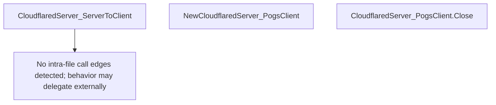

# Behavior Atom: tunnelrpc/pogs/cloudflared_server.go

## Source Anchor

- Go source: [cloudflare/cloudflared@2026.3.0/tunnelrpc/pogs/cloudflared_server.go](https://github.com/cloudflare/cloudflared/blob/2026.3.0/tunnelrpc/pogs/cloudflared_server.go)
- Package: pogs
- Module group: tunnelrpc

## Behavioral Responsibility

Core package behavior anchored to this source file.

## Entry Points

- CloudflaredServer_ServerToClient(s SessionManager, c ConfigurationManager) proto.CloudflaredServer (line 20)
- NewCloudflaredServer_PogsClient(client capnp.Client, conn *rpc.Conn) CloudflaredServer_PogsClient (line 34)
- (CloudflaredServer_PogsClient) Close() error (line 51)

## Internal Function Surface

- None detected.

## Input Contract

- func-param:c ConfigurationManager
- func-param:client capnp.Client
- func-param:conn *rpc.Conn
- func-param:s SessionManager

## Output Contract

- return:CloudflaredServer_PogsClient
- return:error
- return:proto.CloudflaredServer

## Side Effects and State Transitions

- network I/O

## Branching and Failure Semantics

- Branch density: if=0, switch=0, select=0
- No explicit failure pattern markers found in static scan.

## Import and Dependency Surface

- github.com/cloudflare/cloudflared/tunnelrpc/proto
- zombiezen.com/go/capnproto2
- zombiezen.com/go/capnproto2/rpc

## Go-Impl Flow (Intra-file)

## Rust Porting Notes

- **Cap'n Proto server adapter**: `CloudflaredServer_ServerToClient()` wraps a Go implementation into a Cap'n Proto server → in Rust, use `capnp-rpc` crate's server dispatch; implement the generated `cloudflared_server::Server` trait.
- **RPC client wrapper**: `CloudflaredServer_PogsClient` → generated Rust Cap'n Proto client from the `.capnp` schema via `capnpc-rust`.
- **Close lifecycle**: `Close()` shuts down the RPC connection → `Drop` impl or explicit `async fn shutdown()` that awaits in-flight RPCs.
- **Quirk — zero branching**: Pure delegation layer; the Rust port should be equally thin, relying on generated code.

## Accuracy Notes

- Generated from Go AST parsing and source text pattern extraction.
- Source link is authoritative for disputed semantics; keep this atom synchronized with the linked file.
