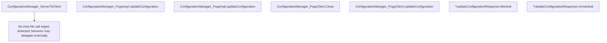

# Behavior Atom: tunnelrpc/pogs/configuration_manager.go

## Source Anchor

- Go source: [cloudflare/cloudflared@2026.3.0/tunnelrpc/pogs/configuration_manager.go](https://github.com/cloudflare/cloudflared/blob/2026.3.0/tunnelrpc/pogs/configuration_manager.go)
- Package: pogs
- Module group: tunnelrpc

## Behavioral Responsibility

Core package behavior anchored to this source file.

## Entry Points

- ConfigurationManager_ServerToClient(c ConfigurationManager) proto.ConfigurationManager (line 24)
- (ConfigurationManager_PogsImpl) UpdateConfiguration(p proto.ConfigurationManager_updateConfiguration) error (line 28)
- (ConfigurationManager_PogsClient) Close() error (line 55)
- (ConfigurationManager_PogsClient) UpdateConfiguration(ctx context.Context, version int32, config []byte) (*UpdateConfigurationResponse, error) (line 60)
- (*UpdateConfigurationResponse) Marshal(s proto.UpdateConfigurationResponse) error (line 84)
- (*UpdateConfigurationResponse) Unmarshal(s proto.UpdateConfigurationResponse) error (line 92)

## Internal Function Surface

- (ConfigurationManager_PogsImpl) updateConfiguration(p proto.ConfigurationManager_updateConfiguration) error (line 32)

## Input Contract

- func-param:c ConfigurationManager
- func-param:config []byte
- func-param:ctx context.Context
- func-param:p proto.ConfigurationManager_updateConfiguration
- func-param:s proto.UpdateConfigurationResponse
- func-param:version int32

## Output Contract

- metrics emission
- return:*UpdateConfigurationResponse
- return:error
- return:proto.ConfigurationManager

## Side Effects and State Transitions

- network I/O

## Branching and Failure Semantics

- Branch density: if=7, switch=0, select=0
- error-return paths

## Import and Dependency Surface

- context
- fmt
- github.com/cloudflare/cloudflared/tunnelrpc/metrics
- github.com/cloudflare/cloudflared/tunnelrpc/proto
- zombiezen.com/go/capnproto2
- zombiezen.com/go/capnproto2/rpc
- zombiezen.com/go/capnproto2/server

## Go-Impl Flow (Intra-file)

## Accuracy Notes

- Generated from Go AST parsing and source text pattern extraction.
- Source link is authoritative for disputed semantics; keep this atom synchronized with the linked file.

## Rust Porting Notes

- **Cap'n Proto server/client**: `capnproto2/server` + `capnproto2/rpc` → `capnp-rpc` Rust crate; implement `configuration_manager::Server` trait for the server side.
- **ServerToClient bridge**: `ConfigurationManager_ServerToClient` wraps Go impl as Cap'n Proto server → use `capnp_rpc::new_client` to wrap a Rust trait implementation.
- **Pogs marshal/unmarshal**: `UpdateConfigurationResponse.Marshal`/`Unmarshal` manually maps between Cap'n Proto and Go structs → use `capnp` generated reader/builder APIs directly, or derive `Serialize`/`Deserialize` for a typed response struct and convert.
- **Metrics integration**: `tunnelrpc/metrics` counters for RPC calls → `metrics::counter!` or Prometheus Rust client.
- **Quirk — manual field copying**: Pogs pattern copies fields one-by-one between Cap'n Proto structs and Go structs — in Rust, implement `From<capnp_reader> for UpdateConfigurationResponse` for clean conversion.
