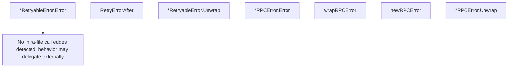

# Behavior Atom: tunnelrpc/pogs/errors.go

## Source Anchor

- Go source: [cloudflare/cloudflared@2026.3.0/tunnelrpc/pogs/errors.go](https://github.com/cloudflare/cloudflared/blob/2026.3.0/tunnelrpc/pogs/errors.go)
- Package: pogs
- Module group: tunnelrpc

## Behavioral Responsibility

Core package behavior anchored to this source file.

## Entry Points

- (*RetryableError) Error() string (line 13)
- RetryErrorAfter(err error, delay time.Duration) *RetryableError (line 18)
- (*RetryableError) Unwrap() error (line 25)
- (*RPCError) Error() string (line 35)
- (*RPCError) Unwrap() error (line 54)

## Internal Function Surface

- wrapRPCError(err error) *RPCError (line 39)
- newRPCError(format string, args ...interface{}) *RPCError (line 48)

## Input Contract

- func-param:args ...interface{}
- func-param:delay time.Duration
- func-param:err error
- func-param:format string

## Output Contract

- return:*RPCError
- return:*RetryableError
- return:error
- return:string

## Side Effects and State Transitions

- No high-signal side effect pattern detected in static scan.

## Branching and Failure Semantics

- Branch density: if=1, switch=0, select=0
- error-return paths

## Import and Dependency Surface

- fmt
- time

## Go-Impl Flow (Intra-file)

## Rust Porting Notes

- **RetryableError**: Error with retry-after duration → `#[derive(thiserror::Error)] enum RpcError { #[error("retryable: {msg}")] Retryable { msg: String, delay: Duration }, #[error("rpc: {0}")] Rpc(String) }`.
- **Unwrap chain**: `Unwrap()` for Go error chain traversal → `#[source]` attribute on `thiserror` variants provides automatic `Error::source()` chain.
- **Duration-based retry**: `RetryErrorAfter(seconds, ...)` → store `std::time::Duration` directly; callers use `tokio::time::sleep(err.delay())` before retry.
- **Quirk — string-only RPC error**: `RPCError` wraps a plain string → in Rust, consider a structured variant with error code + message for richer pattern matching.

## Accuracy Notes

- Generated from Go AST parsing and source text pattern extraction.
- Source link is authoritative for disputed semantics; keep this atom synchronized with the linked file.
