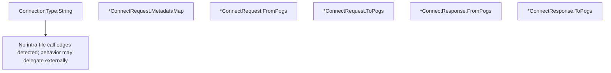

# Behavior Atom: tunnelrpc/pogs/quic_metadata_protocol.go

## Source Anchor

- Go source: [cloudflare/cloudflared@2026.3.0/tunnelrpc/pogs/quic_metadata_protocol.go](https://github.com/cloudflare/cloudflared/blob/2026.3.0/tunnelrpc/pogs/quic_metadata_protocol.go)
- Package: pogs
- Module group: tunnelrpc

## Behavioral Responsibility

Core package behavior anchored to this source file.

## Entry Points

- (ConnectionType) String() string (line 26)
- (*ConnectRequest) MetadataMap() map[string]string (line 52)
- (*ConnectRequest) FromPogs(msg*capnp.Message) error (line 60)
- (*ConnectRequest) ToPogs() (*capnp.Message, error) (line 68)
- (*ConnectResponse) FromPogs(msg*capnp.Message) error (line 92)
- (*ConnectResponse) ToPogs() (*capnp.Message, error) (line 100)

## Internal Function Surface

- None detected.

## Input Contract

- func-param:msg *capnp.Message

## Output Contract

- return:*capnp.Message
- return:error
- return:map[string]string
- return:string

## Side Effects and State Transitions

- No high-signal side effect pattern detected in static scan.

## Branching and Failure Semantics

- Branch density: if=8, switch=1, select=0
- error-return paths
- panic paths

## Import and Dependency Surface

- fmt
- github.com/cloudflare/cloudflared/tunnelrpc/proto
- zombiezen.com/go/capnproto2
- zombiezen.com/go/capnproto2/pogs

## Go-Impl Flow (Intra-file)

## Rust Porting Notes

- **ConnectionType enum**: Go `int` enum → `#[derive(Clone, Copy)] enum ConnectionType { Http, WebSocket, Tcp }` with `Display` impl.
- **Pogs conversion**: `FromPogs()` / `ToPogs()` bidirectional Cap'n Proto ↔ Rust struct conversion → implement `From<capnp_reader::Reader>` and `Into<capnp_builder::Builder>` on `ConnectRequest` / `ConnectResponse`.
- **MetadataMap**: `ConnectRequest.MetadataMap()` returns metadata as key-value pairs → `HashMap<String, String>` or `Vec<(String, String)>` for ordered metadata.
- **Panic paths**: Go code panics on schema errors → in Rust, return `Result` instead; never panic in library code.
- **Quirk — 8 if-branches + 1 switch**: Validation during pogs conversion; use `?` operator for Cap'n Proto field access errors.

## Accuracy Notes

- Generated from Go AST parsing and source text pattern extraction.
- Source link is authoritative for disputed semantics; keep this atom synchronized with the linked file.
