# Behavior Atom: tunnelrpc/pogs/session_manager.go

## Source Anchor

- Go source: [cloudflare/cloudflared@2026.3.0/tunnelrpc/pogs/session_manager.go](https://github.com/cloudflare/cloudflared/blob/2026.3.0/tunnelrpc/pogs/session_manager.go)
- Package: pogs
- Module group: tunnelrpc

## Behavioral Responsibility

Core package behavior anchored to this source file.

## Entry Points

- SessionManager_ServerToClient(s SessionManager) proto.SessionManager (line 31)
- (SessionManager_PogsImpl) RegisterUdpSession(p proto.SessionManager_registerUdpSession) error (line 35)
- (SessionManager_PogsImpl) UnregisterUdpSession(p proto.SessionManager_unregisterUdpSession) error (line 85)
- (*RegisterUdpSessionResponse) Marshal(s proto.RegisterUdpSessionResponse) error (line 114)
- (*RegisterUdpSessionResponse) Unmarshal(s proto.RegisterUdpSessionResponse) error (line 124)
- NewSessionManager_PogsClient(client capnp.Client, conn *rpc.Conn) SessionManager_PogsClient (line 144)
- (SessionManager_PogsClient) Close() error (line 151)
- (SessionManager_PogsClient) RegisterUdpSession(ctx context.Context, sessionID uuid.UUID, dstIP net.IP, dstPort uint16, closeAfterIdleHint time.Duration, traceContext string) (*RegisterUdpSessionResponse, error) (line 156)
- (SessionManager_PogsClient) UnregisterUdpSession(ctx context.Context, sessionID uuid.UUID, message string) error (line 183)

## Internal Function Surface

- (SessionManager_PogsImpl) registerUdpSession(p proto.SessionManager_registerUdpSession) error (line 39)
- (SessionManager_PogsImpl) unregisterUdpSession(p proto.SessionManager_unregisterUdpSession) error (line 89)

## Input Contract

- func-param:client capnp.Client
- func-param:closeAfterIdleHint time.Duration
- func-param:conn *rpc.Conn
- func-param:ctx context.Context
- func-param:dstIP net.IP
- func-param:dstPort uint16
- func-param:message string
- func-param:p proto.SessionManager_registerUdpSession
- func-param:p proto.SessionManager_unregisterUdpSession
- func-param:s SessionManager
- func-param:s proto.RegisterUdpSessionResponse
- func-param:sessionID uuid.UUID
- func-param:traceContext string

## Output Contract

- metrics emission
- return:*RegisterUdpSessionResponse
- return:SessionManager_PogsClient
- return:error
- return:proto.SessionManager

## Side Effects and State Transitions

- network I/O

## Branching and Failure Semantics

- Branch density: if=22, switch=0, select=0
- error-return paths

## Import and Dependency Surface

- context
- fmt
- github.com/cloudflare/cloudflared/tunnelrpc/metrics
- github.com/cloudflare/cloudflared/tunnelrpc/proto
- github.com/google/uuid
- net
- time
- zombiezen.com/go/capnproto2
- zombiezen.com/go/capnproto2/rpc
- zombiezen.com/go/capnproto2/server

## Go-Impl Flow (Intra-file)

```mermaid
flowchart TD
    F1["SessionManager_ServerToClient"]
    F2["SessionManager_PogsImpl.RegisterUdpSession"]
    F3["SessionManager_PogsImpl.registerUdpSession"]
    F4["SessionManager_PogsImpl.UnregisterUdpSession"]
    F5["SessionManager_PogsImpl.unregisterUdpSession"]
    F6["*RegisterUdpSessionResponse.Marshal"]
    F7["*RegisterUdpSessionResponse.Unmarshal"]
    F8["NewSessionManager_PogsClient"]
    F9["SessionManager_PogsClient.Close"]
    F10["SessionManager_PogsClient.RegisterUdpSession"]
    F11["SessionManager_PogsClient.UnregisterUdpSession"]
    NOTE["No intra-file call edges detected; behavior may delegate externally"]
    F1 --> NOTE
```

## Accuracy Notes

- Generated from Go AST parsing and source text pattern extraction.
- Source link is authoritative for disputed semantics; keep this atom synchronized with the linked file.

## Rust Porting Notes

- **Cap'n Proto server**: `SessionManager_PogsImpl` → implement the `session_manager::Server` trait from `capnpc-rust` generated code.
- **Response marshal/unmarshal**: `RegisterUdpSessionResponse` manual field copy → `From<capnp_reader>` / `Into<capnp_builder>` trait impls.
- **UUID/IP wire format**: UUID as 16 bytes, IP as 4/16 bytes in Cap'n Proto → `uuid::Uuid::as_bytes()` and `std::net::IpAddr` byte conversion.
- **Duration serialization**: `time.Duration` as int64 nanoseconds in Cap'n Proto → `std::time::Duration::as_nanos()` / `from_nanos()` for wire compatibility.
- **Quirk — 22 if-branches**: Dense field validation in marshal/unmarshal — same pattern as registration_server; use `?` operator chains.
- **Quirk — shared pattern**: Both `session_manager` and `registration_server` follow identical pogs patterns — consider a macro or generic conversion helper in Rust.
