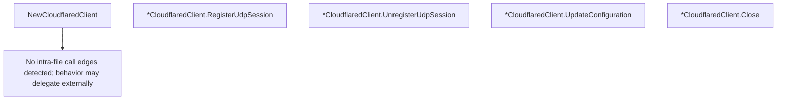

# Behavior Atom: tunnelrpc/quic/cloudflared_client.go

## Source Anchor

- Go source: [cloudflare/cloudflared@2026.3.0/tunnelrpc/quic/cloudflared_client.go](https://github.com/cloudflare/cloudflared/blob/2026.3.0/tunnelrpc/quic/cloudflared_client.go)
- Package: quic
- Module group: tunnelrpc

## Behavioral Responsibility

Transport/protocol behavior for edge-origin data and control flows.

## Entry Points

- NewCloudflaredClient(ctx context.Context, stream io.ReadWriteCloser, requestTimeout time.Duration) (*CloudflaredClient, error) (line 26)
- (*CloudflaredClient) RegisterUdpSession(ctx context.Context, sessionID uuid.UUID, dstIP net.IP, dstPort uint16, closeIdleAfterHint time.Duration, traceContext string) (*pogs.RegisterUdpSessionResponse, error) (line 44)
- (*CloudflaredClient) UnregisterUdpSession(ctx context.Context, sessionID uuid.UUID, message string) error (line 58)
- (*CloudflaredClient) UpdateConfiguration(ctx context.Context, version int32, config []byte) (*pogs.UpdateConfigurationResponse, error) (line 72)
- (*CloudflaredClient) Close() (line 86)

## Internal Function Surface

- None detected.

## Input Contract

- func-param:closeIdleAfterHint time.Duration
- func-param:config []byte
- func-param:ctx context.Context
- func-param:dstIP net.IP
- func-param:dstPort uint16
- func-param:message string
- func-param:requestTimeout time.Duration
- func-param:sessionID uuid.UUID
- func-param:stream io.ReadWriteCloser
- func-param:traceContext string
- func-param:version int32

## Output Contract

- HTTP response writes
- metrics emission
- return:*CloudflaredClient
- return:*pogs.RegisterUdpSessionResponse
- return:*pogs.UpdateConfigurationResponse
- return:error

## Side Effects and State Transitions

- network I/O

## Branching and Failure Semantics

- Branch density: if=5, switch=0, select=0
- error-return paths

## Import and Dependency Surface

- context
- fmt
- github.com/cloudflare/cloudflared/tunnelrpc
- github.com/cloudflare/cloudflared/tunnelrpc/metrics
- github.com/cloudflare/cloudflared/tunnelrpc/pogs
- github.com/google/uuid
- io
- net
- time
- zombiezen.com/go/capnproto2/rpc

## Go-Impl Flow (Intra-file)

## Accuracy Notes

- Generated from Go AST parsing and source text pattern extraction.
- Source link is authoritative for disputed semantics; keep this atom synchronized with the linked file.

## Rust Porting Notes

- **Cap'n Proto RPC**: `zombiezen.com/go/capnproto2/rpc` → `capnp-rpc` Rust crate with generated client stubs from the `.capnp` schema.
- **Stream transport**: `io.ReadWriteCloser` as RPC transport → `tokio::io::AsyncRead + AsyncWrite` wrapped in `capnp_rpc::twoparty::VatNetwork`.
- **Request timeout**: Per-call `requestTimeout` → `tokio::time::timeout(duration, rpc_call)` wrapping each generated Cap'n Proto promise.
- **Metrics emission**: `tunnelrpc/metrics` counters → `metrics::counter!` or Prometheus Rust client for RPC call counting.
- **UUID wire format**: `uuid.UUID` serialized via Cap'n Proto → `uuid::Uuid` with `as_bytes()` for schema-compatible serialization.
- **Close cleanup**: `(*CloudflaredClient).Close()` tears down RPC connection → implement via `Drop` or explicit `shutdown()` method that cancels the `VatNetwork`.
