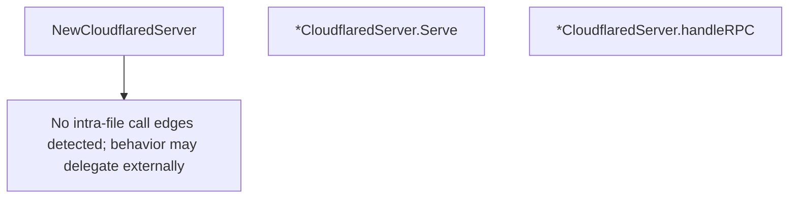

# Behavior Atom: tunnelrpc/quic/cloudflared_server.go

## Source Anchor

- Go source: [cloudflare/cloudflared@2026.3.0/tunnelrpc/quic/cloudflared_server.go](https://github.com/cloudflare/cloudflared/blob/2026.3.0/tunnelrpc/quic/cloudflared_server.go)
- Package: quic
- Module group: tunnelrpc

## Behavioral Responsibility

Transport/protocol behavior for edge-origin data and control flows.

## Entry Points

- NewCloudflaredServer(handleRequest HandleRequestFunc, sessionManager pogs.SessionManager, configManager pogs.ConfigurationManager, responseTimeout time.Duration) *CloudflaredServer (line 26)
- (*CloudflaredServer) Serve(ctx context.Context, stream io.ReadWriteCloser) error (line 37)

## Internal Function Surface

- (*CloudflaredServer) handleRPC(ctx context.Context, stream io.ReadWriteCloser) error (line 52)

## Input Contract

- func-param:configManager pogs.ConfigurationManager
- func-param:ctx context.Context
- func-param:handleRequest HandleRequestFunc
- func-param:responseTimeout time.Duration
- func-param:sessionManager pogs.SessionManager
- func-param:stream io.ReadWriteCloser

## Output Contract

- return:*CloudflaredServer
- return:error

## Side Effects and State Transitions

- network I/O

## Branching and Failure Semantics

- Branch density: if=1, switch=1, select=1
- error-return paths
- fallback/default branches

## Import and Dependency Surface

- context
- fmt
- github.com/cloudflare/cloudflared/tunnelrpc
- github.com/cloudflare/cloudflared/tunnelrpc/pogs
- io
- time

## Go-Impl Flow (Intra-file)

## Rust Porting Notes

- **RPC server dispatch**: `Serve()` reads RPC messages, dispatches to `handleRPC()` → in Rust, implement the Cap'n Proto server trait generated by `capnpc-rust`; each RPC method becomes an `async fn` on the server struct.
- **HandleRequestFunc callback**: Function-typed field for request handling → `Box<dyn Fn(ConnectRequest) -> BoxFuture<ConnectResponse> + Send + Sync>` or an async trait method.
- **Timeout-guarded RPC**: `select` with timeout on RPC handling → `tokio::time::timeout(duration, handle_rpc(msg)).await`.
- **io.ReadWriteCloser**: Stream interface for the RPC transport → `tokio::io::AsyncRead + AsyncWrite + Unpin` or `quinn::SendStream` + `quinn::RecvStream` pair.
- **Quirk — switch on RPC type**: `handleRPC()` dispatches by message type → `match` on a typed RPC enum; the Cap'n Proto which-field pattern maps to Rust enum matching.

## Accuracy Notes

- Generated from Go AST parsing and source text pattern extraction.
- Source link is authoritative for disputed semantics; keep this atom synchronized with the linked file.
