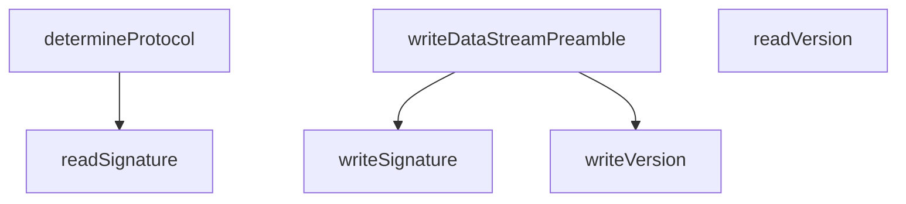

# Behavior Atom: tunnelrpc/quic/protocol.go

## Source Anchor

- Go source: [cloudflare/cloudflared@2026.3.0/tunnelrpc/quic/protocol.go](https://github.com/cloudflare/cloudflared/blob/2026.3.0/tunnelrpc/quic/protocol.go)
- Package: quic
- Module group: tunnelrpc

## Behavioral Responsibility

Transport/protocol behavior for edge-origin data and control flows.

## Entry Points

- No exported/main/init entry point detected; behavior is internal support logic.

## Internal Function Surface

- determineProtocol(stream io.Reader) (protocolSignature, error) (line 33)
- writeDataStreamPreamble(stream io.Writer) error (line 48)
- writeVersion(stream io.Writer) error (line 56)
- readVersion(stream io.Reader) (string, error) (line 61)
- readSignature(stream io.Reader) (protocolSignature, error) (line 67)
- writeSignature(stream io.Writer, signature protocolSignature) error (line 75)

## Input Contract

- func-param:signature protocolSignature
- func-param:stream io.Reader
- func-param:stream io.Writer

## Output Contract

- HTTP response writes
- return:error
- return:protocolSignature
- return:string

## Side Effects and State Transitions

- No high-signal side effect pattern detected in static scan.

## Branching and Failure Semantics

- Branch density: if=3, switch=1, select=0
- error-return paths
- fallback/default branches

## Import and Dependency Surface

- fmt
- io

## Go-Impl Flow (Intra-file)

## Rust Porting Notes

- **Protocol detection**: `determineProtocol()` reads signature bytes from stream → `async fn determine_protocol(stream: &mut impl AsyncRead) -> Result<Protocol>` reading a fixed-size prefix.
- **Preamble writing**: `writeDataStreamPreamble()` / `writeVersion()` / `writeSignature()` emit binary protocol headers → `AsyncWriteExt::write_all(&bytes).await` for each field.
- **Binary handshake**: Sequential read/write of version and signature bytes → use `tokio::io::AsyncReadExt::read_exact()` for fixed-length reads.
- **Switch on signature**: Pattern matching on byte prefix → `match &buf[..SIGNATURE_LEN]` with byte literal arm patterns.
- **Quirk — 3 if-branches**: Error checks on read/write calls; flatten with `?` operator.

## Accuracy Notes

- Generated from Go AST parsing and source text pattern extraction.
- Source link is authoritative for disputed semantics; keep this atom synchronized with the linked file.
