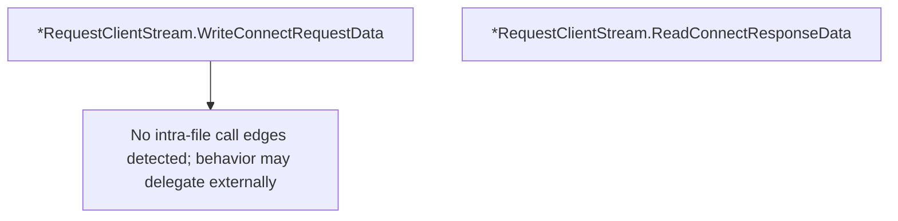

# Behavior Atom: tunnelrpc/quic/request_client_stream.go

## Source Anchor

- Go source: [cloudflare/cloudflared@2026.3.0/tunnelrpc/quic/request_client_stream.go](https://github.com/cloudflare/cloudflared/blob/2026.3.0/tunnelrpc/quic/request_client_stream.go)
- Package: quic
- Module group: tunnelrpc

## Behavioral Responsibility

Transport/protocol behavior for edge-origin data and control flows.

## Entry Points

- (*RequestClientStream) WriteConnectRequestData(dest string, connectionType pogs.ConnectionType, metadata ...pogs.Metadata) error (line 18)
- (*RequestClientStream) ReadConnectResponseData() (*pogs.ConnectResponse, error) (line 37)

## Internal Function Surface

- None detected.

## Input Contract

- func-param:connectionType pogs.ConnectionType
- func-param:dest string
- func-param:metadata ...pogs.Metadata

## Output Contract

- return:*pogs.ConnectResponse
- return:error

## Side Effects and State Transitions

- No high-signal side effect pattern detected in static scan.

## Branching and Failure Semantics

- Branch density: if=7, switch=0, select=0
- error-return paths

## Import and Dependency Surface

- fmt
- github.com/cloudflare/cloudflared/tunnelrpc/pogs
- io
- zombiezen.com/go/capnproto2

## Go-Impl Flow (Intra-file)

## Rust Porting Notes

- **Cap'n Proto message building**: `WriteConnectRequestData()` constructs a Cap'n Proto message and writes to stream → `capnp::message::Builder::new_default()` + `capnp::serialize::write_message(&mut stream, &msg).await`.
- **Response parsing**: `ReadConnectResponseData()` reads and decodes Cap'n Proto response → `capnp::serialize::read_message(&mut stream, opts).await` + `.get_root::<connect_response::Reader>()`.
- **Variadic metadata**: Metadata key-value pairs as function arguments → `&[(String, String)]` slice or `impl IntoIterator<Item = (K, V)>`.
- **Quirk — 7 if-branches**: Validation on Cap'n Proto field access; use `?` on `capnp::Result` return values.

## Accuracy Notes

- Generated from Go AST parsing and source text pattern extraction.
- Source link is authoritative for disputed semantics; keep this atom synchronized with the linked file.
