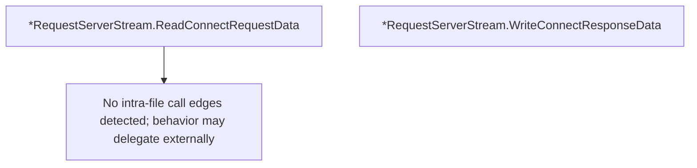

# Behavior Atom: tunnelrpc/quic/request_server_stream.go

## Source Anchor

- Go source: [cloudflare/cloudflared@2026.3.0/tunnelrpc/quic/request_server_stream.go](https://github.com/cloudflare/cloudflared/blob/2026.3.0/tunnelrpc/quic/request_server_stream.go)
- Package: quic
- Module group: tunnelrpc

## Behavioral Responsibility

Transport/protocol behavior for edge-origin data and control flows.

## Entry Points

- (*RequestServerStream) ReadConnectRequestData() (*pogs.ConnectRequest, error) (line 17)
- (*RequestServerStream) WriteConnectResponseData(respErr error, metadata ...pogs.Metadata) error (line 36)

## Internal Function Surface

- None detected.

## Input Contract

- func-param:metadata ...pogs.Metadata
- func-param:respErr error

## Output Contract

- return:*pogs.ConnectRequest
- return:error

## Side Effects and State Transitions

- network I/O

## Branching and Failure Semantics

- Branch density: if=6, switch=0, select=0
- error-return paths

## Import and Dependency Surface

- github.com/cloudflare/cloudflared/tunnelrpc/pogs
- io
- zombiezen.com/go/capnproto2

## Go-Impl Flow (Intra-file)

## Rust Porting Notes

- **Cap'n Proto deserialization**: `ReadConnectRequestData()` reads request from stream → `capnp::serialize::read_message(&mut stream, opts).await` + pogs conversion to Rust struct.
- **Conditional error serialization**: `WriteConnectResponseData()` includes error field only when present → use `Option<String>` for the error field; Cap'n Proto builder's `set_error()` is called conditionally.
- **Mirror of client stream**: Server-side complement to `request_client_stream` → keep the two modules symmetrical in Rust; consider a shared `ConnectMessage` codec trait.
- **Quirk — 6 if-branches**: Validation branches during read/write; flatten with `?` operator on `capnp::Result`.

## Accuracy Notes

- Generated from Go AST parsing and source text pattern extraction.
- Source link is authoritative for disputed semantics; keep this atom synchronized with the linked file.
