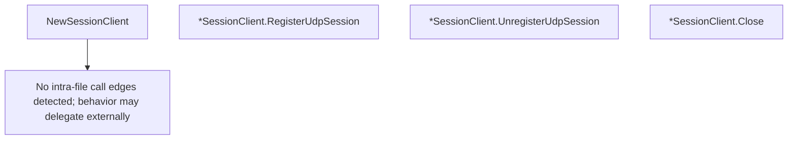

# Behavior Atom: tunnelrpc/quic/session_client.go

## Source Anchor

- Go source: [cloudflare/cloudflared@2026.3.0/tunnelrpc/quic/session_client.go](https://github.com/cloudflare/cloudflared/blob/2026.3.0/tunnelrpc/quic/session_client.go)
- Package: quic
- Module group: tunnelrpc

## Behavioral Responsibility

Transport/protocol behavior for edge-origin data and control flows.

## Entry Points

- NewSessionClient(ctx context.Context, stream io.ReadWriteCloser, requestTimeout time.Duration) (*SessionClient, error) (line 25)
- (*SessionClient) RegisterUdpSession(ctx context.Context, sessionID uuid.UUID, dstIP net.IP, dstPort uint16, closeIdleAfterHint time.Duration, traceContext string) (*pogs.RegisterUdpSessionResponse, error) (line 42)
- (*SessionClient) UnregisterUdpSession(ctx context.Context, sessionID uuid.UUID, message string) error (line 56)
- (*SessionClient) Close() (line 70)

## Internal Function Surface

- None detected.

## Input Contract

- func-param:closeIdleAfterHint time.Duration
- func-param:ctx context.Context
- func-param:dstIP net.IP
- func-param:dstPort uint16
- func-param:message string
- func-param:requestTimeout time.Duration
- func-param:sessionID uuid.UUID
- func-param:stream io.ReadWriteCloser
- func-param:traceContext string

## Output Contract

- HTTP response writes
- metrics emission
- return:*SessionClient
- return:*pogs.RegisterUdpSessionResponse
- return:error

## Side Effects and State Transitions

- network I/O

## Branching and Failure Semantics

- Branch density: if=4, switch=0, select=0
- error-return paths

## Import and Dependency Surface

- context
- fmt
- github.com/cloudflare/cloudflared/tunnelrpc
- github.com/cloudflare/cloudflared/tunnelrpc/metrics
- github.com/cloudflare/cloudflared/tunnelrpc/pogs
- github.com/google/uuid
- io
- net
- time
- zombiezen.com/go/capnproto2/rpc

## Go-Impl Flow (Intra-file)

## Accuracy Notes

- Generated from Go AST parsing and source text pattern extraction.
- Source link is authoritative for disputed semantics; keep this atom synchronized with the linked file.

## Rust Porting Notes

- **Cap'n Proto RPC**: Same `capnp-rpc` Rust crate pattern as [atoms/tunnelrpc/quic/cloudflared_client](cloudflared_client.md) — reuse the schema-generated client stubs.
- **Stream transport**: `io.ReadWriteCloser` → `capnp_rpc::twoparty::VatNetwork` over `AsyncRead + AsyncWrite`.
- **Request timeout**: Per-call timeout → `tokio::time::timeout` wrapping each RPC future.
- **Session registration**: `RegisterUdpSession` / `UnregisterUdpSession` → generated async methods from `.capnp` schema; ensure `RequestID` and `uuid::Uuid` wire format compatibility.
- **Quirk — shared pattern with cloudflared_client**: Both clients share nearly identical transport setup — extract a common `RpcTransport` struct in Rust that both `SessionClient` and `CloudflaredClient` compose.
