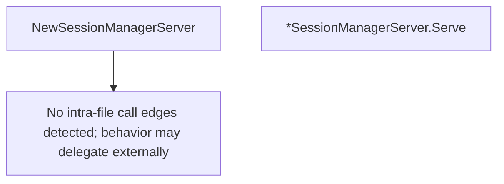

# Behavior Atom: tunnelrpc/quic/session_server.go

## Source Anchor

- Go source: [cloudflare/cloudflared@2026.3.0/tunnelrpc/quic/session_server.go](https://github.com/cloudflare/cloudflared/blob/2026.3.0/tunnelrpc/quic/session_server.go)
- Package: quic
- Module group: tunnelrpc

## Behavioral Responsibility

Transport/protocol behavior for edge-origin data and control flows.

## Entry Points

- NewSessionManagerServer(sessionManager pogs.SessionManager, responseTimeout time.Duration) *SessionManagerServer (line 19)
- (*SessionManagerServer) Serve(ctx context.Context, stream io.ReadWriteCloser) error (line 26)

## Internal Function Surface

- None detected.

## Input Contract

- func-param:ctx context.Context
- func-param:responseTimeout time.Duration
- func-param:sessionManager pogs.SessionManager
- func-param:stream io.ReadWriteCloser

## Output Contract

- return:*SessionManagerServer
- return:error

## Side Effects and State Transitions

- network I/O

## Branching and Failure Semantics

- Branch density: if=1, switch=1, select=1
- error-return paths
- fallback/default branches

## Import and Dependency Surface

- context
- fmt
- github.com/cloudflare/cloudflared/tunnelrpc
- github.com/cloudflare/cloudflared/tunnelrpc/pogs
- io
- time

## Go-Impl Flow (Intra-file)

## Rust Porting Notes

- **Session RPC server**: `SessionManagerServer.Serve()` dispatches session RPCs with timeout → implement the generated Cap'n Proto session manager server trait; each method is `async fn` with `tokio::time::timeout` guard.
- **Select with timeout**: `select` on context + RPC completion → `tokio::select!` with cancellation token and timeout future.
- **Switch on RPC method**: `switch` dispatches by Cap'n Proto which-field → `match` on the generated enum; exhaust all variants.
- **Quirk — mirrors cloudflared_server pattern**: Same dispatch architecture as `cloudflared_server`; consider a shared generic RPC server harness in Rust to reduce duplication.

## Accuracy Notes

- Generated from Go AST parsing and source text pattern extraction.
- Source link is authoritative for disputed semantics; keep this atom synchronized with the linked file.
