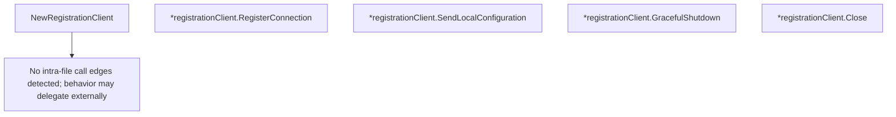

# Behavior Atom: tunnelrpc/registration_client.go

## Source Anchor

- Go source: [cloudflare/cloudflared@2026.3.0/tunnelrpc/registration_client.go](https://github.com/cloudflare/cloudflared/blob/2026.3.0/tunnelrpc/registration_client.go)
- Package: tunnelrpc
- Module group: tunnelrpc

## Behavioral Responsibility

Core package behavior anchored to this source file.

## Entry Points

- NewRegistrationClient(ctx context.Context, stream io.ReadWriteCloser, requestTimeout time.Duration) RegistrationClient (line 36)
- (*registrationClient) RegisterConnection(ctx context.Context, auth pogs.TunnelAuth, tunnelID uuid.UUID, options*pogs.ConnectionOptions, connIndex uint8, edgeAddress net.IP) (*pogs.ConnectionDetails, error) (line 47)
- (*registrationClient) SendLocalConfiguration(ctx context.Context, config []byte) error (line 68)
- (*registrationClient) GracefulShutdown(ctx context.Context, gracePeriod time.Duration) error (line 82)
- (*registrationClient) Close() (line 96)

## Internal Function Surface

- None detected.

## Input Contract

- func-param:auth pogs.TunnelAuth
- func-param:config []byte
- func-param:connIndex uint8
- func-param:ctx context.Context
- func-param:edgeAddress net.IP
- func-param:gracePeriod time.Duration
- func-param:options *pogs.ConnectionOptions
- func-param:requestTimeout time.Duration
- func-param:stream io.ReadWriteCloser
- func-param:tunnelID uuid.UUID

## Output Contract

- metrics emission
- return:*pogs.ConnectionDetails
- return:RegistrationClient
- return:error

## Side Effects and State Transitions

- network I/O

## Branching and Failure Semantics

- Branch density: if=3, switch=0, select=0
- error-return paths

## Import and Dependency Surface

- context
- github.com/cloudflare/cloudflared/tunnelrpc/metrics
- github.com/cloudflare/cloudflared/tunnelrpc/pogs
- github.com/google/uuid
- io
- net
- time
- zombiezen.com/go/capnproto2/rpc

## Go-Impl Flow (Intra-file)

## Accuracy Notes

- Generated from Go AST parsing and source text pattern extraction.
- Source link is authoritative for disputed semantics; keep this atom synchronized with the linked file.

## Rust Porting Notes

- **Cap'n Proto RPC**: `zombiezen.com/go/capnproto2/rpc` → `capnp-rpc` Rust crate with `twoparty::VatNetwork` over an async stream.
- **Stream transport**: `io.ReadWriteCloser` → `tokio::io::AsyncRead + AsyncWrite` wrapped in `capnp_rpc::twoparty::VatNetwork`.
- **Request timeout**: Per-call `requestTimeout` for `RegisterConnection`, `SendLocalConfiguration`, `GracefulShutdown` → `tokio::time::timeout(duration, rpc_future)`.
- **Graceful shutdown RPC**: `GracefulShutdown` sends unregister then waits for grace period → `tokio::time::timeout(grace_period, unregister_rpc)` with cancellation token integration.
- **RegistrationClient trait**: Go interface `RegistrationClient` → Rust trait with async methods; inject via `Arc<dyn RegistrationClient + Send + Sync>` for testability.
- **Quirk — shared pattern**: Same transport setup as [atoms/tunnelrpc/quic/cloudflared_client](quic/cloudflared_client.md) and [atoms/tunnelrpc/quic/session_client](quic/session_client.md) — extract a common `RpcTransport` struct in Rust.
