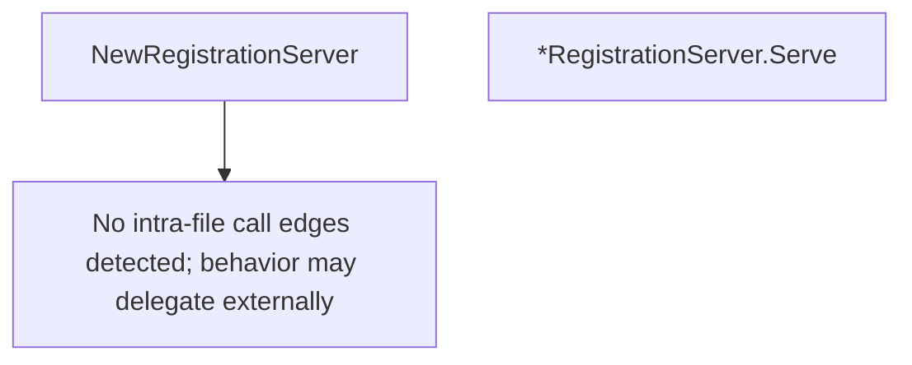

# Behavior Atom: tunnelrpc/registration_server.go

## Source Anchor

- Go source: [cloudflare/cloudflared@2026.3.0/tunnelrpc/registration_server.go](https://github.com/cloudflare/cloudflared/blob/2026.3.0/tunnelrpc/registration_server.go)
- Package: tunnelrpc
- Module group: tunnelrpc

## Behavioral Responsibility

Core package behavior anchored to this source file.

## Entry Points

- NewRegistrationServer(registrationServer pogs.RegistrationServer) *RegistrationServer (line 16)
- (*RegistrationServer) Serve(ctx context.Context, stream io.ReadWriteCloser) error (line 24)

## Internal Function Surface

- None detected.

## Input Contract

- func-param:ctx context.Context
- func-param:registrationServer pogs.RegistrationServer
- func-param:stream io.ReadWriteCloser

## Output Contract

- return:*RegistrationServer
- return:error

## Side Effects and State Transitions

- network I/O

## Branching and Failure Semantics

- Branch density: if=0, switch=0, select=1
- No explicit failure pattern markers found in static scan.

## Import and Dependency Surface

- context
- github.com/cloudflare/cloudflared/tunnelrpc/pogs
- io

## Go-Impl Flow (Intra-file)

## Rust Porting Notes

- **Registration RPC server**: `RegistrationServer.Serve()` handles tunnel registration RPCs → implement the generated Cap'n Proto `registration_server::Server` trait with `async fn` methods.
- **Select for shutdown**: `select` on context cancellation → `tokio::select!` with `CancellationToken` for graceful shutdown.
- **Cap'n Proto transport**: `io.ReadWriteCloser` for RPC stream → `tokio::io::AsyncRead + AsyncWrite + Unpin`; use `capnp_rpc::RpcSystem` for async RPC dispatch.
- **Quirk — zero if-branches**: Pure dispatch layer; the Rust port should remain equally thin.

## Accuracy Notes

- Generated from Go AST parsing and source text pattern extraction.
- Source link is authoritative for disputed semantics; keep this atom synchronized with the linked file.
