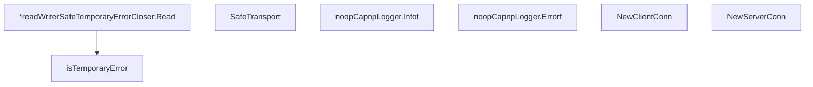

# Behavior Atom: tunnelrpc/utils.go

## Source Anchor

- Go source: [cloudflare/cloudflared@2026.3.0/tunnelrpc/utils.go](https://github.com/cloudflare/cloudflared/blob/2026.3.0/tunnelrpc/utils.go)
- Package: tunnelrpc
- Module group: tunnelrpc

## Behavioral Responsibility

Core package behavior anchored to this source file.

## Entry Points

- (*readWriterSafeTemporaryErrorCloser) Read(p []byte) (n int, err error) (line 32)
- SafeTransport(rw io.ReadWriteCloser) rpc.Transport (line 55)
- (noopCapnpLogger) Infof(ctx context.Context, format string, args ...interface{}) (line 80)
- (noopCapnpLogger) Errorf(ctx context.Context, format string, args ...interface{}) (line 81)
- NewClientConn(transport rpc.Transport) *rpc.Conn (line 83)
- NewServerConn(transport rpc.Transport, client capnp.Client) *rpc.Conn (line 87)

## Internal Function Surface

- isTemporaryError(e error) bool (line 65)

## Input Contract

- func-param:args ...interface{}
- func-param:client capnp.Client
- func-param:ctx context.Context
- func-param:e error
- func-param:format string
- func-param:p []byte
- func-param:rw io.ReadWriteCloser
- func-param:transport rpc.Transport

## Output Contract

- return:*rpc.Conn
- return:bool
- return:err error
- return:n int
- return:rpc.Transport

## Side Effects and State Transitions

- network I/O
- timers and scheduling

## Branching and Failure Semantics

- Branch density: if=3, switch=0, select=0
- error-return paths

## Import and Dependency Surface

- context
- github.com/pkg/errors
- io
- time
- zombiezen.com/go/capnproto2
- zombiezen.com/go/capnproto2/rpc

## Go-Impl Flow (Intra-file)

## Rust Porting Notes

- **Safe transport wrapper**: `SafeTransport()` wraps `io.ReadWriteCloser` with temporary-error retry → in Rust, use a middleware layer that retries on `io::ErrorKind::WouldBlock` or `Interrupted`; or rely on `tokio::io` which handles these internally.
- **Temporary error detection**: `isTemporaryError()` checks errno-level transient errors → `match err.kind() { ErrorKind::WouldBlock | ErrorKind::Interrupted => true, _ => false }` or check `err.raw_os_error()` for platform-specific codes.
- **noopCapnpLogger**: Silences Cap'n Proto library logging → not needed in Rust; `capnp-rpc` uses `log` or `tracing` which can be filtered at the subscriber level.
- **RPC connection factories**: `NewClientConn()` / `NewServerConn()` create Cap'n Proto RPC connections → `capnp_rpc::new_client()` / `capnp_rpc::new_server()` with the appropriate transport.
- **Quirk — 3 if-branches**: Error classification branches; flatten with pattern matching on `io::Error` kind.

## Accuracy Notes

- Generated from Go AST parsing and source text pattern extraction.
- Source link is authoritative for disputed semantics; keep this atom synchronized with the linked file.
