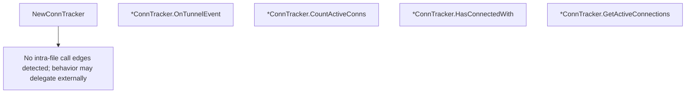

# Behavior Atom: tunnelstate/conntracker.go

## Source Anchor

- Go source: [cloudflare/cloudflared@2026.3.0/tunnelstate/conntracker.go](https://github.com/cloudflare/cloudflared/blob/2026.3.0/tunnelstate/conntracker.go)
- Package: tunnelstate
- Module group: tunnelstate

## Behavioral Responsibility

Core package behavior anchored to this source file.

## Entry Points

- NewConnTracker(log *zerolog.Logger)*ConnTracker (line 31)
- (*ConnTracker) OnTunnelEvent(c connection.Event) (line 40)
- (*ConnTracker) CountActiveConns() uint (line 62)
- (*ConnTracker) HasConnectedWith(protocol connection.Protocol) bool (line 76)
- (*ConnTracker) GetActiveConnections() []IndexedConnectionInfo (line 89)

## Internal Function Surface

- None detected.

## Input Contract

- func-param:c connection.Event
- func-param:log *zerolog.Logger
- func-param:protocol connection.Protocol

## Output Contract

- return:*ConnTracker
- return:[]IndexedConnectionInfo
- return:bool
- return:uint
- stdout/stderr or structured logs

## Side Effects and State Transitions

- network I/O
- concurrency primitives

## Branching and Failure Semantics

- Branch density: if=3, switch=1, select=0
- fallback/default branches

## Import and Dependency Surface

- github.com/cloudflare/cloudflared/connection
- github.com/rs/zerolog
- net
- sync

## Go-Impl Flow (Intra-file)

## Rust Porting Notes

- **Mutex-guarded state**: `sync.Mutex` protecting connection status map → `Arc<Mutex<HashMap<ConnIndex, ConnStatus>>>` or `DashMap`.
- **Event dispatch**: `connection.Event` interface-based update → `match event { Connected(..) => …, Disconnected(..) => … }`.
- **Quirk — 3 if + 1 switch**: State transition logic; concise `match` arms.

## Accuracy Notes

- Generated from Go AST parsing and source text pattern extraction.
- Source link is authoritative for disputed semantics; keep this atom synchronized with the linked file.
