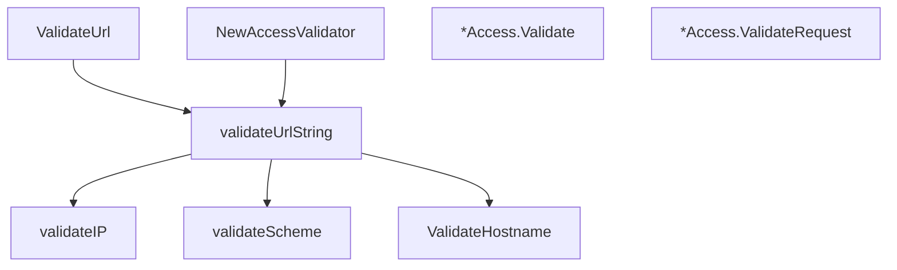

# Behavior Atom: validation/validation.go

## Source Anchor

- Go source: [cloudflare/cloudflared@2026.3.0/validation/validation.go](https://github.com/cloudflare/cloudflared/blob/2026.3.0/validation/validation.go)
- Package: validation
- Module group: validation

## Behavioral Responsibility

Core package behavior anchored to this source file.

## Entry Points

- ValidateHostname(hostname string) (string, error) (line 29)
- ValidateUrl(originUrl string) (*url.URL, error) (line 72)
- NewAccessValidator(ctx context.Context, domain string, issuer string, applicationAUD string) (*Access, error) (line 176)
- (*Access) Validate(ctx context.Context, jwt string) error (line 194)
- (*Access) ValidateRequest(ctx context.Context, r*http.Request) error (line 214)

## Internal Function Surface

- validateUrlString(originUrl string) (string, error) (line 80)
- validateScheme(scheme string) error (line 149)
- validateIP(scheme string, host string, port string) (string, error) (line 158)

## Input Contract

- HTTP requests
- func-param:applicationAUD string
- func-param:ctx context.Context
- func-param:domain string
- func-param:host string
- func-param:hostname string
- func-param:issuer string
- func-param:jwt string
- func-param:originUrl string
- func-param:port string
- func-param:r *http.Request
- func-param:scheme string

## Output Contract

- return:*Access
- return:*url.URL
- return:error
- return:string

## Side Effects and State Transitions

- network I/O

## Branching and Failure Semantics

- Branch density: if=31, switch=0, select=0
- error-return paths

## Import and Dependency Surface

- context
- fmt
- github.com/coreos/go-oidc/v3/oidc
- github.com/pkg/errors
- golang.org/x/net/idna
- net
- net/http
- net/url
- strings
- time

## Go-Impl Flow (Intra-file)

## Rust Porting Notes

- **URL/hostname validation**: `net/url.Parse` + custom hostname checks → `url::Url::parse()` + manual hostname validation.
- **OIDC JWT verification**: `go-oidc` for token validation → `openidconnect` crate or `jsonwebtoken` with JWK set.
- **IDN handling**: `x/net/idna` for internationalized domains → `idna` crate.
- **Quirk — 31 if-branches**: Extensive input validation; decompose into per-type validators.

## Accuracy Notes

- Generated from Go AST parsing and source text pattern extraction.
- Source link is authoritative for disputed semantics; keep this atom synchronized with the linked file.
