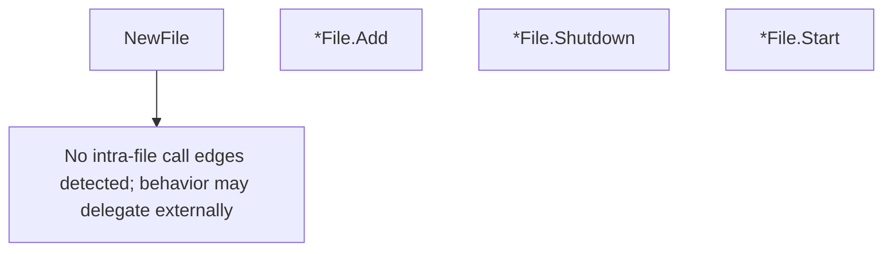

# Behavior Atom: watcher/file.go

## Source Anchor

- Go source: [cloudflare/cloudflared@2026.3.0/watcher/file.go](https://github.com/cloudflare/cloudflared/blob/2026.3.0/watcher/file.go)
- Package: watcher
- Module group: watcher

## Behavioral Responsibility

Runtime lifecycle and orchestration behavior.

## Entry Points

- NewFile() (*File, error) (line 14)
- (*File) Add(filepath string) error (line 27)
- (*File) Shutdown() (line 32)
- (*File) Start(notifier Notification) (line 41)

## Internal Function Surface

- None detected.

## Input Contract

- func-param:filepath string
- func-param:notifier Notification

## Output Contract

- HTTP response writes
- return:*File
- return:error

## Side Effects and State Transitions

- No high-signal side effect pattern detected in static scan.

## Branching and Failure Semantics

- Branch density: if=4, switch=0, select=2
- error-return paths
- fallback/default branches

## Import and Dependency Surface

- github.com/fsnotify/fsnotify

## Go-Impl Flow (Intra-file)

## Rust Porting Notes

- **fsnotify watcher**: `fsnotify.NewWatcher` with goroutine event loop + `select` → `notify::RecommendedWatcher` + `tokio::sync::mpsc` channel for async event dispatch.
- **Notification callback**: `Notification` interface → `trait Notification: Send + Sync { fn on_change(&self, path: &Path); }`.
- **Quirk — 4 if-branches + 2 select**: Event filtering + shutdown; use `tokio::select!` with `CancellationToken`.

## Accuracy Notes

- Generated from Go AST parsing and source text pattern extraction.
- Source link is authoritative for disputed semantics; keep this atom synchronized with the linked file.
