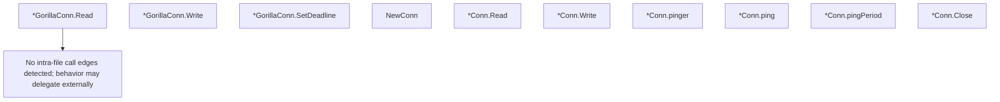

# Behavior Atom: websocket/connection.go

## Source Anchor

- Go source: [cloudflare/cloudflared@2026.3.0/websocket/connection.go](https://github.com/cloudflare/cloudflared/blob/2026.3.0/websocket/connection.go)
- Package: websocket
- Module group: websocket

## Behavioral Responsibility

Transport/protocol behavior for edge-origin data and control flows.

## Entry Points

- (*GorillaConn) Read(p []byte) (int, error) (line 39)
- (*GorillaConn) Write(p []byte) (int, error) (line 60)
- (*GorillaConn) SetDeadline(t time.Time) error (line 71)
- NewConn(ctx context.Context, rw io.ReadWriter, log *zerolog.Logger)*Conn (line 91)
- (*Conn) Read(reader []byte) (int, error) (line 101)
- (*Conn) Write(p []byte) (int, error) (line 111)
- (*Conn) Close() (line 172)

## Internal Function Surface

- (*Conn) pinger(ctx context.Context) (line 124)
- (*Conn) ping() (bool, error) (line 151)
- (*Conn) pingPeriod(ctx context.Context) time.Duration (line 162)

## Input Contract

- func-param:ctx context.Context
- func-param:log *zerolog.Logger
- func-param:p []byte
- func-param:reader []byte
- func-param:rw io.ReadWriter
- func-param:t time.Time

## Output Contract

- HTTP response writes
- return:*Conn
- return:bool
- return:error
- return:int
- return:time.Duration
- stdout/stderr or structured logs

## Side Effects and State Transitions

- network I/O
- concurrency primitives
- timers and scheduling

## Branching and Failure Semantics

- Branch density: if=14, switch=0, select=1
- error-return paths

## Import and Dependency Surface

- bytes
- context
- errors
- fmt
- github.com/gobwas/ws
- github.com/gobwas/ws/wsutil
- github.com/gorilla/websocket
- github.com/rs/zerolog
- io
- sync
- time

## Go-Impl Flow (Intra-file)

## Rust Porting Notes

- **Dual WebSocket impls**: gorilla + gobwas WebSocket libraries → unify on `tokio_tungstenite` (single library covers both use cases).
- **Goroutine pinger**: Background goroutine sending periodic pings via `select` + timer → `tokio::spawn` with `tokio::select!` on `interval.tick()` + `CancellationToken`.
- **Mutex-guarded write**: `sync.Mutex` protecting concurrent WebSocket writes → `tokio::sync::Mutex<SplitSink<…>>` or channel-based write serialization.
- **Quirk — 14 if-branches**: Close-state checks + error handling; use `select!` with cancellation.

## Accuracy Notes

- Generated from Go AST parsing and source text pattern extraction.
- Source link is authoritative for disputed semantics; keep this atom synchronized with the linked file.
