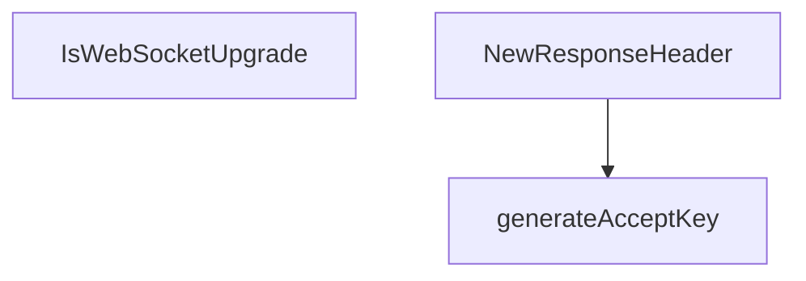

# Behavior Atom: websocket/websocket.go

## Source Anchor

- Go source: [cloudflare/cloudflared@2026.3.0/websocket/websocket.go](https://github.com/cloudflare/cloudflared/blob/2026.3.0/websocket/websocket.go)
- Package: websocket
- Module group: websocket

## Behavioral Responsibility

Transport/protocol behavior for edge-origin data and control flows.

## Entry Points

- IsWebSocketUpgrade(req *http.Request) bool (line 12)
- NewResponseHeader(req *http.Request) http.Header (line 17)

## Internal Function Surface

- generateAcceptKey(challengeKey string) string (line 28)

## Input Contract

- HTTP requests
- func-param:challengeKey string
- func-param:req *http.Request

## Output Contract

- HTTP response writes
- return:bool
- return:http.Header
- return:string

## Side Effects and State Transitions

- network I/O

## Branching and Failure Semantics

- Branch density: if=0, switch=0, select=0
- No explicit failure pattern markers found in static scan.

## Import and Dependency Surface

- crypto/sha1
- encoding/base64
- github.com/gorilla/websocket
- net/http

## Go-Impl Flow (Intra-file)

## Rust Porting Notes

- **WebSocket upgrade detection**: `IsWebSocketUpgrade` checking headers → check `req.headers().get("Upgrade") == Some("websocket")`.
- **Accept key generation**: `crypto/sha1` for Sec-WebSocket-Accept → `sha1::Sha1::digest()` + base64 encode (or rely on `tungstenite` library handling handshake).
- **Quirk — zero branching**: Utility functions; direct translation.

## Accuracy Notes

- Generated from Go AST parsing and source text pattern extraction.
- Source link is authoritative for disputed semantics; keep this atom synchronized with the linked file.
