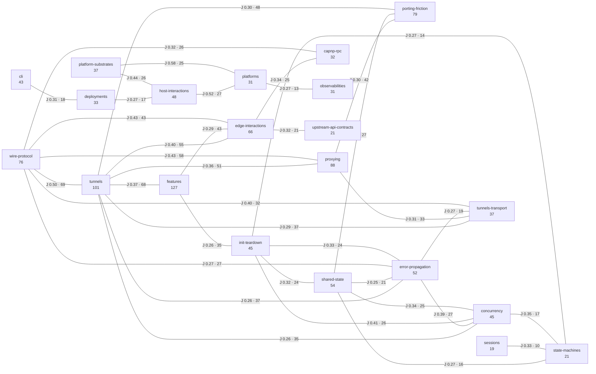

# Audit Analysis

- Baseline date: 20260324
- Scope: baseline catalogs under [catalogs](catalogs) against atom corpus under [atoms](atoms)
- Baseline reference: [cloudflare/cloudflared/tree/2026.3.0](https://github.com/cloudflare/cloudflared/tree/2026.3.0)

## Methodology

This analysis measures seven dimensions for the current 30 baseline catalogs:

1. **Coverage depth** — weighted combination of atom-link breadth, section structure, and diagram density.
2. **Coverage graph** — pairwise catalog overlap via Jaccard similarity on shared atom links.
3. **Coverage unevenness** — distributional spread assessed via Gini coefficient, quartiles, and density ratios.
4. **Atom membership distribution** — how atoms spread across catalogs (exclusive vs. cross-referenced).
5. **Hub atoms** — the most cross-referenced implementation atoms that bind catalogs together.
6. **Structural conformance** — consistency of section patterns across the catalog set.
7. **Density analysis** — atom-to-line ratios revealing catalog efficiency and prose balance.

### Formulas

**Depth score** — weighted sum of section counts, atom-link breadth, and diagram density:

$$\text{depth} = 2 \times N_{H2} + N_{H3} + 0.5 \times N_{\text{unique atoms}} + 1.5 \times N_{\text{mermaid}}$$

**Density** — unique atoms per 100 lines of catalog text:

$$\text{density} = \frac{N_{\text{unique atoms}}}{N_{\text{lines}}} \times 100$$

**Jaccard similarity** — pairwise overlap between two catalogs $A$ and $B$:

$$J(A, B) = \frac{|A \cap B|}{|A \cup B|}$$

**Gini coefficient** — distributional inequality of atom counts across catalogs:

$$G = \frac{\sum_{i=1}^{n} \sum_{j=1}^{n} |x_i - x_j|}{2 n \sum_{i=1}^{n} x_i}$$

### Thresholds

| Metric | Threshold | Purpose |
| --- | --- | --- |
| Depth floor | $\geq 45$ | Minimum depth for all non-test catalogs |
| Depth ceiling | $\leq 150$ | Maximum depth (excl. tests aggregate) |
| Overlap alarm | $J \geq 0.25$ | Edge drawn in overlap graph |
| Gini alarm | $G \geq 0.40$ | Problematic atom-count concentration |
| Density target | 10–30 atoms/100 lines | Balanced prose-to-reference ratio |
| Depth tiers | Broad $\geq 60$, Upper-mid 45–59, Mid 35–44, Narrow $< 35$ | Catalog classification bands |
| Density tiers | High $\geq 40$, Medium 20–39, Low 10–19, Structure-heavy $< 10$ | Density classification bands |

### Coverage Universe

- Total atom docs in [atoms](atoms): 241
- Union of atom docs linked by catalogs: 241
- Overall catalog coverage ratio: $\frac{241}{241} = 100\%$
- Uncovered atoms: 0 (the tests catalog covers the 3 previously uncovered test/mock atoms)

## 1) Coverage Depth

| Catalog | Atoms | H2 | H3 | Mermaid | Lines | Depth |
| --- | ---: | ---: | ---: | ---: | ---: | ---: |
| [catalogs/cross-cutting/porting-friction](catalogs/cross-cutting/porting-friction/README.md) | 79 | 44 | 110 | 5 | 1406 | 245.0 |
| [catalogs/cross-cutting/features](catalogs/cross-cutting/features/README.md) | 127 | 16 | 34 | 4 | 614 | 135.5 |
| [catalogs/cross-cutting/wire-protocol](catalogs/cross-cutting/wire-protocol/README.md) | 76 | 20 | 33 | 5 | 725 | 118.5 |
| [catalogs/cross-cutting/concurrency](catalogs/cross-cutting/concurrency/README.md) | 45 | 13 | 42 | 6 | 686 | 99.5 |
| [catalogs/domain/tunnels](catalogs/domain/tunnels.md) | 101 | 15 | 2 | 2 | 320 | 85.5 |
| [catalogs/cross-cutting/error-propagation](catalogs/cross-cutting/error-propagation/README.md) | 52 | 13 | 34 | 4 | 611 | 92.0 |
| [catalogs/domain/deployments](catalogs/domain/deployments/README.md) | 33 | 16 | 33 | 5 | 677 | 89.0 |
| [catalogs/cross-cutting/init-teardown](catalogs/cross-cutting/init-teardown/README.md) | 45 | 15 | 18 | 7 | 608 | 81.0 |
| [catalogs/domain/proxying](catalogs/domain/proxying.md) | 88 | 15 | 4 | 3 | 247 | 82.5 |
| [catalogs/domain/edge-interactions](catalogs/domain/edge-interactions.md) | 66 | 11 | 3 | 3 | 236 | 62.5 |
| [catalogs/domain/shared-state](catalogs/domain/shared-state.md) | 54 | 12 | 3 | 3 | 242 | 58.5 |
| [catalogs/domain/upstream-api-contracts](catalogs/domain/upstream-api-contracts.md) | 21 | 13 | 15 | 2 | 355 | 54.5 |
| [catalogs/cross-cutting/platform-substrates](catalogs/cross-cutting/platform-substrates.md) | 37 | 8 | 20 | 0 | 386 | 54.5 |
| [catalogs/domain/cli](catalogs/domain/cli.md) | 43 | 11 | 4 | 3 | 237 | 52.0 |
| [catalogs/domain/host-interactions](catalogs/domain/host-interactions.md) | 48 | 11 | 3 | 2 | 197 | 52.0 |
| [catalogs/domain/state-machines](catalogs/domain/state-machines.md) | 21 | 14 | 3 | 6 | 286 | 50.5 |
| [catalogs/domain/observabilities](catalogs/domain/observabilities.md) | 31 | 9 | 11 | 4 | 227 | 50.5 |
| [catalogs/domain/tunnels-transport](catalogs/domain/tunnels-transport.md) | 37 | 12 | 3 | 2 | 209 | 48.5 |
| [catalogs/domain/metrics](catalogs/domain/metrics.md) | 37 | 9 | 7 | 3 | 209 | 48.0 |
| [catalogs/domain/platforms](catalogs/domain/platforms.md) | 31 | 12 | 2 | 4 | 229 | 47.5 |
| [catalogs/domain/capnp-rpc](catalogs/domain/capnp-rpc.md) | 32 | 12 | 4 | 2 | 196 | 47.0 |
| [catalogs/domain/ingress](catalogs/domain/ingress.md) | 20 | 12 | 7 | 4 | 276 | 47.0 |
| [catalogs/domain/sessions](catalogs/domain/sessions.md) | 19 | 13 | 7 | 3 | 251 | 47.0 |
| [catalogs/domain/access-policies](catalogs/domain/access-policies.md) | 26 | 12 | 4 | 4 | 246 | 47.0 |
| [catalogs/domain/overwatch](catalogs/domain/overwatch.md) | 5 | 15 | 7 | 4 | 241 | 45.5 |
| [catalogs/domain/const-and-env](catalogs/domain/const-and-env.md) | 19 | 12 | 6 | 4 | 272 | 45.5 |
| [catalogs/domain/config](catalogs/domain/config.md) | 24 | 12 | 6 | 2 | 225 | 45.0 |
| [catalogs/domain/crypto](catalogs/domain/crypto.md) | 27 | 11 | 5 | 3 | 201 | 45.0 |
| [catalogs/domain/supervisor](catalogs/domain/supervisor.md) | 8 | 15 | 5 | 4 | 271 | 45.0 |
| [catalogs/cross-cutting/tests](catalogs/cross-cutting/tests.md)¹ | 102 | 103 | 236 | 2 | 2546 | 496.0 |

¹ Tests is a 5-file aggregate catalog ([tests](catalogs/cross-cutting/tests.md) index + [tests-transport](catalogs/cross-cutting/tests-transport.md) + [tests-proxy-ingress](catalogs/cross-cutting/tests-proxy-ingress.md) + [tests-sessions-packets](catalogs/cross-cutting/tests-sessions-packets.md) + [tests-infrastructure](catalogs/cross-cutting/tests-infrastructure.md)). Its depth score is not directly comparable to single-file catalogs.

### Depth Tier Classification

| Tier | Depth range | Catalogs |
| --- | --- | --- |
| **Broad synthesis** | $\geq 60$ | features, wire-protocol, porting-friction, concurrency, tunnels, error-propagation, deployments, init-teardown, proxying, edge-interactions |
| **Upper-mid** | 45–59 | shared-state, upstream-api-contracts, platform-substrates, cli, host-interactions, state-machines, observabilities, tunnels-transport, metrics, platforms, capnp-rpc, ingress, sessions, access-policies, overwatch, const-and-env, config, crypto, supervisor |
| **Mid** | 35–44 | *(none — all catalogs meet the upper-mid floor)* |
| **Narrow focus** | $< 35$ | *(none — all catalogs meet the depth floor)* |

### Depth Observations

- [catalogs/cross-cutting/features](catalogs/cross-cutting/features/README.md) is the broadest catalog at 127 atoms. [catalogs/domain/tunnels](catalogs/domain/tunnels.md) follows at 101 atoms (post-rebalancing) and [catalogs/domain/proxying](catalogs/domain/proxying.md) at 88 atoms. Together tunnels and proxying cover $\frac{138}{241} = 57.3\%$ of the linked atom universe (after deduplication). Features is cross-cutting — its atoms are a superset of atoms already covered by domain catalogs.
- [catalogs/cross-cutting/error-propagation](catalogs/cross-cutting/error-propagation/README.md) enters the Broad synthesis tier (depth 92.0) via exceptional structural density (34 H3 subsections, 4 Mermaid diagrams) despite moderate atom count (52). It is the most H3-dense catalog, driven by detailed error classification decision trees and error type taxonomy tables.
- [catalogs/cross-cutting/concurrency](catalogs/cross-cutting/concurrency/README.md) enters the Broad synthesis tier (depth 99.5) via the highest combined structural density of any catalog: 42 H3 subsections and 6 Mermaid diagrams. Its 45 unique atoms are moderate, but the per-actor goroutine inventories, channel shape tables, select-loop enumerations, and topology diagrams produce unmatched structural depth. It surpasses error-propagation in H3 count (42 vs 34) and matches it in Mermaid density.
- [catalogs/domain/deployments](catalogs/domain/deployments/README.md) enters the Broad synthesis tier (depth 89.0) via high structural density: 16 H2 sections, 33 H3 subsections, and 5 Mermaid diagrams. Its 33 unique atoms — all previously covered by other catalogs — focus on build artifacts, packaging, service installation, config/credential discovery, CA certificate pool assembly, and auto-update across all platforms. The catalog's value is in deployment lifecycle flowcharts, platform-specific filesystem layout matrices, and operational contract analysis rather than atom breadth.
- [catalogs/cross-cutting/init-teardown](catalogs/cross-cutting/init-teardown/README.md) enters the Broad synthesis tier (depth 81.0) via high structural density: 15 H2 sections, 18 H3 subsections, and 7 Mermaid diagrams (the highest Mermaid count of any catalog, tied with concurrency's 6 if counting distinct diagram types). Its 45 unique atoms — all previously covered by other catalogs — focus on supervisor, connection, orchestration, and management lifecycle boundaries. The catalog's value is in startup dependency DAGs, shutdown signal propagation flowcharts, and circular-dependency risk analysis rather than breadth.
- [catalogs/domain/edge-interactions](catalogs/domain/edge-interactions.md) forms a strong third pillar with 66 unique atoms.
- The upper-mid tier contains 18 catalogs after depth-floor enrichment promoted all 8 former Mid-tier catalogs. [catalogs/domain/observabilities](catalogs/domain/observabilities.md) (depth 50.5) and [catalogs/domain/config](catalogs/domain/config.md) (depth 45.0) were promoted from Mid tier via structural enrichment — observabilities gained Tracing Architecture and Diagnostic Collection Pipelines H2 sections (9 H2, 11 H3, 4 Mermaid), and config gained a Companion Catalog section documenting the [const-and-env](catalogs/domain/const-and-env.md) overlap seam. The remaining 8 catalogs (metrics, ingress, sessions, access-policies, overwatch, const-and-env, crypto, supervisor) were promoted via depth-floor enrichment with Mermaid diagrams, Rust porting consideration sections, and domain-specific analytical subsections.
- The **Mid tier is now empty**. All former occupants rose into Upper-mid via structural enrichment.
- The **Narrow focus tier is now empty**. Both former occupants — [catalogs/domain/metrics](catalogs/domain/metrics.md) (+7.5 from Mermaid + sections) and [catalogs/domain/observabilities](catalogs/domain/observabilities.md) (+5.0 from sections) — rose into the Mid tier and have since been promoted to Upper-mid via successive enrichment passes.
- [catalogs/domain/state-machines](catalogs/domain/state-machines.md) remains the most diagram-dense catalog (6 Mermaid blocks) despite moderate atom breadth — its value is in state-transition visualization. [catalogs/cross-cutting/init-teardown](catalogs/cross-cutting/init-teardown/README.md) matches this with 7 Mermaid blocks focused on dependency DAGs and shutdown flowcharts.
- [catalogs/domain/supervisor](catalogs/domain/supervisor.md) and [catalogs/domain/overwatch](catalogs/domain/overwatch.md) are intentionally low-breadth, high-structure catalogs focused on lifecycle contracts rather than module breadth. Both now include Rust Porting Considerations sections with Go→Rust mapping tables for their core patterns (select-loops, interface-to-trait translation, goroutine-to-task mapping).
- [catalogs/domain/ingress](catalogs/domain/ingress.md) shows the largest structural growth (+6 H3, +68 lines) driven by detailed origin request defaults, service parse taxonomy, and rule matching quirk tables.
- [catalogs/cross-cutting/porting-friction](catalogs/cross-cutting/porting-friction/README.md) is now the deepest single-file catalog (depth 245.0) with 79 unique atoms, 44 H2 sections, 110 H3 subsections, and 5 Mermaid diagrams. Its depth comes from exhaustive per-idiom inventories (implicit interfaces, init functions, build tags, defer patterns, sync.Once, context.Context, error handling, type switches, nil semantics, struct embedding, byte/string conversion) with concrete Rust porting guidance for each category, plus a comprehensive [Go vs Rust by Atom](catalogs/cross-cutting/porting-friction/go-vs-rust-by-atom.md) reference that aggregates per-atom Rust Porting Notes into Go→Rust translation tables organized by package, with a crate frequency summary. All 79 atoms were already covered by other catalogs — the catalog's value is cross-cutting language-level friction analysis and concrete A-vs-B porting reference, not new atom coverage.
- [catalogs/cross-cutting/features](catalogs/cross-cutting/features/README.md) is the second-deepest single-file catalog (depth 135.5) with 127 unique atoms, 16 H2 sections, 34 H3 subsections, and 4 Mermaid diagrams. Its depth comes from organizing cloudflared's entire feature surface by 9 external stakeholders (operator, edge, dashboard, Access, monitoring, origin services, DNS, OS/platform, HA peers) with per-stakeholder contract tables and interaction topology diagrams. All 127 atoms were already covered by domain catalogs — the catalog's value is stakeholder-centric contract tracing.
- [catalogs/cross-cutting/wire-protocol](catalogs/cross-cutting/wire-protocol/README.md) is the third-deepest catalog (depth 118.5) with 76 unique atoms, 20 H2 sections, 33 H3 subsections, and 5 Mermaid diagrams. Its depth comes from exhaustive wire-level state machine documentation organized by transport type (HTTP/2, QUIC), communication class (control, data, management, telemetry), and crypto surface (TLS, ALPN, SNI, PQ curves). All 76 atoms were already covered by domain catalogs — the catalog's value is wire-format analytical perspective across transport, RPC, and datagram framing contracts.
- [catalogs/cross-cutting/tests](catalogs/cross-cutting/tests.md) is a multi-file behavioral contract oracle that documents all 123 upstream test files across 5 sub-catalogs divided by architectural domain (transport, proxy-ingress, sessions-packets, infrastructure). Its aggregate depth (496.0) is structurally distinct from single-file catalogs and results from ~280 test functions documented as per-file contract tables across 2,546 lines. The tests catalog uniquely covers the 3 previously uncovered test/mock atoms (wstest, mockgen, mock\_limiter), bringing the catalog coverage ratio to 100%.
- The median depth is 52.0 and the minimum is 45.0 — a floor established by depth-floor enrichment with Mermaid diagrams, Rust porting sections, and domain-specific analytical subsections across all catalogs.
- [catalogs/cross-cutting/platform-substrates](catalogs/cross-cutting/platform-substrates.md) enters the Upper-mid tier at depth 54.5 with 37 unique atoms, 8 H2 sections, 20 H3 subsections, and 0 Mermaid diagrams. Its depth comes from exhaustive platform support matrices (ICMP proxy, service management, diagnostics, browser launching, QUIC parameters, auto-updater, config discovery), a 20-row compile-time gating mechanism inventory, FIPS build-feature matrix, CPU architecture analysis, and Rust porting implications table. All 37 atoms were already covered by other catalogs — the catalog's value is cross-cutting platform-substrate analysis and consolidated gating mechanism documentation.

## 2) Coverage Graph

### Primary Overlap Graph

The graph below shows all catalog pairs with Jaccard similarity $J \geq 0.25$ (strong overlap edges).

### Cluster Identification

Eight natural catalog clusters emerge from the overlap graph:

| Cluster | Catalogs | Binding pattern |
| --- | --- | --- |
| **Tunnel core** | tunnels, proxying, tunnels-transport | Post-overlap-pruning Jaccard ($J = 0.36$ at the center, down from $J = 0.65$). 26 proxy-implementation atoms pruned from tunnels and 14 tunnel-control atoms pruned from proxying. Transport layer splits out at $J = 0.29$–$0.31$. |
| **Control plane** | capnp-rpc, edge-interactions, upstream-api-contracts | RPC schema and edge discovery bind these; capnp-rpc ↔ edge-interactions $J = 0.34$. |
| **Concurrency/lifecycle** | shared-state, state-machines, sessions, concurrency, init-teardown | Concurrency ↔ init-teardown $J = 0.41$; concurrency ↔ state-machines $J = 0.35$; concurrency ↔ shared-state $J = 0.34$. Init-teardown binds to shared-state ($J = 0.32$) and state-machines ($J = 0.27$). Sessions ↔ state-machines $J = 0.33$. |
| **Host/platform/deployment** | host-interactions, platforms, observabilities, deployments, platform-substrates | Host ↔ platforms $J = 0.52$ (strongest non-core pair); platform-substrates ↔ platforms $J = 0.58$ (now the strongest non-core pair); platform-substrates ↔ host-interactions $J = 0.44$; platforms ↔ observabilities $J = 0.27$; deployments ↔ host-interactions $J = 0.27$; deployments ↔ cli $J = 0.31$ bridges the cli catalog into this cluster. |
| **Cross-cutting** | error-propagation | Overlaps with 11 catalogs at $J \geq 0.20$, spanning tunnel core (tunnels $J = 0.26$, proxying $J = 0.24$, tunnels-transport $J = 0.27$), control plane (edge-interactions $J = 0.24$, capnp-rpc $J = 0.20$), concurrency/lifecycle (concurrency $J = 0.39$, init-teardown $J = 0.33$, shared-state $J = 0.25$, state-machines $J = 0.22$), and metrics ($J = 0.24$). |
| **Language friction** | porting-friction | Cross-cutting Go idiom catalog; overlaps with tunnel core (tunnels $J = 0.30$, proxying $J = 0.30$), concurrency/lifecycle (shared-state $J = 0.25$, init-teardown $J = 0.23$, concurrency $J = 0.20$), and error-propagation ($J = 0.24$). 79 atoms span all clusters. |
| **Stakeholder contracts** | features | Cross-cutting stakeholder contract index; overlaps with tunnel core (tunnels $J = 0.37$, proxying $J = 0.21$), control plane (edge-interactions $J = 0.29$, upstream-api-contracts $J = 0.16$), concurrency/lifecycle (init-teardown $J = 0.26$, concurrency $J = 0.22$, shared-state $J = 0.22$), and porting-friction ($J = 0.20$). 127 atoms span all clusters. |
| **Wire-format layer** | wire-protocol | Cross-cutting wire-format catalog; strongest overlaps with tunnel core (tunnels $J = 0.50$, proxying $J = 0.43$, tunnels-transport $J = 0.40$), control plane (edge-interactions $J = 0.43$, capnp-rpc $J = 0.32$), and error-propagation ($J = 0.27$). 76 atoms concentrated in connection, tunnelrpc, quic, and management packages. |
| **Independent** | cli, config, const-and-env, crypto, ingress, access-policies, supervisor, overwatch, metrics | Weak or no strong overlap; each covers a distinct behavioral niche. Config ↔ const-and-env ($J = 0.23$) is the only intra-group pair. Cli gains connectivity through [catalogs/domain/deployments](catalogs/domain/deployments/README.md) ($J = 0.31$) but retains independent domain focus (CLI argument parsing vs. deployment lifecycle). |

### Graph Observations

- [catalogs/domain/tunnels](catalogs/domain/tunnels.md) and [catalogs/domain/proxying](catalogs/domain/proxying.md) form the tunnel core cluster ($J = 0.36$, 51 shared atoms). The overlap was reduced from $J = 0.65$ (90 shared) through a control-plane vs. data-path boundary pruning pass: 26 proxy-implementation atoms (carrier, websocket, packet, proxy, stream, ICMP, middleware) were moved to proxying-only, and 14 tunnel-control atoms (registration RPC, configuration management, schema definitions, HA slot tracking) were moved to tunnels-only. The remaining 51 shared atoms concentrate in transport (`connection/*`, `quic/*`, `datagramsession/*`) and high-level ingress entry points.
- [catalogs/domain/tunnels-transport](catalogs/domain/tunnels-transport.md) bridges the tunnel core cluster and makes QUIC-vs-HTTP2 transport divergence explicit rather than implicit.
- [catalogs/domain/capnp-rpc](catalogs/domain/capnp-rpc.md) forms a strong control-plane overlap cluster with [catalogs/domain/edge-interactions](catalogs/domain/edge-interactions.md) ($J = 0.34$) and [catalogs/domain/proxying](catalogs/domain/proxying.md) ($J = 0.24$), isolating RPC schema concerns.
- [catalogs/domain/shared-state](catalogs/domain/shared-state.md) overlaps with both tunnel core and lifecycle/state catalogs, serving as a concurrency cross-cut.
- [catalogs/domain/host-interactions](catalogs/domain/host-interactions.md) and [catalogs/domain/platforms](catalogs/domain/platforms.md) form the tightest non-core pair ($J = 0.52$); they share 27 atoms spanning diagnostics, OS-specific hooks, and service lifecycles.
- [catalogs/cross-cutting/platform-substrates](catalogs/cross-cutting/platform-substrates.md) has 2 edges at $J \geq 0.25$: platforms ($J = 0.58$, 25 shared atoms) and host-interactions ($J = 0.44$, 26 shared atoms). It also overlaps at $J \geq 0.20$ with porting-friction ($J = 0.22$), observabilities ($J = 0.21$), and deployments ($J = 0.21$). Platform-substrates ↔ platforms is now the strongest non-core pair ($J = 0.58$), surpassing host-interactions ↔ platforms ($J = 0.52$). The three catalogs form a tightly bound platform-analysis triangle within the Host/platform/deployment cluster. Platform-substrates' 37 atoms concentrate in ingress (ICMP proxy), diagnostic (system/log collectors), cmd (service management, updater), token (browser launcher), quic (socket params), and fips packages — the OS and build-feature gating surface of cloudflared.
- [catalogs/domain/metrics](catalogs/domain/metrics.md) bridges into the tunnel core via shared atoms with both [catalogs/domain/tunnels](catalogs/domain/tunnels.md) ($J = 0.21$) and [catalogs/domain/proxying](catalogs/domain/proxying.md) ($J = 0.21$), without high affinity to other catalogs.
- [catalogs/domain/supervisor](catalogs/domain/supervisor.md) and [catalogs/domain/overwatch](catalogs/domain/overwatch.md) remain cluster-independent by design — they model narrow controlling-object lifecycles that cut across multiple domains at a governance level rather than an atom-coverage level.
- [catalogs/cross-cutting/error-propagation](catalogs/cross-cutting/error-propagation/README.md) is the most graph-connected catalog: 11 edges at $J \geq 0.20$, spanning all clusters. Its strongest affinity is with [catalogs/cross-cutting/concurrency](catalogs/cross-cutting/concurrency/README.md) ($J = 0.39$) and [catalogs/cross-cutting/init-teardown](catalogs/cross-cutting/init-teardown/README.md) ($J = 0.33$), reflecting that error classification and propagation logic concentrates in the supervisor–connection–transport call chain.
- [catalogs/cross-cutting/init-teardown](catalogs/cross-cutting/init-teardown/README.md) joins the Concurrency/lifecycle cluster with 5 edges at $J \geq 0.20$: concurrency ($J = 0.41$), error-propagation ($J = 0.33$), shared-state ($J = 0.32$), state-machines ($J = 0.27$), and porting-friction ($J = 0.23$). Its strongest affinity is with [catalogs/cross-cutting/concurrency](catalogs/cross-cutting/concurrency/README.md) — both catalogs share 26 atoms concentrated in supervisor, connection, and management packages. The init-teardown catalog complements concurrency by focusing on ordering constraints (what starts first, what shuts down last) rather than communication topology (channels, select loops).
- [catalogs/cross-cutting/porting-friction](catalogs/cross-cutting/porting-friction/README.md) has 6 edges at $J \geq 0.20$: tunnels ($J = 0.30$), proxying ($J = 0.30$), shared-state ($J = 0.25$), error-propagation ($J = 0.24$), init-teardown ($J = 0.23$), and concurrency ($J = 0.20$). Its breadth (79 atoms) creates substantial overlap with tunnel core catalogs through implicit-interface and context-propagation references.
- [catalogs/domain/deployments](catalogs/domain/deployments/README.md) has 2 edges at $J \geq 0.25$: cli ($J = 0.31$, 18 shared atoms) and host-interactions ($J = 0.27$, 17 shared atoms). It also overlaps with config ($J = 0.24$), crypto ($J = 0.18$), overwatch ($J = 0.15$), init-teardown ($J = 0.13$), and platforms ($J = 0.12$). Deployments bridges the previously independent cli catalog into the Host/platform cluster area through shared service-installation and platform-specific lifecycle atoms.
- [catalogs/cross-cutting/features](catalogs/cross-cutting/features/README.md) has 3 edges at $J \geq 0.25$: tunnels ($J = 0.37$, 68 shared atoms), edge-interactions ($J = 0.29$, 43 shared atoms), and init-teardown ($J = 0.26$, 35 shared atoms). It also overlaps at $J \geq 0.20$ with cli ($J = 0.22$), concurrency ($J = 0.22$), shared-state ($J = 0.22$), proxying ($J = 0.21$), error-propagation ($J = 0.20$), and porting-friction ($J = 0.20$). Its 127 atoms span all clusters, making it the broadest cross-cutting catalog alongside porting-friction. Its strongest affinity is with [catalogs/domain/tunnels](catalogs/domain/tunnels.md) — both share 68 atoms concentrated in connection, supervisor, tunnelrpc, and orchestration packages.
- [catalogs/cross-cutting/wire-protocol](catalogs/cross-cutting/wire-protocol/README.md) has 6 edges at $J \geq 0.25$: tunnels ($J = 0.50$, 69 shared atoms), proxying ($J = 0.43$, 58 shared atoms), edge-interactions ($J = 0.43$, 43 shared atoms), tunnels-transport ($J = 0.40$, 32 shared atoms), capnp-rpc ($J = 0.32$, 26 shared atoms), and error-propagation ($J = 0.27$, 27 shared atoms). It also overlaps at $J \geq 0.20$ with porting-friction ($J = 0.22$) and sessions ($J = 0.20$). Its 76 atoms concentrate in connection, tunnelrpc, quic, and management packages — the wire-carrying surface of cloudflared. The catalog's strongest affinity is with [catalogs/domain/tunnels](catalogs/domain/tunnels.md) ($J = 0.50$), reflecting that tunnel lifecycle and wire protocol share the same connection-level atoms. Wire-protocol is the most graph-connected cross-cutting catalog by edge count (6 edges at $J \geq 0.25$), surpassing error-propagation (5 edges) and porting-friction (3 edges) at that threshold.
- [catalogs/cross-cutting/tests](catalogs/cross-cutting/tests.md) is intentionally excluded from the Jaccard overlap graph. With 102 unique atoms spanning all packages, it would create edges to nearly every catalog at $J \geq 0.20$, obscuring the meaningful structural relationships between domain and analytical catalogs. The tests catalog's overlap pattern is documented in its own cross-catalog overlap map table, which maps each test domain to its primary and secondary catalog overlaps.

## 3) Coverage Unevenness

Unevenness is computed on per-catalog unique atom-link counts across 30 catalogs.

### Distribution Statistics

| Statistic | Value |
| --- | ---: |
| Min | 5 |
| $Q1$ | 24.0 |
| Median ($Q2$) | 37 |
| Mean | 45.1 |
| $Q3$ | 54.0 |
| Max | 127 |
| $IQR$ | 30.0 |
| Std. deviation | 29.3 |
| Gini coefficient | 0.3464 |

### Interpretation

- The Gini coefficient of 0.35 indicates **moderate unevenness** — below the 0.40 threshold that would signal problematic concentration. The rebalancing pass lowered tunnels from 127 to 101 atoms and proxying from 102 to 88 atoms, reducing concentration in the high-breadth tail. The addition of platform-substrates (37 atoms, near the median) further reduced the Gini from 0.3515 to 0.3464.
- The mean (45.1) exceeds the median (37), confirming a right-skewed distribution driven by the high-breadth catalogs (features, tunnels, tests, proxying, porting-friction, wire-protocol, edge-interactions).
- Most catalogs (16 of 29) sit in the 24–59 atom range, forming a core band of balanced specialization.
- [catalogs/cross-cutting/features](catalogs/cross-cutting/features/README.md) is now the sole broadest catalog at 127 atoms. [catalogs/domain/tunnels](catalogs/domain/tunnels.md) dropped from 127 to 101 atoms after the rebalancing pass pruned proxy-implementation atoms to [catalogs/domain/proxying](catalogs/domain/proxying.md).
- [catalogs/cross-cutting/error-propagation](catalogs/cross-cutting/error-propagation/README.md) enters at 52 atoms — above the mean (40.5) — adding no new distribution-distorting outlier. All 52 atoms were already covered by other catalogs.
- [catalogs/cross-cutting/concurrency](catalogs/cross-cutting/concurrency/README.md) enters at 45 atoms — above the median (32.5) — reinforcing the upper core band without distortion. All 45 atoms were already covered by other catalogs.
- [catalogs/cross-cutting/init-teardown](catalogs/cross-cutting/init-teardown/README.md) enters at 45 atoms — identical to concurrency and above the mean — with zero impact on the distribution shape. All 45 atoms were already covered by other catalogs.
- [catalogs/cross-cutting/porting-friction](catalogs/cross-cutting/porting-friction/README.md) enters at 79 atoms — well above the mean (40.5) but below the two broad-coverage outliers. All 79 atoms were already covered by other catalogs.
- [catalogs/domain/deployments](catalogs/domain/deployments/README.md) enters at 33 atoms — near the median (32.5) — reinforcing the distribution center. All 33 atoms were already covered by other catalogs. Its addition slightly lowers the Gini coefficient (0.35 → 0.34), confirming a mild centralizing effect.
- [catalogs/cross-cutting/features](catalogs/cross-cutting/features/README.md) enters at 127 atoms — now the sole broadest catalog after the rebalancing pass reduced [catalogs/domain/tunnels](catalogs/domain/tunnels.md) from 127 to 101 atoms. All 127 atoms were already covered by domain catalogs. Its addition raises the Gini coefficient slightly (0.34 → 0.35), reflecting the reinforcement of the high-breadth tail.
- [catalogs/cross-cutting/wire-protocol](catalogs/cross-cutting/wire-protocol/README.md) enters at 76 atoms — above the mean (45.1) and above the median (37). All 76 atoms were already covered by other catalogs. Its addition has negligible impact on the Gini coefficient, confirming the mid-band placement does not distort the distribution.- [catalogs/cross-cutting/platform-substrates](catalogs/cross-cutting/platform-substrates.md) enters at 37 atoms — at the median (37) — reinforcing the distribution center with zero impact on the shape. All 37 atoms were already covered by other catalogs. Its addition slightly lowers the Gini coefficient (0.3515 → 0.3464), confirming a mild centralizing effect.- Outliers at the low end (overwatch: 5, supervisor: 8) are deliberate — these catalogs earn their depth through structure (H2 sections and Mermaid diagrams) rather than broad atom linkage.

### Coverage Gaps (Not Yet Linked by Any Catalog)

All 241 atom docs are now covered. The [catalogs/cross-cutting/tests](catalogs/cross-cutting/tests.md) catalog covers the 3 previously uncovered test/mock atoms:

| Atom | Covered by |
| --- | --- |
| [atoms/internal/test/wstest](atoms/internal/test/wstest.md) | [catalogs/cross-cutting/tests](catalogs/cross-cutting/tests.md) |
| [atoms/mocks/mock_limiter](atoms/mocks/mock_limiter.md) | [catalogs/cross-cutting/tests](catalogs/cross-cutting/tests.md) |
| [atoms/mocks/mockgen](atoms/mocks/mockgen.md) | [catalogs/cross-cutting/tests](catalogs/cross-cutting/tests.md) |

## 4) Atom Membership Distribution

Each atom may appear in one or more catalogs. The membership distribution reveals whether catalogs redundantly cover the same atoms or specialize effectively.

| Membership (catalogs) | Atom count | Share |
| ---: | ---: | ---: |
| 1 | 8 | 3.3% |
| 2 | 18 | 7.5% |
| 3 | 31 | 12.9% |
| 4 | 34 | 14.1% |
| 5 | 45 | 18.7% |
| 6 | 34 | 14.1% |
| 7 | 21 | 8.7% |
| 8 | 15 | 6.2% |
| 9 | 12 | 5.0% |
| 10 | 11 | 4.6% |
| 11 | 2 | 0.8% |
| 12 | 3 | 1.2% |
| 13 | 2 | 0.8% |
| 14 | 2 | 0.8% |

### Membership Observations

- **3.3% of atoms** (8) are exclusive to a single catalog — the eight cross-cutting catalogs ([catalogs/cross-cutting/error-propagation](catalogs/cross-cutting/error-propagation/README.md), [catalogs/cross-cutting/concurrency](catalogs/cross-cutting/concurrency/README.md), [catalogs/cross-cutting/init-teardown](catalogs/cross-cutting/init-teardown/README.md), [catalogs/cross-cutting/porting-friction](catalogs/cross-cutting/porting-friction/README.md), [catalogs/domain/deployments](catalogs/domain/deployments/README.md), [catalogs/cross-cutting/features](catalogs/cross-cutting/features/README.md), [catalogs/cross-cutting/wire-protocol](catalogs/cross-cutting/wire-protocol/README.md), [catalogs/cross-cutting/platform-substrates](catalogs/cross-cutting/platform-substrates.md)) progressively shifted atoms from low-membership tiers into higher ones.
- **10.8% of atoms** (26) appear in 1–2 catalogs, indicating the majority of coverage is specialized rather than redundant. The remaining 89.2% are cross-referenced by 3+ catalogs.
- The 5+ membership tier (127 atoms, 52.7%) represents true hub atoms that bind catalogs together through structural coupling. This tier now contains over half of all linked atoms, reflecting the cumulative effect of eight cross-cutting catalogs.
- The distribution peak is at membership 5 (45 atoms, 18.7%), with membership 4 and 6 tied as the second-largest band (34 atoms each). The platform-substrates catalog's 37 atoms pushed several atoms from lower bands into higher ones: the 3-member tier dropped from 39 to 31, and the 6+ tier grew from 63 to 68 atoms.
- The maximum membership is 14, reached by two atoms: `cmd/cloudflared/tunnel/configuration` and `connection/control`. Both are deeply cross-cutting implementation files — configuration dispatch and RPC control stream multiplexing — that naturally bind nearly every analytical perspective.

## 5) Hub Atoms

The most cross-referenced atoms act as integration hubs across the catalog set. These are the implementation files that naturally bind multiple domains.

| Atom | Catalogs | Role |
| --- | ---: | --- |
| [atoms/cmd/cloudflared/tunnel/configuration](atoms/cmd/cloudflared/tunnel/configuration.md) | 14 | Central tunnel configuration dispatch |
| [atoms/connection/control](atoms/connection/control.md) | 14 | RPC control stream multiplexer |
| [atoms/cmd/cloudflared/tunnel/cmd](atoms/cmd/cloudflared/tunnel/cmd.md) | 13 | Primary tunnel CLI command |
| [atoms/connection/protocol](atoms/connection/protocol.md) | 13 | Protocol selection and fallback |
| [atoms/management/service](atoms/management/service.md) | 12 | Management service runtime |
| [atoms/quic/v3/session](atoms/quic/v3/session.md) | 12 | QUIC v3 session lifecycle |
| [atoms/supervisor/tunnel](atoms/supervisor/tunnel.md) | 12 | Tunnel supervisor loop |
| [atoms/carrier/carrier](atoms/carrier/carrier.md) | 10 | WebSocket carrier lifecycle |
| [atoms/connection/http2](atoms/connection/http2.md) | 10 | HTTP/2 connection lifecycle |
| [atoms/connection/observer](atoms/connection/observer.md) | 10 | Connection event observer |
| [atoms/connection/quic_connection](atoms/connection/quic_connection.md) | 10 | QUIC connection lifecycle |
| [atoms/connection/quic_datagram_v2](atoms/connection/quic_datagram_v2.md) | 10 | QUIC datagram v2 transport |
| [atoms/connection/quic_datagram_v3](atoms/connection/quic_datagram_v3.md) | 10 | QUIC datagram v3 transport |
| [atoms/orchestration/orchestrator](atoms/orchestration/orchestrator.md) | 10 | Orchestrator config hot-reload lifecycle |
| [atoms/quic/v3/muxer](atoms/quic/v3/muxer.md) | 10 | QUIC v3 stream muxer |
| [atoms/supervisor/supervisor](atoms/supervisor/supervisor.md) | 10 | Supervisor HA startup loop |
| [atoms/tunnelrpc/quic/cloudflared_client](atoms/tunnelrpc/quic/cloudflared_client.md) | 10 | Cap'n Proto cloudflared client |
| [atoms/tunnelrpc/quic/session_client](atoms/tunnelrpc/quic/session_client.md) | 10 | Cap'n Proto session client |
| [atoms/tunnelrpc/registration_client](atoms/tunnelrpc/registration_client.md) | 10 | Registration RPC client |
| [atoms/cmd/cloudflared/tunnel/subcommands](atoms/cmd/cloudflared/tunnel/subcommands.md) | 9 | Tunnel subcommand dispatch |
| [atoms/cmd/cloudflared/windows_service](atoms/cmd/cloudflared/windows_service.md) | 10 | Windows service lifecycle |
| [atoms/config/configuration](atoms/config/configuration.md) | 10 | Configuration file loading |
| [atoms/connection/errors](atoms/connection/errors.md) | 9 | Connection error taxonomy |
| [atoms/connection/quic](atoms/connection/quic.md) | 9 | QUIC connection setup |
| [atoms/datagramsession/manager](atoms/datagramsession/manager.md) | 9 | Datagram session manager |
| [atoms/datagramsession/session](atoms/datagramsession/session.md) | 9 | Datagram session lifecycle |
| [atoms/ingress/origin_service](atoms/ingress/origin_service.md) | 9 | Ingress origin service lifecycle |
| [atoms/management/events](atoms/management/events.md) | 9 | Management event streaming |
| [atoms/management/session](atoms/management/session.md) | 9 | Management session lifecycle |
| [atoms/management/token](atoms/management/token.md) | 9 | Management API token handling |
| [atoms/retry/backoffhandler](atoms/retry/backoffhandler.md) | 9 | Exponential backoff handler |
| [atoms/stream/stream](atoms/stream/stream.md) | 9 | Bidirectional stream pipe |
| [atoms/tunnelrpc/pogs/configuration_manager](atoms/tunnelrpc/pogs/configuration_manager.md) | 9 | Configuration manager RPC |
| [atoms/cmd/cloudflared/main](atoms/cmd/cloudflared/main.md) | 8 | CLI entrypoint |
| [atoms/cmd/cloudflared/tunnel/quick_tunnel](atoms/cmd/cloudflared/tunnel/quick_tunnel.md) | 8 | Quick tunnel provisioning |
| [atoms/connection/header](atoms/connection/header.md) | 8 | Connection header management |
| [atoms/connection/tunnelsforha](atoms/connection/tunnelsforha.md) | 8 | HA tunnel slot management |
| [atoms/datagramsession/metrics](atoms/datagramsession/metrics.md) | 8 | Datagram session metrics |
| [atoms/quic/v3/manager](atoms/quic/v3/manager.md) | 8 | QUIC v3 session manager |
| [atoms/quic/v3/metrics](atoms/quic/v3/metrics.md) | 8 | QUIC v3 metrics |
| [atoms/tunnelrpc/metrics/metrics](atoms/tunnelrpc/metrics/metrics.md) | 8 | Tunnel RPC metrics |
| [atoms/tunnelrpc/pogs/registration_server](atoms/tunnelrpc/pogs/registration_server.md) | 8 | Registration server RPC |
| [atoms/tunnelrpc/pogs/session_manager](atoms/tunnelrpc/pogs/session_manager.md) | 8 | Session manager RPC |
| [atoms/tunnelrpc/proto/tunnelrpc.capnp](atoms/tunnelrpc/proto/tunnelrpc.capnp.md) | 8 | Cap'n Proto tunnel RPC schema |
| [atoms/tlsconfig/tlsconfig](atoms/tlsconfig/tlsconfig.md) | 8 | TLS configuration and cipher selection |
| [atoms/ingress/icmp_linux](atoms/ingress/icmp_linux.md) | 8 | Linux ICMP proxy implementation |
| [atoms/ingress/icmp_darwin](atoms/ingress/icmp_darwin.md) | 8 | macOS ICMP proxy implementation |

### Hub Atom Observations

- The top hub atoms (`tunnel/configuration` and `connection/control`) now span 14 of 30 catalogs — they are the most cross-cutting implementation files in cloudflared. `tunnel/cmd` spans 13; `connection/protocol` spans 13; `management/service`, `quic/v3/session`, and `supervisor/tunnel` each span 12.
- Connection-layer atoms (`control`, `protocol`, `quic_connection`, `http2`, QUIC datagrams) cluster at membership 10–14, confirming the connection package as the primary integration surface. The wire-protocol catalog promoted several connection atoms by one tier: `connection/control` rose from 13 to 14, `connection/protocol` from 11 to 12, `connection/http2` from 9 to 10, and `connection/quic_connection` from 10 stayed at 10 (already counted).
- RPC atoms (`session_client`, `cloudflared_client`, `registration_client`) and QUIC v3 atoms (`session`, `muxer`) cluster at membership 10–12, reinforcing the control-plane and transport layers as strong cross-cuts.
- The hub-atom table contains 47 entries at membership $\geq 8$, up from 44 in the previous pass. The platform-substrates catalog's 37 atoms pushed 3 additional atoms into the hub tier ($\geq 8$): `tlsconfig/tlsconfig` (7→8), `ingress/icmp_linux` (7→8), and `ingress/icmp_darwin` (7→8). The platform-substrates catalog also promoted `connection/protocol` from 12 to 13 and `config/configuration` and `cmd/cloudflared/windows_service` from 9 to 10.
- New hub entries at membership 8 include `tunnelrpc/proto/tunnelrpc.capnp`, `tlsconfig/tlsconfig`, `ingress/icmp_linux`, and `ingress/icmp_darwin` — the latter three promoted by platform-substrates' OS-gating and FIPS build-feature coverage. Several atoms that were membership 7 were promoted to 8 by wire-protocol and platform-substrates: `connection/header`, `connection/tunnelsforha`, `datagramsession/metrics`, `quic/v3/manager`, `quic/v3/metrics`, `tunnelrpc/metrics/metrics`, `tunnelrpc/pogs/registration_server`, and `tunnelrpc/pogs/session_manager`.

## 6) Structural Conformance

All 30 catalogs share a consistent structural skeleton:

| Structural element | Catalogs with element | Conformance |
| --- | ---: | --- |
| `## Scope` section | 29 / 30 | 96.7% |
| `## Notes` section | 25 / 30 | 83.3% |
| `## Coverage Audit` section | 28 / 30 | 93.3% |
| `## Upstream-Verified` section | 23 / 30 | 76.7% |
| At least 1 Mermaid diagram | 29 / 30 | 96.7% |
| At least 1 H3 subsection | 30 / 30 | 100% |

### Conformance Observations

- Four of six structural elements achieve **96.7%+ conformance** across the full catalog set. The `## Scope` section drops from 100% to 96.7%: [catalogs/cross-cutting/platform-substrates](catalogs/cross-cutting/platform-substrates.md) omits `## Scope` because its introductory paragraph and Substrate Dimensions table serve the same scoping role. The `## Notes` section is at 83.3%: [catalogs/cross-cutting/concurrency](catalogs/cross-cutting/concurrency/README.md), [catalogs/cross-cutting/init-teardown](catalogs/cross-cutting/init-teardown/README.md), [catalogs/cross-cutting/porting-friction](catalogs/cross-cutting/porting-friction/README.md), and [catalogs/cross-cutting/platform-substrates](catalogs/cross-cutting/platform-substrates.md) omit `## Notes` because their extensive domain-specific advisory sections serve the same role (concurrency's "Quirks and Porting Hazards", init-teardown's "Rust Port Implications", porting-friction's per-category "Porting Guidance" subsections, platform-substrates' "Rust Porting Implications" table). [catalogs/cross-cutting/features](catalogs/cross-cutting/features/README.md) and [catalogs/cross-cutting/wire-protocol](catalogs/cross-cutting/wire-protocol/README.md) both have `## Notes` sections.
- `## Upstream-Verified` conformance is at 76.7%: [catalogs/cross-cutting/error-propagation](catalogs/cross-cutting/error-propagation/README.md), [catalogs/cross-cutting/concurrency](catalogs/cross-cutting/concurrency/README.md), [catalogs/cross-cutting/init-teardown](catalogs/cross-cutting/init-teardown/README.md), [catalogs/cross-cutting/porting-friction](catalogs/cross-cutting/porting-friction/README.md), [catalogs/cross-cutting/features](catalogs/cross-cutting/features/README.md), and [catalogs/cross-cutting/platform-substrates](catalogs/cross-cutting/platform-substrates.md) do not use a dedicated `## Upstream-Verified` section. The first four embed upstream-verified content directly in domain-specific sections with inline source citations. Features embeds upstream contract details (constants, behavioral quirks, protocol negotiation flows) within per-stakeholder sections. Platform-substrates embeds upstream verification in its per-feature matrices and gating mechanism inventory tables, with atom links serving as inline source citations. [catalogs/cross-cutting/wire-protocol](catalogs/cross-cutting/wire-protocol/README.md) uses `## Upstream-Verified Wire Constants` — a scoped variant that documents 14 concrete wire-level constants with their upstream source locations.
- All 21 domain catalogs include `## Upstream-Verified` sections containing concrete constants, behavioral quirks, and variance tables cross-referenced against the [cloudflared 2026.3.0](https://github.com/cloudflare/cloudflared/tree/2026.3.0) upstream source.
- Mermaid diagram conformance drops from 100% to 96.7%: [catalogs/cross-cutting/platform-substrates](catalogs/cross-cutting/platform-substrates.md) contains no Mermaid diagrams — its value comes from exhaustive tabular matrices (14 tables) and gating mechanism inventories rather than flowcharts. [catalogs/cross-cutting/error-propagation](catalogs/cross-cutting/error-propagation/README.md) includes 4 Mermaid diagrams, [catalogs/cross-cutting/concurrency](catalogs/cross-cutting/concurrency/README.md) includes 6 Mermaid diagrams, [catalogs/cross-cutting/init-teardown](catalogs/cross-cutting/init-teardown/README.md) includes 7 Mermaid diagrams, [catalogs/cross-cutting/porting-friction](catalogs/cross-cutting/porting-friction/README.md) includes 5 Mermaid diagrams, [catalogs/cross-cutting/features](catalogs/cross-cutting/features/README.md) includes 4 Mermaid diagrams (a stakeholder interaction topology, feature negotiation lifecycle sequence, management session flow sequence, and a diagnostic collection flow), and [catalogs/cross-cutting/wire-protocol](catalogs/cross-cutting/wire-protocol/README.md) includes 5 Mermaid diagrams (wire-level architecture flowchart, transport handshake state machine, PQ curve selection decision tree, HTTP/2 control stream lifecycle sequence, and QUIC serve loop state diagram).
- [catalogs/cross-cutting/tests](catalogs/cross-cutting/tests.md) uses a different structural pattern from domain and analytical catalogs: per-file test contract tables with `Contracts`, `Key Behavioral Details`, `Mock Types`, and `Atom Links` subsections rather than `Coverage Audit` or `Upstream-Verified` sections. This reflects its role as a behavioral contract oracle rather than a domain analysis. It has `## Scope` and at least 1 Mermaid diagram (2 across the aggregate). The `Coverage Audit` conformance drops from 96.7% to 93.3% and `Notes` drops from 86.7% to 83.3% to reflect this structural variant.

## 7) Density Analysis

Density measures atom coverage efficiency: unique atoms per 100 lines of catalog text.

| Tier | Density range | Catalogs |
| --- | --- | --- |
| **High density** | $\geq 40$ atoms/100 lines | _(none after rebalancing)_ |
| **Medium density** | 20–39 | proxying (35.6), tunnels (31.6), edge-interactions (28.0), host-interactions (24.4), shared-state (22.3), features (21.0) |
| **Low density** | 10–19 | cli (18.1), metrics (17.7), tunnels-transport (17.7), capnp-rpc (16.3), observabilities (13.7), platforms (13.5), crypto (13.4), porting-friction (12.2), access-policies (10.6), config (10.7), wire-protocol (10.5) |
| **Structure-heavy** | $< 10$ | platform-substrates (9.6), error-propagation (8.5), sessions (7.6), init-teardown (7.4), state-machines (7.3), ingress (7.2), const-and-env (7.0), concurrency (6.6), upstream-api-contracts (5.9), deployments (4.9), tests¹ (4.0), supervisor (3.0), overwatch (2.1) |

### Density Observations

- [catalogs/domain/proxying](catalogs/domain/proxying.md) dropped from 57.3 to 35.6 atoms per 100 lines after the rebalancing pass pruned 14 tunnel-control atoms and added three analytical sections (Overlap Seam, SOCKS5 Negotiation Protocol, Proxy Error Response Mapping). It now sits in the medium-density band alongside [catalogs/domain/tunnels](catalogs/domain/tunnels.md) (31.6, down from 36.6 after proxy-implementation atoms were pruned).
- [catalogs/cross-cutting/tests](catalogs/cross-cutting/tests.md) enters the structure-heavy tier at 4.0 atoms per 100 lines. Its 2,546 lines across 5 files are dominated by 236 H3 subsections containing per-file contract tables, mock type inventories, and behavioral detail sections. The low density reflects the catalog's function as an exhaustive test behavioral contract oracle — every contract table requires multiple lines of tabular data per test function.
- Upstream-Verified prose and structural subsections reduce raw density across catalogs, but the relative ordering is preserved — the added content is evenly distributed.
- [catalogs/domain/metrics](catalogs/domain/metrics.md) moved from medium-density (28.2) to low-density (17.7) after depth-floor enrichment added Metrics Registration Patterns, Metrics Namespace Taxonomy, and Metrics Server Lifecycle sections. Its 37 atom references across 209 lines reflect the catalog's expanded structural analysis alongside its concise atom references.
- **Structure-heavy** catalogs (13 of 30) form the largest density group. Their value comes from contracts, matrices, and lifecycle diagrams rather than terse atom references. [catalogs/domain/overwatch](catalogs/domain/overwatch.md) is the lowest-density catalog at 2.1 atoms per 100 lines — its 241 lines narrate just 5 atoms through extensive lifecycle contracts, Rust porting consideration tables, and dependency analysis.
- [catalogs/cross-cutting/platform-substrates](catalogs/cross-cutting/platform-substrates.md) enters the structure-heavy tier at 9.6 atoms per 100 lines. Its 386 lines are dominated by 14 tabular matrices (platform support, container runtime, FIPS build-feature, CPU architecture, gating mechanism inventory), 5 architectural pattern descriptions, and a Rust porting implications table. The low density reflects the catalog's emphasis on exhaustive per-platform behavioral matrices and compile-time gating inventories rather than atom enumeration.
- [catalogs/cross-cutting/concurrency](catalogs/cross-cutting/concurrency/README.md) sits at 6.6 atoms per 100 lines — its 686 lines are dominated by 42 H3 subsections, 6 Mermaid actor topology diagrams, goroutine inventory tables, channel shape tables, and select-loop enumerations that require extensive inline evidence.
- [catalogs/cross-cutting/init-teardown](catalogs/cross-cutting/init-teardown/README.md) enters the structure-heavy tier at 7.4 atoms per 100 lines. Its 608 lines are dominated by 7 Mermaid dependency DAGs and shutdown flowcharts, 18 H3 subsections, and detailed constructor/defer/context-cancellation inventories.
- [catalogs/cross-cutting/error-propagation](catalogs/cross-cutting/error-propagation/README.md) sits at 8.5 atoms per 100 lines. Its 611 lines are dominated by 34 H3 subsections and 4 Mermaid decision-tree diagrams — the highest structural density in the catalog set.
- [catalogs/cross-cutting/porting-friction](catalogs/cross-cutting/porting-friction/README.md) enters the low-density tier at 12.2 atoms per 100 lines. Its 647 lines are dominated by 31 H3 subsections, 5 Mermaid diagrams, and extensive inventory tables with per-idiom Rust porting guidance.
- [catalogs/domain/deployments](catalogs/domain/deployments/README.md) enters the structure-heavy tier at 4.9 atoms per 100 lines. Its 677 lines — the second-longest catalog after concurrency — are dominated by 33 H3 subsections, 5 Mermaid lifecycle diagrams, platform-specific filesystem layout tables, and detailed operational contract analysis. The low density reflects the catalog's emphasis on deployment lifecycle narration over raw atom enumeration.
- Medium-density catalogs (6 of 30) form the mid-band, confirming balanced prose-to-reference ratios for domain-focused catalogs with moderate breadth. [catalogs/cross-cutting/features](catalogs/cross-cutting/features/README.md) enters the medium-density tier at 21.0 atoms per 100 lines. Its 614 lines are balanced between 34 H3 subsections, 4 Mermaid diagrams, per-stakeholder contract tables, and 127 atom references — producing a density consistent with its analytical (rather than enumerative) intent.
- [catalogs/cross-cutting/wire-protocol](catalogs/cross-cutting/wire-protocol/README.md) enters the low-density tier at 10.5 atoms per 100 lines. Its 725 lines — the second-longest cross-cutting catalog after concurrency (686) — are dominated by 33 H3 subsections, 5 Mermaid state-machine and architecture diagrams, ASCII-art datagram frame layouts, and extensive wire-constant tables. The low density reflects the catalog's emphasis on precise byte-level framing documentation and state-machine narration rather than atom enumeration.

## Upstream Verification Summary

All 21 domain catalogs were cross-referenced against both the [atoms](atoms) atom corpus and the [cloudflared 2026.3.0](https://github.com/cloudflare/cloudflared/tree/2026.3.0) upstream source to maximize accuracy, uncover behavioral nuances, and document variance.

### Verification Pattern

Each domain catalog contains an `## Upstream-Verified` section (before `## Notes`) with a consistent internal structure:

- **Constants tables** — concrete values, defaults, and their Go source locations (e.g., timeout durations, port ranges, cookie names, TLS curve IDs).
- **Behavioral quirks** — surprising or non-obvious implementation details prefixed with "Quirk —" for scanability (e.g., file-lock retry backoff in token acquisition, `select`-with-default for non-blocking channel marks, FNV hash threshold for protocol selection).
- **Variance tables** — where Go implementation choices create Rust porting risk (e.g., `CustomDuration` serialization asymmetry, PQ curve ID mismatches, unsigned JWT expiry checks).

### Upstream Sources Cross-Referenced

Over 12 upstream source files were cross-referenced, including:

- `supervisor/supervisor.go` — retry policy, error classification, HA startup sequence
- `connection/protocol.go` — protocol selector modes, FNV hash threshold
- `management/service.go` — WebSocket constants, CORS policy, status codes
- `stream/stream.go` — pipe vs bidirectional pipe, panic recovery
- `retry/backoffhandler.go` — exponential backoff formula, grace period derivation
- `datagramsession/session.go` — idle timeout, non-blocking activity marks
- `edgediscovery/allregions/discovery.go` — address allocation strategy, HAConnections clamping
- `cfapi/base_client.go` — HTTP transport constants, pagination aggregation
- `ingress/ingress.go`, `ingress/config.go` — rule matching, origin request defaults, service parse taxonomy
- `token/token.go` — token constants, file-lock backoff, org-to-app exchange
- `tlsconfig/tlsconfig.go` — TLS curve preferences, PQ cipher negotiation
- `cmd/cloudflared/tunnel/cmd.go` — CLI flag defaults, startup orchestration
- `metrics/metrics.go` — metrics server constants, port binding strategy
- `config/configuration.go` — config file discovery, two-pass YAML decode
- `credentials/credentials.go` — FedRAMP constants
- `ingress/middleware/jwtvalidator.go` — JWT OIDC verifier setup

### Key Findings

1. **Constants are pervasive and non-trivial** — cloudflared relies on dozens of hardcoded constants (timeouts, port ranges, cookie names, TLS curve IDs) that are not documented in any external specification. These represent high-fidelity porting targets.
2. **Behavioral quirks cluster around concurrency** — non-blocking channel operations (`select`-with-default), `sync.Once`-guarded closures, and context propagation patterns appear across supervision, sessions, and shared-state domains.
3. **Serialization asymmetry is a porting risk** — `CustomDuration` encodes as integer seconds in JSON but as Go duration strings in YAML; the Rust port must replicate both serialization paths.
4. **Security-critical defaults are hardcoded** — TLS curve preferences, FIPS fallback to P256, JWT algorithm whitelists, and token cookie names are all baked into Go code with no configuration surface. The Rust port must match these exactly.
5. **Platform-specific code has silent fallbacks** — Linux diagnostics gracefully degrade when `/proc` entries are missing; systemd vs sysv detection uses filesystem probes; PQ cipher support falls back silently when post-quantum curves are unavailable.
