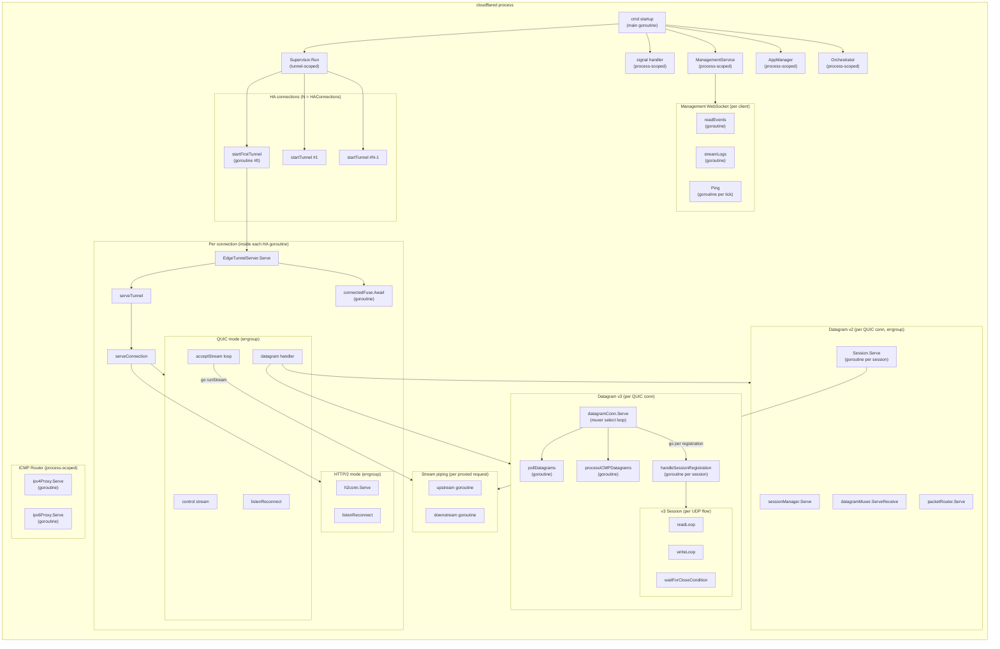

# Concurrency Actor Topology Catalog

- Baseline date: 20260321
- Baseline reference: [cloudflare/cloudflared/tree/2026.3.0](https://github.com/cloudflare/cloudflared/tree/2026.3.0)
- Primary evidence set: behavior atoms under [../../atoms](../../../atoms)
- Upstream recheck: concurrency surfaces revalidated against tag `2026.3.0` source anchors for [supervisor/supervisor.go](https://github.com/cloudflare/cloudflared/blob/2026.3.0/supervisor/supervisor.go), [supervisor/tunnel.go](https://github.com/cloudflare/cloudflared/blob/2026.3.0/supervisor/tunnel.go), [connection/quic_connection.go](https://github.com/cloudflare/cloudflared/blob/2026.3.0/connection/quic_connection.go), [connection/http2.go](https://github.com/cloudflare/cloudflared/blob/2026.3.0/connection/http2.go), [connection/quic_datagram_v2.go](https://github.com/cloudflare/cloudflared/blob/2026.3.0/connection/quic_datagram_v2.go), [quic/v3/muxer.go](https://github.com/cloudflare/cloudflared/blob/2026.3.0/quic/v3/muxer.go), [quic/v3/session.go](https://github.com/cloudflare/cloudflared/blob/2026.3.0/quic/v3/session.go), [datagramsession/manager.go](https://github.com/cloudflare/cloudflared/blob/2026.3.0/datagramsession/manager.go), [datagramsession/session.go](https://github.com/cloudflare/cloudflared/blob/2026.3.0/datagramsession/session.go), [stream/stream.go](https://github.com/cloudflare/cloudflared/blob/2026.3.0/stream/stream.go), [management/service.go](https://github.com/cloudflare/cloudflared/blob/2026.3.0/management/service.go), [overwatch/app_manager.go](https://github.com/cloudflare/cloudflared/blob/2026.3.0/overwatch/app_manager.go), [signal/safe_signal.go](https://github.com/cloudflare/cloudflared/blob/2026.3.0/signal/safe_signal.go), and [ingress/origin_icmp_proxy.go](https://github.com/cloudflare/cloudflared/blob/2026.3.0/ingress/origin_icmp_proxy.go).

## Scope

This catalog records the concurrent actor topology of cloudflared: how many goroutines exist at each layer, what their lifetimes are, how they communicate (channels, errgroups, contexts, sync primitives), and the structural patterns (fan-out, fan-in, pipeline, select loops, supervisor restart) that the Rust async runtime must replicate.

- Direct evidence: goroutine spawn sites (`go func()`), channel declarations, `errgroup.WithContext`, `sync.WaitGroup`, `context.Context` cancellation trees, `select` multiplexing loops, and `signal.Signal` one-shot coordination.
- Out of scope: shared mutable state protected by mutexes is cataloged in [shared-state](../shared-state.md); error classification decision trees are cataloged in [error-propagation](../error-propagation/README.md); metrics instrumentation is cataloged in [metrics](../metrics.md).

## Catalog Structure

- [Goroutine Spawn Sites](spawn-sites.md) — Complete inventory of all goroutine spawn sites by scope and subsystem
- [Channels and Select Loops](channels-select.md) — Channel inventory and select loop inventory across all subsystems
- [Patterns and Primitives](patterns-primitives.md) — Errgroup coordination, context cancellation, concurrency patterns 1–8, sync primitives

## Process-Level Goroutine Topology

## Goroutine Count at Steady State

For a typical cloudflared process with `HAConnections = 4`, QUIC protocol, datagram v3, and M active UDP sessions:

| Layer | Count formula | Typical (M=10) |
| --- | --- | --- |
| Main + signal + systemd | 3 | 3 |
| ICMP Router (ipv4 + ipv6) | 2 | 2 |
| Supervisor loop | 1 | 1 |
| HA tunnel goroutines | N | 4 |
| connectedFuse.Await per conn | N | 4 |
| Errgroup: QUIC tunnel+listenReconnect | 2×N | 8 |
| Errgroup: quicConn (control+accept+datagram) | 3×N | 12 |
| poll+ICMP processor per conn (v3) | 2×N | 8 |
| Active v3 sessions (read+write+handler) | 3×M per conn | 120 |
| Active stream pipes (2 per request) | 2×R (R = concurrent requests) | varies |
| Management WS (if connected) | 2-3 | 0-3 |
| **Total (excluding stream pipes)** | **13 + 8N + 3MN** | **~162** |

**Rust impact**: The goroutine-per-session model (3 per v3 session, 2 per v2 session) means the async runtime must efficiently handle hundreds of lightweight tasks. Tokio's task model is well-suited, but the channel buffer sizes and non-blocking send patterns must be preserved to avoid backpressure differences.

## Quirks and Porting Hazards

### Goroutine per stream (QUIC)

The `acceptStream` loop spawns `go q.runStream(quicStream)` for every accepted QUIC stream with no concurrency limit beyond QUIC's `MaxIncomingStreams` (configurable). The Rust port should use a `tokio::JoinSet` or semaphore to bound concurrent task count if the QUIC library doesn't already.

Evidence: [atoms/connection/quic_connection](../../../atoms/connection/quic_connection.md)

### HTTP/2 implicit concurrency

`http2.Server.ServeConn` manages its own goroutine pool internally — one goroutine per HTTP/2 stream, up to `MaxConcurrentStreams`. The `ServeHTTP` handler runs in this implicit goroutine. The `activeRequestsWG` tracks live handlers for graceful close. The Rust port using hyper or h2 will get similar behavior but must explicitly implement the wait-for-drain logic.

Evidence: [atoms/connection/http2](../../../atoms/connection/http2.md)

### Datagram v3 session migration

When a session migrates, `Migrate()` atomically swaps the eyeball pointer and sends a new context on `contextChan`. The `waitForCloseCondition` loop replaces its `connCtx` variable. This means a single session can outlive the QUIC connection that created it. The Rust port needs a mechanism to re-bind a session's cancellation token to a new connection.

Evidence: [atoms/quic/v3/session](../../../atoms/quic/v3/session.md)

### Benign data race in v2 manager

`manager.UpdateLogger` contains a documented benign data race: the logger pointer is updated without synchronization. The comment says "no problem if the old pointer is read". The Rust port should use `Arc<RwLock<Logger>>` or `ArcSwap` instead.

Evidence: [atoms/datagramsession/manager](../../../atoms/datagramsession/manager.md)

### Fire-and-forget ping goroutine

The management service spawns `go c.Ping(ctx)` on every 15-second tick without tracking the goroutine. If the WebSocket is slow, pings can accumulate. The Rust port should use `tokio::spawn` with a select timeout.

Evidence: [atoms/management/service](../../../atoms/management/service.md)

### Default v2 session close message handling

In v2, `session.close(err)` sends to `closeChan` (buffered 2). Both `dstToTransport` and `close()` can write, so buffer size 2 prevents blocking. The Rust port must ensure the equivalent `mpsc` channel has matching capacity.

Evidence: [atoms/datagramsession/session](../../../atoms/datagramsession/session.md)

### Overwatch service-run goroutine

`AppManager.Add` calls `go m.serviceRun(service)` without tracking the goroutine. The only coordination is via the `ServiceCallback` function. The Rust port should use a `JoinHandle` for proper cleanup.

Evidence: [atoms/overwatch/app_manager](../../../atoms/overwatch/app_manager.md)

## Full Coverage Links

### Supervisor and tunnel

- [atoms/supervisor/supervisor](../../../atoms/supervisor/supervisor.md)
- [atoms/supervisor/tunnel](../../../atoms/supervisor/tunnel.md)
- [atoms/supervisor/external_control](../../../atoms/supervisor/external_control.md)
- [atoms/supervisor/fuse](../../../atoms/supervisor/fuse.md)
- [atoms/supervisor/conn_aware_logger](../../../atoms/supervisor/conn_aware_logger.md)
- [atoms/supervisor/tunnelsforha](../../../atoms/supervisor/tunnelsforha.md)
- [atoms/supervisor/metrics](../../../atoms/supervisor/metrics.md)
- [atoms/supervisor/pqtunnels](../../../atoms/supervisor/pqtunnels.md)

### Connection layer

- [atoms/connection/quic_connection](../../../atoms/connection/quic_connection.md)
- [atoms/connection/http2](../../../atoms/connection/http2.md)
- [atoms/connection/quic](../../../atoms/connection/quic.md)
- [atoms/connection/quic_datagram_v2](../../../atoms/connection/quic_datagram_v2.md)
- [atoms/connection/quic_datagram_v3](../../../atoms/connection/quic_datagram_v3.md)
- [atoms/connection/control](../../../atoms/connection/control.md)
- [atoms/connection/connection](../../../atoms/connection/connection.md)
- [atoms/connection/protocol](../../../atoms/connection/protocol.md)
- [atoms/connection/observer](../../../atoms/connection/observer.md)
- [atoms/connection/event](../../../atoms/connection/event.md)

### QUIC datagram v3

- [atoms/quic/v3/muxer](../../../atoms/quic/v3/muxer.md)
- [atoms/quic/v3/session](../../../atoms/quic/v3/session.md)

### Datagram v2

- [atoms/datagramsession/manager](../../../atoms/datagramsession/manager.md)
- [atoms/datagramsession/session](../../../atoms/datagramsession/session.md)
- [atoms/datagramsession/event](../../../atoms/datagramsession/event.md)
- [atoms/datagramsession/metrics](../../../atoms/datagramsession/metrics.md)
- [atoms/quic/datagram](../../../atoms/quic/datagram.md)

### Stream and proxy

- [atoms/stream/stream](../../../atoms/stream/stream.md)
- [atoms/cfio/copy](../../../atoms/cfio/copy.md)
- [atoms/proxy/proxy](../../../atoms/proxy/proxy.md)

### Ingress and origin

- [atoms/ingress/ingress](../../../atoms/ingress/ingress.md)
- [atoms/ingress/origin_service](../../../atoms/ingress/origin_service.md)
- [atoms/ingress/origin_icmp_proxy](../../../atoms/ingress/origin_icmp_proxy.md)
- [atoms/ingress/origin_dialer](../../../atoms/ingress/origin_dialer.md)
- [atoms/ingress/icmp_generic](../../../atoms/ingress/icmp_generic.md)
- [atoms/ingress/packet_router](../../../atoms/ingress/packet_router.md)

### Orchestration and management

- [atoms/orchestration/orchestrator](../../../atoms/orchestration/orchestrator.md)
- [atoms/management/service](../../../atoms/management/service.md)
- [atoms/management/events](../../../atoms/management/events.md)

### Overwatch and signal

- [atoms/overwatch/app_manager](../../../atoms/overwatch/app_manager.md)
- [atoms/signal/safe_signal](../../../atoms/signal/safe_signal.md)

### Command layer

- [atoms/cmd/cloudflared/tunnel/cmd](../../../atoms/cmd/cloudflared/tunnel/cmd.md)
- [atoms/cmd/cloudflared/tunnel/signal](../../../atoms/cmd/cloudflared/tunnel/signal.md)
- [atoms/cmd/cloudflared/windows_service](../../../atoms/cmd/cloudflared/windows_service.md)

### Retry and flow control

- [atoms/retry/backoffhandler](../../../atoms/retry/backoffhandler.md)
- [atoms/flow/limiter](../../../atoms/flow/limiter.md)

### Carrier

- [atoms/carrier/carrier](../../../atoms/carrier/carrier.md)

## Coverage Audit

- Concurrency-scoped atoms linked: 44
- Missing atoms with concurrency relevance: 0
