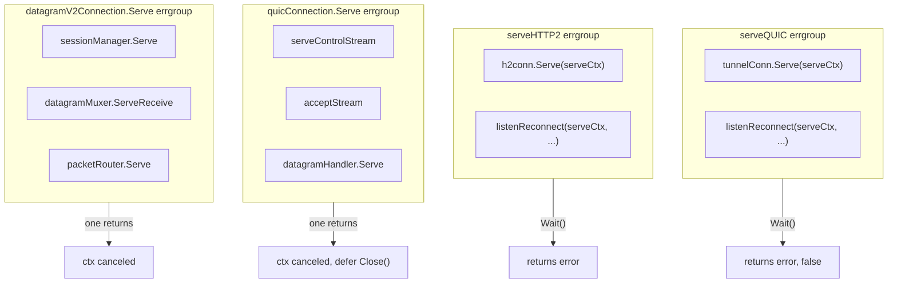
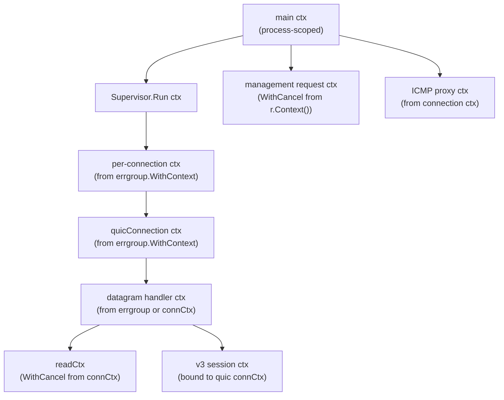
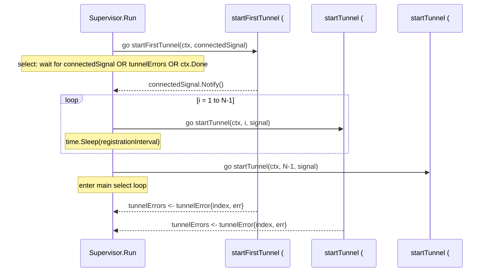
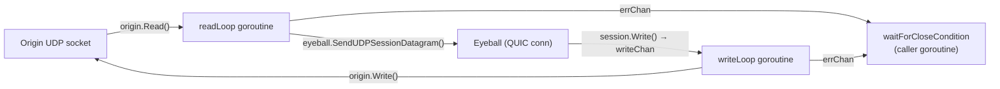
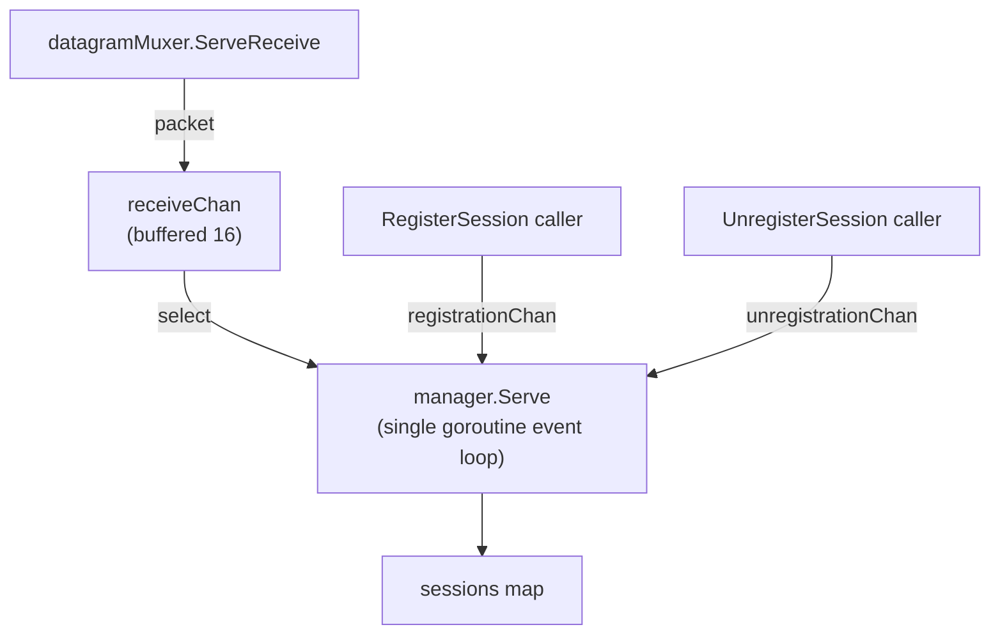

# Concurrency — Patterns and Primitives

> Part of the [Concurrency Behavior Catalog](README.md).

## Errgroup Coordination Sites

The codebase uses `golang.org/x/sync/errgroup` for structured concurrency — the first goroutine to return a non-nil error cancels the context of all other goroutines in the group.



| Site | File | Goroutines | Cancellation semantic | Evidence |
|---|---|---|---|---|
| `serveQUIC()` | supervisor/tunnel.go | `tunnelConn.Serve` + `listenReconnect` | first return cancels both | [atoms/supervisor/tunnel](../../../atoms/supervisor/tunnel.md) |
| `serveHTTP2()` | supervisor/tunnel.go | `h2conn.Serve` + `listenReconnect` | first return cancels both | [atoms/supervisor/tunnel](../../../atoms/supervisor/tunnel.md) |
| `quicConnection.Serve()` | connection/quic_connection.go | control stream + accept stream + datagram handler | first return cancels all; `defer q.Close()` | [atoms/connection/quic_connection](../../../atoms/connection/quic_connection.md) |
| `datagramV2Connection.Serve()` | connection/quic_datagram_v2.go | session manager + muxer + packet router | first return cancels all | [atoms/connection/quic_datagram_v2](../../../atoms/connection/quic_datagram_v2.md) |

**Rust porting note**: `errgroup.WithContext` maps naturally to `tokio::select!` over `JoinSet` tasks, or to `futures::try_join!` where all branches share a `CancellationToken`. The key semantic to preserve: the _first_ error cancels the derived context seen by all siblings.

## Context Cancellation Tree



| Context | Scope | Cancel trigger | Downstream effect | Evidence |
|---|---|---|---|---|
| main ctx | process | ctrl+c / OS signal | everything shuts down | [atoms/cmd/cloudflared/tunnel/cmd](../../../atoms/cmd/cloudflared/tunnel/cmd.md) |
| `Supervisor.Run` ctx | supervisor | parent cancel | all HA tunnels exit | [atoms/supervisor/supervisor](../../../atoms/supervisor/supervisor.md) |
| per-connection ctx | connection | errgroup first-return | connection teardown | [atoms/supervisor/tunnel](../../../atoms/supervisor/tunnel.md) |
| `quicConnection.Serve` ctx | connection | errgroup first-return | streams + datagrams + control all stop | [atoms/connection/quic_connection](../../../atoms/connection/quic_connection.md) |
| datagram handler ctx | connection | parent cancel or errgroup return | session manager + muxer stop | [atoms/connection/quic_datagram_v2](../../../atoms/connection/quic_datagram_v2.md) |
| v3 readCtx | connection | `datagramConn.Serve` returns → `defer cancel()` | poll + ICMP processor stop | [atoms/quic/v3/muxer](../../../atoms/quic/v3/muxer.md) |
| v3 session connCtx | session | QUIC connection close | session close | [atoms/quic/v3/session](../../../atoms/quic/v3/session.md) |
| management ctx | websocket | client disconnect or server cancel | read + stream goroutines stop | [atoms/management/service](../../../atoms/management/service.md) |

**Quirk — v3 session context migration**: When a UDP session migrates between QUIC connections, the session's `contextChan` receives the new connection's context. The `waitForCloseCondition` select loop swaps `connCtx` to the new value, so cancellation of the _old_ connection no longer kills the migrated session. This is a non-trivial `select` branch that the Rust port must replicate.

## Concurrency Patterns

### Pattern 1 — Supervisor Fan-Out



The supervisor spawns N goroutines (one per HA connection), staggers startup with `registrationInterval` (1 second), and monitors results on the `tunnelErrors` channel. On error, it decides: retry with backoff, or exit.

**Key details**:

- First tunnel is special: `startFirstTunnel` loops internally retrying on transient errors (8 error types always-retry). Other tunnels return immediately.
- Backoff timer is shared per-tunnel via `protocolFallback.BackoffTimer()`.
- Goroutines _are not_ re-spawned individually; the supervisor batches all waiting tunnels when the backoff timer fires.

Evidence: [atoms/supervisor/supervisor](../../../atoms/supervisor/supervisor.md), [atoms/supervisor/tunnel](../../../atoms/supervisor/tunnel.md)

### Pattern 2 — Errgroup Structured Concurrency

Each QUIC/HTTP2 connection uses `errgroup.WithContext(ctx)` to bind N goroutines to a shared cancellation context. When any goroutine returns (error or nil), the derived context is cancelled, causing all siblings to terminate.

**QUIC connection errgroup** (3 goroutines):

1. `serveControlStream` — RPC registration, waits for unregister
2. `acceptStream` — accepts QUIC streams in a loop, spawns `runStream` per stream
3. `datagramHandler.Serve` — runs v2 or v3 datagram muxer

**HTTP/2 connection errgroup** (2 goroutines):

1. `h2conn.Serve` — runs the `http2.Server`
2. `listenReconnect` — waits for reconnect or shutdown signal

**Datagram v2 errgroup** (3 goroutines):

1. `sessionManager.Serve` — event loop for session lifecycle
2. `datagramMuxer.ServeReceive` — reads QUIC datagrams
3. `packetRouter.Serve` — routes ICMP packets

Evidence: [atoms/connection/quic_connection](../../../atoms/connection/quic_connection.md), [atoms/connection/http2](../../../atoms/connection/http2.md), [atoms/connection/quic_datagram_v2](../../../atoms/connection/quic_datagram_v2.md)

### Pattern 3 — v3 Session Read-Write Split

Each v3 UDP session spawns exactly two goroutines:



- `readLoop`: blocking `origin.Read()` in a tight loop; sends encoded datagrams directly to the eyeball connection via `atomic.Pointer[DatagramConn]`.
- `writeLoop`: reads from `writeChan` (buffered 512); writes to `origin.Write()`.
- `waitForCloseCondition`: 5-branch select loop monitoring context, migration, errors, idle timeout, and activity.
- Coordination: `errChan` (buffered 3) allows all three writers to send without blocking. `closeWrite` channel close terminates the write loop. `closeFn` uses `sync.OnceValue` to ensure single-close.

Evidence: [atoms/quic/v3/session](../../../atoms/quic/v3/session.md)

### Pattern 4 — v2 Session Manager Event Loop

The v2 `manager.Serve()` is a single-goroutine event loop that serializes all session state mutations through channel message passing — no mutex needed.



- All session map mutations happen inside the single `Serve` goroutine.
- `RegisterSession` and `UnregisterSession` are called from different goroutines; they send events to channels and block on response channels with a 5-second timeout.
- `receiveChan` is buffered (16) to decouple transport reads from event processing.

Evidence: [atoms/datagramsession/manager](../../../atoms/datagramsession/manager.md), [atoms/datagramsession/session](../../../atoms/datagramsession/session.md)

### Pattern 5 — Bidirectional Stream Pipe

`PipeBidirectional` is the I/O pump used for every proxied TCP/WebSocket request:

- Spawns 2 goroutines (upstream and downstream), each calling `cfio.Copy`.
- Coordination via `bidirectionalStreamStatus`: an `atomic.Uint32` + unbuffered `chan struct{}` (capacity 2, sends once per direction).
- On first direction EOF: `CloseWrite()` propagates half-close to destination. `status.wait(maxWaitForSecondStream)` blocks until the second direction finishes or timeout.
- Panic recovery: each goroutine has `defer recover()`. If `isAnyDone()` is true, the panic is expected (stale pipe). Otherwise, reported to Sentry.

Evidence: [atoms/stream/stream](../../../atoms/stream/stream.md), [atoms/cfio/copy](../../../atoms/cfio/copy.md)

### Pattern 6 — One-Shot Signal Primitive

`signal.Signal` wraps a `chan struct{}` with `sync.Once` to provide safe one-shot notification:

- `Notify()` calls `close(ch)` inside `sync.Once.Do`, so multiple notify calls are safe.
- `Wait()` returns `<-chan struct{}` for use in select.
- Used for: `connectedSignal` (first tunnel connected), per-tunnel connected signals in `tunnelsConnecting` map.

Evidence: [atoms/signal/safe_signal](../../../atoms/signal/safe_signal.md), [atoms/supervisor/supervisor](../../../atoms/supervisor/supervisor.md)

### Pattern 7 — Connection Grace Period

The QUIC connection `Serve()` errgroup includes a grace period mechanism:

- When the control stream handler returns nil (clean unregistration), the goroutine sleeps for `gracePeriod` before returning `ControlStreamError`.
- This delays context cancellation, allowing in-flight stream handlers (`runStream` goroutines) to finish naturally.
- The grace period select: `ctx.Done` OR `ticker.C`.

Evidence: [atoms/connection/quic_connection](../../../atoms/connection/quic_connection.md)

### Pattern 8 — Non-Blocking Activity Tracking

Both v2 and v3 sessions use a non-blocking `markActive()` pattern:

```go
func (s *session) markActive() {
    select {
    case s.activeAtChan <- time.Now():
    default:
    }
}
```

The channel has capacity 1 (v3) or 2 (v2). If full, the write is dropped — acceptable because idle detection only needs approximate last-active time. This avoids blocking the hot path (every read/write) on timer updates.

Evidence: [atoms/quic/v3/session](../../../atoms/quic/v3/session.md), [atoms/datagramsession/session](../../../atoms/datagramsession/session.md)

## Sync Primitives for Coordination

| Primitive | Location | Purpose | Evidence |
|---|---|---|---|
| `sync.WaitGroup` | `waitToShutdown(wg, ...)` | Wait for all server goroutines before process exit | [atoms/cmd/cloudflared/tunnel/cmd](../../../atoms/cmd/cloudflared/tunnel/cmd.md) |
| `sync.WaitGroup` | `HTTP2Connection.activeRequestsWG` | Track in-flight HTTP/2 requests for graceful close | [atoms/connection/http2](../../../atoms/connection/http2.md) |
| `sync.Once` | `signal.Signal.once` | Ensure `close(ch)` called exactly once | [atoms/signal/safe_signal](../../../atoms/signal/safe_signal.md) |
| `sync.Once` | `booleanFuse.once` | Ensure fuse fires exactly once | [atoms/supervisor/fuse](../../../atoms/supervisor/fuse.md) |
| `sync.OnceValue` | `session.closeFn` (v3) | Ensure origin socket closed once | [atoms/quic/v3/session](../../../atoms/quic/v3/session.md) |
| `sync.Mutex` | `ipAddrFallback.m` | Serialize edge-IP rotation decisions | [atoms/supervisor/tunnel](../../../atoms/supervisor/tunnel.md) |
| `sync.Mutex` | `ManagementService.streamingMut` | Serialize streaming session start | [atoms/management/service](../../../atoms/management/service.md) |
| `sync.Mutex` | `portMapMutex` | Serialize UDP port allocation per connIndex | [atoms/connection/quic](../../../atoms/connection/quic.md) |
| `sync.Mutex` | `http2RespWriter.hijackedMutex` | Coordinate hijack state between handler and writer | [atoms/connection/http2](../../../atoms/connection/http2.md) |
| `sync.Pool` | `datagramConn.icmpEncoderPool/icmpDecoderPool` | Pool ICMP codec instances across goroutines | [atoms/quic/v3/muxer](../../../atoms/quic/v3/muxer.md) |
| `atomic.Uint32` | `nopCloserReadWriter.closed` | Coordinate close between read and close goroutines | [atoms/connection/quic_connection](../../../atoms/connection/quic_connection.md) |
| `atomic.Uint32` | `bidirectionalStreamStatus.anyDone` | Track whether either pipe direction is done | [atoms/stream/stream](../../../atoms/stream/stream.md) |
| `atomic.Pointer[DatagramConn]` | `session.eyeball` (v3) | Lock-free read of current eyeball during migration | [atoms/quic/v3/session](../../../atoms/quic/v3/session.md) |
