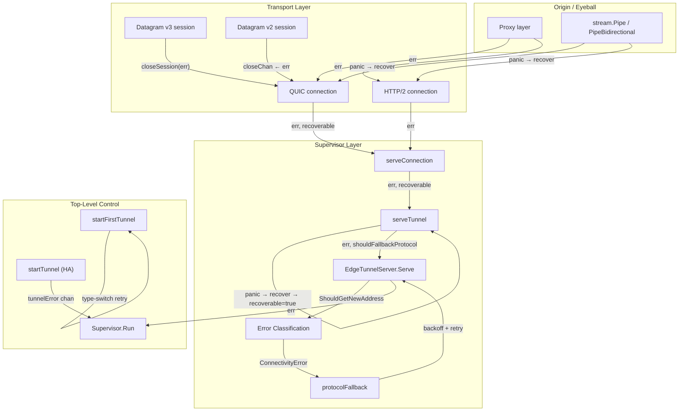

# Error Propagation Behavior Catalog

- Baseline date: 20260321
- Baseline reference: [cloudflare/cloudflared/tree/2026.3.0](https://github.com/cloudflare/cloudflared/tree/2026.3.0)
- Primary evidence set: behavior atoms under [../../atoms](../../../atoms)
- Upstream recheck: error surfaces revalidated against tag `2026.3.0` source anchors for [connection/errors.go](https://github.com/cloudflare/cloudflared/blob/2026.3.0/connection/errors.go), [tunnelrpc/pogs/errors.go](https://github.com/cloudflare/cloudflared/blob/2026.3.0/tunnelrpc/pogs/errors.go), [supervisor/tunnel.go](https://github.com/cloudflare/cloudflared/blob/2026.3.0/supervisor/tunnel.go), [supervisor/supervisor.go](https://github.com/cloudflare/cloudflared/blob/2026.3.0/supervisor/supervisor.go), [stream/stream.go](https://github.com/cloudflare/cloudflared/blob/2026.3.0/stream/stream.go), [proxy/proxy.go](https://github.com/cloudflare/cloudflared/blob/2026.3.0/proxy/proxy.go), [datagramsession/session.go](https://github.com/cloudflare/cloudflared/blob/2026.3.0/datagramsession/session.go), [quic/v3/session.go](https://github.com/cloudflare/cloudflared/blob/2026.3.0/quic/v3/session.go), [quic/v3/datagram_errors.go](https://github.com/cloudflare/cloudflared/blob/2026.3.0/quic/v3/datagram_errors.go), [edgediscovery/edgediscovery.go](https://github.com/cloudflare/cloudflared/blob/2026.3.0/edgediscovery/edgediscovery.go), [connection/observer.go](https://github.com/cloudflare/cloudflared/blob/2026.3.0/connection/observer.go), [connection/event.go](https://github.com/cloudflare/cloudflared/blob/2026.3.0/connection/event.go), [management/events.go](https://github.com/cloudflare/cloudflared/blob/2026.3.0/management/events.go), and [connection/quic.go](https://github.com/cloudflare/cloudflared/blob/2026.3.0/connection/quic.go).

## Scope

This catalog records how errors are defined, classified, propagated, absorbed, and recovered throughout the cloudflared codebase. Go's pervasive `if err != nil` pattern hides implicit decision trees where the _same_ error value may be retried, swallowed, logged, reclassified, or escalated depending on context. This catalog makes those implicit trees explicit.

- Direct evidence: error type definitions, sentinel errors, type-switch classification sites, panic recovery, error absorption points, and error wrapping/context additions.
- Out of scope: metrics instrumentation already detailed in [metrics](../metrics.md), broader ingress rule behavior already detailed in [ingress](../ingress.md), and general proxy plumbing already detailed in [proxying](../proxying.md).

## Catalog Structure

- [Classification Trees](classification-trees.md) — Error classification decision trees and error propagation through connection lifecycle
- [Recovery and Absorption](recovery-absorption.md) — Panic recovery, error absorption, wrapping patterns, severity logging, connection-closed detection

## Error Propagation Topology

## Error Type Taxonomy

### Connection-Layer Error Types

Defined in [connection/errors.go](https://github.com/cloudflare/cloudflared/blob/2026.3.0/connection/errors.go) — [atoms/connection/errors](../../../atoms/connection/errors.md).

| Type | Classification | Unwrap | Purpose |
|---|---|---|---|
| `DupConnRegisterTunnelError` | Retriable (address rotation) | No | Already connected to this server; try another address. Value type (not pointer). Sentinel: `errDuplicationConnection`. |
| `EdgeQuicDialError` | Fatal in `serveConnection`, retriable in `startFirstTunnel` | Yes (`Cause`) | QUIC dial failure wrapping the underlying `quic.Transport` or TLS error. |
| `ServerRegisterTunnelError` | Conditional (`Permanent` field) | No | Registration rejection from edge. `Permanent` flag determines retry eligibility. Factory: `serverRegistrationErrorFromRPC(err)`. |
| `ControlStreamError` | Retriable in `startFirstTunnel` | No | Control stream protocol failure. |
| `StreamListenerError` | Retriable in `startFirstTunnel` | No | Stream listener failure on QUIC connections. |
| `DatagramManagerError` | Retriable in `startFirstTunnel` | No | Datagram session manager failure. |

### Supervisor-Layer Error Types

Defined in [supervisor/tunnel.go](https://github.com/cloudflare/cloudflared/blob/2026.3.0/supervisor/tunnel.go) — [atoms/supervisor/tunnel](../../../atoms/supervisor/tunnel.md).

| Type | Classification | Unwrap | Purpose |
|---|---|---|---|
| `ConnectivityError` | Conditional (`reachedMaxRetries`) | No | Created by `ipAddrFallback.ShouldGetNewAddress()` when network-level errors exhaust retries. `HasReachedMaxRetries()` determines protocol fallback. |
| `unrecoverableError` | Fatal (permanent) | No | Wraps errors that must not be retried. `serveTunnel` returns `recoverable = !permanent` for this type. |
| `ReconnectSignal` | Recoverable (forced) | No | External control message forcing reconnect with optional delay (`DelayBeforeReconnect()`). Always `recoverable = true`. |

### RPC-Boundary Error Types

Defined in [tunnelrpc/pogs/errors.go](https://github.com/cloudflare/cloudflared/blob/2026.3.0/tunnelrpc/pogs/errors.go) — [atoms/tunnelrpc/pogs/errors](../../../atoms/tunnelrpc/pogs/errors.md).

| Type | Classification | Unwrap | Purpose |
|---|---|---|---|
| `RetryableError` | Retriable (with delay) | Yes (`err`) | Wraps any error with a `Delay time.Duration` field. Factory: `RetryErrorAfter(err, delay)`. Cap'n Proto RPC `ConnectionError.RetryAfter()` maps to this. |
| `RPCError` | Non-retriable | Yes (`err`) | Marks errors from the RPC subsystem itself (marshaling, transport) vs. remote operation failure. Factory: `wrapRPCError(err)`, `newRPCError(format, args...)`. |

### Edge-Discovery Error Types

Defined in [edgediscovery/edgediscovery.go](https://github.com/cloudflare/cloudflared/blob/2026.3.0/edgediscovery/edgediscovery.go) — [atoms/edgediscovery/edgediscovery](../../../atoms/edgediscovery/edgediscovery.md).

| Type | Classification | Unwrap | Purpose |
|---|---|---|---|
| `ErrNoAddressesLeft` | Conditional (static vs. dynamic edge) | No | Sentinel — address pool exhausted. `startFirstTunnel` retries only when using static edge addresses; dynamic edge returns immediately. |
| `DialError` | Retriable (connectivity) | — | Edge TCP/UDP dial failure. Triggers address rotation + connectivity error tracking in `ipAddrFallback`. |

### Datagram-Layer Error Types

Defined in [quic/v3/datagram_errors.go](https://github.com/cloudflare/cloudflared/blob/2026.3.0/quic/v3/datagram_errors.go) — [atoms/quic/v3/datagram_errors](../../../atoms/quic/v3/datagram_errors.md).

| Sentinel | Purpose |
|---|---|
| `ErrInvalidDatagramType` | Unexpected datagram type byte. |
| `ErrDatagramHeaderTooSmall` | Datagram too small (< `datagramTypeLen` bytes). |
| `ErrDatagramPayloadTooLarge` | Payload exceeds maximum datagram size. |
| `ErrDatagramPayloadHeaderTooSmall` | Payload too small for header. |
| `ErrDatagramPayloadInvalidSize` | Invalid datagram size for its type. |
| `ErrDatagramResponseMsgInvalidSize` | Response message size mismatch. |
| `ErrDatagramResponseInvalidSize` | Response datagram overall size mismatch. |
| `ErrDatagramResponseMsgTooLargeMaximum` | Error message exceeds `maxResponseErrorMessageLen`. |
| `ErrDatagramResponseMsgTooLargeDatagram` | Error message exceeds provided datagram length. |
| `ErrDatagramICMPPayloadTooLarge` | ICMP payload exceeds `maxICMPPayloadLen`. |
| `ErrDatagramICMPPayloadMissing` | Missing ICMP payload. |

Wrapping helpers: `wrapMarshalErr(err)` and `wrapUnmarshalErr(err)` add context for serialization boundaries.

### Session-Layer Error Types

| Type | Source | Purpose |
|---|---|---|
| `SessionCloseErr` (v3) | [quic/v3/session.go](https://github.com/cloudflare/cloudflared/blob/2026.3.0/quic/v3/session.go) — [atoms/quic/v3/session](../../../atoms/quic/v3/session.md) | Sentinel: session's `Close()` was called directly. |
| `SessionIdleErr` (v3) | [quic/v3/session.go](https://github.com/cloudflare/cloudflared/blob/2026.3.0/quic/v3/session.go) — [atoms/quic/v3/session](../../../atoms/quic/v3/session.md) | Typed struct with `Is()` support. Idle timeout exceeded (`defaultCloseIdleAfter = 210s`). |
| `SessionIdleErr` (v2 function) | [datagramsession/session.go](https://github.com/cloudflare/cloudflared/blob/2026.3.0/datagramsession/session.go) — [atoms/datagramsession/session](../../../atoms/datagramsession/session.md) | Factory function returning `fmt.Errorf` — no `Is()` support. Same 210s default. |
| `errClosedSession` (v2) | [datagramsession/event.go](https://github.com/cloudflare/cloudflared/blob/2026.3.0/datagramsession/event.go) — [atoms/datagramsession/event](../../../atoms/datagramsession/event.md) | Carries `byRemote bool` to distinguish local vs. remote close initiator. |
| `ErrVithVariableSeverity` | [datagramsession/session.go](https://github.com/cloudflare/cloudflared/blob/2026.3.0/datagramsession/session.go) — [atoms/datagramsession/session](../../../atoms/datagramsession/session.md) | Interface with `LogLevel() zerolog.Level`. Errors implementing this get logged at their declared severity instead of `Error`. **Quirk — typo**: `ErrVithVariableSeverity` (should be `ErrWithVariableSeverity`). |

### CLI-Layer Error Types

| Type | Source | Purpose |
|---|---|---|
| `usageError` | [cmd/cloudflared/cliutil/errors.go](https://github.com/cloudflare/cloudflared/blob/2026.3.0/cmd/cloudflared/cliutil/errors.go) — [atoms/cmd/cloudflared/cliutil/errors](../../../atoms/cmd/cloudflared/cliutil/errors.md) | CLI argument/flag validation errors. Factory: `UsageError(format, args...)`. |

### Management WebSocket Error Classification

Defined in [management/events.go](https://github.com/cloudflare/cloudflared/blob/2026.3.0/management/events.go) — [atoms/management/events](../../../atoms/management/events.md).

| Function | Purpose |
|---|---|
| `IsClosed(err, log)` | Returns `true` if `err` is a `websocket.CloseError`; logs non-normal closures at debug level. |
| `AsClosed(err)` | Returns `*websocket.CloseError` or `nil`. For callers that need the close code/reason. |

## Full Coverage Links

### Error Definition Atoms

- [connection/errors](../../../atoms/connection/errors.md)
- [tunnelrpc/pogs/errors](../../../atoms/tunnelrpc/pogs/errors.md)
- [cmd/cloudflared/cliutil/errors](../../../atoms/cmd/cloudflared/cliutil/errors.md)
- [diagnostic/error](../../../atoms/diagnostic/error.md)
- [quic/v3/datagram_errors](../../../atoms/quic/v3/datagram_errors.md)

### Error Classification and Propagation Atoms

- [supervisor/supervisor](../../../atoms/supervisor/supervisor.md)
- [supervisor/tunnel](../../../atoms/supervisor/tunnel.md)
- [supervisor/external_control](../../../atoms/supervisor/external_control.md)
- [supervisor/fuse](../../../atoms/supervisor/fuse.md)
- [supervisor/conn_aware_logger](../../../atoms/supervisor/conn_aware_logger.md)
- [edgediscovery/edgediscovery](../../../atoms/edgediscovery/edgediscovery.md)
- [edgediscovery/allregions/regions](../../../atoms/edgediscovery/allregions/regions.md)
- [connection/protocol](../../../atoms/connection/protocol.md)

### Error Absorption and Recovery Atoms

- [stream/stream](../../../atoms/stream/stream.md)
- [proxy/proxy](../../../atoms/proxy/proxy.md)
- [cfio/copy](../../../atoms/cfio/copy.md)
- [connection/quic](../../../atoms/connection/quic.md)
- [connection/quic_connection](../../../atoms/connection/quic_connection.md)
- [connection/http2](../../../atoms/connection/http2.md)
- [connection/header](../../../atoms/connection/header.md)
- [connection/control](../../../atoms/connection/control.md)
- [connection/observer](../../../atoms/connection/observer.md)
- [connection/event](../../../atoms/connection/event.md)

### Session Error Atoms

- [datagramsession/session](../../../atoms/datagramsession/session.md)
- [datagramsession/event](../../../atoms/datagramsession/event.md)
- [datagramsession/manager](../../../atoms/datagramsession/manager.md)
- [quic/v3/session](../../../atoms/quic/v3/session.md)
- [quic/v3/muxer](../../../atoms/quic/v3/muxer.md)

### RPC Error Boundary Atoms

- [tunnelrpc/registration_client](../../../atoms/tunnelrpc/registration_client.md)
- [tunnelrpc/quic/cloudflared_client](../../../atoms/tunnelrpc/quic/cloudflared_client.md)
- [tunnelrpc/quic/session_client](../../../atoms/tunnelrpc/quic/session_client.md)
- [tunnelrpc/pogs/registration_server](../../../atoms/tunnelrpc/pogs/registration_server.md)
- [tunnelrpc/pogs/session_manager](../../../atoms/tunnelrpc/pogs/session_manager.md)
- [tunnelrpc/pogs/configuration_manager](../../../atoms/tunnelrpc/pogs/configuration_manager.md)
- [tunnelrpc/proto/tunnelrpc.capnp](../../../atoms/tunnelrpc/proto/tunnelrpc.capnp.md)

### Application Layer Error Atoms

- [carrier/carrier](../../../atoms/carrier/carrier.md)
- [carrier/websocket](../../../atoms/carrier/websocket.md)
- [logger/create](../../../atoms/logger/create.md)
- [management/events](../../../atoms/management/events.md)
- [management/service](../../../atoms/management/service.md)
- [config/configuration](../../../atoms/config/configuration.md)
- [config/manager](../../../atoms/config/manager.md)
- [credentials/credentials](../../../atoms/credentials/credentials.md)
- [credentials/origin_cert](../../../atoms/credentials/origin_cert.md)
- [retry/backoffhandler](../../../atoms/retry/backoffhandler.md)
- [signal/safe_signal](../../../atoms/signal/safe_signal.md)

### CLI and Service Error Atoms

- [cmd/cloudflared/tunnel/cmd](../../../atoms/cmd/cloudflared/tunnel/cmd.md)
- [cmd/cloudflared/tunnel/configuration](../../../atoms/cmd/cloudflared/tunnel/configuration.md)
- [cmd/cloudflared/tunnel/subcommands](../../../atoms/cmd/cloudflared/tunnel/subcommands.md)
- [cmd/cloudflared/main](../../../atoms/cmd/cloudflared/main.md)
- [cmd/cloudflared/windows_service](../../../atoms/cmd/cloudflared/windows_service.md)
- [cmd/cloudflared/tunnel/quick_tunnel](../../../atoms/cmd/cloudflared/tunnel/quick_tunnel.md)

## Notes

- This catalog focuses on error _flow_ semantics, not on the behavior of the components that produce errors. For component behavior, see the respective domain catalogs: [supervisor](../supervisor.md), [tunnels-transport](../tunnels-transport.md), [sessions](../sessions.md), [proxying](../proxying.md).
- The distinction between "absorption" and "propagation" is contextual: an error logged and returned is propagated; an error logged and replaced with `nil` is absorbed. Both patterns appear extensively in cloudflared.
- The `(error, recoverable bool)` pattern is the most architecturally significant error mechanism in cloudflared. A Rust port should model this with an enum: `ConnResult { Recoverable(Error), Fatal(Error), Graceful }`.

## Coverage Audit

- Audit method: collect atom docs under [../../atoms](../../../atoms) with error type definitions, panic/recover patterns, error classification/type-switch logic, error wrapping, and error absorption points. Cross-reference against all atom links in this catalog.
- Current coverage result: 52 error-scoped atom docs linked, covering the primary error definition, classification, propagation, absorption, and recovery surfaces.
- Delta: 0 error-definition atoms missing (all 5 primary error definition files linked); 0 classification atoms missing.
- Operational guardrail: if error types or classification logic change upstream, rerun this audit and update this file in the same change.
