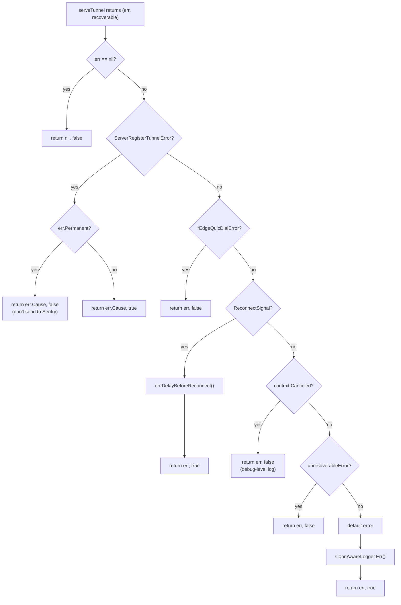
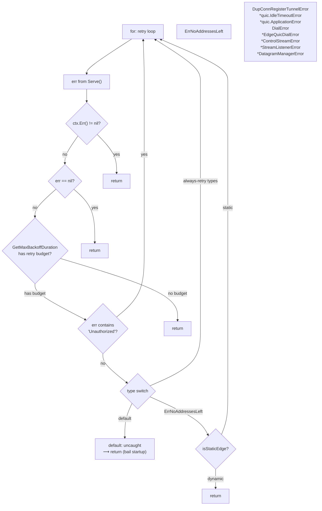
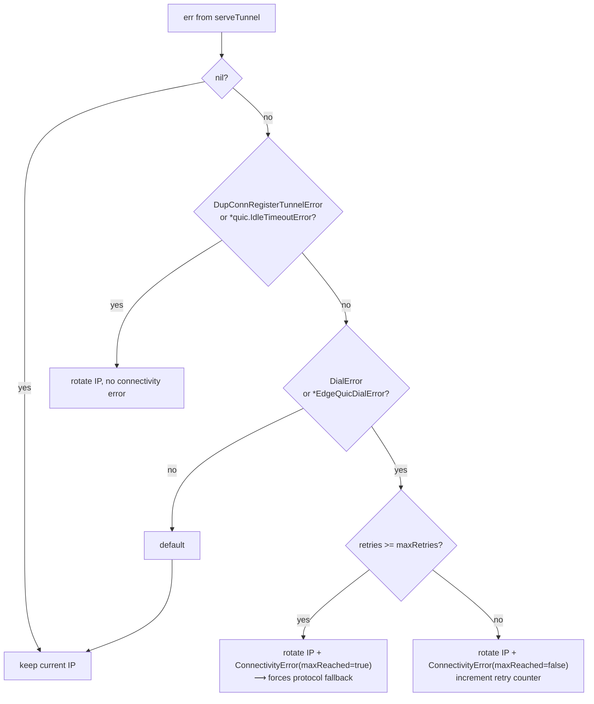

# Error Propagation — Classification Trees

> Part of the [Error Propagation Behavior Catalog](README.md).

## Error Classification Decision Trees

### The `serveTunnel` Classifier

The central error classification site is `EdgeTunnelServer.serveTunnel()` in [supervisor/tunnel.go](https://github.com/cloudflare/cloudflared/blob/2026.3.0/supervisor/tunnel.go). It returns `(err error, recoverable bool)` — the two-value signature that drives retry/fallback decisions upstream.



**Key observations:**

- **Quirk — `ServerRegisterTunnelError` strips its wrapper.** The returned error is `err.Cause`, not the `ServerRegisterTunnelError` itself. The Sentry comment states: "Don't send registration error return from server to Sentry. They are logged on server side."
- **Quirk — `EdgeQuicDialError` is fatal at `serveTunnel` level** but retriable at `startFirstTunnel` level. The same error type has different recoverability at different stack depths.
- **Quirk — default branch is recoverable.** Unknown/uncaught error types are treated as recoverable (`true`) unless they implement `unrecoverableError`. This biases toward retry.

### The `startFirstTunnel` Classifier

`Supervisor.startFirstTunnel()` in [supervisor/supervisor.go](https://github.com/cloudflare/cloudflared/blob/2026.3.0/supervisor/supervisor.go) runs a retry loop with a type-switch that further classifies errors already processed by `serveTunnel`:



**Key observations:**

- **Quirk — Unauthorized is string-matched.** `strings.Contains(err.Error(), "Unauthorized")` treats any error whose message contains "Unauthorized" as transient. This is a heuristic for edge propagation lag on new tunnels.
- **Quirk — `ErrNoAddressesLeft` depends on edge mode.** Static edge configurations retry forever; dynamic configurations bail immediately. Same error, different outcomes.
- **Quirk — 8 error types are always-retried.** These include QUIC-specific errors (`*quic.IdleTimeoutError`, `*quic.ApplicationError`) and all the `connection` package error types. Everything else bails from startup.

### The `ipAddrFallback` Classifier

`ipAddrFallback.ShouldGetNewAddress()` maps errors to address-rotation decisions:



**Key observations:**

- **Quirk — `DupConnRegisterTunnelError` and `*quic.IdleTimeoutError` rotate silently.** No `ConnectivityError` is produced — the retry counter is not affected. These are treated as "expected" address issues.
- **Quirk — Only `DialError` and `*EdgeQuicDialError` count toward retry exhaustion.** All other error types keep the current IP address unchanged. This creates a narrow funnel where only network-level dial failures escalate to protocol fallback.

### The `isQuicBroken` Classifier

Determines whether QUIC should be abandoned for HTTP/2 fallback:

| Error pattern | Matches | Mechanism |
|---|---|---|
| `*quic.IdleTimeoutError` | Yes | `errors.As` unwrap |
| `*quic.TransportError` | Yes | `errors.As` unwrap |
| `*net.OpError` wrapping "operation not permitted" | Yes | `errors.As` + `strings.Contains` on inner error |
| Everything else | No | Default: QUIC is not broken |

- **Quirk — "operation not permitted" is string-matched inside `*net.OpError`.** A low-level kernel error string comparison drives a protocol-level decision. This catches cases where egress UDP to port 7844 is blocked by firewalls.

## Error Propagation Through the Connection Lifecycle

### Dual-Return Pattern: `(error, bool)`

The core propagation mechanism is the `(error, recoverable bool)` return pair used by:

- `serveTunnel(ctx, ...) (err error, recoverable bool)`
- `serveConnection(ctx, ...) (err error, recoverable bool)`
- `serveQUIC(ctx, ...) (err error, recoverable bool)`

This pattern is _not_ a standard Go idiom — it is cloudflared-specific. The `recoverable` flag drives a critical decision point in `EdgeTunnelServer.Serve()`:

1. `recoverable = false` → return error to supervisor → supervisor decides (typically bail for non-first connections)
2. `recoverable = true` → enter backoff wait → check if protocol fallback is needed → retry connection

### The `shouldFallbackProtocol` Decision Chain

After `serveTunnel` returns, `Serve()` computes `shouldFallbackProtocol`:

1. `ipAddrFallback.ShouldGetNewAddress(connIndex, err)` produces `(shouldRotateEdgeIP, cErr)`
2. If `cErr` is a `*ConnectivityError` with `HasReachedMaxRetries() == true`, force protocol fallback
3. Wait for backoff timer
4. If `shouldFallbackProtocol == true` AND no connection has succeeded with the current protocol → call `selectNextProtocol()`
5. `selectNextProtocol()` checks `isQuicBroken(cause)` and `selector.Fallback()` availability

### `errgroup.Wait()` Error Aggregation

HTTP/2 and QUIC connections use `golang.org/x/sync/errgroup`:

```go
errGroup.Go(func() error { return h2conn.Serve(serveCtx) })
errGroup.Go(func() error { return listenReconnect(serveCtx, ...) })
return errGroup.Wait()
```

- `errgroup.Wait()` returns the **first non-nil error** from any goroutine and cancels the derived context.
- **Quirk — `listenReconnect` never returns a real error in production.** It returns `nil` on graceful shutdown and `ReconnectSignal` on forced reconnect. The `ReconnectSignal` error is what causes the errgroup to cancel `h2conn.Serve()`.

### Connection Close Error Chain

When QUIC connections close, a reference-counted close pattern is used:

```go
type wrapCloseableConnQuicConnection struct {
    quic.Connection
    udpConn *net.UDPConn
}

func (w *wrapCloseableConnQuicConnection) CloseWithError(errorCode, reason) error {
    err := w.Connection.CloseWithError(errorCode, reason)
    w.udpConn.Close()  // UDP close error silently ignored
    return err
}
```

- **Quirk — UDP close errors are always silently discarded.** The QUIC-level close error is propagated; the underlying UDP socket close error is not.
