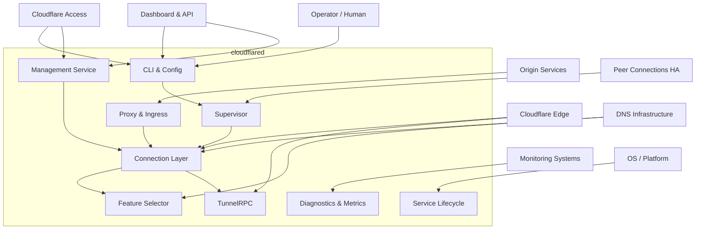
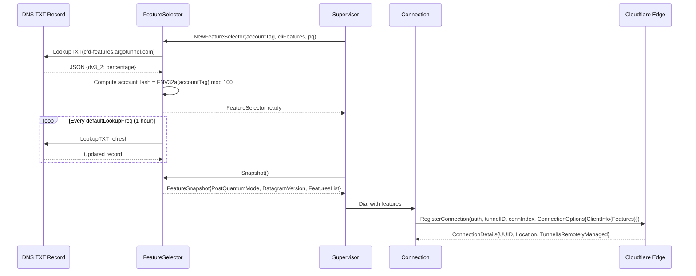
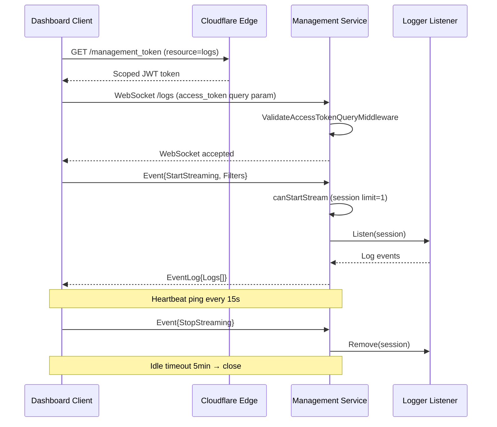
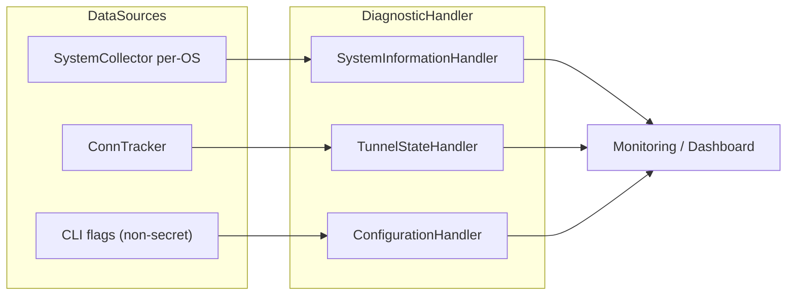

# Features Behavior Catalog — Stakeholder Contract Index

- Baseline date: 20260322
- Baseline reference: [cloudflare/cloudflared/tree/2026.3.0](https://github.com/cloudflare/cloudflared/tree/2026.3.0)
- Primary evidence set: behavior atoms under [../../atoms](../../../atoms)
- Upstream recheck: feature flag, registration, management, diagnostic, and access surfaces revalidated against tag `2026.3.0` source anchors for [features/selector.go](https://github.com/cloudflare/cloudflared/blob/2026.3.0/features/selector.go), [atoms/features/selector](../../../atoms/features/selector.md), [features/features.go](https://github.com/cloudflare/cloudflared/blob/2026.3.0/features/features.go), [atoms/features/features](../../../atoms/features/features.md), [tunnelrpc/pogs/registration_server.go](https://github.com/cloudflare/cloudflared/blob/2026.3.0/tunnelrpc/pogs/registration_server.go), [atoms/tunnelrpc/pogs/registration_server](../../../atoms/tunnelrpc/pogs/registration_server.md), [connection/connection.go](https://github.com/cloudflare/cloudflared/blob/2026.3.0/connection/connection.go), [atoms/connection/connection](../../../atoms/connection/connection.md), [management/service.go](https://github.com/cloudflare/cloudflared/blob/2026.3.0/management/service.go), [atoms/management/service](../../../atoms/management/service.md), [diagnostic/handlers.go](https://github.com/cloudflare/cloudflared/blob/2026.3.0/diagnostic/handlers.go), [atoms/diagnostic/handlers](../../../atoms/diagnostic/handlers.md), [cmd/cloudflared/tunnel/cmd.go](https://github.com/cloudflare/cloudflared/blob/2026.3.0/cmd/cloudflared/tunnel/cmd.go), [atoms/cmd/cloudflared/tunnel/cmd](../../../atoms/cmd/cloudflared/tunnel/cmd.md), [supervisor/supervisor.go](https://github.com/cloudflare/cloudflared/blob/2026.3.0/supervisor/supervisor.go), and [atoms/supervisor/supervisor](../../../atoms/supervisor/supervisor.md).

## Scope

This catalog indexes the complete feature surface of cloudflared organized by the external actors (stakeholders) that interact with a running connector instance or its CLI. Each stakeholder section documents the contracts, message flows, and behavioral atoms that govern the interaction boundary.

For this catalog, *feature* means an externally observable capability or interaction contract — not the Go `features` package alone (though that package is one contract documented here).

Stakeholders covered:

1. **Operator / Human** — CLI invocations, config-file authoring, service lifecycle commands, tunnel CRUD, access login.
2. **Cloudflare Edge** — tunnel registration, control-stream RPC, feature negotiation, protocol selection, HA coordination.
3. **Cloudflare Dashboard & API** — cfapi REST client, remote configuration push, management HTTP/WebSocket service.
4. **Cloudflare Access** — JWT validation middleware, access-login browser flow, token management.
5. **Monitoring Systems** — Prometheus metrics endpoint, readiness/health server, diagnostic HTTP handlers, pprof.
6. **Origin Services** — ingress rule matching, HTTP/WebSocket/TCP/SOCKS/ICMP proxy, hello-world server.
7. **DNS Infrastructure** — feature-flag TXT-record lookup, edge-address SRV discovery, origin DNS resolution.
8. **OS / Platform** — service install/uninstall, signal handling, auto-update, FIPS build tags.
9. **Peer Connections (HA)** — connection-index tracking, tunnelsForHA, reconnect signals, external control.

Out of scope:

- internal-only data structures with no stakeholder-facing contract (e.g., packet encoders, cfio copy),
- porting-friction analysis already detailed in [porting-friction](../porting-friction/README.md),
- pure concurrency patterns already detailed in [concurrency](../concurrency/README.md).

## Catalog Structure

- [Operator and Platform Stakeholders](operator-and-platform.md) — Stakeholders 1 (Operator/Human) and 8 (OS/Platform)
- [Edge and Access Stakeholders](edge-and-access.md) — Stakeholders 2 (Cloudflare Edge), 4 (Cloudflare Access), and 9 (Peer Connections HA)
- [API, Monitoring, Origin, and DNS Stakeholders](api-monitoring-origin-dns.md) — Stakeholders 3 (Dashboard & API), 5 (Monitoring Systems), 6 (Origin Services), and 7 (DNS Infrastructure)

## Stakeholder Interaction Topology

## Feature Negotiation Lifecycle

## Management Session Flow

## Diagnostic Collection Flow

## Stakeholder Interaction Matrix

| Stakeholder | Reads from | Writes to | Behavioral catalogs |
|---|---|---|---|
| Operator / Human | stdout, config files, credentials | CLI commands, config files, stdin | [cli](../cli.md), [config](../config.md), [deployments](../deployments/README.md) |
| Cloudflare Edge | Registration responses, proxied requests | Registration, config export, proxy responses | [edge-interactions](../edge-interactions.md), [tunnels](../tunnels.md), [tunnels-transport](../tunnels-transport.md) |
| Dashboard & API | cfapi responses, management service data | cfapi requests, remote config updates | [upstream-api-contracts](../upstream-api-contracts.md), [observabilities](../observabilities.md) |
| Cloudflare Access | JWT tokens, cert endpoints | Login flow, token storage | [access-policies](../access-policies.md), [crypto](../crypto.md) |
| Monitoring Systems | Metrics, health status, diagnostics | Prometheus scrapes, health checks | [metrics](../metrics.md), [observabilities](../observabilities.md) |
| Origin Services | Proxied requests | Responses, WebSocket frames, TCP bytes | [ingress](../ingress.md), [proxying](../proxying.md), [sessions](../sessions.md) |
| DNS Infrastructure | TXT records, SRV records | DNS queries | [edge-interactions](../edge-interactions.md) |
| OS / Platform | Signals, service state | Service files, PID files, update binary | [platforms](../platforms.md), [deployments](../deployments/README.md), [init-teardown](../init-teardown/README.md) |
| Peer Connections (HA) | Shared supervisor state, events | Registration, reconnect signals | [tunnels](../tunnels.md), [state-machines](../state-machines.md), [supervisor](../supervisor.md) |

## Coverage Audit

- Audit method: collect all atom docs referenced via stakeholder interaction tables across 9 stakeholder sections, Mermaid sequence diagrams, and the Stakeholder Interaction Matrix, then diff against the unique atom links listed in this catalog.
- Current coverage result: 127 stakeholder-scoped atom docs found, 127 linked in catalog, 0 missing.
- Delta (catalog links − stakeholder-scoped atom docs): 0.
- Cross-cutting note: all 127 atoms are already covered by domain catalogs — this catalog adds no new coverage, only stakeholder-centric organization.
- Operational guardrail: if cloudflared adds a new external interaction surface (e.g., a new management endpoint, a new feature flag, a new platform target), rerun this audit and update this file in the same change.

## Notes

This catalog is intentionally a cross-cutting stakeholder contract index that organizes atoms by external interaction surface rather than internal domain. It overlaps substantially with:

- [cli](../cli.md) — operator-facing command and flag details,
- [edge-interactions](../edge-interactions.md) — edge registration and protocol negotiation,
- [tunnels](../tunnels.md) — tunnel lifecycle and HA coordination,
- [upstream-api-contracts](../upstream-api-contracts.md) — cfapi REST contract details,
- [metrics](../metrics.md) — Prometheus metrics surface detail,
- [observabilities](../observabilities.md) — monitoring and diagnostic internals,
- [access-policies](../access-policies.md) — Access authentication and JWT validation,
- [ingress](../ingress.md) — origin service routing and proxy behavior,
- [platforms](../platforms.md) — OS-specific service and signal behavior,
- [deployments](../deployments/README.md) — installation and update lifecycle,
- [supervisor](../supervisor.md) — HA coordination and supervision detail.

The differentiated value of this catalog is organizing the full feature surface by *who* interacts with cloudflared, enabling stakeholder-centric contract tracing.
