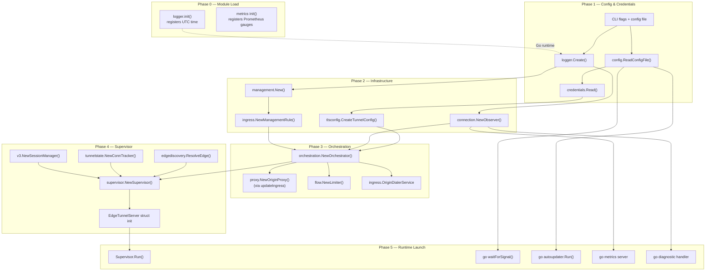
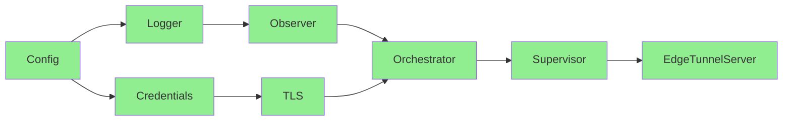

# Init & Teardown Behavior Catalog

- Baseline date: 20260321
- Baseline reference: [cloudflare/cloudflared/tree/2026.3.0](https://github.com/cloudflare/cloudflared/tree/2026.3.0)
- Primary evidence set: behavior atoms under [../../atoms](../../../atoms)
- Upstream recheck: initialization and teardown surfaces revalidated against tag `2026.3.0` source anchors for [cmd/cloudflared/tunnel/cmd.go](https://github.com/cloudflare/cloudflared/blob/2026.3.0/cmd/cloudflared/tunnel/cmd.go), [cmd/cloudflared/tunnel/signal.go](https://github.com/cloudflare/cloudflared/blob/2026.3.0/cmd/cloudflared/tunnel/signal.go), [supervisor/supervisor.go](https://github.com/cloudflare/cloudflared/blob/2026.3.0/supervisor/supervisor.go), [supervisor/tunnel.go](https://github.com/cloudflare/cloudflared/blob/2026.3.0/supervisor/tunnel.go), [orchestration/orchestrator.go](https://github.com/cloudflare/cloudflared/blob/2026.3.0/orchestration/orchestrator.go), [connection/control.go](https://github.com/cloudflare/cloudflared/blob/2026.3.0/connection/control.go), [overwatch/app_manager.go](https://github.com/cloudflare/cloudflared/blob/2026.3.0/overwatch/app_manager.go), [management/service.go](https://github.com/cloudflare/cloudflared/blob/2026.3.0/management/service.go), [ingress/origin_proxy.go](https://github.com/cloudflare/cloudflared/blob/2026.3.0/ingress/origin_proxy.go), [signal/safe_signal.go](https://github.com/cloudflare/cloudflared/blob/2026.3.0/signal/safe_signal.go), and [supervisor/fuse.go](https://github.com/cloudflare/cloudflared/blob/2026.3.0/supervisor/fuse.go).

## Scope

This catalog records the initialization dependency chain, startup phase ordering, shutdown signal propagation, teardown sequencing, and circular-dependency risk analysis across the cloudflared codebase. The goal is to document what starts first, what depends on what being alive, and what order things shut down — critical for avoiding circular init or teardown deadlocks in the Rust port.

- Direct evidence: constructor functions (`New*`), Go `init()` functions, `Run()`/`Serve()` entry points, `Close()`/`Shutdown()`/`Stop()` methods, `defer` cleanup chains, context cancellation hierarchy, `gracefulShutdownC` propagation, and signal handling.
- Out of scope: concurrent actor topology already detailed in [concurrency](../concurrency/README.md), shared mutable state protection already detailed in [shared-state](../shared-state.md), error classification and recovery already detailed in [error-propagation](../error-propagation/README.md), and supervisor control loop contracts already detailed in [supervisor](../supervisor.md).

## Catalog Structure

- [Startup Sequence](startup-sequence.md) — Constructor inventory, startup sequence (server → supervisor → tunnel), per-connection startup, control stream registration
- [Shutdown and Teardown](shutdown-teardown.md) — Shutdown topology, teardown surface inventory, defer cleanup chains, context cancellation hierarchy, graceful shutdown, overwatch lifecycle, config hot-reload

## Initialization Dependency DAG

The diagram below shows the full construction-time dependency graph. Every arrow means "must be fully initialized before".

### Initialization Phase Summary

| Phase                    | What                                                                                                          | Blocking?                                           | Key Evidence                                                                                                                                                                                                              |
| ------------------------ | ------------------------------------------------------------------------------------------------------------- | --------------------------------------------------- | ------------------------------------------------------------------------------------------------------------------------------------------------------------------------------------------------------------------------- |
| 0 — Module load          | Go `init()` functions register UTC time formatter, Prometheus metrics                                         | Implicit (Go runtime)                               | [atoms/logger/create](../../../atoms/logger/create.md), [atoms/supervisor/metrics](../../../atoms/supervisor/metrics.md)                                                                                                        |
| 1 — Config & credentials | CLI flags parsed, config file read, logger created, origin cert loaded                                        | Sequential                                          | [atoms/cmd/cloudflared/tunnel/cmd](../../../atoms/cmd/cloudflared/tunnel/cmd.md), [atoms/config/configuration](../../../atoms/config/configuration.md), [atoms/credentials/credentials](../../../atoms/credentials/credentials.md) |
| 2 — Infrastructure       | TLS config built, Observer created, management service instantiated                                           | Sequential                                          | [atoms/tlsconfig/tlsconfig](../../../atoms/tlsconfig/tlsconfig.md), [atoms/connection/observer](../../../atoms/connection/observer.md), [atoms/management/service](../../../atoms/management/service.md)                           |
| 3 — Orchestration        | Orchestrator created with ingress rules, proxy, flow limiter, dialer                                          | Sequential; spawns `waitToCloseLastProxy` goroutine | [atoms/orchestration/orchestrator](../../../atoms/orchestration/orchestrator.md), [atoms/flow/limiter](../../../atoms/flow/limiter.md)                                                                                          |
| 4 — Supervisor           | Edge address resolution, session manager, conn tracker, supervisor + EdgeTunnelServer structs                 | Sequential; edge DNS resolution may block           | [atoms/supervisor/supervisor](../../../atoms/supervisor/supervisor.md), [atoms/supervisor/tunnel](../../../atoms/supervisor/tunnel.md), [atoms/edgediscovery/edgediscovery](../../../atoms/edgediscovery/edgediscovery.md)         |
| 5 — Runtime launch       | `Supervisor.Run()`, signal handler, autoupdater, metrics server, diagnostic handler all spawned as goroutines | Concurrent goroutine launches from `StartServer`    | [atoms/cmd/cloudflared/tunnel/cmd](../../../atoms/cmd/cloudflared/tunnel/cmd.md), [atoms/cmd/cloudflared/tunnel/signal](../../../atoms/cmd/cloudflared/tunnel/signal.md)                                                        |

## Circular Dependency & Deadlock Risk Analysis

### Init-Time Circular Dependency Check

**Result: No init-time cycles.** The dependency graph is a strict DAG. Every constructor receives only already-fully-initialized objects.

### Teardown Deadlock Risk Matrix

| Risk                                            | Scenario                                                                                             | Probability | Mitigation                                                                                        |
| ----------------------------------------------- | ---------------------------------------------------------------------------------------------------- | ----------- | ------------------------------------------------------------------------------------------------- |
| `graceShutdownC` not listened to                | A goroutine's select loop lacks `graceShutdownC` case → hangs until hard cancel                      | LOW         | All `Serve` loops verified to have `graceShutdownC` OR `ctx.Done()` case                          |
| `waitForUnregister` edge timeout                | Edge doesn't respond to `GracefulShutdown` RPC within `gracePeriod`                                  | MEDIUM      | `waitForUnregister` has context timeout bounded by `gracePeriod`; hard cancel follows             |
| `tunnelErrors` channel block                    | `startFirstTunnel` defers send on `tunnelErrors`; if main loop already exited, send blocks forever   | LOW         | Channel is buffered implicitly by main loop always reading from it; `ctx.Done()` unblocks         |
| errgroup member hangs                           | One errgroup goroutine ignores context cancel → `errgroup.Wait()` blocks                             | LOW         | All errgroup members have `ctx.Done()` / `serveCtx.Done()` cases; panic recovery in `serveTunnel` |
| Bidirectional stream pipe stall                 | `PipeBidirectional` goroutine waits for both directions; one side hangs                              | LOW         | `wait()` has timeout timer; atomic `anyDone` tracks first completion                              |
| Orchestrator proxy shutdown vs. active requests | `waitToCloseLastProxy` closes `proxyShutdownC` which kills origin listeners while requests in flight | LOW         | New proxy is created before old one is closed (copy-on-write pattern)                             |
| Second SIGTERM during grace period              | User sends second signal before grace period expires                                                 | NONE        | `waitForSignal` only handles first signal; `waitToShutdown` already in grace path                 |

### Key Insight: No Circular Teardown Dependencies

Teardown follows a strict reverse-init ordering:

$$\text{signal} \to \text{graceShutdownC} \to \text{listeners drain} \to \text{ctx cancel} \to \text{errgroups exit} \to \text{wg.Wait} \to \text{process exit}$$

There are no mutual-wait patterns: no goroutine waits for another goroutine that waits for the first. The dual-channel design (`graceShutdownC` + `ctx.Done()`) ensures every actor has at least one guaranteed unblock path.

## Rust Port Implications

| Go Pattern                                       | Rust Equivalent                                                    | Init/Teardown Notes                                     |
| ------------------------------------------------ | ------------------------------------------------------------------ | ------------------------------------------------------- |
| `init()` package-level                           | `once_cell::Lazy` / `std::sync::LazyLock`                          | Prometheus metrics registration should use `LazyLock`   |
| Constructor injection (manual)                   | Builder pattern or typed constructor                               | Enforce DAG ordering at compile time via ownership      |
| `gracefulShutdownC chan struct{}`                | `tokio::sync::watch<()>` or `tokio_util::CancellationToken`        | `CancellationToken` is idiomatic for broadcast shutdown |
| `context.WithCancel` parent-child                | `CancellationToken::child_token()`                                 | Natural tree structure maps 1:1                         |
| `errgroup.WithContext`                           | `tokio::task::JoinSet` + child `CancellationToken`                 | JoinSet auto-cancels on drop if configured              |
| `defer cancel()` / `defer close()`               | `Drop` trait impl or explicit `.abort()`                           | RAII handles most defer patterns                        |
| `close(chan)` broadcast                          | `CancellationToken.cancel()`                                       | Broadcast to all listeners                              |
| `sync.WaitGroup` join                            | `JoinSet::join_all()` or `tokio::select!`                          | Natural async equivalent                                |
| `signal.Notify(SIGTERM, SIGINT)`                 | `tokio::signal::ctrl_c()` + `tokio::signal::unix::signal(SIGTERM)` | Platform-specific signal handling                       |
| `time.NewTicker(gracePeriod)`                    | `tokio::time::sleep(duration)`                                     | Simple timeout in async                                 |
| Two-phase shutdown (graceShutdownC → ctx cancel) | Two `CancellationToken` levels: `graceful_token` → `hard_token`    | Parent-child token structure enforces ordering          |

## Coverage Audit

### Atom Coverage

| Atom                                                                                              | Linked | Role                                                   |
| ------------------------------------------------------------------------------------------------- | ------ | ------------------------------------------------------ |
| [atoms/cmd/cloudflared/tunnel/cmd](../../../atoms/cmd/cloudflared/tunnel/cmd.md)                     | Yes    | Top-level startup + shutdown orchestration             |
| [atoms/cmd/cloudflared/tunnel/signal](../../../atoms/cmd/cloudflared/tunnel/signal.md)               | Yes    | Signal handler, graceShutdownC trigger                 |
| [atoms/cmd/cloudflared/tunnel/configuration](../../../atoms/cmd/cloudflared/tunnel/configuration.md) | Yes    | prepareTunnelConfig factory                            |
| [atoms/cmd/cloudflared/updater/service](../../../atoms/cmd/cloudflared/updater/service.md)           | Yes    | Autoupdater lifecycle                                  |
| [atoms/config/configuration](../../../atoms/config/configuration.md)                                 | Yes    | Config file init                                       |
| [atoms/logger/create](../../../atoms/logger/create.md)                                               | Yes    | Logger init + init() function                          |
| [atoms/credentials/credentials](../../../atoms/credentials/credentials.md)                           | Yes    | Credential reading                                     |
| [atoms/tlsconfig/tlsconfig](../../../atoms/tlsconfig/tlsconfig.md)                                   | Yes    | TLS config construction                                |
| [atoms/tlsconfig/certreloader](../../../atoms/tlsconfig/certreloader.md)                             | Yes    | Hot-reloadable cert wrapper                            |
| [atoms/connection/observer](../../../atoms/connection/observer.md)                                   | Yes    | Observer init                                          |
| [atoms/connection/control](../../../atoms/connection/control.md)                                     | Yes    | Control stream registration + unregistration           |
| [atoms/connection/http2](../../../atoms/connection/http2.md)                                         | Yes    | HTTP/2 connection init + close                         |
| [atoms/connection/quic_connection](../../../atoms/connection/quic_connection.md)                     | Yes    | QUIC connection init + errgroup                        |
| [atoms/connection/errors](../../../atoms/connection/errors.md)                                       | Yes    | Error types for retry decisions                        |
| [atoms/connection/metrics](../../../atoms/connection/metrics.md)                                     | Yes    | Package-level metric init                              |
| [atoms/management/service](../../../atoms/management/service.md)                                     | Yes    | Management service init + per-connection teardown      |
| [atoms/management/session](../../../atoms/management/session.md)                                     | Yes    | Session stop/cleanup                                   |
| [atoms/orchestration/orchestrator](../../../atoms/orchestration/orchestrator.md)                     | Yes    | Orchestrator init + config hot-reload + proxy shutdown |
| [atoms/orchestration/config](../../../atoms/orchestration/config.md)                                 | Yes    | Orchestrator config model                              |
| [atoms/proxy/proxy](../../../atoms/proxy/proxy.md)                                                   | Yes    | Origin proxy construction                              |
| [atoms/flow/limiter](../../../atoms/flow/limiter.md)                                                 | Yes    | Flow limiter init                                      |
| [atoms/ingress/origin_service](../../../atoms/ingress/origin_service.md)                             | Yes    | Origin service start + shutdown channel                |
| [atoms/ingress/origin_proxy](../../../atoms/ingress/origin_proxy.md)                                 | Yes    | Origin proxy interface implementations                 |
| [atoms/edgediscovery/edgediscovery](../../../atoms/edgediscovery/edgediscovery.md)                   | Yes    | Edge address resolution                                |
| [atoms/supervisor/supervisor](../../../atoms/supervisor/supervisor.md)                               | Yes    | Supervisor init + run loop + HA expansion              |
| [atoms/supervisor/tunnel](../../../atoms/supervisor/tunnel.md)                                       | Yes    | EdgeTunnelServer init + serve + protocol fallback      |
| [atoms/supervisor/fuse](../../../atoms/supervisor/fuse.md)                                           | Yes    | Fuse latch for connection notification                 |
| [atoms/supervisor/metrics](../../../atoms/supervisor/metrics.md)                                     | Yes    | Package-level metric init                              |
| [atoms/supervisor/external_control](../../../atoms/supervisor/external_control.md)                   | Yes    | ReconnectSignal struct                                 |
| [atoms/supervisor/conn_aware_logger](../../../atoms/supervisor/conn_aware_logger.md)                 | Yes    | Connection-aware logger init                           |
| [atoms/supervisor/tunnelsforha](../../../atoms/supervisor/tunnelsforha.md)                           | Yes    | HA tunnel tracking init                                |
| [atoms/signal/safe_signal](../../../atoms/signal/safe_signal.md)                                     | Yes    | Signal primitive init                                  |
| [atoms/tunnelstate/conntracker](../../../atoms/tunnelstate/conntracker.md)                           | Yes    | Connection tracker init                                |
| [atoms/datagramsession/manager](../../../atoms/datagramsession/manager.md)                           | Yes    | Session manager teardown                               |
| [atoms/datagramsession/metrics](../../../atoms/datagramsession/metrics.md)                           | Yes    | Package-level metric init                              |
| [atoms/quic/v3/session](../../../atoms/quic/v3/session.md)                                           | Yes    | v3 session close                                       |
| [atoms/quic/v3/manager](../../../atoms/quic/v3/manager.md)                                           | Yes    | v3 session manager init                                |
| [atoms/quic/v3/metrics](../../../atoms/quic/v3/metrics.md)                                           | Yes    | Package-level metric init                              |
| [atoms/overwatch/app_manager](../../../atoms/overwatch/app_manager.md)                               | Yes    | Overwatch add/remove lifecycle                         |
| [atoms/overwatch/manager](../../../atoms/overwatch/manager.md)                                       | Yes    | Manager interface                                      |
| [atoms/watcher/file](../../../atoms/watcher/file.md)                                                 | Yes    | File watcher shutdown                                  |
| [atoms/carrier/carrier](../../../atoms/carrier/carrier.md)                                           | Yes    | Carrier shutdown channel                               |
| [atoms/metrics/metrics](../../../atoms/metrics/metrics.md)                                           | Yes    | Metrics listener close                                 |
| [atoms/retry/backoffhandler](../../../atoms/retry/backoffhandler.md)                                 | Yes    | Backoff timer used in startup retry                    |
| [atoms/stream/stream](../../../atoms/stream/stream.md)                                               | Yes    | Bidirectional pipe timeout cleanup                     |
