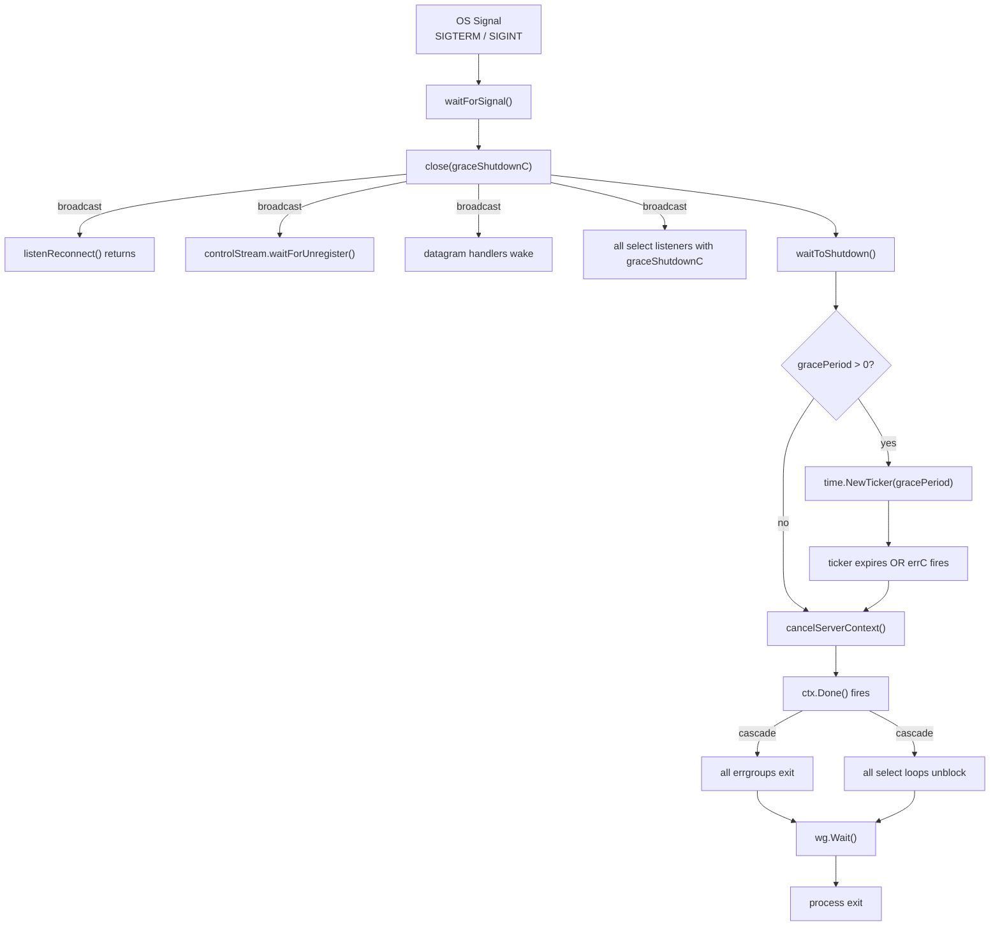
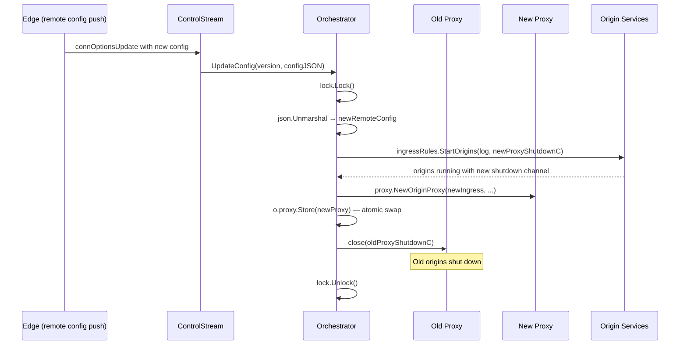

# Init & Teardown — Shutdown and Teardown

> Part of the [Init & Teardown Behavior Catalog](README.md).

## Shutdown Topology

### Signal Propagation



### Shutdown Phase Summary

| Phase               | Trigger                                      | What Happens                                                                                        | Grace Window       |
| ------------------- | -------------------------------------------- | --------------------------------------------------------------------------------------------------- | ------------------ |
| 1 — Graceful signal | `SIGTERM`/`SIGINT` → `close(graceShutdownC)` | All `graceShutdownC` listeners wake; `waitToShutdown` notified                                      | —                  |
| 2 — Grace period    | `time.NewTicker(gracePeriod)` (default 30s)  | In-flight requests drain; control streams send `GracefulShutdown` RPC; datagram sessions unregister | 0–30s configurable |
| 3 — Context cancel  | `cancelServerContext()` fires `ctx.Done()`   | All errgroups return; all goroutine select loops unblock on `ctx.Done()`                            | —                  |
| 4 — Goroutine join  | `wg.Wait()` in `StartServer`                 | Waits for all tracked goroutines to finish                                                          | —                  |
| 5 — Process exit    | Return from `StartServer` → `os.Exit()`      | Logger, TLS, orchestrator rely on GC (no explicit close)                                            | —                  |

Evidence: [atoms/cmd/cloudflared/tunnel/cmd](../../../atoms/cmd/cloudflared/tunnel/cmd.md), [atoms/cmd/cloudflared/tunnel/signal](../../../atoms/cmd/cloudflared/tunnel/signal.md).

## Teardown Surface Inventory

### Close / Shutdown / Stop Methods

| Package           | Type                | Method                            | What It Cleans Up                                                             | Evidence                                                                      |
| ----------------- | ------------------- | --------------------------------- | ----------------------------------------------------------------------------- | ----------------------------------------------------------------------------- |
| `connection`      | `controlStream`     | `waitForUnregister()`             | Sends `GracefulShutdown` RPC to edge, closes registration client              | [atoms/connection/control](../../../atoms/connection/control.md)                 |
| `connection`      | `HTTP2Connection`   | `close()`                         | Waits on `activeRequestsWG`, closes underlying TLS conn                       | [atoms/connection/http2](../../../atoms/connection/http2.md)                     |
| `watcher`         | `*File`             | `Shutdown()`                      | Signals file watcher goroutine to exit                                        | [atoms/watcher/file](../../../atoms/watcher/file.md)                             |
| `overwatch`       | `AppManager`        | `Remove(name)`                    | Calls `service.Shutdown()`, removes from map                                  | [atoms/overwatch/app_manager](../../../atoms/overwatch/app_manager.md)           |
| `management`      | `ManagementService` | (implicit via ctx cancel)         | Context cancel stops `readEvents` and `streamLogs` goroutines                 | [atoms/management/service](../../../atoms/management/service.md)                 |
| `management`      | `session`           | `Stop()`                          | Marks session inactive; `streamLogs` exits on `Active()` check                | [atoms/management/session](../../../atoms/management/session.md)                 |
| `orchestration`   | `Orchestrator`      | `waitToCloseLastProxy()`          | Waits on `shutdownC` (ctx.Done), then closes last `proxyShutdownC`            | [atoms/orchestration/orchestrator](../../../atoms/orchestration/orchestrator.md) |
| `ingress`         | origin services     | `StartOrigins` / `proxyShutdownC` | Origins start with a shutdown channel; closing it terminates origin listeners | [atoms/ingress/origin_service](../../../atoms/ingress/origin_service.md)         |
| `datagramsession` | `manager`           | `UnregisterSession()`             | Removes session from map, closes session conn, drains pending sends           | [atoms/datagramsession/manager](../../../atoms/datagramsession/manager.md)       |
| `quic/v3`         | `session`           | `Close()` / `closeFn`             | `sync.OnceValue`-guarded close; closes write channel and origin socket        | [atoms/quic/v3/session](../../../atoms/quic/v3/session.md)                       |
| `carrier`         | `Serve()`           | (listens `shutdownC`)             | Closes WebSocket connections when shutdown channel fires                      | [atoms/carrier/carrier](../../../atoms/carrier/carrier.md)                       |
| `metrics`         | listener            | `defer metricsListener.Close()`   | Closed via defer in `StartServer`                                             | [atoms/metrics/metrics](../../../atoms/metrics/metrics.md)                       |

### Resources With NO Explicit Close

| Resource          | Package         | Cleanup Mechanism                                                            | Risk                         |
| ----------------- | --------------- | ---------------------------------------------------------------------------- | ---------------------------- |
| Logger            | `logger`        | Process exit / GC                                                            | None — stateless writers     |
| TLS config        | `tlsconfig`     | Process exit / GC                                                            | None — immutable after init  |
| CertReloader      | `tlsconfig`     | Process exit / GC                                                            | None — sync.RWMutex internal |
| Orchestrator      | `orchestration` | `waitToCloseLastProxy` goroutine cleans up proxy; struct itself relies on GC | Low — goroutine exits on ctx |
| ConnTracker       | `tunnelstate`   | Process exit / GC                                                            | None — read-only after init  |
| Edge address pool | `edgediscovery` | Process exit / GC                                                            | None — sync.Mutex internal   |

## `defer` Cleanup Chain Inventory

| Location                             | `defer` Pattern                            | Purpose                                             | Evidence                                                                      |
| ------------------------------------ | ------------------------------------------ | --------------------------------------------------- | ----------------------------------------------------------------------------- |
| `StartServer`                        | `defer cancel()` on top-level context      | Ensures all child contexts terminate                | [atoms/cmd/cloudflared/tunnel/cmd](../../../atoms/cmd/cloudflared/tunnel/cmd.md) |
| `StartServer`                        | `defer metricsListener.Close()`            | Closes metrics HTTP listener                        | [atoms/cmd/cloudflared/tunnel/cmd](../../../atoms/cmd/cloudflared/tunnel/cmd.md) |
| `StartServer`                        | `defer trace.Stop()` (if tracing)          | Flushes trace output to file                        | [atoms/cmd/cloudflared/tunnel/cmd](../../../atoms/cmd/cloudflared/tunnel/cmd.md) |
| `Serve` (ETS)                        | `defer haConnections.Dec()`                | Decrements HA connection gauge                      | [atoms/supervisor/tunnel](../../../atoms/supervisor/tunnel.md)                   |
| `Serve` (ETS)                        | `defer connectedFuse.Fuse(false)`          | Ensures fuse fires even on early exit               | [atoms/supervisor/tunnel](../../../atoms/supervisor/tunnel.md)                   |
| `serveTunnel`                        | `defer observer.SendDisconnect(connIndex)` | Emits disconnect event                              | [atoms/supervisor/tunnel](../../../atoms/supervisor/tunnel.md)                   |
| `serveTunnel`                        | `defer func() { recover() ... }()`         | Treats panics as recoverable error                  | [atoms/supervisor/tunnel](../../../atoms/supervisor/tunnel.md)                   |
| `startFirstTunnel`                   | `defer func() { tunnelErrors <- ... }()`   | Always sends error on channel so main loop unblocks | [atoms/supervisor/supervisor](../../../atoms/supervisor/supervisor.md)           |
| `waitForUnregister`                  | `defer registrationClient.Close()`         | Closes Cap'n Proto registration client              | [atoms/connection/control](../../../atoms/connection/control.md)                 |
| `management.logs`                    | `defer c.Close(...)`                       | Closes WebSocket on any exit                        | [atoms/management/service](../../../atoms/management/service.md)                 |
| `management.logs`                    | `defer cancel()`                           | Cancels per-connection context                      | [atoms/management/service](../../../atoms/management/service.md)                 |
| `management.logs`                    | `defer m.logger.Remove(session)`           | Removes log streaming session                       | [atoms/management/service](../../../atoms/management/service.md)                 |
| `ipAddrFallback.ShouldGetNewAddress` | `defer f.m.Unlock()`                       | Releases mutex after address evaluation             | [atoms/supervisor/tunnel](../../../atoms/supervisor/tunnel.md)                   |

## Context Cancellation Hierarchy

```text
process context (c.Context from CLI framework)
│
├─ ctx, cancel := context.WithCancel(c.Context)     ← StartServer owns this
│  │
│  ├─ Supervisor.Run(ctx, connectedSignal)
│  │  │
│  │  ├─ [goroutine] startFirstTunnel(ctx, connectedSignal)
│  │  │  └─ EdgeTunnelServer.Serve(ctx, 0, ...)
│  │  │     └─ serveTunnel(ctx, ...)
│  │  │        └─ serveConnection(ctx, ...)
│  │  │           └─ serveQUIC / serveHTTP2
│  │  │              └─ errgroup.WithContext(ctx) ← derived child context
│  │  │                 ├─ control stream handler (serveCtx)
│  │  │                 ├─ acceptStream loop (serveCtx)
│  │  │                 ├─ datagram handler (serveCtx)
│  │  │                 └─ listenReconnect (serveCtx)
│  │  │
│  │  ├─ [goroutine] startTunnel(ctx, 1, ...)
│  │  │  └─ (same tree as above)
│  │  ├─ ...
│  │  └─ [goroutine] startTunnel(ctx, N-1, ...)
│  │
│  ├─ [goroutine] autoupdater.Run(ctx)
│  └─ other ctx-dependent goroutines
│
└─ cancelServerContext() called in waitToShutdown AFTER grace period
```

**Dual shutdown channel pattern**: Every select loop that needs graceful shutdown awareness listens to **both** `gracefulShutdownC` (early soft signal) and `ctx.Done()` (hard cancel after grace period). This two-phase approach allows in-flight work to drain before forced termination.

## Graceful Shutdown Channel Propagation Map

The `graceShutdownC chan struct{}` is created once in `StartServer` and threaded through:

| Recipient          | Receives As                         | How Used                                       | Evidence                                                                            |
| ------------------ | ----------------------------------- | ---------------------------------------------- | ----------------------------------------------------------------------------------- |
| `waitForSignal()`  | `graceShutdownC chan struct{}`      | Closes channel on SIGTERM/SIGINT               | [atoms/cmd/cloudflared/tunnel/signal](../../../atoms/cmd/cloudflared/tunnel/signal.md) |
| `waitToShutdown()` | `graceShutdownC <-chan struct{}`    | Detects graceful shutdown, starts grace period | [atoms/cmd/cloudflared/tunnel/cmd](../../../atoms/cmd/cloudflared/tunnel/cmd.md)       |
| `Supervisor`       | `gracefulShutdownC <-chan struct{}` | Main run loop listens for early shutdown       | [atoms/supervisor/supervisor](../../../atoms/supervisor/supervisor.md)                 |
| `EdgeTunnelServer` | `gracefulShutdownC <-chan struct{}` | `listenReconnect()` returns `nil` on close     | [atoms/supervisor/tunnel](../../../atoms/supervisor/tunnel.md)                         |
| `controlStream`    | `gracefulShutdownC <-chan struct{}` | `waitForUnregister()` initiates graceful RPC   | [atoms/connection/control](../../../atoms/connection/control.md)                       |

## Shutdown Ordering Constraints

### Hard Ordering Requirements

| Constraint                                                                | Why                                                       | Consequence of Violation                          |
| ------------------------------------------------------------------------- | --------------------------------------------------------- | ------------------------------------------------- |
| `close(graceShutdownC)` **before** `cancelServerContext()`                | Listeners need graceful drain window before hard kill     | Requests dropped without drain; edge not notified |
| Control stream `GracefulShutdown` RPC **before** QUIC/H2 connection close | Edge needs notification to stop routing to this connector | Edge continues sending to dead connector → 502s   |
| `errgroup.Wait()` runs **after** all goroutine members return             | errgroup semantics — Wait blocks until all done           | Goroutine leak if any member hangs                |
| `wg.Wait()` in `StartServer` **after** `cancelServerContext()`            | WaitGroup tracks all tracked goroutines                   | Process exits before goroutines finish            |
| `registrationClient.Close()` **after** `GracefulShutdown` RPC             | Close tears down Cap'n Proto transport                    | RPC fails with broken pipe                        |

### Soft Ordering (Best Effort)

| Constraint                                        | Why                                         | Impact of Reordering                    |
| ------------------------------------------------- | ------------------------------------------- | --------------------------------------- |
| Drain datagram sessions before connection close   | Minimizes in-flight packet loss             | Minimal — edge handles reconnect        |
| HTTP/2 `activeRequestsWG.Wait()` before TLS close | Allows in-flight HTTP/2 streams to complete | Abrupt stream reset                     |
| Orchestrator proxy shutdown after tunnel close    | Proxy should remain available during drain  | Requests may hit closed proxy (404/502) |

## Overwatch Service Lifecycle

The `overwatch` package provides a secondary init/teardown path for plugin-style services:

| Method                    | Behavior                                                                   | Evidence                                                            |
| ------------------------- | -------------------------------------------------------------------------- | ------------------------------------------------------------------- |
| `NewAppManager(callback)` | Creates manager with empty service map                                     | [atoms/overwatch/app_manager](../../../atoms/overwatch/app_manager.md) |
| `Add(service)`            | Stops existing service with same name, then `go m.serviceRun(service)`     | [atoms/overwatch/app_manager](../../../atoms/overwatch/app_manager.md) |
| `Remove(name)`            | Calls `service.Shutdown()`, deletes from map                               | [atoms/overwatch/app_manager](../../../atoms/overwatch/app_manager.md) |
| `serviceRun(service)`     | Calls `service.Run()` (blocking), then `callback(type, name, err)` on exit | [atoms/overwatch/app_manager](../../../atoms/overwatch/app_manager.md) |

**Lifecycle contract**: `Add()` always stops-then-starts, so replacing a running service is safe. No reference counting — `Remove()` is fire-and-forget after `Shutdown()`.

Evidence: [atoms/overwatch/manager](../../../atoms/overwatch/manager.md).

## Orchestrator Config Hot-Reload Lifecycle

The Orchestrator supports runtime configuration updates without restart:



**Critical ordering**: new proxy is created and stored **before** old proxy is shut down. This "start-before-stop" pattern prevents a window where no proxy is available.

Evidence: [atoms/orchestration/orchestrator](../../../atoms/orchestration/orchestrator.md), [atoms/orchestration/config](../../../atoms/orchestration/config.md).
