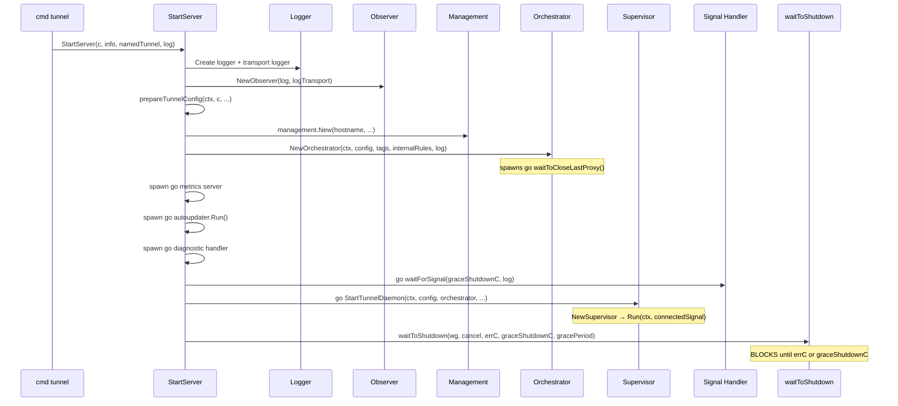
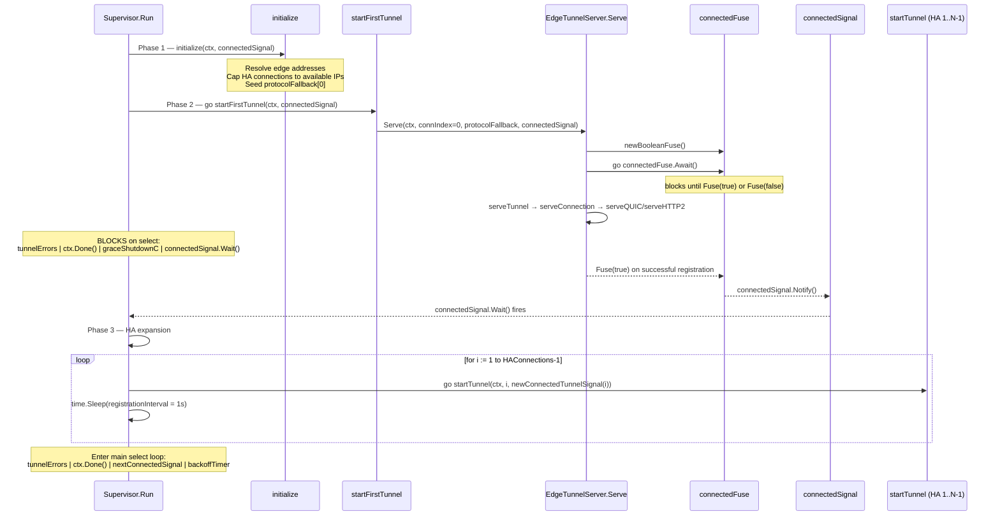
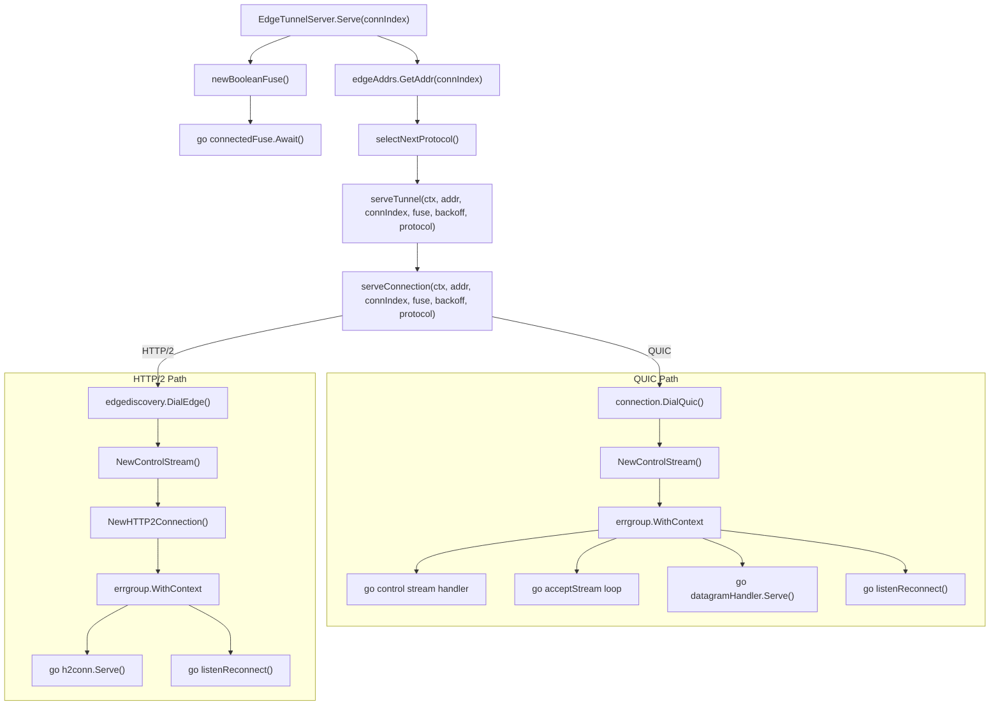

# Init & Teardown — Startup Sequence

> Part of the [Init & Teardown Behavior Catalog](README.md).

## Constructor Inventory

### Phase 0 — Go `init()` Functions

| Package           | Function              | Side Effects                                                                    | Evidence                                                                |
| ----------------- | --------------------- | ------------------------------------------------------------------------------- | ----------------------------------------------------------------------- |
| `logger`          | `init()`              | Registers `zerolog.TimestampFunc = utcNow` — forces UTC timestamps process-wide | [atoms/logger/create](../../../atoms/logger/create.md)                     |
| `supervisor`      | (package-level `var`) | Registers `haConnections` Prometheus gauge via `prometheus.MustRegister()`      | [atoms/supervisor/metrics](../../../atoms/supervisor/metrics.md)           |
| `connection`      | (package-level `var`) | Registers connection metrics (regSuccess, regFail, etc.)                        | [atoms/connection/metrics](../../../atoms/connection/metrics.md)           |
| `datagramsession` | (package-level `var`) | Registers datagram session metrics                                              | [atoms/datagramsession/metrics](../../../atoms/datagramsession/metrics.md) |
| `quic/v3`         | (package-level `var`) | Registers v3 datagram metrics                                                   | [atoms/quic/v3/metrics](../../../atoms/quic/v3/metrics.md)                 |

### Phase 1–4 — Factory / Constructor Functions

| Constructor                                                                                           | Required Dependencies                                                      | Returns                                                                       | Evidence                                                                        |
| ----------------------------------------------------------------------------------------------------- | -------------------------------------------------------------------------- | ----------------------------------------------------------------------------- | ------------------------------------------------------------------------------- |
| `config.ReadConfigFile(c, log)`                                                                       | CLI context, logger                                                        | `*configFileSettings`                                                         | [atoms/config/configuration](../../../atoms/config/configuration.md)               |
| `logger.Create(config)`                                                                               | Logger config (from CLI)                                                   | `*zerolog.Logger`                                                             | [atoms/logger/create](../../../atoms/logger/create.md)                             |
| `credentials.Read(certPath, log)`                                                                     | Origin cert path, logger                                                   | `*User`                                                                       | [atoms/credentials/credentials](../../../atoms/credentials/credentials.md)         |
| `tlsconfig.CreateTunnelConfig(c, serverName)`                                                         | CLI context, server name                                                   | `*tls.Config`                                                                 | [atoms/tlsconfig/tlsconfig](../../../atoms/tlsconfig/tlsconfig.md)                 |
| `tlsconfig.NewCertReloader(certPath, keyPath)`                                                        | Cert/key paths                                                             | `*CertReloader` (sync.RWMutex guarded)                                        | [atoms/tlsconfig/certreloader](../../../atoms/tlsconfig/certreloader.md)           |
| `connection.NewObserver(log, logTransport)`                                                           | Logger pair                                                                | `*Observer`                                                                   | [atoms/connection/observer](../../../atoms/connection/observer.md)                 |
| `management.New(hostname, enableDiag, ip, id, label, log, logger)`                                    | Hostname, flags, logger                                                    | `*ManagementService` (registers HTTP routes)                                  | [atoms/management/service](../../../atoms/management/service.md)                   |
| `orchestration.NewOrchestrator(ctx, config, tags, internalRules, log)`                                | Context, config, ingress rules, logger                                     | `*Orchestrator`; calls `updateIngress()` + spawns `go waitToCloseLastProxy()` | [atoms/orchestration/orchestrator](../../../atoms/orchestration/orchestrator.md)   |
| `proxy.NewOriginProxy(ingress, dialer, tags, limiter, log)`                                           | Ingress rules, dialer, flow limiter                                        | `*Proxy`                                                                      | [atoms/proxy/proxy](../../../atoms/proxy/proxy.md)                                 |
| `flow.NewLimiter(maxFlows)`                                                                           | Max active flows count                                                     | `Limiter`                                                                     | [atoms/flow/limiter](../../../atoms/flow/limiter.md)                               |
| `edgediscovery.ResolveEdge(log, region, ipVersion)`                                                   | Logger, region string, IP version                                          | `*Edge` (address pool)                                                        | [atoms/edgediscovery/edgediscovery](../../../atoms/edgediscovery/edgediscovery.md) |
| `edgediscovery.StaticEdge(log, addrs)`                                                                | Logger, address list                                                       | `*Edge`                                                                       | [atoms/edgediscovery/edgediscovery](../../../atoms/edgediscovery/edgediscovery.md) |
| `tunnelstate.NewConnTracker(log)`                                                                     | Logger                                                                     | `*ConnTracker`                                                                | [atoms/tunnelstate/conntracker](../../../atoms/tunnelstate/conntracker.md)         |
| `v3.NewSessionManager(metrics, log, dialer, limiter)`                                                 | Metrics, logger, dialer service, flow limiter                              | `SessionManager`                                                              | [atoms/quic/v3/manager](../../../atoms/quic/v3/manager.md)                         |
| `supervisor.NewSupervisor(config, orchestrator, reconnectCh, gracefulShutdownC)`                      | TunnelConfig, Orchestrator, reconnect channel, shutdown channel            | `*Supervisor`; resolves edge addresses, allocates HA tracking                 | [atoms/supervisor/supervisor](../../../atoms/supervisor/supervisor.md)             |
| `signal.New(ch)`                                                                                      | `chan struct{}`                                                            | `*Signal` (sync.Once guarded)                                                 | [atoms/signal/safe_signal](../../../atoms/signal/safe_signal.md)                   |
| `connection.NewControlStream(observer, fuse, props, idx, addr, fn, timeout, shutdownC, grace, proto)` | Observer, fuse, tunnel properties, connection index, several config values | `ControlStreamHandler`                                                        | [atoms/connection/control](../../../atoms/connection/control.md)                   |

## Startup Sequence

### Top-Level: `StartServer` → `waitToShutdown`

Key observations:

1. **`prepareTunnelConfig` is a synchronous mega-factory** that assembles `TunnelConfig` from CLI flags, credentials, TLS configs, ICMP router, and dialer services before any goroutines launch.
2. **`graceShutdownC` is created as `make(chan struct{})` in `StartServer`** — it is the singleton process-wide broadcast channel.
3. **`connectedSignal` is created as `signal.New(make(chan struct{}))`** — it is the one-shot latch for first-connection notification. Goroutines `notifySystemd()` and `writePidFile()` depend on it.

### Supervisor Startup: Three-Phase Sequence

### Phase 2 Detail: First Tunnel Startup Retry Loop

`startFirstTunnel` runs in its own goroutine and retries indefinitely for certain error types:

| Error Type                        | Retry?               | Condition                      |
| --------------------------------- | -------------------- | ------------------------------ |
| `nil` (success then disconnect)   | Return               | —                              |
| `context.Canceled`                | Return               | ctx cancelled                  |
| `"Unauthorized"`                  | Always retry         | Transient edge propagation lag |
| `ErrNoAddressesLeft`              | Retry if static edge | Return if dynamic edge         |
| `DupConnRegisterTunnelError`      | Always retry         | Address rotation               |
| `*quic.IdleTimeoutError`          | Always retry         | Network transient              |
| `*quic.ApplicationError`          | Always retry         | Edge-side                      |
| `DialError`, `*EdgeQuicDialError` | Always retry         | Network transient              |
| `*ControlStreamError`             | Always retry         | Control stream                 |
| `*StreamListenerError`            | Always retry         | QUIC listener                  |
| `*DatagramManagerError`           | Always retry         | Datagram subsystem             |
| Default (uncaught)                | Return               | Fatal — bail startup           |

Evidence: [atoms/supervisor/supervisor](../../../atoms/supervisor/supervisor.md), [atoms/connection/errors](../../../atoms/connection/errors.md).

### Per-Connection Startup: `serveTunnel` → Transport

Each connection (first tunnel or HA) follows:

Evidence: [atoms/supervisor/tunnel](../../../atoms/supervisor/tunnel.md), [atoms/connection/quic_connection](../../../atoms/connection/quic_connection.md), [atoms/connection/http2](../../../atoms/connection/http2.md), [atoms/connection/control](../../../atoms/connection/control.md).

### Control Stream Registration

The control stream is where registration → unregistration lifecycle lives:

1. **`registerClient()`** sends `TunnelAuth` + `ConnectionOptions` to edge
2. On success: `connectedFuse.Connected()` fires → `connectedSignal.Notify()` propagates up
3. If `connIndex == 0` and tunnel is locally managed: sends local config via `SendLocalConfiguration()`
4. **`waitForUnregister()`** enters select on `ctx.Done()` / `gracefulShutdownC`
5. On shutdown signal: sends `GracefulShutdown` RPC to edge, waits up to `gracePeriod`

Evidence: [atoms/connection/control](../../../atoms/connection/control.md).
