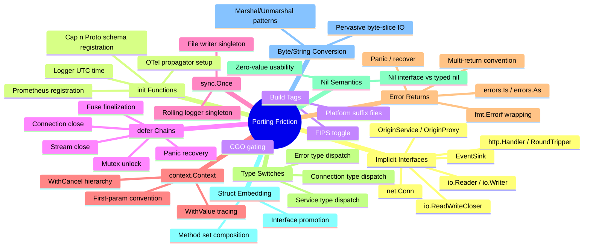
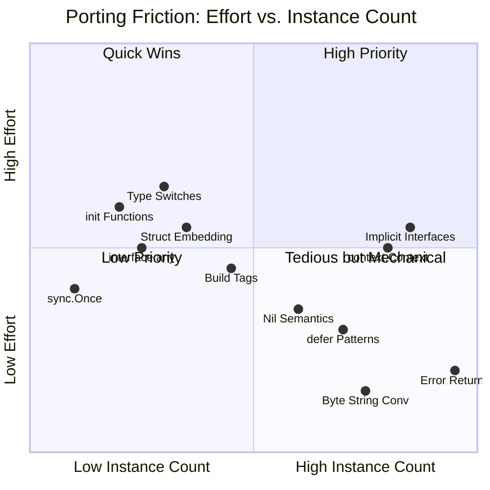

# Porting Friction Catalog

- Baseline date: 20260321
- Baseline reference: [cloudflare/cloudflared/tree/2026.3.0](https://github.com/cloudflare/cloudflared/tree/2026.3.0)
- Primary evidence set: behavior atoms under [../../atoms](../../../atoms)
- Upstream recheck: friction surfaces revalidated against tag `2026.3.0` source anchors for [ingress/origin_proxy.go](https://github.com/cloudflare/cloudflared/blob/2026.3.0/ingress/origin_proxy.go), [ingress/origin_service.go](https://github.com/cloudflare/cloudflared/blob/2026.3.0/ingress/origin_service.go), [supervisor/tunnel.go](https://github.com/cloudflare/cloudflared/blob/2026.3.0/supervisor/tunnel.go), [connection/quic_connection.go](https://github.com/cloudflare/cloudflared/blob/2026.3.0/connection/quic_connection.go), [connection/observer.go](https://github.com/cloudflare/cloudflared/blob/2026.3.0/connection/observer.go), [logger/create.go](https://github.com/cloudflare/cloudflared/blob/2026.3.0/logger/create.go), [tracing/tracing.go](https://github.com/cloudflare/cloudflared/blob/2026.3.0/tracing/tracing.go), [datagramsession/metrics.go](https://github.com/cloudflare/cloudflared/blob/2026.3.0/datagramsession/metrics.go), [fips/fips.go](https://github.com/cloudflare/cloudflared/blob/2026.3.0/fips/fips.go), [ingress/icmp_posix.go](https://github.com/cloudflare/cloudflared/blob/2026.3.0/ingress/icmp_posix.go), and [ingress/icmp_generic.go](https://github.com/cloudflare/cloudflared/blob/2026.3.0/ingress/icmp_generic.go).

## Scope

This catalog inventories Go language idioms in cloudflared that have no direct Rust equivalent, where the Go-to-Rust translation is structurally painful. These are not behavioral patterns but rather language-level friction surfaces: implicit interface satisfaction, `init()` functions, build tags as feature flags, `defer` cleanup chains, `sync.Once` closures, `context.Context` propagation, error handling conventions, type switches, nil semantics, struct embedding, and `[]byte`/string conversion overhead. The goal is to give the Rust port a concrete map of every translation hazard so none are discovered late.

- Direct evidence: interface definitions, `init()` bodies, platform-gated files, `defer` statements, `sync.Once` fields, `context.Context` parameters, `(value, error)` returns, `switch err.(type)` blocks, nil-interface checks, struct embedding, and `[]byte` parameters.
- Out of scope: goroutine actor topology already detailed in [concurrency](../concurrency/README.md), channel shape and select-loop mechanics already detailed in [concurrency](../concurrency/README.md), startup/shutdown ordering already detailed in [init-teardown](../init-teardown/README.md), error classification taxonomy already detailed in [error-propagation](../error-propagation/README.md), shared-state mutex inventory already detailed in [shared-state](../shared-state.md), and platform-substrate behavioral matrices already detailed in [platform-substrates](../platform-substrates.md).

## Catalog Structure

- [Type System Friction](type-system-friction.md) — Implicit interfaces, type switches, struct embedding, nil semantics, byte/string conversion
- [Runtime Pattern Friction](runtime-pattern-friction.md) — init() functions, build tags, defer patterns, sync.Once, context propagation, error convention translation
- [Go vs Rust by Atom](go-vs-rust-by-atom.md) — Per-atom Go→Rust translation tables aggregated from each atom's Rust Porting Notes, plus crate frequency summary

## Friction Taxonomy

## Friction Severity Summary

### Severity Ranking

| Rank | Friction category | Severity | Instance count | Rationale |
| ---: | ----------------------------------- | ---------- | ---------------------------------- | -------------------------------------------------------------------------------------------------------------------------------------------------------------- |
| 1 | **Implicit interface satisfaction** | **High** | 80+ implementations | Every implementor needs explicit `impl Trait for Type`; interface discovery requires tracing all call sites; enum-vs-trait decision must be made per interface |
| 2 | **context.Context propagation** | **High** | 80+ functions | Single Go concept splits into 3+ Rust mechanisms (CancellationToken, timeout, task-local); every function signature changes |
| 3 | **Type switches on error types** | **High** | 5 switch sites but 15+ error types | Requires unified error hierarchy design; `errors.As` chains need coherent downcast strategy |
| 4 | **Struct embedding** | **Medium** | 9 embedding sites | No language-level method promotion; each promoted method needs manual delegation |
| 5 | **init() functions** | **Medium** | 7 init() bodies | Each becomes `Lazy`/`OnceLock`; ordering becomes explicit concern |
| 6 | **Build tags** | **Medium** | 15+ gated files, 1 FIPS tag | `#[cfg]` works but FIPS/CGO patterns need structural redesign |
| 7 | **defer patterns** | **Medium** | 11+ distinct patterns | Most map to RAII/Drop; panic recovery and mutable-capture defers are hard cases |
| 8 | **interface{}/any parameters** | **Medium** | 10 sites | Replace with generics + serde; requires knowing concrete types at each call site |
| 9 | **sync.Once closures** | **Low** | 2 instances | Direct mapping to `OnceLock` |
| 10 | **Nil semantics** | **Low** | Pervasive but mechanical | `Option<T>` is a clean replacement; nil channel disabling needs case-by-case translation |
| 11 | **[]byte/string conversion** | **Low** | 150+ sites but mechanical | `&[u8]`/`Vec<u8>` vs `&str`/`String` is well-understood; UTF-8 enforcement is a benefit |
| 12 | **Error return convention** | **Low** | 200+ functions but mechanical | `(T, error)` → `Result<T, E>` is the most straightforward translation in the entire catalog |

## Coverage Audit

### Atoms Referenced by This Catalog

| # | Atom | Friction categories |
| --: | ----------------------------------------------------------------------------------------------------------------------- | ------------------------------------------------------------------------------------- |
| 1 | [../../atoms/carrier/carrier](../../../atoms/carrier/carrier.md) | Implicit interfaces (io.Reader/Writer) |
| 2 | [../../atoms/cfapi/base_client](../../../atoms/cfapi/base_client.md) | interface{}/any, error returns |
| 3 | [../../atoms/cmd/cloudflared/generic_service](../../../atoms/cmd/cloudflared/generic_service.md) | Build tags (fallback) |
| 4 | [../../atoms/cmd/cloudflared/linux_service](../../../atoms/cmd/cloudflared/linux_service.md) | Build tags (Linux) |
| 5 | [../../atoms/cmd/cloudflared/macos_service](../../../atoms/cmd/cloudflared/macos_service.md) | Build tags (macOS) |
| 6 | [../../atoms/cmd/cloudflared/tunnel/cmd](../../../atoms/cmd/cloudflared/tunnel/cmd.md) | defer (WaitGroup) |
| 7 | [../../atoms/cmd/cloudflared/tunnel/subcommands](../../../atoms/cmd/cloudflared/tunnel/subcommands.md) | interface{}/any |
| 8 | [../../atoms/cmd/cloudflared/windows_service](../../../atoms/cmd/cloudflared/windows_service.md) | Build tags (Windows) |
| 9 | [../../atoms/config/configuration](../../../atoms/config/configuration.md) | interface{}/any (YAML marshal) |
| 10 | [../../atoms/config/manager](../../../atoms/config/manager.md) | defer (file close) |
| 11 | [../../atoms/connection/control](../../../atoms/connection/control.md) | Implicit interfaces (io.ReadWriteCloser), context.Context |
| 12 | [../../atoms/connection/errors](../../../atoms/connection/errors.md) | Error wrapping/matching (errors.Is/As) |
| 13 | [../../atoms/connection/header](../../../atoms/connection/header.md) | Panic paths |
| 14 | [../../atoms/connection/http2](../../../atoms/connection/http2.md) | defer, Implicit interfaces, Panic |
| 15 | [../../atoms/connection/observer](../../../atoms/connection/observer.md) | Implicit interfaces (EventSink), nil channel |
| 16 | [../../atoms/connection/quic_connection](../../../atoms/connection/quic_connection.md) | Implicit interfaces, defer, type switch, struct embedding, context.Context |
| 17 | [../../atoms/credentials/origin_cert](../../../atoms/credentials/origin_cert.md) | []byte conversion |
| 18 | [../../atoms/datagramsession/manager](../../../atoms/datagramsession/manager.md) | Implicit interfaces (io.ReadWriteCloser) |
| 19 | [../../atoms/datagramsession/metrics](../../../atoms/datagramsession/metrics.md) | init() |
| 20 | [../../atoms/diagnostic/network/collector_unix](../../../atoms/diagnostic/network/collector_unix.md) | Build tags |
| 21 | [../../atoms/diagnostic/network/collector_windows](../../../atoms/diagnostic/network/collector_windows.md) | Build tags |
| 22 | [../../atoms/diagnostic/system_collector_linux](../../../atoms/diagnostic/system_collector_linux.md) | Build tags |
| 23 | [../../atoms/diagnostic/system_collector_windows](../../../atoms/diagnostic/system_collector_windows.md) | Build tags |
| 24 | [../../atoms/edgediscovery/dial](../../../atoms/edgediscovery/dial.md) | context.Context, defer |
| 25 | [../../atoms/fips/fips](../../../atoms/fips/fips.md) | Build tags (FIPS) |
| 26 | [../../atoms/fips/nofips](../../../atoms/fips/nofips.md) | Build tags (FIPS) |
| 27 | [../../atoms/ingress/icmp_darwin](../../../atoms/ingress/icmp_darwin.md) | Build tags |
| 28 | [../../atoms/ingress/icmp_generic](../../../atoms/ingress/icmp_generic.md) | Build tags (fallback) |
| 29 | [../../atoms/ingress/icmp_linux](../../../atoms/ingress/icmp_linux.md) | Build tags |
| 30 | [../../atoms/ingress/icmp_metrics](../../../atoms/ingress/icmp_metrics.md) | init() |
| 31 | [../../atoms/ingress/icmp_posix](../../../atoms/ingress/icmp_posix.md) | Build tags |
| 32 | [../../atoms/ingress/icmp_windows](../../../atoms/ingress/icmp_windows.md) | Build tags |
| 33 | [../../atoms/ingress/origin_dialer](../../../atoms/ingress/origin_dialer.md) | Implicit interfaces (net.Conn), context.Context |
| 34 | [../../atoms/ingress/origin_icmp_proxy](../../../atoms/ingress/origin_icmp_proxy.md) | Implicit interfaces (ICMPRouterServer) |
| 35 | [../../atoms/ingress/origin_proxy](../../../atoms/ingress/origin_proxy.md) | Implicit interfaces (domain interfaces), context.Context |
| 36 | [../../atoms/ingress/origin_service](../../../atoms/ingress/origin_service.md) | Implicit interfaces (OriginService), struct embedding, type switch |
| 37 | [../../atoms/ingress/origins/dns](../../../atoms/ingress/origins/dns.md) | Implicit interfaces (net.Conn), context.Context |
| 38 | [../../atoms/logger/console](../../../atoms/logger/console.md) | Implicit interfaces (io.Writer) |
| 39 | [../../atoms/logger/create](../../../atoms/logger/create.md) | init(), sync.Once, Implicit interfaces |
| 40 | [../../atoms/management/events](../../../atoms/management/events.md) | []byte (JSON marshal) |
| 41 | [../../atoms/management/logger](../../../atoms/management/logger.md) | Implicit interfaces (io.Writer, zerolog.LevelWriter) |
| 42 | [../../atoms/metrics/metrics](../../../atoms/metrics/metrics.md) | context.Context |
| 43 | [../../atoms/orchestration/config](../../../atoms/orchestration/config.md) | []byte (JSON marshal) |
| 44 | [../../atoms/orchestration/orchestrator](../../../atoms/orchestration/orchestrator.md) | Implicit interfaces (Orchestrator), nil interface, []byte |
| 45 | [../../atoms/packet/decoder](../../../atoms/packet/decoder.md) | []byte parameters |
| 46 | [../../atoms/packet/funnel](../../../atoms/packet/funnel.md) | Implicit interfaces (Funnel) |
| 47 | [../../atoms/packet/packet](../../../atoms/packet/packet.md) | []byte marshal |
| 48 | [../../atoms/quic/datagram](../../../atoms/quic/datagram.md) | []byte, context.Context |
| 49 | [../../atoms/quic/datagramv2](../../../atoms/quic/datagramv2.md) | []byte, context.Context, channel direction |
| 50 | [../../atoms/quic/param_unix](../../../atoms/quic/param_unix.md) | Build tags |
| 51 | [../../atoms/quic/param_windows](../../../atoms/quic/param_windows.md) | Build tags |
| 52 | [../../atoms/quic/safe_stream](../../../atoms/quic/safe_stream.md) | Implicit interfaces, defer |
| 53 | [../../atoms/quic/v3/session](../../../atoms/quic/v3/session.md) | Implicit interfaces (io.ReadWriteCloser, Funnel) |
| 54 | [../../atoms/retry/backoffhandler](../../../atoms/retry/backoffhandler.md) | context.Context |
| 55 | [../../atoms/socks/authenticator](../../../atoms/socks/authenticator.md) | Implicit interfaces |
| 56 | [../../atoms/socks/dialer](../../../atoms/socks/dialer.md) | Implicit interfaces (Dialer) |
| 57 | [../../atoms/stream/debug](../../../atoms/stream/debug.md) | Implicit interfaces (io.Reader/Writer) |
| 58 | [../../atoms/supervisor/fuse](../../../atoms/supervisor/fuse.md) | defer (fuse finalization) |
| 59 | [../../atoms/supervisor/supervisor](../../../atoms/supervisor/supervisor.md) | context.Context |
| 60 | [../../atoms/supervisor/tunnel](../../../atoms/supervisor/tunnel.md) | Type switches, defer, panic/recover, struct embedding, context.Context, error returns |
| 61 | [../../atoms/tlsconfig/certreloader](../../../atoms/tlsconfig/certreloader.md) | Error wrapping (pkg/errors) |
| 62 | [../../atoms/token/launch_browser_darwin](../../../atoms/token/launch_browser_darwin.md) | Build tags |
| 63 | [../../atoms/token/launch_browser_other](../../../atoms/token/launch_browser_other.md) | Build tags |
| 64 | [../../atoms/token/launch_browser_windows](../../../atoms/token/launch_browser_windows.md) | Build tags |
| 65 | [../../atoms/tracing/client](../../../atoms/tracing/client.md) | context.Context |
| 66 | [../../atoms/tracing/identity](../../../atoms/tracing/identity.md) | Implicit interfaces (BinaryMarshaler), []byte |
| 67 | [../../atoms/tracing/tracing](../../../atoms/tracing/tracing.md) | init(), context.Context, struct embedding |
| 68 | [../../atoms/tunnelrpc/metrics/metrics](../../../atoms/tunnelrpc/metrics/metrics.md) | init() |
| 69 | [../../atoms/tunnelrpc/proto/quic_metadata_protocol.capnp](../../../atoms/tunnelrpc/proto/quic_metadata_protocol.capnp.md) | init(), panic paths |
| 70 | [../../atoms/tunnelrpc/proto/tunnelrpc.capnp](../../../atoms/tunnelrpc/proto/tunnelrpc.capnp.md) | init(), panic paths |
| 71 | [../../atoms/tunnelrpc/quic/cloudflared_client](../../../atoms/tunnelrpc/quic/cloudflared_client.md) | Implicit interfaces (io.ReadWriteCloser), context.Context |
| 72 | [../../atoms/tunnelrpc/quic/cloudflared_server](../../../atoms/tunnelrpc/quic/cloudflared_server.md) | Implicit interfaces (io.ReadWriteCloser), context.Context |
| 73 | [../../atoms/tunnelrpc/quic/session_client](../../../atoms/tunnelrpc/quic/session_client.md) | Implicit interfaces (io.ReadWriteCloser), context.Context |
| 74 | [../../atoms/tunnelrpc/quic/session_server](../../../atoms/tunnelrpc/quic/session_server.md) | Implicit interfaces (io.ReadWriteCloser), context.Context |
| 75 | [../../atoms/tunnelrpc/registration_client](../../../atoms/tunnelrpc/registration_client.md) | Implicit interfaces (io.ReadWriteCloser), context.Context |
| 76 | [../../atoms/tunnelrpc/registration_server](../../../atoms/tunnelrpc/registration_server.md) | Implicit interfaces (io.ReadWriteCloser), context.Context |
| 77 | [../../atoms/tunnelrpc/utils](../../../atoms/tunnelrpc/utils.md) | Implicit interfaces, interface{}/any |
| 78 | [../../atoms/tunnelstate/conntracker](../../../atoms/tunnelstate/conntracker.md) | Implicit interfaces (EventSink) |
| 79 | [../../atoms/websocket/connection](../../../atoms/websocket/connection.md) | Implicit interfaces (io.Reader/Writer) |
