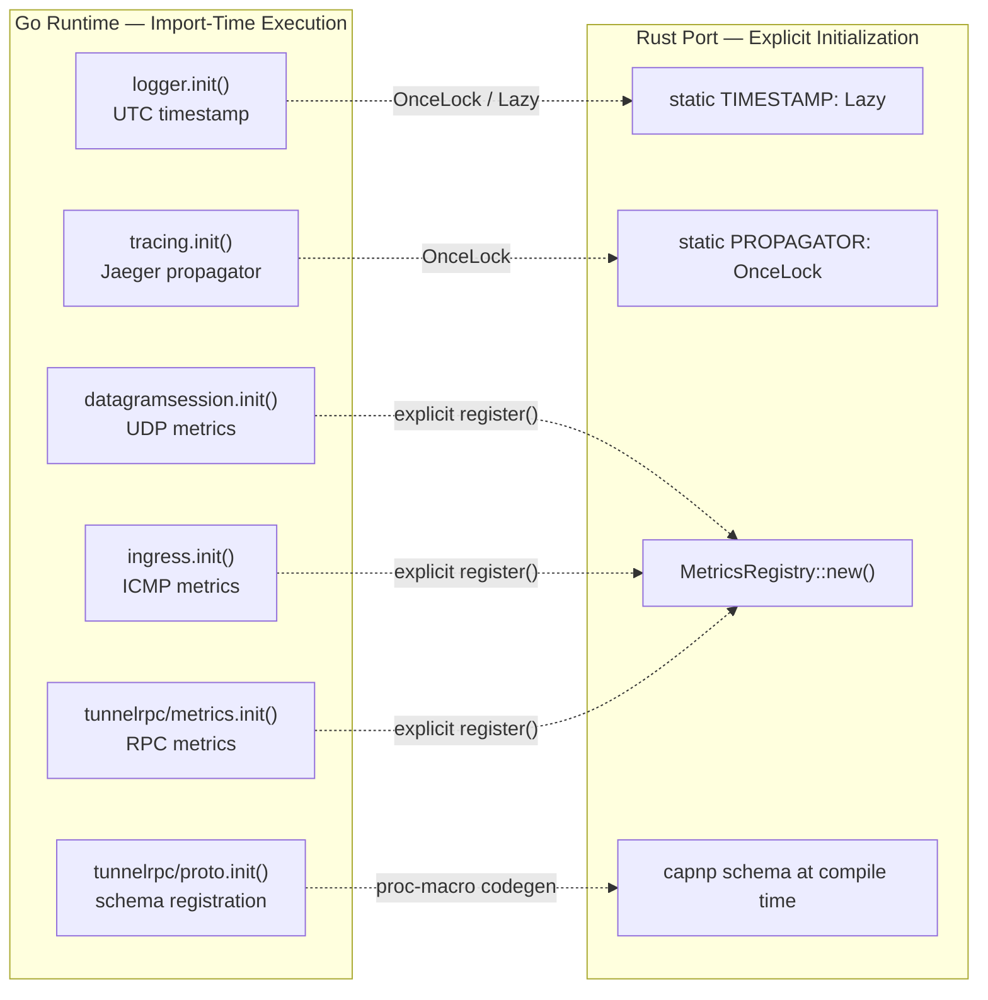
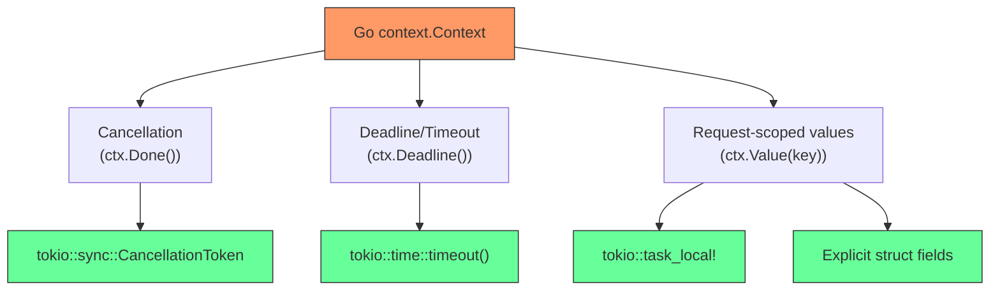

# Porting Friction — Runtime Pattern Friction

> Part of the [Porting Friction Behavior Catalog](README.md).

## init() Functions

Go's `init()` runs at package import time with no explicit call site. Rust has no equivalent — all initialization must be explicit.

### init() Inventory

| Package                             | init() purpose                                                             | Side effect                               | Atom                                                                                                                    |
| ----------------------------------- | -------------------------------------------------------------------------- | ----------------------------------------- | ----------------------------------------------------------------------------------------------------------------------- |
| `logger`                            | `zerolog.TimestampFunc = func() time.Time { return time.Now().UTC() }`     | Mutates global zerolog timestamp function | [../../atoms/logger/create](../../../atoms/logger/create.md)                                                               |
| `tracing`                           | `otel.SetTextMapPropagator(otelContrib.Jaeger{})` + hostname/version attrs | Registers global OTel propagator          | [../../atoms/tracing/tracing](../../../atoms/tracing/tracing.md)                                                           |
| `datagramsession`                   | `prometheus.MustRegister(activeUDPSessions, totalUDPSessions)`             | Registers Prometheus gauges               | [../../atoms/datagramsession/metrics](../../../atoms/datagramsession/metrics.md)                                           |
| `ingress` (ICMP)                    | `prometheus.MustRegister(icmpRequestsTotal, icmpRequestErrors)`            | Registers ICMP metrics                    | [../../atoms/ingress/icmp_metrics](../../../atoms/ingress/icmp_metrics.md)                                                 |
| `tunnelrpc/metrics`                 | `prometheus.MustRegister(...)` for 5+ RPC metrics                          | Registers RPC gauges/counters             | [../../atoms/tunnelrpc/metrics/metrics](../../../atoms/tunnelrpc/metrics/metrics.md)                                       |
| `tunnelrpc/proto` (tunnelrpc.capnp) | Cap'n Proto schema self-registration                                       | Registers generated schema                | [../../atoms/tunnelrpc/proto/tunnelrpc.capnp](../../../atoms/tunnelrpc/proto/tunnelrpc.capnp.md)                           |
| `tunnelrpc/proto` (quic_metadata)   | Cap'n Proto schema self-registration                                       | Registers generated schema                | [../../atoms/tunnelrpc/proto/quic_metadata_protocol.capnp](../../../atoms/tunnelrpc/proto/quic_metadata_protocol.capnp.md) |

### init() Dependency Chain



### Porting Guidance — init()

| Go pattern                                   | Rust replacement                                                   | Notes                                                                         |
| -------------------------------------------- | ------------------------------------------------------------------ | ----------------------------------------------------------------------------- |
| `prometheus.MustRegister(...)` in `init()`   | `static METRIC: Lazy<IntCounter> = Lazy::new(…)`                   | Use `std::sync::LazyLock` (stable since Rust 1.80) or `once_cell::sync::Lazy` |
| `otel.SetTextMapPropagator(...)` in `init()` | `OnceLock::get_or_init()` in an explicit `init_tracing()` function | Global OTel setup must be called once before first request                    |
| Cap'n Proto `init()` schema registration     | Compile-time codegen via `capnpc-rust` build script                | No runtime registration needed                                                |
| `zerolog.TimestampFunc = ...`                | Configure at logger construction time                              | No global mutation                                                            |

## Build Tags as Feature Gates

Go uses `//go:build` directives and file-suffix conventions for conditional compilation. Rust uses `#[cfg(...)]` attributes and Cargo features.

> **See also:** [platform-substrates](../platform-substrates.md) for the full platform support matrix, container runtime matrix, FIPS build-feature matrix, and gating mechanism inventory across all OS/init-system/container/CPU dimensions.

### Platform-Gated Files

| Go file suffix / tag     | Constraint                                  | Atom(s)                                                                                                                                                                                                                                                                                                                                                                                                                                                                                                                                              | Rust `#[cfg]`                      |
| ------------------------ | ------------------------------------------- | ---------------------------------------------------------------------------------------------------------------------------------------------------------------------------------------------------------------------------------------------------------------------------------------------------------------------------------------------------------------------------------------------------------------------------------------------------------------------------------------------------------------------------------------------------- | ---------------------------------- |
| `_linux.go`              | `linux`                                     | [../../atoms/diagnostic/system_collector_linux](../../../atoms/diagnostic/system_collector_linux.md), [../../atoms/ingress/icmp_linux](../../../atoms/ingress/icmp_linux.md)                                                                                                                                                                                                                                                                                                                                                                               | `#[cfg(target_os = "linux")]`      |
| `_darwin.go`             | `darwin`                                    | [../../atoms/token/launch_browser_darwin](../../../atoms/token/launch_browser_darwin.md), [../../atoms/ingress/icmp_darwin](../../../atoms/ingress/icmp_darwin.md)                                                                                                                                                                                                                                                                                                                                                                                         | `#[cfg(target_os = "macos")]`      |
| `_windows.go`            | `windows`                                   | [../../atoms/quic/param_windows](../../../atoms/quic/param_windows.md), [../../atoms/diagnostic/network/collector_windows](../../../atoms/diagnostic/network/collector_windows.md), [../../atoms/diagnostic/system_collector_windows](../../../atoms/diagnostic/system_collector_windows.md), [../../atoms/token/launch_browser_windows](../../../atoms/token/launch_browser_windows.md), [../../atoms/ingress/icmp_windows](../../../atoms/ingress/icmp_windows.md), [../../atoms/cmd/cloudflared/windows_service](../../../atoms/cmd/cloudflared/windows_service.md) | `#[cfg(target_os = "windows")]`    |
| `_posix.go` / `_unix.go` | `darwin \|\| linux`                         | [../../atoms/ingress/icmp_posix](../../../atoms/ingress/icmp_posix.md), [../../atoms/quic/param_unix](../../../atoms/quic/param_unix.md)                                                                                                                                                                                                                                                                                                                                                                                                                   | `#[cfg(unix)]`                     |
| `_generic.go`            | `!darwin && !linux && (!windows \|\| !cgo)` | [../../atoms/ingress/icmp_generic](../../../atoms/ingress/icmp_generic.md)                                                                                                                                                                                                                                                                                                                                                                                                                                                                              | `#[cfg(not(any(unix, windows)))]`  |
| `_other.go`              | fallback (non-darwin)                       | [../../atoms/token/launch_browser_other](../../../atoms/token/launch_browser_other.md)                                                                                                                                                                                                                                                                                                                                                                                                                                                                  | `#[cfg(not(target_os = "macos"))]` |
| `_unix.go` (network)     | `unix`                                      | [../../atoms/diagnostic/network/collector_unix](../../../atoms/diagnostic/network/collector_unix.md)                                                                                                                                                                                                                                                                                                                                                                                                                                                    | `#[cfg(unix)]`                     |

### FIPS Build Tag

The `fips` build tag toggles an entirely different TLS backend:

| Go file          | Tag                | Behavior                                                                                       | Atom                                                  |
| ---------------- | ------------------ | ---------------------------------------------------------------------------------------------- | ----------------------------------------------------- |
| `fips/fips.go`   | `//go:build fips`  | `import _ "crypto/tls/fipsonly"` → forces FIPS-compliant TLS; `IsFipsEnabled()` returns `true` | [../../atoms/fips/fips](../../../atoms/fips/fips.md)     |
| `fips/nofips.go` | `//go:build !fips` | `IsFipsEnabled()` returns `false`                                                              | [../../atoms/fips/nofips](../../../atoms/fips/nofips.md) |

### Platform Service Files

| Go file                              | Platform | Atom                                                                                          | Purpose                     |
| ------------------------------------ | -------- | --------------------------------------------------------------------------------------------- | --------------------------- |
| `cmd/cloudflared/linux_service.go`   | Linux    | [../../atoms/cmd/cloudflared/linux_service](../../../atoms/cmd/cloudflared/linux_service.md)     | Systemd service integration |
| `cmd/cloudflared/macos_service.go`   | macOS    | [../../atoms/cmd/cloudflared/macos_service](../../../atoms/cmd/cloudflared/macos_service.md)     | Launchd plist management    |
| `cmd/cloudflared/windows_service.go` | Windows  | [../../atoms/cmd/cloudflared/windows_service](../../../atoms/cmd/cloudflared/windows_service.md) | Windows SCM service         |
| `cmd/cloudflared/generic_service.go` | Fallback | [../../atoms/cmd/cloudflared/generic_service](../../../atoms/cmd/cloudflared/generic_service.md) | No-op service manager       |

### Build Tag Friction Matrix

| Go mechanism                                           | Rust equivalent                                  | Friction level | Explanation                                                                             |
| ------------------------------------------------------ | ------------------------------------------------ | -------------- | --------------------------------------------------------------------------------------- |
| File suffix `_linux.go`                                | `#[cfg(target_os = "linux")]` on module or items | **Low**        | Direct mapping; Rust cfg is more explicit                                               |
| `//go:build fips` custom tag                           | `#[cfg(feature = "fips")]` Cargo feature         | **Medium**     | Must define feature in `Cargo.toml`, wire through dependency tree                       |
| `//go:build !darwin && !linux && (!windows \|\| !cgo)` | `#[cfg(not(any(unix, windows)))]`                | **Medium**     | Compound negation is verbose but expressible                                            |
| CGO dependency (`!cgo` fallback)                       | No direct equivalent                             | **High**       | Rust has no CGO; use `cc` crate or `bindgen` for C interop                              |
| Import side-effect `import _ "crypto/tls/fipsonly"`    | Conditional dependency in `Cargo.toml`           | **High**       | Go's blank import triggers `init()` side effect; Rust must link a different TLS backend |

## defer Patterns

Go's `defer` guarantees cleanup runs at function exit in LIFO order. Rust uses RAII (`Drop` trait). The translation is usually straightforward but has several friction points.

### defer Inventory

| Pattern               | Go code                                             | Location atoms                                                                                                                                                                                                            | Rust translation                                    |
| --------------------- | --------------------------------------------------- | ------------------------------------------------------------------------------------------------------------------------------------------------------------------------------------------------------------------------- | --------------------------------------------------- |
| **Connection close**  | `defer conn.Close()`                                | [../../atoms/connection/quic_connection](../../../atoms/connection/quic_connection.md), [../../atoms/connection/http2](../../../atoms/connection/http2.md), [../../atoms/edgediscovery/dial](../../../atoms/edgediscovery/dial.md) | `Drop` impl or scope guard                          |
| **HA counter**        | `haConnections.Inc()` / `defer haConnections.Dec()` | [../../atoms/supervisor/tunnel](../../../atoms/supervisor/tunnel.md)                                                                                                                                                         | RAII guard: `let _guard = HaConnectionGuard::new()` |
| **Fuse finalization** | `defer connectedFuse.Fuse(false)`                   | [../../atoms/supervisor/tunnel](../../../atoms/supervisor/tunnel.md), [../../atoms/supervisor/fuse](../../../atoms/supervisor/fuse.md)                                                                                          | `Drop` impl on fuse wrapper                         |
| **Panic recovery**    | `defer func() { if r := recover() { ... } }()`      | [../../atoms/supervisor/tunnel](../../../atoms/supervisor/tunnel.md)                                                                                                                                                         | `std::panic::catch_unwind()` at boundary            |
| **Disconnect event**  | `defer e.config.Observer.SendDisconnect(connIndex)` | [../../atoms/supervisor/tunnel](../../../atoms/supervisor/tunnel.md)                                                                                                                                                         | `Drop` guard sends disconnect                       |
| **Stream close**      | `defer stream.Close()`                              | [../../atoms/connection/quic_connection](../../../atoms/connection/quic_connection.md), [../../atoms/quic/safe_stream](../../../atoms/quic/safe_stream.md)                                                                      | `Drop` impl                                         |
| **Ticker stop**       | `defer ticker.Stop()`                               | [../../atoms/connection/quic_connection](../../../atoms/connection/quic_connection.md)                                                                                                                                       | Ticker drops automatically in tokio                 |
| **Mutex unlock**      | `defer f.m.Unlock()`                                | [../../atoms/supervisor/tunnel](../../../atoms/supervisor/tunnel.md)                                                                                                                                                         | `MutexGuard` drop (automatic)                       |
| **File close**        | `defer file.Close()`                                | [../../atoms/logger/create](../../../atoms/logger/create.md), [../../atoms/config/manager](../../../atoms/config/manager.md)                                                                                                    | `Drop` impl (automatic)                             |
| **Session cleanup**   | `defer activeUDPSessions.Dec()`                     | [../../atoms/datagramsession/metrics](../../../atoms/datagramsession/metrics.md)                                                                                                                                             | RAII counter guard                                  |
| **WaitGroup done**    | `defer wg.Done()`                                   | [../../atoms/cmd/cloudflared/tunnel/cmd](../../../atoms/cmd/cloudflared/tunnel/cmd.md)                                                                                                                                       | `JoinHandle` or scope guard                         |

### defer Friction Points

| Friction                                      | Go behavior                                                                                 | Rust challenge                                                                                                                                           |
| --------------------------------------------- | ------------------------------------------------------------------------------------------- | -------------------------------------------------------------------------------------------------------------------------------------------------------- |
| **LIFO ordering**                             | Multiple defers execute in reverse declaration order                                        | Rust drops in reverse field order within a struct, but for local variables drops happen in reverse declaration order — same semantics. Match is natural. |
| **Deferred closures capturing mutable state** | `defer func() { err = wrapErr(err) }()` mutates the named return                            | No equivalent — Rust closures in `Drop` can't mutate enclosing function's locals. Must restructure to explicit cleanup blocks.                           |
| **Panic recovery in defer**                   | `defer func() { if r := recover() { err = r.(error) } }()`                                  | `std::panic::catch_unwind()` must wrap the entire body. Cannot be deferred. Must restructure as `catch_unwind(AssertUnwindSafe(\|\| { ... }))`.          |
| **Conditional defer**                         | `defer` is unconditional once reached, but Go sometimes guards with `if cond { defer ... }` | Rust guards use `Option<Guard>` pattern or explicit scope blocks.                                                                                        |
| **Deferred metric adjustments**               | `Inc()` then `defer Dec()` for gauge tracking                                               | Requires RAII guard type (e.g., `struct GaugeGuard(&'static IntGauge)` with `Drop` calling `Dec()`).                                                     |

## sync.Once Closures

Go's `sync.Once` ensures a function runs exactly once, even across goroutines. cloudflared uses this for singleton initialization:

### sync.Once Inventory

| Field / variable                  | Purpose                                             | Atom                                                      |
| --------------------------------- | --------------------------------------------------- | --------------------------------------------------------- |
| `singleFileInit.once sync.Once`   | Ensure log file is opened exactly once              | [../../atoms/logger/create](../../../atoms/logger/create.md) |
| `rotatingFileInit.once sync.Once` | Ensure rolling logger directory + file created once | [../../atoms/logger/create](../../../atoms/logger/create.md) |

Upstream source (`logger/create.go`) confirms the pattern:

```go
type fileInitializer struct {
    once          sync.Once
    writer        io.Writer
    creationError error
}

var (
    singleFileInit   fileInitializer
    rotatingFileInit fileInitializer
)

func createFileWriter(config FileConfig) (io.Writer, error) {
    singleFileInit.once.Do(func() {
        // ... create file ...
    })
    return singleFileInit.writer, singleFileInit.creationError
}
```

### Porting Guidance — sync.Once

| Go pattern                                   | Rust equivalent                                     | Notes                                 |
| -------------------------------------------- | --------------------------------------------------- | ------------------------------------- |
| `var x sync.Once` + `x.Do(func() { ... })`   | `std::sync::OnceLock<T>` + `.get_or_init(\|\| ...)` | Stable since Rust 1.70. Returns `&T`. |
| `sync.Once` capturing error                  | `OnceLock<Result<T, E>>`                            | Store the `Result` inside the lock    |
| `sync.Once` with side-effect only (no value) | `std::sync::Once` + `.call_once(\|\| ...)`          | When no return value is needed        |

Key friction: Go's `sync.Once.Do` takes a `func()` closure that can capture and mutate surrounding variables (e.g., `singleFileInit.writer = ...`). Rust's `OnceLock` requires the closure to return the initialized value, which is a cleaner pattern but requires restructuring code that captures mutable fields.

## context.Context Propagation

Go's `context.Context` is a pervasive first-parameter convention carrying cancellation signals, deadlines, and request-scoped values. Rust has no single equivalent — the functionality splits across multiple mechanisms.

### context.Context Usage Count

Over 80 functions in cloudflared accept `context.Context` as their first non-receiver parameter. Key categories:

| Category             | Example functions                                         | Atom(s)                                                                                                                                                                                                                                                                                                                                                                                                                                                                                                                                                                          | Count |
| -------------------- | --------------------------------------------------------- | -------------------------------------------------------------------------------------------------------------------------------------------------------------------------------------------------------------------------------------------------------------------------------------------------------------------------------------------------------------------------------------------------------------------------------------------------------------------------------------------------------------------------------------------------------------------------------- | ----: |
| **RPC serve/client** | `Serve(ctx, stream)`, `NewRegistrationClient(ctx, ...)`   | [../../atoms/tunnelrpc/registration_server](../../../atoms/tunnelrpc/registration_server.md), [../../atoms/tunnelrpc/registration_client](../../../atoms/tunnelrpc/registration_client.md), [../../atoms/tunnelrpc/quic/cloudflared_server](../../../atoms/tunnelrpc/quic/cloudflared_server.md), [../../atoms/tunnelrpc/quic/cloudflared_client](../../../atoms/tunnelrpc/quic/cloudflared_client.md), [../../atoms/tunnelrpc/quic/session_server](../../../atoms/tunnelrpc/quic/session_server.md), [../../atoms/tunnelrpc/quic/session_client](../../../atoms/tunnelrpc/quic/session_client.md) |   12+ |
| **Dial / connect**   | `DialEdge(ctx, ...)`, `DialTCP(ctx, ...)`, `DialUDP(...)` | [../../atoms/edgediscovery/dial](../../../atoms/edgediscovery/dial.md), [../../atoms/ingress/origin_dialer](../../../atoms/ingress/origin_dialer.md), [../../atoms/ingress/origins/dns](../../../atoms/ingress/origins/dns.md)                                                                                                                                                                                                                                                                                                                                                            |    8+ |
| **QUIC datagram**    | `demux(ctx, msg)`, `handleSession(...)`                   | [../../atoms/quic/datagramv2](../../../atoms/quic/datagramv2.md), [../../atoms/quic/datagram](../../../atoms/quic/datagram.md)                                                                                                                                                                                                                                                                                                                                                                                                                                                         |    6+ |
| **Supervisor/serve** | `Serve(ctx, ...)`, `Run(ctx, ...)`                        | [../../atoms/supervisor/tunnel](../../../atoms/supervisor/tunnel.md), [../../atoms/supervisor/supervisor](../../../atoms/supervisor/supervisor.md)                                                                                                                                                                                                                                                                                                                                                                                                                                     |    4+ |
| **Tracing**          | `NewTracedContext(ctx, ...)`, `newCfdTracer(ctx, ...)`    | [../../atoms/tracing/tracing](../../../atoms/tracing/tracing.md), [../../atoms/tracing/client](../../../atoms/tracing/client.md)                                                                                                                                                                                                                                                                                                                                                                                                                                                       |    6+ |
| **Backoff**          | `Backoff(ctx)`, `GetMaxBackoffDuration(ctx)`              | [../../atoms/retry/backoffhandler](../../../atoms/retry/backoffhandler.md)                                                                                                                                                                                                                                                                                                                                                                                                                                                                                                          |     2 |
| **Metrics**          | `ServeMetrics(l, ctx, ...)`                               | [../../atoms/metrics/metrics](../../../atoms/metrics/metrics.md)                                                                                                                                                                                                                                                                                                                                                                                                                                                                                                                    |     1 |
| **Config update**    | `UpdateConfiguration(ctx, version, config)`               | [../../atoms/connection/quic_connection](../../../atoms/connection/quic_connection.md)                                                                                                                                                                                                                                                                                                                                                                                                                                                                                              |     1 |
| **Origin proxy**     | `EstablishConnection(ctx, dest, log)`                     | [../../atoms/ingress/origin_proxy](../../../atoms/ingress/origin_proxy.md)                                                                                                                                                                                                                                                                                                                                                                                                                                                                                                          |     3 |

### Context Decomposition for Rust



### Porting Guidance — context.Context

| Go pattern                                 | Rust replacement                                     | Friction                                                                |
| ------------------------------------------ | ---------------------------------------------------- | ----------------------------------------------------------------------- |
| `ctx context.Context` as first param       | `token: CancellationToken`                           | **Low** — direct mapping for cancellation                               |
| `context.WithCancel(parent)`               | `token.child_token()`                                | **Low** — hierarchical cancellation                                     |
| `context.WithTimeout(ctx, 30*time.Second)` | `tokio::time::timeout(Duration::from_secs(30), fut)` | **Low** — wraps the future                                              |
| `ctx.Value(traceKey)`                      | Explicit field on request struct or `task_local!`    | **Medium** — no single equivalent; must thread trace context explicitly |
| `select { case <-ctx.Done(): }`            | `tokio::select! { _ = token.cancelled() => {} }`     | **Low** — direct mapping                                                |
| Context-carrying closures in goroutines    | Async tasks with cloned tokens                       | **Medium** — must explicitly clone and move token                       |

## Error Handling Convention Translation

Go returns `(T, error)` tuples; Rust uses `Result<T, E>`. The translation is mostly mechanical but has friction points.

### Multi-Return vs. Result

Go's multi-return allows returning partial results alongside errors. Over 200 functions in cloudflared use the `(T, error)` pattern. The translation is usually `Result<T, E>`, but some cases are harder:

| Go pattern                                   | Instance count          | Rust translation                                             | Friction                                                         |
| -------------------------------------------- | ----------------------- | ------------------------------------------------------------ | ---------------------------------------------------------------- |
| `(T, error)`                                 | ~200                    | `Result<T, Error>`                                           | **None** — direct mapping                                        |
| `(T, bool)` "comma ok"                       | ~30                     | `Option<T>`                                                  | **None** — direct mapping                                        |
| `(err error, recoverable bool)`              | 2 (serveTunnel)         | `Result<(), TunnelError>` where error encodes recoverability | **Medium** — must encode recoverable/unrecoverable in error type |
| `(needsNewAddr bool, connectivityErr error)` | 1 (ShouldGetNewAddress) | `Result<ShouldRotate, ConnectivityError>`                    | **Medium** — two pieces of information                           |
| Named return values mutated in `defer`       | ~5                      | Explicit error wrapping before return                        | **High** — no `defer` can mutate Rust returns                    |

### Error Wrapping and Matching

| Go pattern                                | Atom(s)                                                                                                                                        | Rust equivalent                            |
| ----------------------------------------- | ---------------------------------------------------------------------------------------------------------------------------------------------- | ------------------------------------------ |
| `fmt.Errorf("...: %w", err)`              | Throughout codebase                                                                                                                            | `anyhow::Context` or `thiserror` `#[from]` |
| `errors.Is(err, ErrFoo)`                  | [../../atoms/connection/errors](../../../atoms/connection/errors.md)                                                                              | `matches!(err, MyError::Foo)` or downcast  |
| `errors.As(err, &target)`                 | [../../atoms/supervisor/tunnel](../../../atoms/supervisor/tunnel.md)                                                                              | `err.downcast_ref::<TargetError>()`        |
| `var ErrFoo = errors.New("...")` sentinel | [../../atoms/connection/errors](../../../atoms/connection/errors.md), [../../atoms/ingress/icmp_generic](../../../atoms/ingress/icmp_generic.md)     | `#[derive(thiserror::Error)]` enum variant |
| `github.com/pkg/errors.Wrap(err, msg)`    | [../../atoms/supervisor/tunnel](../../../atoms/supervisor/tunnel.md), [../../atoms/tlsconfig/certreloader](../../../atoms/tlsconfig/certreloader.md) | `.context("msg")?` with anyhow             |

### Panic/Recover Patterns

Go uses `panic`/`recover` for exceptional control flow. cloudflared has a critical panic recovery boundary:

| Location                   | Pattern                                                                        | Atom                                                                                          |
| -------------------------- | ------------------------------------------------------------------------------ | --------------------------------------------------------------------------------------------- |
| `serveTunnel`              | `defer func() { if r := recover() { err = r.(error); recoverable = true } }()` | [../../atoms/supervisor/tunnel](../../../atoms/supervisor/tunnel.md)                             |
| Cap'n Proto generated code | Panic on schema violation                                                      | [../../atoms/tunnelrpc/proto/tunnelrpc.capnp](../../../atoms/tunnelrpc/proto/tunnelrpc.capnp.md) |
| HTTP/2 handler             | Panic paths in stream handling                                                 | [../../atoms/connection/http2](../../../atoms/connection/http2.md)                               |
| Header parsing             | Panic on malformed headers                                                     | [../../atoms/connection/header](../../../atoms/connection/header.md)                             |

Rust porting: use `std::panic::catch_unwind(AssertUnwindSafe(|| { ... }))` at the `serveTunnel` boundary. Cap'n Proto codegen in Rust returns `Result` instead of panicking.
