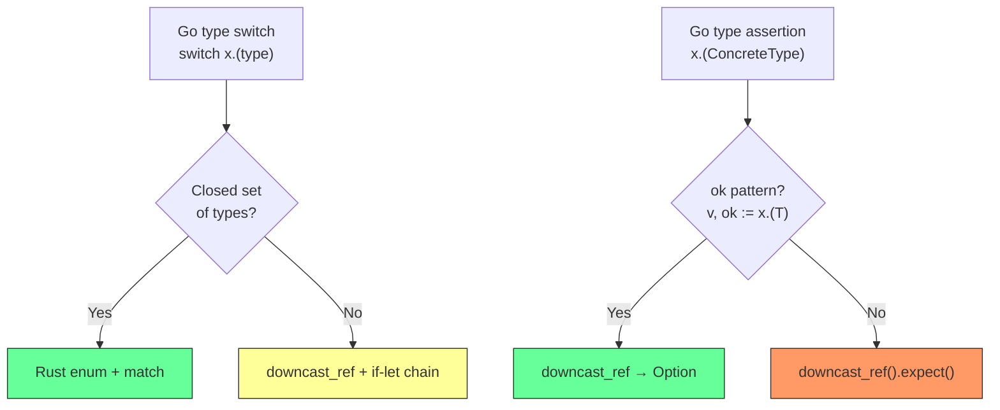

# Porting Friction — Type System Friction

> Part of the [Porting Friction Behavior Catalog](README.md).

## Implicit Interface Satisfaction

Go satisfies interfaces implicitly — any struct with the right method signature is automatically an implementor. Rust requires explicit `impl Trait for Type` blocks. cloudflared uses this extensively; every instance below requires explicit Rust trait implementation.

### io.Reader / io.Writer Implementations

These types implicitly satisfy `io.Reader` and/or `io.Writer` without declaring the interface:

| Go type                     | Satisfied interface(s)             | Atom                                                                                | Rust equivalent                    |
| --------------------------- | ---------------------------------- | ----------------------------------------------------------------------------------- | ---------------------------------- |
| `StdinoutStream`            | `io.Reader`, `io.Writer`           | [../../atoms/carrier/carrier](../../../atoms/carrier/carrier.md)                       | `impl Read + Write`                |
| `resilientMultiWriter`      | `io.Writer`, `zerolog.LevelWriter` | [../../atoms/logger/create](../../../atoms/logger/create.md)                           | `impl Write` + custom `LevelWrite` |
| `consoleWriter`             | `io.Writer`                        | [../../atoms/logger/console](../../../atoms/logger/console.md)                         | `impl Write`                       |
| `GorillaConn`               | `io.Reader`, `io.Writer`           | [../../atoms/websocket/connection](../../../atoms/websocket/connection.md)             | `impl Read + Write`                |
| `Conn` (websocket)          | `io.Reader`, `io.Writer`           | [../../atoms/websocket/connection](../../../atoms/websocket/connection.md)             | `impl Read + Write`                |
| `DebugStream`               | `io.Reader`, `io.Writer`           | [../../atoms/stream/debug](../../../atoms/stream/debug.md)                             | `impl Read + Write`                |
| `SafeStreamCloser`          | `io.Reader`, `io.Writer`           | [../../atoms/quic/safe_stream](../../../atoms/quic/safe_stream.md)                     | `impl Read + Write`                |
| `http2RespWriter`           | `io.Reader`, `io.Writer`           | [../../atoms/connection/http2](../../../atoms/connection/http2.md)                     | `impl Read + Write`                |
| `httpResponseAdapter`       | `io.Writer`                        | [../../atoms/connection/quic_connection](../../../atoms/connection/quic_connection.md) | `impl Write`                       |
| `nopCloserReadWriter`       | `io.Reader` (override)             | [../../atoms/connection/quic_connection](../../../atoms/connection/quic_connection.md) | `impl Read`                        |
| `NopReadCloser`             | `io.Reader`, `io.Closer`           | [../../atoms/ingress/origin_service](../../../atoms/ingress/origin_service.md)         | `impl Read` (returns EOF)          |
| `Logger` (management)       | `io.Writer`, `zerolog.LevelWriter` | [../../atoms/management/logger](../../../atoms/management/logger.md)                   | `impl Write` + custom              |
| `NoAuthAuthenticator`       | `Authenticator`                    | [../../atoms/socks/authenticator](../../../atoms/socks/authenticator.md)               | `impl Authenticator`               |
| `UserPassAuthAuthenticator` | `Authenticator`                    | [../../atoms/socks/authenticator](../../../atoms/socks/authenticator.md)               | `impl Authenticator`               |
| `Identity`                  | `encoding.BinaryMarshaler`         | [../../atoms/tracing/identity](../../../atoms/tracing/identity.md)                     | `impl Serialize`                   |

### io.ReadWriteCloser Consumers

Functions that accept `io.ReadWriteCloser` form a polymorphic boundary harder to translate than simple `Read`/`Write`:

| Function / consumer                                       | Atom                                                                                                                                                                                                                                                                                                                                                                                       | Friction                                |
| --------------------------------------------------------- | ------------------------------------------------------------------------------------------------------------------------------------------------------------------------------------------------------------------------------------------------------------------------------------------------------------------------------------------------------------------------------------------ | --------------------------------------- |
| `SafeTransport(rw io.ReadWriteCloser)`                    | [../../atoms/tunnelrpc/utils](../../../atoms/tunnelrpc/utils.md)                                                                                                                                                                                                                                                                                                                              | Requires `Box<dyn Read + Write + Send>` |
| `RegistrationServer.Serve(stream io.ReadWriteCloser)`     | [../../atoms/tunnelrpc/registration_server](../../../atoms/tunnelrpc/registration_server.md)                                                                                                                                                                                                                                                                                                  | Trait object parameter                  |
| `NewRegistrationClient(stream io.ReadWriteCloser)`        | [../../atoms/tunnelrpc/registration_client](../../../atoms/tunnelrpc/registration_client.md)                                                                                                                                                                                                                                                                                                  | Constructor takes trait object          |
| `manager.RegisterSession(originProxy io.ReadWriteCloser)` | [../../atoms/datagramsession/manager](../../../atoms/datagramsession/manager.md)                                                                                                                                                                                                                                                                                                              | Session origin is trait object          |
| `NewSession(origin io.ReadWriteCloser)`                   | [../../atoms/quic/v3/session](../../../atoms/quic/v3/session.md)                                                                                                                                                                                                                                                                                                                              | QUIC v3 session origin                  |
| `controlStream.ServeControlStream(rw io.ReadWriteCloser)` | [../../atoms/connection/control](../../../atoms/connection/control.md)                                                                                                                                                                                                                                                                                                                        | Control plane stream                    |
| All `tunnelrpc/quic` server/client constructors           | [../../atoms/tunnelrpc/quic/cloudflared_client](../../../atoms/tunnelrpc/quic/cloudflared_client.md), [../../atoms/tunnelrpc/quic/cloudflared_server](../../../atoms/tunnelrpc/quic/cloudflared_server.md), [../../atoms/tunnelrpc/quic/session_client](../../../atoms/tunnelrpc/quic/session_client.md), [../../atoms/tunnelrpc/quic/session_server](../../../atoms/tunnelrpc/quic/session_server.md) | 4 × trait-object constructor            |

### Domain-Specific Interfaces

Go's implicit satisfaction is most painful for cloudflared's custom domain interfaces, where multiple unrelated types satisfy the same interface:

| Go interface                                   | Satisfying types                                                                                                                                                          | Atom(s)                                                                                                                                              | Rust strategy                               |
| ---------------------------------------------- | ------------------------------------------------------------------------------------------------------------------------------------------------------------------------- | ---------------------------------------------------------------------------------------------------------------------------------------------------- | ------------------------------------------- |
| `OriginService`                                | `unixSocketPath`, `httpService`, `rawTCPService`, `tcpOverWSService`, `socksProxyOverWSService`, `helloWorld`, `statusCode`, `ManagementService`, `MockOriginHTTPService` | [../../atoms/ingress/origin_service](../../../atoms/ingress/origin_service.md)                                                                          | `enum OriginService` or `dyn OriginService` |
| `HTTPOriginProxy` (embeds `http.RoundTripper`) | `unixSocketPath`, `httpService`, `statusCode`                                                                                                                             | [../../atoms/ingress/origin_proxy](../../../atoms/ingress/origin_proxy.md)                                                                              | `impl HttpOriginProxy`                      |
| `StreamBasedOriginProxy`                       | `rawTCPService`, `tcpOverWSService`, `socksProxyOverWSService`                                                                                                            | [../../atoms/ingress/origin_proxy](../../../atoms/ingress/origin_proxy.md)                                                                              | `impl StreamOriginProxy`                    |
| `HTTPLocalProxy` (embeds `http.Handler`)       | `ManagementService`                                                                                                                                                       | [../../atoms/ingress/origin_proxy](../../../atoms/ingress/origin_proxy.md)                                                                              | `impl HttpLocalProxy`                       |
| `EventSink`                                    | `tunnelstate.ConnTracker` (and test mocks)                                                                                                                                | [../../atoms/connection/observer](../../../atoms/connection/observer.md), [../../atoms/tunnelstate/conntracker](../../../atoms/tunnelstate/conntracker.md) | `impl EventSink`                            |
| `EdgeAddrHandler`                              | `ipAddrFallback`                                                                                                                                                          | [../../atoms/supervisor/tunnel](../../../atoms/supervisor/tunnel.md)                                                                                    | `impl EdgeAddrHandler`                      |
| `ControlStreamHandler`                         | `controlStream`                                                                                                                                                           | [../../atoms/connection/control](../../../atoms/connection/control.md)                                                                                  | `impl ControlStreamHandler`                 |
| `Orchestrator` (interface)                     | `orchestration.Orchestrator`                                                                                                                                              | [../../atoms/orchestration/orchestrator](../../../atoms/orchestration/orchestrator.md)                                                                  | `impl Orchestrator`                         |
| `ICMPRouterServer`                             | `icmpProxy` (per-platform)                                                                                                                                                | [../../atoms/ingress/origin_icmp_proxy](../../../atoms/ingress/origin_icmp_proxy.md)                                                                    | `impl IcmpRouter`                           |
| `Dialer` (socks)                               | `NetDialer`, `ConnDialer`                                                                                                                                                 | [../../atoms/socks/dialer](../../../atoms/socks/dialer.md)                                                                                              | `impl SocksDialer`                          |
| `packet.Funnel`                                | `icmpEchoFlow`, `Session` (v3)                                                                                                                                            | [../../atoms/packet/funnel](../../../atoms/packet/funnel.md), [../../atoms/quic/v3/session](../../../atoms/quic/v3/session.md)                             | `impl Funnel`                               |

### Porting Guidance — Implicit Interfaces

The Rust port must decide between two strategies for each interface:

1. **Trait objects** (`Box<dyn Trait>` / `&dyn Trait`) — preserves runtime polymorphism, matches Go's interface semantics most closely. Best for `io.ReadWriteCloser` boundaries and `OriginService`.
2. **Enum dispatch** — more idiomatic Rust, enables exhaustive matching, avoids vtable overhead. Best for `OriginService` (closed set of 9 variants) and `EdgeAddrHandler` (single implementor).

Rule of thumb: if the Go interface has a **closed, known set of implementors**, use an enum. If it's **open for extension** (especially across crate boundaries), use a trait object.

## Type Switches and Assertions

Go's `switch v := x.(type)` enables runtime type dispatch. Rust uses `match` on enums or `downcast`.

### Type Switch Inventory

| Location              | Switch target                                 | Cases                                                                                                                                                   | Atom                                                                                |
| --------------------- | --------------------------------------------- | ------------------------------------------------------------------------------------------------------------------------------------------------------- | ----------------------------------------------------------------------------------- |
| `ShouldGetNewAddress` | `err.(type)`                                  | `nil`, `DupConnRegisterTunnelError`, `*quic.IdleTimeoutError`, `DialError`, `*EdgeQuicDialError`, default                                               | [../../atoms/supervisor/tunnel](../../../atoms/supervisor/tunnel.md)                   |
| `serveConnection`     | `protocol` (then error type switch on return) | `QUIC`, `HTTP2`, default; then `*ServerRegisterTunnelError`, `*EdgeQuicDialError`, `ReconnectSignal`, `context.Canceled`, `unrecoverableError`, default | [../../atoms/supervisor/tunnel](../../../atoms/supervisor/tunnel.md)                   |
| `dispatchRequest`     | `request.Type`                                | `ConnectionTypeHTTP`, `ConnectionTypeWebsocket`, `ConnectionTypeTCP`, default                                                                           | [../../atoms/connection/quic_connection](../../../atoms/connection/quic_connection.md) |
| `newHTTPTransport`    | `service.(type)`                              | `*unixSocketPath`, default                                                                                                                              | [../../atoms/ingress/origin_service](../../../atoms/ingress/origin_service.md)         |
| `isQuicBroken`        | `errors.As` chains                            | `*IdleTimeoutError`, `*TransportError`, `*EdgeQuicDialError`                                                                                            | [../../atoms/supervisor/tunnel](../../../atoms/supervisor/tunnel.md)                   |

### Porting Strategy — Type Switches

Key friction: Go's error type switch in `ShouldGetNewAddress` dispatches on `err.(type)` across 5 concrete error types from different packages. In Rust, this requires either a unified error enum (preferred) or `downcast_ref` chains (fragile). The `errors.As` pattern in `isQuicBroken` similarly requires Rust's `downcast` or pattern matching on a flattened error enum.

## Struct Embedding and Method Promotion

Go's anonymous struct fields ("embedding") promote methods from the embedded type to the outer type. Rust has no equivalent — delegation must be explicit.

### Embedding Inventory

| Outer type             | Embedded type                              | Promoted methods                                                   | Atom                                                                                |
| ---------------------- | ------------------------------------------ | ------------------------------------------------------------------ | ----------------------------------------------------------------------------------- |
| `helloWorld`           | `httpService`                              | `RoundTrip()`, `String()`                                          | [../../atoms/ingress/origin_service](../../../atoms/ingress/origin_service.md)         |
| `ManagementService`    | `HTTPLocalProxy` (interface)               | `ServeHTTP()`                                                      | [../../atoms/ingress/origin_service](../../../atoms/ingress/origin_service.md)         |
| `WarpRoutingService`   | `StreamBasedOriginProxy` (interface field) | `EstablishConnection()`                                            | [../../atoms/ingress/origin_service](../../../atoms/ingress/origin_service.md)         |
| `TracedHTTPRequest`    | `*http.Request` + `*cfdTracer`             | All `http.Request` methods + tracer methods                        | [../../atoms/tracing/tracing](../../../atoms/tracing/tracing.md)                       |
| `TracedContext`        | `context.Context` + `*cfdTracer`           | All context methods + tracer methods                               | [../../atoms/tracing/tracing](../../../atoms/tracing/tracing.md)                       |
| `streamReadWriteAcker` | `*RequestServerStream`                     | `ReadConnectRequestData()`, `WriteConnectResponseData()`, etc.     | [../../atoms/connection/quic_connection](../../../atoms/connection/quic_connection.md) |
| `httpResponseAdapter`  | `*RequestServerStream`                     | Stream read/write methods                                          | [../../atoms/connection/quic_connection](../../../atoms/connection/quic_connection.md) |
| `protocolFallback`     | `retry.BackoffHandler`                     | `Backoff()`, `BackoffTimer()`, `ReachedMaxRetries()`, `ResetNow()` | [../../atoms/supervisor/tunnel](../../../atoms/supervisor/tunnel.md)                   |
| `connectedFuse`        | `*booleanFuse` + `*protocolFallback`       | Fuse and backoff methods                                           | [../../atoms/supervisor/tunnel](../../../atoms/supervisor/tunnel.md)                   |

### Porting Strategy — Embedding

Rust options for each embedding pattern:

| Go pattern                                                            | Rust option 1                                                                   | Rust option 2                                               |
| --------------------------------------------------------------------- | ------------------------------------------------------------------------------- | ----------------------------------------------------------- |
| Struct embeds struct                                                  | Store as field + manual delegation (`fn method(&self) { self.inner.method() }`) | Use `Deref` impl (anti-pattern for non-smart-pointer types) |
| Struct embeds interface                                               | Store as field: `inner: Box<dyn Trait>` + delegate                              | Use trait composition: `trait Combined: TraitA + TraitB`    |
| Double embedding (`TracedHTTPRequest` embeds `Request` + `cfdTracer`) | Struct with two fields + implement both traits                                  | Newtype pattern with `AsRef`                                |

Key friction: Go's embedding is zero-cost method promotion. Rust delegation requires boilerplate for every promoted method. The `ambassador` crate can auto-generate delegation, or use proc macros, but there's no language-level equivalent.

## Nil Semantics

Go's nil has different behavior depending on whether it's a nil interface or a nil concrete pointer. Rust replaces all nil handling with `Option<T>`.

### Nil Friction Points

| Go pattern                      | Example                                                                  | Atom(s)                                                                                              | Rust friction                                                                                            |
| ------------------------------- | ------------------------------------------------------------------------ | ---------------------------------------------------------------------------------------------------- | -------------------------------------------------------------------------------------------------------- |
| **Nil interface ≠ nil pointer** | Function returns `(nil, nil)` when both value and error are absent       | Throughout codebase                                                                                  | `Option<T>` makes this explicit; no ambiguity. But requires careful translation of `if x == nil` checks. |
| **Zero-value usability**        | `sync.Mutex{}` is ready to use; `sync.Once{}` is ready to use            | [../../atoms/supervisor/tunnel](../../../atoms/supervisor/tunnel.md)                                    | `Mutex::new(T)` requires explicit value; `Once::new()` works similarly. Low friction.                    |
| **Nil receiver methods**        | Go allows calling methods on nil pointers (method just sees nil `self`)  | Possible in Go but not observed in cloudflared as deliberate pattern                                 | N/A in Rust — `&self` can never be null.                                                                 |
| **Nil channel semantics**       | Send/receive on nil channel blocks forever; used to disable select cases | [../../atoms/connection/observer](../../../atoms/connection/observer.md)                                | No equivalent in Rust. Use `Option<Receiver>` with conditional select branches.                          |
| **Nil function values**         | Callbacks stored as `func(...)` can be nil                               | [../../atoms/connection/quic_connection](../../../atoms/connection/quic_connection.md) (DialTLSContext) | `Option<Box<dyn Fn(...)>>`                                                                               |
| **Interface nil check**         | `if proxy == nil` checks boxed interface                                 | [../../atoms/orchestration/orchestrator](../../../atoms/orchestration/orchestrator.md)                  | `Option<Box<dyn OriginProxy>>`                                                                           |

## []byte / String Conversion

Go's `[]byte` and `string` are distinct types with implicit O(n) conversion. Rust's `&[u8]` / `Vec<u8>` vs `&str` / `String` have explicit conversion semantics.

### []byte Parameter Density

Over 150 function signatures in cloudflared use `[]byte` parameters. High-density packages:

| Package                             | `[]byte` parameter count |                                                                                                                                                        Atoms |
| ----------------------------------- | ------------------------ | -----------------------------------------------------------------------------------------------------------------------------------------------------------: |
| `quic/datagramv2` + `quic/datagram` | 15+                      |                                     [../../atoms/quic/datagramv2](../../../atoms/quic/datagramv2.md), [../../atoms/quic/datagram](../../../atoms/quic/datagram.md) |
| `connection` (QUIC + HTTP/2)        | 12+                      |         [../../atoms/connection/quic_connection](../../../atoms/connection/quic_connection.md), [../../atoms/connection/http2](../../../atoms/connection/http2.md) |
| `packet`                            | 8+                       |                                       [../../atoms/packet/packet](../../../atoms/packet/packet.md), [../../atoms/packet/decoder](../../../atoms/packet/decoder.md) |
| `credentials`                       | 6+                       |                                                                                [../../atoms/credentials/origin_cert](../../../atoms/credentials/origin_cert.md) |
| `management`                        | 6+                       |                         [../../atoms/management/events](../../../atoms/management/events.md), [../../atoms/management/logger](../../../atoms/management/logger.md) |
| `orchestration`                     | 3+                       | [../../atoms/orchestration/orchestrator](../../../atoms/orchestration/orchestrator.md), [../../atoms/orchestration/config](../../../atoms/orchestration/config.md) |
| `tracing`                           | 3+                       |                               [../../atoms/tracing/tracing](../../../atoms/tracing/tracing.md), [../../atoms/tracing/identity](../../../atoms/tracing/identity.md) |

### Conversion Friction

| Go pattern                                    | Rust equivalent                                                    | Friction                                     |
| --------------------------------------------- | ------------------------------------------------------------------ | -------------------------------------------- |
| `string(byteSlice)` (copies)                  | `String::from_utf8(vec)?` (validates + moves) or `from_utf8_lossy` | **Medium** — Rust enforces UTF-8 validity    |
| `[]byte(str)` (copies)                        | `s.as_bytes()` (borrow, zero-copy) or `s.into_bytes()` (move)      | **Low** — Rust is better here                |
| `json.Marshal(v)` → `[]byte`                  | `serde_json::to_vec(&v)?` → `Vec<u8>`                              | **Low** — direct mapping                     |
| `json.Unmarshal(data, &v)`                    | `serde_json::from_slice::<T>(data)?`                               | **Low** — direct mapping                     |
| `io.Reader`/`io.Writer` with `[]byte` buffers | `Read`/`Write` with `&[u8]`/`&mut [u8]`                            | **Low** — Rust's traits are nearly identical |

### interface{}/any Parameters

Go's `interface{}` (aliased as `any` in Go 1.18+) allows passing arbitrary types:

| Function                                                  | Parameter              | Atom                                                                                                | Rust strategy                 |
| --------------------------------------------------------- | ---------------------- | --------------------------------------------------------------------------------------------------- | ----------------------------- |
| `renderOutput(format string, v interface{})`              | `v interface{}`        | [../../atoms/cmd/cloudflared/tunnel/subcommands](../../../atoms/cmd/cloudflared/tunnel/subcommands.md) | Generic `T: Serialize`        |
| `sendRequest(method, url, body interface{})`              | `body interface{}`     | [../../atoms/cfapi/base_client](../../../atoms/cfapi/base_client.md)                                   | Generic `T: Serialize`        |
| `parseResponse(reader, data interface{})`                 | `data interface{}`     | [../../atoms/cfapi/base_client](../../../atoms/cfapi/base_client.md)                                   | Generic `T: DeserializeOwned` |
| `MarshalYAML() (interface{}, error)`                      | Return type            | [../../atoms/config/configuration](../../../atoms/config/configuration.md)                             | `impl Serialize`              |
| `UnmarshalYAML(func(interface{}) error)`                  | Callback param         | [../../atoms/config/configuration](../../../atoms/config/configuration.md)                             | Serde `Deserialize` derive    |
| `noopCapnpLogger.Infof(ctx, format, args ...interface{})` | Variadic `interface{}` | [../../atoms/tunnelrpc/utils](../../../atoms/tunnelrpc/utils.md)                                       | `tracing::info!()` macro      |
