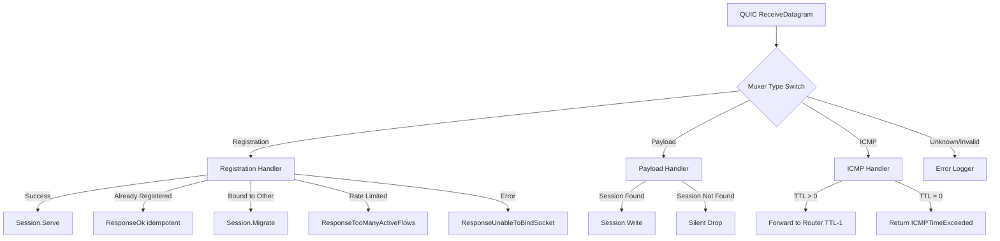

# Tests — Session & Packet Layer Contracts

- Parent: [tests](tests.md)
- Baseline reference: [cloudflare/cloudflared/tree/2026.3.0](https://github.com/cloudflare/cloudflared/tree/2026.3.0)

## Scope

This sub-catalog documents behavioral contracts encoded in QUIC v3 datagram handling, session lifecycle, datagram muxer, session manager, legacy datagram sessions (v1/v2), packet encoding/decoding, flow limiting, and stream handling tests.

Packages covered: `quic/v3`, `datagramsession`, `packet`, `flow`, `stream`.

---

## quic/v3/datagram\_test.go

Source: [quic/v3/datagram\_test.go](https://github.com/cloudflare/cloudflared/blob/2026.3.0/quic/v3/datagram_test.go)

### Contracts

| Test | Behavioral Contract |
|---|---|
| `TestSessionRegistration_MarshalUnmarshal` | 8 cases: IPv4/IPv6/traced/max-values/payloads round-trip through marshal/unmarshal |
| `TestSessionRegistration_MarshalBinary` | Idle hint overflow detection |
| `TestTypeUnmarshalErrors` | Invalid length and invalid types rejected for all 4 datagram types |
| `TestSessionPayload` | Basic, empty, header-too-small, payload-too-small, and too-large payloads handled correctly |
| `TestSessionRegistrationResponse` | All valid response types, unsupported type, too-small, error-message-too-long, error-message-too-large |
| `TestICMPDatagram` | Basic, empty, and too-large ICMP datagrams |
| `FuzzRegistrationDatagram` | Fuzz: arbitrary bytes → no panic on registration datagram unmarshal |
| `FuzzPayloadDatagram` | Fuzz: arbitrary bytes → no panic on payload datagram unmarshal |
| `FuzzRegistrationResponseDatagram` | Fuzz: arbitrary bytes → no panic on registration response unmarshal |
| `FuzzICMPDatagram` | Fuzz: arbitrary bytes → no panic on ICMP datagram unmarshal |

### Key Behavioral Details

**Four datagram types**: The QUIC v3 wire protocol carries four distinct datagram types:

1. **UDPSessionRegistrationDatagram** — Carries RequestID, destination address, idle hint, trace context
2. **UDPSessionPayloadDatagram** — Carries RequestID + arbitrary payload bytes
3. **UDPSessionRegistrationResponseDatagram** — Carries RequestID, response type, optional error message
4. **ICMPDatagram** — Carries raw ICMP packet payload

**Fuzz coverage**: All four datagram types have dedicated fuzz targets ensuring that arbitrary byte sequences never cause panics. This is important for the Rust port — Rust's `#[test]` with `proptest` or `cargo fuzz` should cover the same space.

**Registration datagram encoding**:

| Field | Size | Details |
|---|---|---|
| Type byte | 1 | `UDPSessionRegistrationType` |
| RequestID | 16 | 128-bit identifier |
| Destination | 6 (IPv4) or 18 (IPv6) | Address + port |
| IdleHint | 8 | Duration in nanoseconds (max 2^64-1) |
| Trace context | variable | Optional, only when traced |

### Atom Links

- [quic/v3/datagram](../../atoms/quic/v3/datagram.md)

---

## quic/v3/session\_test.go

Source: [quic/v3/session\_test.go](https://github.com/cloudflare/cloudflared/blob/2026.3.0/quic/v3/session_test.go)

### Contracts

| Test | Behavioral Contract |
|---|---|
| `TestSessionNew` | Session construction initializes all fields correctly |
| `TestSessionWrite` | 1280 iterations × 16 payloads each — session writes payload to origin correctly |
| `TestSessionRead` | 1280 iterations × 16 payloads — session reads payload from origin, wraps in datagram format, sends to eyeball |
| `TestSessionRead_OriginTooLarge` | Oversized origin responses are dropped silently |
| `TestSessionServe_Migrate` | Eyeball migration: session moves from connection 0 to connection 1 |
| `TestSessionServe_Migrate_CloseContext2` | Second context cancellation after migration is handled |
| `TestSessionClose_Multiple` | Idempotent close — closing twice does not panic |
| `TestSessionServe_IdleTimeout` | Session closes after idle timeout expires |
| `TestSessionServe_ParentContextCanceled` | Parent context cancellation propagates to session close |
| `TestSessionServe_ReadErrors` | Origin read errors cause session to close with appropriate error |

### Key Behavioral Details

**High-iteration throughput tests**: `TestSessionWrite` and `TestSessionRead` each perform 1280 × 16 = 20,480 operations. This validates that the session's read/write paths handle sustained throughput without resource leaks. Every test uses `leaktest.Check(t)()` to verify goroutine cleanup.

**Session migration**: A session established on connection 0 can migrate to connection 1. The test validates:

1. Registration response is sent to connection 0
2. `Migrate()` called on the session with connection 1
3. The session's datagram writer switches to connection 1
4. Connection 0's context can be cancelled without affecting the migrated session

**Idle timeout**: The session's idle timer starts when no data flows. When the timeout expires, the session closes with `SessionIdleErr`. Activity (read or write) resets the timer.

### Atom Links

- [quic/v3/session](../../atoms/quic/v3/session.md)

---

## quic/v3/session\_fuzz\_test.go

Source: [quic/v3/session\_fuzz\_test.go](https://github.com/cloudflare/cloudflared/blob/2026.3.0/quic/v3/session_fuzz_test.go)

Contains additional fuzz targets for session-related datagram parsing.

### Atom Links

- [quic/v3/session](../../atoms/quic/v3/session.md)

---

## quic/v3/muxer\_test.go

Source: [quic/v3/muxer\_test.go](https://github.com/cloudflare/cloudflared/blob/2026.3.0/quic/v3/muxer_test.go)

### Contracts

| Test | Behavioral Contract |
|---|---|
| `TestDatagramConn_New` | DatagramConn construction with session manager, ICMP router, metrics |
| `TestDatagramConn_SendUDPSessionDatagram` | Datagram sent via conn reaches the QUIC connection |
| `TestDatagramConn_SendUDPSessionResponse` | Registration response reaches the QUIC connection with correct fields |
| `TestDatagramConnServe_ApplicationClosed` | Context timeout closes the muxer cleanly |
| `TestDatagramConnServe_ConnectionClosed` | QUIC connection context cancellation closes the muxer |
| `TestDatagramConnServe_ReceiveDatagramError` | `net.ErrClosed` from QUIC propagates to muxer close |
| `TestDatagramConnServe_SessionRegistrationRateLimit` | Rate-limited registration returns `ResponseTooManyActiveFlows` |
| `TestDatagramConnServe_ErrorDatagramTypes` | Empty, unexpected, and unknown datagram types are logged and dropped |
| `TestDatagramConnServe_RegisterSession_SessionManagerError` | Registration failure returns `ResponseUnableToBindSocket` |
| `TestDatagramConnServe` | Full flow: register session → session served → clean shutdown |
| `TestDatagramConnServeDecodeMultipleICMPInParallel` | 100 ICMP packets decoded in parallel — no interference between decoders |
| `TestDatagramConnServe_RegisterTwice` | Already-registered session returns `ResponseOk` (idempotent) |
| `TestDatagramConnServe_MigrateConnection` | Session migrates from connection 0 to connection 1 via registration on new conn |
| `TestDatagramConnServe_Payload_GetSessionError` | Payload for unknown session is silently discarded |
| `TestDatagramConnServe_Payloads` | 256 × 16 payloads delivered in-order to session |
| `TestDatagramConnServe_ICMPDatagram_TTLDecremented` | ICMP packet TTL decremented by 1 before forwarding to origin |
| `TestDatagramConnServe_ICMPDatagram_TTLExceeded` | TTL=0 ICMP packet returns Time Exceeded to eyeball |

### Key Behavioral Details

**Muxer as central dispatcher**: The DatagramConn (`muxer`) is the central component of quic/v3. It reads datagrams from the QUIC connection, discriminates by type (registration, payload, ICMP), and dispatches to the appropriate handler. The tests comprehensively cover the dispatch matrix:

**Parallel ICMP decoding**: The test `TestDatagramConnServeDecodeMultipleICMPInParallel` sends 100 ICMP packets simultaneously. It validates that the decoder instances do not interfere with each other — a regression test for a bug where parallel decoding with shared state caused packet corruption.

**In-order payload delivery**: 256 × 16 = 4096 payloads are sent and received in-order to a session. The test validates sequential delivery fidelity.

### Mock Types

| Type | Purpose |
|---|---|
| `noopEyeball` | No-op DatagramConn for construction tests |
| `mockEyeball` | Channels for capturing sent datagrams and responses |
| `mockQuicConn` | Channels for send/receive datagram simulation |
| `mockQuicConnReadError` | Returns configurable error on ReceiveDatagram |
| `mockSessionManager` | Configurable register/get/unregister with preset errors |
| `mockSession` | Channels: `served`, `migrated`, `recv` for session lifecycle |
| `LockedBuffer` | Thread-safe `bytes.Buffer` for log output capture |

### Atom Links

- [quic/v3/muxer](../../atoms/quic/v3/muxer.md)

---

## quic/v3/manager\_test.go

Source: [quic/v3/manager\_test.go](https://github.com/cloudflare/cloudflared/blob/2026.3.0/quic/v3/manager_test.go)

### Contracts

| Test | Behavioral Contract |
|---|---|
| `TestRegisterSession` | Register → retrieve → duplicate returns `ErrSessionAlreadyRegistered` → cross-conn duplicate returns `ErrSessionBoundToOtherConn` → unregister succeeds |
| `TestGetSession_Empty` | Empty manager returns `ErrSessionNotFound` |
| `TestRegisterSessionRateLimit` | Flow limiter `ErrTooManyActiveFlows` → returns `ErrSessionRegistrationRateLimited` |

### Key Behavioral Details

**Registration error taxonomy**:

| Error | Condition |
|---|---|
| `ErrSessionAlreadyRegistered` | Same RequestID re-registered on same connection |
| `ErrSessionBoundToOtherConn` | Same RequestID registered on different connection |
| `ErrSessionNotFound` | GetSession for unknown RequestID |
| `ErrSessionRegistrationRateLimited` | Flow limiter rejects |

### Atom Links

- [quic/v3/manager](../../atoms/quic/v3/manager.md)

---

## quic/v3/request\_test.go

Source: [quic/v3/request\_test.go](https://github.com/cloudflare/cloudflared/blob/2026.3.0/quic/v3/request_test.go)

### Contracts

| Test | Behavioral Contract |
|---|---|
| `TestRequestIDParsing` | Random 16-byte slice round-trips through `RequestIDFromSlice` → `MarshalBinaryTo` |
| `TestRequestID_MarshalBinary` | `MarshalBinaryTo` + `UnmarshalBinary` round-trips to same `RequestID` |

### Atom Links

- [quic/v3/request](../../atoms/quic/v3/request.md)

---

## quic/v3/icmp\_test.go & metrics\_test.go

Sources:

- [quic/v3/icmp\_test.go](https://github.com/cloudflare/cloudflared/blob/2026.3.0/quic/v3/icmp_test.go) — Mock types: `noopICMPRouter`, `mockICMPRouter`
- [quic/v3/metrics\_test.go](https://github.com/cloudflare/cloudflared/blob/2026.3.0/quic/v3/metrics_test.go) — Mock type: `noopMetrics` (reveals 9-method metrics interface)

Test-only infrastructure files shared across the v3 package tests.

### Atom Links

- [quic/v3/icmp](../../atoms/quic/v3/icmp.md)
- [quic/v3/metrics](../../atoms/quic/v3/metrics.md)

---

## datagramsession/session\_test.go

Source: [datagramsession/session\_test.go](https://github.com/cloudflare/cloudflared/blob/2026.3.0/datagramsession/session_test.go)

### Contracts

| Test | Behavioral Contract |
|---|---|
| `TestSessionCtxDone` | Session stops after context cancellation |
| `TestCloseSession` | Session stops after `close()` method called |
| `TestCloseIdle` | Session stops after idle timeout (100ms) with no read/write |
| `TestWriteToDstSessionPreventClosed` | Active writes prevent idle timeout closure |
| `TestReadFromDstSessionPreventClosed` | Active reads prevent idle timeout closure |
| `TestMarkActiveNotBlocking` | 50 concurrent `markActive()` calls do not block |
| `TestZeroBytePayload` | Zero-length payload is handled without error (some UDP apps send 0-size) |

### Key Behavioral Details

**Three session close paths**: The shared `testSessionReturns` helper tests:

| Close Method | closedByRemote | Error |
|---|---|---|
| Context cancellation | `false` | `context.Canceled` |
| Explicit `close()` | `false` | `errClosedSession` |
| Idle timeout | `false` | `SessionIdleErr(duration)` |

**Idle timeout prevention**: Both read (`TestReadFromDstSessionPreventClosed`) and write (`TestWriteToDstSessionPreventClosed`) activity reset the idle timer. The test runs activity for 500ms with a 100ms idle timeout — the session stays alive as long as data flows.

**Zero-byte payload**: This validates an important edge case — some UDP protocols send empty datagrams. The session must relay them without error.

### Atom Links

- [datagramsession/session](../../atoms/datagramsession/session.md)

---

## datagramsession/manager\_test.go

Source: [datagramsession/manager\_test.go](https://github.com/cloudflare/cloudflared/blob/2026.3.0/datagramsession/manager_test.go)

### Contracts

| Test | Behavioral Contract |
|---|---|
| `TestManagerServe` | Full integration: manager registers sessions, bidirectionally relays messages, cleanly unregisters with remote-close reporting |
| `TestTimeout` | Operations timeout with `context.DeadlineExceeded` when event loop not running |
| `TestUnregisterSessionCloseSession` | Unregistering while serving causes `closedByRemote=true` |
| `TestManagerCtxDoneCloseSessions` | Context cancellation causes `closedByRemote=false` |

### Mock Types

| Type | Purpose |
|---|---|
| `mockOrigin` | Read-echo loop validating expected payloads |
| `mockQUICTransport` | Maps session IDs to payload channels |
| `mockEyeballSession` | Sends N packets, receives N responses |

### Atom Links

- [datagramsession/manager](../../atoms/datagramsession/manager.md)

---

## packet/packet\_test.go

Source: [packet/packet\_test.go](https://github.com/cloudflare/cloudflared/blob/2026.3.0/packet/packet_test.go)

### Contracts

| Test | Behavioral Contract |
|---|---|
| `TestNewICMPTTLExceedPacket` | TTL-exceeded ICMP packet: router IP as src, original src as dst, DefaultTTL, truncation at MTU, round-trip encode→decode |
| `TestChecksum` | ICMPv6 echo encodes with correct checksum value (`0xff96`) |

### Key Behavioral Details

**MTU truncation**: When the original ICMP packet exceeds the minimum MTU, the TTL-exceeded response includes only the first MTU bytes of the original packet as the ICMP error payload. The test validates this truncation for both IPv4 (576 bytes) and IPv6 (1280 bytes) minimum MTU values.

### Atom Links

- [packet/packet](../../atoms/packet/packet.md)

---

## packet/decoder\_test.go

Source: [packet/decoder\_test.go](https://github.com/cloudflare/cloudflared/blob/2026.3.0/packet/decoder_test.go)

### Contracts

| Test | Behavioral Contract |
|---|---|
| `TestDecodeIP` | IP decoder decodes IPv4 and IPv6 UDP packets; ICMP decoder rejects them |
| `TestDecodeICMP` | ICMP decoder handles ICMPv4 time-exceeded, ICMPv4 echo, ICMPv6 dest-unreachable, ICMPv6 echo; validates checksum |
| `TestDecodeBadPackets` | Both decoders reject wrong IP version, non-packet bytes, zero-length input |
| `FuzzIPDecoder` | Fuzz: arbitrary bytes → no panic on IP decoder |
| `FuzzICMPDecoder` | Fuzz: arbitrary bytes → no panic on ICMP decoder |

### Mock Types

| Type | Purpose |
|---|---|
| `UDP` struct | Test-only type with `SrcPort`/`DstPort` + `EncodeLayers()` |

### Atom Links

- [packet/decoder](../../atoms/packet/decoder.md)

---

## packet/funnel\_test.go

Source: [packet/funnel\_test.go](https://github.com/cloudflare/cloudflared/blob/2026.3.0/packet/funnel_test.go)

### Contracts

| Test | Behavioral Contract |
|---|---|
| `TestFunnelRegistration` | `GetOrRegister` creates new funnels, returns existing on no-replace, replaces and closes old on replace, propagates factory errors |
| `TestFunnelUnregister` | `Unregister` closes and removes funnels; unregistering replaced funnel returns false; unregistering current funnel returns true |

### Mock Types

| Type | Purpose |
|---|---|
| `mockFunnelUniPipe` | Channel-based unidirectional pipe |
| `testFunnelID` | Type/String identifier |
| `testFunnel` | Close/Equal/LastActive/UpdateLastActive with `closed` flag |

### Atom Links

- [packet/funnel](../../atoms/packet/funnel.md)

---

## flow/limiter\_test.go

Source: [flow/limiter\_test.go](https://github.com/cloudflare/cloudflared/blob/2026.3.0/flow/limiter_test.go)

### Contracts

| Test | Behavioral Contract |
|---|---|
| `TestFlowLimiter_Unlimited` | Limiter with limit=0 allows unlimited acquisitions |
| `TestFlowLimiter_Limited` | Limiter with limit=N rejects (N+1)th acquire with `ErrTooManyActiveFlows` |
| `TestFlowLimiter_AcquireAndReleaseFlow` | Release allows re-acquisition; over-release does not grant extra capacity |
| `TestFlowLimiter_SetLimit` | Dynamic limit changes via `SetLimit()` adjust capacity; switching to 0 enables unlimited |

### Key Behavioral Details

**Dynamic limit**: The flow limiter supports runtime limit changes. Increasing the limit allows new acquisitions; decreasing it causes previously-acquired flows that exceed the new limit to be gradually drained (existing flows are not force-closed). Setting limit to 0 disables limiting entirely.

**Over-release safety**: Releasing more times than acquired does not create "extra" capacity — the counter is clamped to the limit.

### Atom Links

- [flow/limiter](../../atoms/flow/limiter.md)

---

## stream/stream\_test.go

Source: [stream/stream\_test.go](https://github.com/cloudflare/cloudflared/blob/2026.3.0/stream/stream_test.go)

### Contracts

| Test | Behavioral Contract |
|---|---|
| `TestPipeBidirectionalFinishBothSides` | Closing both reader sides → clean exit |
| `TestPipeBidirectionalFinishOneSideTimeout` | Closing only one reader side → timeout error |
| `TestPipeBidirectionalClosingWriteBothSidesAlsoExists` | CloseWrite both sides + write to readers → clean exit |
| `TestPipeBidirectionalClosingWriteSingleSideAlsoExists` | CloseWrite one side only → timeout |

### Key Behavioral Details

**Bidirectional pipe semantics**: `PipeBidirectional` copies data between two streams until both sides close. The test validates that:

- Both readers closed → immediate exit
- Only one reader closed → waits for timeout
- Both writers close-written + data arrives → immediate exit
- Only one writer close-written → waits for timeout

This is critical for the Rust port's `tokio::io::copy_bidirectional` equivalent.

### Mock Types

| Type | Purpose |
|---|---|
| `mockedStream` | Channel-based `Read`/`Write`/`CloseWrite` with helpers |

### Atom Links

- [stream/stream](../../atoms/stream/stream.md)

---

## Contract Density Summary

| File | Tests | Benchmarks | Fuzz | Key Contracts |
|---|---|---|---|---|
| quic/v3/datagram\_test.go | 6 | 0 | 4 | Wire format for 4 datagram types, boundary detection |
| quic/v3/session\_test.go | 10 | 0 | 0 | 20K-operation throughput, migration, idle timeout |
| quic/v3/muxer\_test.go | 17 | 0 | 0 | Central dispatch matrix, parallel ICMP, in-order delivery |
| quic/v3/manager\_test.go | 3 | 0 | 0 | Registration error taxonomy, rate limiting |
| quic/v3/request\_test.go | 2 | 0 | 0 | RequestID serialization round-trip |
| datagramsession/session\_test.go | 7 | 0 | 0 | Three close paths, idle prevention, zero-byte payload |
| datagramsession/manager\_test.go | 4 | 0 | 0 | Bidirectional relay, remote-close reporting |
| packet/packet\_test.go | 2 | 0 | 0 | TTL-exceed construction, ICMPv6 checksum |
| packet/decoder\_test.go | 3 | 0 | 2 | IP/ICMP decode, bad-packet rejection |
| packet/funnel\_test.go | 2 | 0 | 0 | Registration, replacement, unregistration lifecycle |
| flow/limiter\_test.go | 4 | 0 | 0 | Dynamic limit, over-release safety |
| stream/stream\_test.go | 4 | 0 | 0 | Bidirectional pipe close semantics |
| **Total** | **~64** | **0** | **6** | |
