# Tests Behavior Catalog — Behavioral Contract Oracle Index

- Baseline date: 20260323
- Baseline reference: [cloudflare/cloudflared/tree/2026.3.0](https://github.com/cloudflare/cloudflared/tree/2026.3.0)
- Primary evidence set: 123 `_test.go` files across ~35 Go packages in cloudflared `2026.3.0`
- Role: behavioral contract oracle — mirrors and validates contracts documented in [domain catalogs](../../README.md), acting as the ground-truth source for the Rust port's acceptance criteria

## Scope

This catalog documents the complete upstream Go test suite as a behavioral contract oracle for the cloudflared Rust rewrite. Every test function encodes at least one behavioral invariant that the Rust port must preserve.

The catalog is organized into four sub-catalogs by architectural domain:

1. **[tests-transport](tests-transport.md)** — Connection layer, QUIC, HTTP/2, header serialization, protocol selection, datagram v2, tunnel RPC, and TLS configuration.
2. **[tests-proxy-ingress](tests-proxy-ingress.md)** — Proxy routing, ingress rule parsing, origin services, ICMP proxying, SOCKS5, carrier/WebSocket, orchestration, and supervisor.
3. **[tests-sessions-packets](tests-sessions-packets.md)** — QUIC v3 datagrams, session lifecycle, muxer, manager, datagram sessions (v1/v2), packet encoding/decoding, flow limiting, and stream handling.
4. **[tests-infrastructure](tests-infrastructure.md)** — Management service, diagnostics, edge discovery, cfapi, credentials, tokens, features, config, metrics, validation, logging, signals, file watching, overwatch, and hello-world.

## Test Suite Statistics

| Metric | Value |
| --- | --- |
| Total `_test.go` files | 123 |
| Estimated test functions | ~280 |
| Fuzz targets | 8 |
| Benchmarks | 3 |
| Packages with tests | ~35 |
| Test infrastructure files | 5 |

## Test Pattern Taxonomy

The upstream test suite employs a consistent set of testing patterns. Understanding these is critical for porting tests to Rust equivalents.

### Assertion Patterns

| Go Pattern | Rust Equivalent | Prevalence |
| --- | --- | --- |
| `testify/assert` (soft fail) | `assert!` / `assert_eq!` | ~90% of files |
| `testify/require` (hard fail) | `assert!` with early return | ~70% of files |
| stdlib `t.Fatal`/`t.Errorf` | `panic!` / `assert!` | ~15% of files |

### Structural Patterns

| Pattern | Description | Prevalence | Key Files |
| --- | --- | --- | --- |
| Table-driven tests | `[]struct` slice iterated with `t.Run` | ~65% of files | ingress, features, connection, cfapi |
| Fuzz testing | `func Fuzz*(f *testing.F)` with corpus | 8 targets in 4 files | `quic/v3/datagram`, `packet/decoder`, `tracing`, `validation` |
| Benchmarks | `func Benchmark*(b *testing.B)` | 3 targets | `connection/http2`, `ingress` |
| goroutine leak detection | `leaktest.Check(t)()` defer | ~10 tests | `quic/v3/session`, `quic/v3/muxer`, `ingress/origin_icmp_proxy` |
| gomock interface mocking | `go.uber.org/mock/gomock` | 3 files | `connection/quic_datagram_v2`, `quic/v3/manager`, `proxy` |
| In-process network pipes | `net.Pipe()` for sync I/O | ~15 files | `datagramsession`, `tunnelrpc`, `stream` |
| Real QUIC connections | Full TLS QUIC client/server | 3 files | `quic/datagram`, `quic/safe_stream`, `connection/quic_connection` |
| `httptest.Server` | Real HTTP server in test | ~10 files | `ingress/origin_proxy`, `carrier`, `validation` |
| WebSocket pipes | `test.WSPipe(nil, nil)` | 3 files | `management/events`, `management/service` |
| Time injection | `Clock{Now, After}` fields | 1 file | `retry/backoffhandler` |
| Signal-based tests | `syscall.SIGUSR1` delivery | 1 file | `token/signal` (Linux/macOS only) |
| Build-tag constrained | `//go:build` platform guards | ~8 files | `ingress/icmp_*`, `token/signal`, `watcher/file`, `diagnostic/network` |

### Mock Type Taxonomy

| Mock Category | Examples | Purpose |
| --- | --- | --- |
| Protocol mocks | `mockQuicConn`, `mockRPCStream`, `mockOriginProxy` | Simulate transport endpoints |
| Session mocks | `mockSession`, `mockSessionManager`, `mockSessionRPCServer` | Control session lifecycle |
| Network mocks | `mockMuxer`, `mockEyeball`, `mockICMPRouter` | Simulate edge connectivity |
| Service mocks | `mockService`, `mockNotifier`, `mockWriter` | Stub auxiliary services |
| Transport mocks | `mockedStream`, `testStreamer`, `wsEyeball` | Stub I/O paths |
| DNS/Discovery mocks | `mockNetLookupSRV`, `mockNetLookupIP` | Stub DNS resolution |
| Metrics mocks | `noopMetrics` | Satisfying metrics interfaces |

### Test Infrastructure Files

| File | Purpose |
| --- | --- |
| [internal/test/wstest.go](https://github.com/cloudflare/cloudflared/blob/2026.3.0/internal/test/wstest.go) | `WSPipe` — in-memory WebSocket client/server pair for management tests |
| [mocks/mockgen.go](https://github.com/cloudflare/cloudflared/blob/2026.3.0/mocks/mockgen.go) | gomock-generated `MockLimiter` for `flow.Limiter` interface |
| [mocks/mock\_limiter.go](https://github.com/cloudflare/cloudflared/blob/2026.3.0/mocks/mock_limiter.go) | gomock `MockLimiter` implementation |
| [edgediscovery/mocks\_for\_test.go](https://github.com/cloudflare/cloudflared/blob/2026.3.0/edgediscovery/mocks_for_test.go) | `MockEdge` factory for edge discovery tests |
| [edgediscovery/allregions/mocks\_for\_test.go](https://github.com/cloudflare/cloudflared/blob/2026.3.0/edgediscovery/allregions/mocks_for_test.go) | Region and address test fixtures |

### Test Infrastructure Atom Links

- [internal/test/wstest](../../atoms/internal/test/wstest.md)
- [mocks/mockgen](../../atoms/mocks/mockgen.md)
- [mocks/mock\_limiter](../../atoms/mocks/mock_limiter.md)

## Test Suite Architecture

```mermaid
flowchart TD
    subgraph Test Infrastructure
        WST["internal/test WSPipe"]
        GMK["mocks MockLimiter"]
        EDM["edgediscovery MockEdge"]
    end

    subgraph "Transport Tests"
        CT["connection tests<br/>7 files"]
        QT["quic tests<br/>2 files"]
        TRT["tunnelrpc tests<br/>2 files"]
        TLC["tlsconfig tests<br/>1 file"]
    end

    subgraph "Proxy & Ingress Tests"
        PT["proxy tests<br/>2 files"]
        IT["ingress tests<br/>16 files"]
        OT["orchestration tests<br/>2 files"]
        ST["supervisor tests<br/>2 files"]
        SKT["socks tests<br/>3 files"]
        CRT["carrier tests<br/>2 files"]
        WSS["websocket tests<br/>1 file"]
    end

    subgraph "Session & Packet Tests"
        QV3["quic/v3 tests<br/>8 files"]
        DST["datagramsession tests<br/>2 files"]
        PKT["packet tests<br/>3 files"]
        FLT["flow tests<br/>1 file"]
        SMT["stream tests<br/>1 file"]
    end

    subgraph "Infrastructure Tests"
        MGT["management tests<br/>6 files"]
        DGT["diagnostic tests<br/>5 files"]
        EDT["edgediscovery tests<br/>7 files"]
        CFT["cfapi tests<br/>4 files"]
        CRD["credentials tests<br/>2 files"]
        TKT["token tests<br/>2 files"]
        FET["features tests<br/>1 file"]
        CNF["config tests<br/>2 files"]
        MET["metrics tests<br/>2 files"]
        VAL["validation tests<br/>1 file"]
        LOG["logger tests<br/>2 files"]
        SIG["signal tests<br/>1 file"]
        WAT["watcher tests<br/>1 file"]
        RET["retry tests<br/>1 file"]
        OWT["overwatch tests<br/>1 file"]
        HLT["hello tests<br/>1 file"]
        SSG["sshgen tests<br/>1 file"]
        IPA["ipaccess tests<br/>1 file"]
    end

    GMK --> PT
    GMK --> QV3
    GMK --> CT
    WST --> MGT
    EDM --> EDT
```

## Cross-Catalog Overlap Map

This catalog acts as a behavioral contract mirror for every domain catalog. The following table maps test file clusters to the domain catalogs whose contracts they validate.

| Test Domain | Files | Primary Catalog Overlap | Secondary Overlap |
| --- | --- | --- | --- |
| connection/* | 7 | [tunnels-transport](../domain/tunnels-transport.md) | [wire-protocol](wire-protocol/README.md), [concurrency](concurrency/README.md) |
| quic/* | 2 | [tunnels-transport](../domain/tunnels-transport.md) | [sessions](../domain/sessions.md) |
| quic/v3/* | 8 | [sessions](../domain/sessions.md) | [wire-protocol](wire-protocol/README.md), [tunnels-transport](../domain/tunnels-transport.md) |
| tunnelrpc/* | 2 | [capnp-rpc](../domain/capnp-rpc.md) | [tunnels-transport](../domain/tunnels-transport.md) |
| proxy/* | 2 | [proxying](../domain/proxying.md) | [ingress](../domain/ingress.md), [sessions](../domain/sessions.md) |
| ingress/* | 16 | [ingress](../domain/ingress.md) | [proxying](../domain/proxying.md), [platforms](../domain/platforms.md) |
| orchestration/* | 2 | [config](../domain/config.md) | [ingress](../domain/ingress.md), [proxying](../domain/proxying.md) |
| supervisor/* | 2 | [supervisor](../domain/supervisor.md) | [crypto](../domain/crypto.md), [state-machines](../domain/state-machines.md) |
| datagramsession/* | 2 | [sessions](../domain/sessions.md) | [tunnels-transport](../domain/tunnels-transport.md) |
| packet/* | 3 | [sessions](../domain/sessions.md) | [wire-protocol](wire-protocol/README.md) |
| flow/* | 1 | [sessions](../domain/sessions.md) | [shared-state](../domain/shared-state.md) |
| management/* | 6 | [observabilities](../domain/observabilities.md) | [features](features/README.md), [sessions](../domain/sessions.md) |
| diagnostic/* | 5 | [observabilities](../domain/observabilities.md) | [metrics](../domain/metrics.md), [platforms](../domain/platforms.md) |
| edgediscovery/* | 7 | [edge-interactions](../domain/edge-interactions.md) | [tunnels](../domain/tunnels.md) |
| cfapi/* | 4 | [upstream-api-contracts](../domain/upstream-api-contracts.md) | [tunnels](../domain/tunnels.md) |
| credentials/* | 2 | [crypto](../domain/crypto.md) | [access-policies](../domain/access-policies.md) |
| token/* | 2 | [access-policies](../domain/access-policies.md) | [crypto](../domain/crypto.md) |
| features/* | 1 | [features](features/README.md) | [edge-interactions](../domain/edge-interactions.md) |
| config/* | 2 | [config](../domain/config.md) | [ingress](../domain/ingress.md) |
| metrics/* | 2 | [metrics](../domain/metrics.md) | [observabilities](../domain/observabilities.md) |
| socks/* | 3 | [proxying](../domain/proxying.md) | [access-policies](../domain/access-policies.md) |
| carrier/* | 2 | [proxying](../domain/proxying.md) | [tunnels-transport](../domain/tunnels-transport.md) |
| websocket/* | 1 | [tunnels-transport](../domain/tunnels-transport.md) | [wire-protocol](wire-protocol/README.md) |
| stream/* | 1 | [tunnels-transport](../domain/tunnels-transport.md) | [concurrency](concurrency/README.md) |
| signal/* | 1 | [shared-state](../domain/shared-state.md) | [init-teardown](init-teardown/README.md) |
| watcher/* | 1 | [config](../domain/config.md) | [host-interactions](../domain/host-interactions.md) |
| retry/* | 1 | [state-machines](../domain/state-machines.md) | [supervisor](../domain/supervisor.md) |
| overwatch/* | 1 | [overwatch](../domain/overwatch.md) | [init-teardown](init-teardown/README.md) |
| hello/* | 1 | [host-interactions](../domain/host-interactions.md) | [crypto](../domain/crypto.md) |
| tracing/* | 3 | [observabilities](../domain/observabilities.md) | [wire-protocol](wire-protocol/README.md) |
| validation/* | 1 | [access-policies](../domain/access-policies.md) | [host-interactions](../domain/host-interactions.md) |
| ipaccess/* | 1 | [access-policies](../domain/access-policies.md) | [proxying](../domain/proxying.md) |
| logger/* | 2 | [observabilities](../domain/observabilities.md) | [init-teardown](init-teardown/README.md) |
| tlsconfig/* | 1 | [crypto](../domain/crypto.md) | [tunnels-transport](../domain/tunnels-transport.md) |
| sshgen/* | 1 | [crypto](../domain/crypto.md) | [access-policies](../domain/access-policies.md) |

## Porting Priority Signal

Tests encode behavioral contracts at varying levels of criticality. The following tiers rank test clusters by their importance as Rust port acceptance criteria.

### Tier 1 — Correctness-Critical (Must-Port First)

| Test Cluster | Reason | Test Count |
| --- | --- | --- |
| `connection/*` | Core tunnel transport, registration, graceful shutdown | ~25 |
| `quic/v3/*` | Primary datagram path, session lifecycle, fuzz coverage | ~40 |
| `proxy/*` | All 8 connection type permutations, SSE, error propagation | ~10 |
| `ingress/rule_test.go` | Hostname/wildcard/regex matching | ~12 |
| `tunnelrpc/*` | Cap'n Proto wire compatibility | ~8 |
| `supervisor/*` | Protocol fallback state machine, PQ curve preferences | ~10 |

### Tier 2 — Behavioral Fidelity (Port Before Release)

| Test Cluster | Reason | Test Count |
| --- | --- | --- |
| `orchestration/*` | Config hot-reload, concurrent safety | ~10 |
| `datagramsession/*` | Legacy session manager, bidirectional relay | ~8 |
| `features/*` | Feature flag resolution, snapshot isolation | ~8 |
| `edgediscovery/*` | Edge address allocation, IPv4/IPv6 failover | ~15 |
| `credentials/*` | Origin cert decode, round-trip encode | ~10 |
| `management/*` | WebSocket event streaming, session limits | ~15 |

### Tier 3 — Completeness (Port for Parity)

| Test Cluster | Reason | Test Count |
| --- | --- | --- |
| `cfapi/*` | JSON serialization contracts | ~12 |
| `packet/*` | ICMP encode/decode, fuzz targets | ~10 |
| `socks/*` | SOCKS5 protocol compliance | ~5 |
| `carrier/*` | Bastion destination, WebSocket proxying | ~6 |
| `diagnostic/*` | System info parsing, handler HTTP contracts | ~10 |
| `config/*` | YAML/JSON deserialization | ~3 |
| Remaining 20+ files | Validation, signals, retry, metrics, logging, etc. | ~30 |

## Sub-Catalog Index

| Sub-Catalog | Packages Covered | Test Files | Estimated Tests |
| --- | --- | --- | --- |
| [tests-transport](tests-transport.md) | connection, quic, tunnelrpc, tlsconfig, websocket | 13 | ~65 |
| [tests-proxy-ingress](tests-proxy-ingress.md) | proxy, ingress, orchestration, supervisor, socks, carrier | 27 | ~80 |
| [tests-sessions-packets](tests-sessions-packets.md) | quic/v3, datagramsession, packet, flow, stream | 15 | ~65 |
| [tests-infrastructure](tests-infrastructure.md) | management, diagnostic, edgediscovery, cfapi, credentials, token, features, config, metrics, validation, logger, signal, watcher, retry, overwatch, hello, sshgen, ipaccess | 68 | ~70 |
