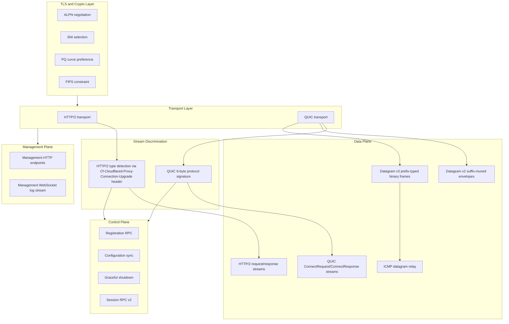

# Wire Protocol Behavior Catalog

- Baseline date: 20260322
- Baseline reference: [cloudflare/cloudflared/tree/2026.3.0](https://github.com/cloudflare/cloudflared/tree/2026.3.0)
- Primary evidence set: behavior atoms under [../../atoms](../../../atoms)
- Upstream recheck: key wire-protocol surfaces revalidated against tag `2026.3.0` source anchors for [connection/protocol.go](https://github.com/cloudflare/cloudflared/blob/2026.3.0/connection/protocol.go), [atoms/connection/protocol](../../../atoms/connection/protocol.md), [connection/http2.go](https://github.com/cloudflare/cloudflared/blob/2026.3.0/connection/http2.go), [atoms/connection/http2](../../../atoms/connection/http2.md), [connection/quic.go](https://github.com/cloudflare/cloudflared/blob/2026.3.0/connection/quic.go), [atoms/connection/quic](../../../atoms/connection/quic.md), [connection/quic_connection.go](https://github.com/cloudflare/cloudflared/blob/2026.3.0/connection/quic_connection.go), [atoms/connection/quic_connection](../../../atoms/connection/quic_connection.md), [connection/control.go](https://github.com/cloudflare/cloudflared/blob/2026.3.0/connection/control.go), [atoms/connection/control](../../../atoms/connection/control.md), [connection/header.go](https://github.com/cloudflare/cloudflared/blob/2026.3.0/connection/header.go), [atoms/connection/header](../../../atoms/connection/header.md), [connection/connection.go](https://github.com/cloudflare/cloudflared/blob/2026.3.0/connection/connection.go), [atoms/connection/connection](../../../atoms/connection/connection.md), [tunnelrpc/quic/protocol.go](https://github.com/cloudflare/cloudflared/blob/2026.3.0/tunnelrpc/quic/protocol.go), [atoms/tunnelrpc/quic/protocol](../../../atoms/tunnelrpc/quic/protocol.md), [quic/datagramv2.go](https://github.com/cloudflare/cloudflared/blob/2026.3.0/quic/datagramv2.go), [atoms/quic/datagramv2](../../../atoms/quic/datagramv2.md), [quic/v3/datagram.go](https://github.com/cloudflare/cloudflared/blob/2026.3.0/quic/v3/datagram.go), [atoms/quic/v3/datagram](../../../atoms/quic/v3/datagram.md), [connection/quic_datagram_v3.go](https://github.com/cloudflare/cloudflared/blob/2026.3.0/connection/quic_datagram_v3.go), [atoms/connection/quic_datagram_v3](../../../atoms/connection/quic_datagram_v3.md), [supervisor/pqtunnels.go](https://github.com/cloudflare/cloudflared/blob/2026.3.0/supervisor/pqtunnels.go), [atoms/supervisor/pqtunnels](../../../atoms/supervisor/pqtunnels.md), and [management/service.go](https://github.com/cloudflare/cloudflared/blob/2026.3.0/management/service.go), [atoms/management/service](../../../atoms/management/service.md).

## Scope

This catalog documents **wire-level state machines and framing contracts** between cloudflared and Cloudflare edge, organized by transport type and communication class.

For this catalog, wire protocol behavior includes:

- transport-layer handshake and session setup (TLS, QUIC, HTTP/2),
- stream-type discrimination and protocol-version preambles,
- control-plane RPC framing (Cap'n Proto registration, configuration, session management),
- data-plane request/response envelope formats per transport family,
- datagram envelope structures (v2 suffix-muxed, v3 prefix-typed binary),
- ICMP relay encapsulation within datagram frames,
- management-plane HTTP and WebSocket wire behavior,
- crypto negotiation surfaces (ALPN, SNI, PQ curve selection),
- connection lifecycle state machines including fallback and graceful shutdown.

Out of scope:

- tunnel CRUD and account-level API details in [tunnels](../tunnels.md),
- broad origin-side proxying behavior in [proxying](../proxying.md),
- CLI command inventory in [cli](../cli.md),
- non-wire observability aggregation in [observabilities](../observabilities.md).

## Catalog Structure

- [Transport and Handshake](transport-handshake.md) — TLS, crypto, protocol selection, edge discovery, wire constants
- [HTTP/2 and QUIC Protocols](http2-quic.md) — HTTP/2 wire protocol, QUIC wire protocol, connection lifecycle events
- [RPC and Datagram Formats](rpc-datagram.md) — Cap'n Proto RPC, datagram v2/v3 wire formats, management wire protocol

## Wire-Level Architecture

## Communication Class Summary

| Class | Transport | Wire mechanism | Primary atoms |
| --- | --- | --- | --- |
| **Admin/Control** | HTTP/2 control stream, QUIC RPC stream | Cap'n Proto RPC (RegisterConnection, SendLocalConfiguration, GracefulShutdown) | [connection/control](../../../atoms/connection/control.md), [tunnelrpc/registration_client](../../../atoms/tunnelrpc/registration_client.md), [tunnelrpc/registration_server](../../../atoms/tunnelrpc/registration_server.md) |
| **Configuration** | HTTP/2 config update, QUIC RPC | JSON body (HTTP/2) or Cap'n Proto UpdateConfiguration (QUIC) | [connection/http2](../../../atoms/connection/http2.md), [tunnelrpc/quic/cloudflared_client](../../../atoms/tunnelrpc/quic/cloudflared_client.md), [tunnelrpc/pogs/configuration_manager](../../../atoms/tunnelrpc/pogs/configuration_manager.md) |
| **Session management** | QUIC RPC (v2) or datagram frame (v3) | Cap'n Proto Register/UnregisterUdpSession (v2), binary registration datagram (v3) | [tunnelrpc/quic/session_client](../../../atoms/tunnelrpc/quic/session_client.md), [quic/v3/datagram](../../../atoms/quic/v3/datagram.md), [quic/v3/muxer](../../../atoms/quic/v3/muxer.md) |
| **Data (HTTP)** | HTTP/2 request streams, QUIC data streams | HTTP/2 request/response with serialized headers; QUIC ConnectRequest/ConnectResponse with metadata | [connection/http2](../../../atoms/connection/http2.md), [connection/quic_connection](../../../atoms/connection/quic_connection.md), [tunnelrpc/quic/request_server_stream](../../../atoms/tunnelrpc/quic/request_server_stream.md) |
| **Data (UDP)** | QUIC datagrams | v2 suffix-muxed or v3 prefix-typed binary frames | [quic/datagramv2](../../../atoms/quic/datagramv2.md), [quic/v3/datagram](../../../atoms/quic/v3/datagram.md), [datagramsession/session](../../../atoms/datagramsession/session.md), [quic/v3/session](../../../atoms/quic/v3/session.md) |
| **Data (ICMP)** | QUIC datagrams | v2 raw IP packet type or v3 dedicated ICMP type byte | [quic/v3/icmp](../../../atoms/quic/v3/icmp.md), [quic/datagramv2](../../../atoms/quic/datagramv2.md) |
| **Telemetry** | Internal events + Prometheus | Connection events, RPC timing, datagram metrics, QUIC transport metrics | [connection/event](../../../atoms/connection/event.md), [connection/metrics](../../../atoms/connection/metrics.md), [tunnelrpc/metrics/metrics](../../../atoms/tunnelrpc/metrics/metrics.md), [quic/v3/metrics](../../../atoms/quic/v3/metrics.md) |
| **Management** | HTTP + WebSocket | REST endpoints + WebSocket log stream with JWT auth | [management/service](../../../atoms/management/service.md), [management/events](../../../atoms/management/events.md), [management/session](../../../atoms/management/session.md) |
| **Discovery** | DNS SRV/TXT | Protocol percentages and edge address resolution | [edgediscovery/edgediscovery](../../../atoms/edgediscovery/edgediscovery.md), [edgediscovery/protocol](../../../atoms/edgediscovery/protocol.md) |

## Intentional Catalog Overlap

| Overlap catalog | Why overlap exists | Representative overlap atoms |
| --- | --- | --- |
| [edge-interactions](../edge-interactions.md) | Edge interaction lifecycle covers registration and discovery from an interaction-topology perspective; this catalog covers the same from a wire-format and state-machine perspective. | [connection/control](../../../atoms/connection/control.md), [tunnelrpc/registration_client](../../../atoms/tunnelrpc/registration_client.md), [edgediscovery/edgediscovery](../../../atoms/edgediscovery/edgediscovery.md) |
| [tunnels-transport](../tunnels-transport.md) | Transport catalog covers protocol family differences; this catalog covers wire-level framing and state machines within each family. | [connection/http2](../../../atoms/connection/http2.md), [connection/quic_connection](../../../atoms/connection/quic_connection.md), [connection/protocol](../../../atoms/connection/protocol.md) |
| [capnp-rpc](../capnp-rpc.md) | Cap'n Proto catalog covers schema-to-implementation mapping; this catalog covers Cap'n Proto as wire framing within the broader protocol stack. | [tunnelrpc/quic/protocol](../../../atoms/tunnelrpc/quic/protocol.md), [tunnelrpc/pogs/quic_metadata_protocol](../../../atoms/tunnelrpc/pogs/quic_metadata_protocol.md) |
| [crypto](../crypto.md) | Crypto catalog covers all crypto usage; this catalog covers crypto as the TLS wire-negotiation layer. | [tlsconfig/tlsconfig](../../../atoms/tlsconfig/tlsconfig.md), [supervisor/pqtunnels](../../../atoms/supervisor/pqtunnels.md) |
| [sessions](../sessions.md) | Sessions catalog covers session lifecycle; this catalog covers session registration wire formats (v2 RPC vs v3 datagram). | [datagramsession/session](../../../atoms/datagramsession/session.md), [quic/v3/session](../../../atoms/quic/v3/session.md) |

## Full Coverage Links

### Connection wire atoms (15)

- [connection/connection](../../../atoms/connection/connection.md)
- [connection/control](../../../atoms/connection/control.md)
- [connection/errors](../../../atoms/connection/errors.md)
- [connection/event](../../../atoms/connection/event.md)
- [connection/header](../../../atoms/connection/header.md)
- [connection/http2](../../../atoms/connection/http2.md)
- [connection/json](../../../atoms/connection/json.md)
- [connection/metrics](../../../atoms/connection/metrics.md)
- [connection/protocol](../../../atoms/connection/protocol.md)
- [connection/quic](../../../atoms/connection/quic.md)
- [connection/quic_connection](../../../atoms/connection/quic_connection.md)
- [connection/quic_datagram_v2](../../../atoms/connection/quic_datagram_v2.md)
- [connection/quic_datagram_v3](../../../atoms/connection/quic_datagram_v3.md)
- [connection/tunnelsforha](../../../atoms/connection/tunnelsforha.md)
- [connection/observer](../../../atoms/connection/observer.md)

### Tunnelrpc wire atoms (20)

- [tunnelrpc/metrics/metrics](../../../atoms/tunnelrpc/metrics/metrics.md)
- [tunnelrpc/pogs/cloudflared_server](../../../atoms/tunnelrpc/pogs/cloudflared_server.md)
- [tunnelrpc/pogs/configuration_manager](../../../atoms/tunnelrpc/pogs/configuration_manager.md)
- [tunnelrpc/pogs/errors](../../../atoms/tunnelrpc/pogs/errors.md)
- [tunnelrpc/pogs/quic_metadata_protocol](../../../atoms/tunnelrpc/pogs/quic_metadata_protocol.md)
- [tunnelrpc/pogs/registration_server](../../../atoms/tunnelrpc/pogs/registration_server.md)
- [tunnelrpc/pogs/session_manager](../../../atoms/tunnelrpc/pogs/session_manager.md)
- [tunnelrpc/pogs/tag](../../../atoms/tunnelrpc/pogs/tag.md)
- [tunnelrpc/proto/quic_metadata_protocol.capnp](../../../atoms/tunnelrpc/proto/quic_metadata_protocol.capnp.md)
- [tunnelrpc/proto/tunnelrpc.capnp](../../../atoms/tunnelrpc/proto/tunnelrpc.capnp.md)
- [tunnelrpc/quic/cloudflared_client](../../../atoms/tunnelrpc/quic/cloudflared_client.md)
- [tunnelrpc/quic/cloudflared_server](../../../atoms/tunnelrpc/quic/cloudflared_server.md)
- [tunnelrpc/quic/protocol](../../../atoms/tunnelrpc/quic/protocol.md)
- [tunnelrpc/quic/request_client_stream](../../../atoms/tunnelrpc/quic/request_client_stream.md)
- [tunnelrpc/quic/request_server_stream](../../../atoms/tunnelrpc/quic/request_server_stream.md)
- [tunnelrpc/quic/session_client](../../../atoms/tunnelrpc/quic/session_client.md)
- [tunnelrpc/quic/session_server](../../../atoms/tunnelrpc/quic/session_server.md)
- [tunnelrpc/registration_client](../../../atoms/tunnelrpc/registration_client.md)
- [tunnelrpc/registration_server](../../../atoms/tunnelrpc/registration_server.md)
- [tunnelrpc/utils](../../../atoms/tunnelrpc/utils.md)

### QUIC and datagram wire atoms (16)

- [quic/constants](../../../atoms/quic/constants.md)
- [quic/conversion](../../../atoms/quic/conversion.md)
- [quic/datagram](../../../atoms/quic/datagram.md)
- [quic/datagramv2](../../../atoms/quic/datagramv2.md)
- [quic/metrics](../../../atoms/quic/metrics.md)
- [quic/safe_stream](../../../atoms/quic/safe_stream.md)
- [quic/tracing](../../../atoms/quic/tracing.md)
- [quic/v3/datagram](../../../atoms/quic/v3/datagram.md)
- [quic/v3/datagram_errors](../../../atoms/quic/v3/datagram_errors.md)
- [quic/v3/icmp](../../../atoms/quic/v3/icmp.md)
- [quic/v3/manager](../../../atoms/quic/v3/manager.md)
- [quic/v3/metrics](../../../atoms/quic/v3/metrics.md)
- [quic/v3/muxer](../../../atoms/quic/v3/muxer.md)
- [quic/v3/request](../../../atoms/quic/v3/request.md)
- [quic/v3/session](../../../atoms/quic/v3/session.md)
- [datagramsession/session](../../../atoms/datagramsession/session.md)

### Discovery and protocol selection atoms (7)

- [edgediscovery/allregions/address](../../../atoms/edgediscovery/allregions/address.md)
- [edgediscovery/allregions/discovery](../../../atoms/edgediscovery/allregions/discovery.md)
- [edgediscovery/allregions/region](../../../atoms/edgediscovery/allregions/region.md)
- [edgediscovery/dial](../../../atoms/edgediscovery/dial.md)
- [edgediscovery/edgediscovery](../../../atoms/edgediscovery/edgediscovery.md)
- [edgediscovery/protocol](../../../atoms/edgediscovery/protocol.md)
- [supervisor/pqtunnels](../../../atoms/supervisor/pqtunnels.md)

### TLS and crypto wire atoms (6)

- [fips/fips](../../../atoms/fips/fips.md)
- [fips/nofips](../../../atoms/fips/nofips.md)
- [tlsconfig/certreloader](../../../atoms/tlsconfig/certreloader.md)
- [tlsconfig/cloudflare_ca](../../../atoms/tlsconfig/cloudflare_ca.md)
- [tlsconfig/hello_ca](../../../atoms/tlsconfig/hello_ca.md)
- [tlsconfig/tlsconfig](../../../atoms/tlsconfig/tlsconfig.md)

### Management wire atoms (5)

- [management/events](../../../atoms/management/events.md)
- [management/middleware](../../../atoms/management/middleware.md)
- [management/service](../../../atoms/management/service.md)
- [management/session](../../../atoms/management/session.md)
- [management/token](../../../atoms/management/token.md)

### Supporting wire atoms (7)

- [carrier/carrier](../../../atoms/carrier/carrier.md)
- [carrier/websocket](../../../atoms/carrier/websocket.md)
- [stream/stream](../../../atoms/stream/stream.md)
- [websocket/connection](../../../atoms/websocket/connection.md)
- [websocket/websocket](../../../atoms/websocket/websocket.md)
- [packet/encoder](../../../atoms/packet/encoder.md)
- [packet/decoder](../../../atoms/packet/decoder.md)

## Notes

- This catalog is intentionally wire-format-centric. It traces byte-level framing, state machines, and protocol handshakes end-to-end across all transport families.
- Overlap with [edge-interactions](../edge-interactions.md), [tunnels-transport](../tunnels-transport.md), [capnp-rpc](../capnp-rpc.md), [crypto](../crypto.md), and [sessions](../sessions.md) is documented above; each catalog slices the same underlying code from a different analytical angle.
- The v2-to-v3 datagram evolution represents the most significant wire-format change in the baseline: from suffix-muxed with RPC session control to prefix-typed binary with inline registration.
- HTTP/2 and QUIC transports share the same control-plane RPC methods (registration, config, shutdown) but differ in how streams are established and how data-plane requests are framed.

## Coverage Audit

- Audit method: collect every atom doc that participates in wire-level behavior between cloudflared and Cloudflare edge across connection setup, stream framing, datagram encoding, RPC contracts, management HTTP endpoints, TLS negotiation, and discovery resolution; then diff against all links in this catalog.
- Current result: 76 wire-protocol scoped atom docs found, 76 linked in this catalog, 0 missing.
- Operational guardrail: if transport framing, datagram envelope formats, RPC contracts, or TLS negotiation surfaces change, update this catalog in the same change.
