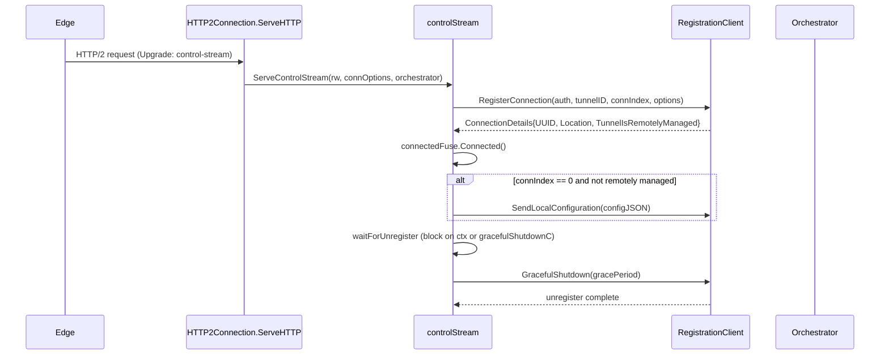
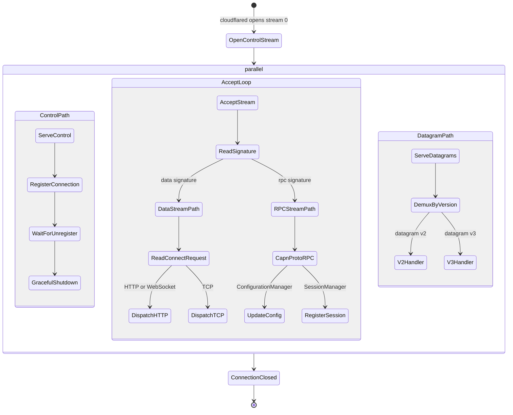

# Wire Protocol — HTTP/2 and QUIC Protocols

> Part of the [Wire Protocol Behavior Catalog](README.md).

## HTTP/2 Wire Protocol

### Stream Type Discrimination

The edge sends requests to cloudflared over a shared HTTP/2 connection. Each request is classified by the `Cf-Cloudflared-Proxy-Connection-Upgrade` header:

| Header value | Type constant | Stream behavior |
| --- | --- | --- |
| `control-stream` | `TypeControlStream` | Registration RPC, config push, graceful shutdown |
| `configuration-update` | `TypeConfiguration` | JSON config version + payload |
| `websocket` | `TypeWebsocket` | WebSocket origin proxy with flushing |
| *(absent, with `Cf-Cloudflared-Proxy-Src`)* | `TypeTCP` | TCP stream proxy via warp-routing |
| *(absent, default)* | `TypeHTTP` | Standard HTTP origin proxy |

Primary evidence: [connection/http2](../../../atoms/connection/http2.md), [connection/connection](../../../atoms/connection/connection.md).

### HTTP/2 Header Serialization

User headers from HTTP/1.x origins are base64-encoded and serialized into a single `Cf-Cloudflared-Request-Headers` header for transport over HTTP/2. Response headers use `Cf-Cloudflared-Response-Headers`. A `Cf-Cloudflared-Response-Meta` JSON header carries source attribution (`cloudflared` or `origin`) and flow rate-limit signaling.

Control response headers are identified by prefix: `:`, `cf-int-`, `cf-cloudflared-`, or `cf-proxy-`.

| Header | Direction | Wire format |
| --- | --- | --- |
| `Cf-Cloudflared-Request-Headers` | edge → cloudflared | base64 `key:value;` pairs |
| `Cf-Cloudflared-Response-Headers` | cloudflared → edge | base64 `key:value;` pairs |
| `Cf-Cloudflared-Response-Meta` | cloudflared → edge | JSON `{"src":"origin"/"cloudflared","flow_rate_limited":bool}` |

Primary evidence: [connection/header](../../../atoms/connection/header.md), [connection/http2](../../../atoms/connection/http2.md).

### HTTP/2 Control Stream Lifecycle



### HTTP/2 Configuration Update Wire Format

```json
{
  "version": 42,
  "config": { /* raw JSON ingress/origin config */ }
}
```

Sent via HTTP/2 request with `Cf-Cloudflared-Proxy-Connection-Upgrade: configuration-update`. Parsed by `handleConfigurationUpdate`, forwarded to `Orchestrator.UpdateConfig`.

Primary evidence: [connection/http2](../../../atoms/connection/http2.md), [connection/control](../../../atoms/connection/control.md).

### HTTP/2 Flush Behavior

Responses are flushed per-write when any of these conditions hold:

| Condition | Detection method |
| --- | --- |
| Stream type is WebSocket, TCP, or ControlStream | `Type.shouldFlush()` returns true |
| Missing `Content-Length` header | Empty header check |
| `Transfer-Encoding: chunked` present | Header prefix match |
| Content-Type is `text/event-stream`, `application/grpc`, or `application/x-ndjson` | `flushableContentTypes` list match |

Primary evidence: [connection/connection](../../../atoms/connection/connection.md), [connection/http2](../../../atoms/connection/http2.md).

## QUIC Wire Protocol

### QUIC Connection Establishment

cloudflared dials QUIC to an edge address using `quic.Dial` over a per-connection-index UDP socket. Socket ports are cached and reused across reconnects to preserve firewall pinhole state. On macOS, dual-stack `udp` is split into `udp4`/`udp6` to support DF bit setting.

Primary evidence: [connection/quic](../../../atoms/connection/quic.md).

### QUIC Stream Protocol Signatures

Every QUIC stream begins with a 6-byte protocol signature followed by a 2-byte version identifier:

| Signature | Hex bytes | Version | Meaning |
| --- | --- | --- | --- |
| Data stream | `0A 36 CD 12 A1 3E` | `"01"` (ASCII) | Request/response proxy stream |
| RPC stream | `52 BB 82 5C DB 65` | *(Cap'n Proto framing)* | Control RPC stream (registration, config, session) |

The `determineProtocol` function reads the first 6 bytes to dispatch. Data streams additionally read a 2-byte ASCII version before Cap'n Proto `ConnectRequest`/`ConnectResponse` exchange. RPC streams proceed directly to Cap'n Proto RPC bootstrapping.

Primary evidence: [tunnelrpc/quic/protocol](../../../atoms/tunnelrpc/quic/protocol.md).

### QUIC Stream Serve Loop



Primary evidence: [connection/quic_connection](../../../atoms/connection/quic_connection.md), [tunnelrpc/quic/protocol](../../../atoms/tunnelrpc/quic/protocol.md).

### QUIC ConnectRequest/ConnectResponse Envelope

Over data streams, after the 6+2 byte preamble, the wire exchanges Cap'n Proto-encoded metadata:

**ConnectRequest** (edge → cloudflared):

| Field | Type | Example values |
| --- | --- | --- |
| `Dest` | string | `"localhost:8080"`, `"192.168.1.1:443"` |
| `Type` | ConnectionType enum | `HTTP=1`, `Websocket=2`, `TCP=3` |
| `Metadata` | repeated key-value | `HttpMethod:GET`, `HttpHost:example.com`, `HttpHeader:X-Foo:bar`, `FlowID:abc123` |

**ConnectResponse** (cloudflared → edge):

| Field | Type | Meaning |
| --- | --- | --- |
| `Error` | string (optional) | Non-nil signals proxy failure |
| `Metadata` | repeated key-value | `HttpStatus:200`, `HttpHeader:Content-Type:text/html`, flow rate limit flag |

Schema source: [tunnelrpc/proto/quic_metadata_protocol.capnp](../../../atoms/tunnelrpc/proto/quic_metadata_protocol.capnp.md), [tunnelrpc/pogs/quic_metadata_protocol](../../../atoms/tunnelrpc/pogs/quic_metadata_protocol.md).

QUIC-side HTTP headers are transported as metadata key-value pairs with `HttpHeader:` prefix. HTTP status is a metadata value under key `HttpStatus`. Trailers are **not** supported over QUIC.

Primary evidence: [connection/quic_connection](../../../atoms/connection/quic_connection.md), [tunnelrpc/quic/request_client_stream](../../../atoms/tunnelrpc/quic/request_client_stream.md), [tunnelrpc/quic/request_server_stream](../../../atoms/tunnelrpc/quic/request_server_stream.md).

## Connection Lifecycle Events (Wire Telemetry)

| Event | Direction | Trigger |
| --- | --- | --- |
| `RegisteringTunnel` | internal | Before registration RPC |
| `Connected` | internal + metrics | Registration success |
| `Reconnecting` | internal | Transport error, retrying |
| `Unregistering` | internal + RPC | Graceful shutdown initiated |
| `Disconnected` | internal + metrics | Connection terminated |
| `SetURL` | internal | Quick tunnel URL assigned |

Primary evidence: [connection/event](../../../atoms/connection/event.md), [connection/metrics](../../../atoms/connection/metrics.md), [connection/control](../../../atoms/connection/control.md).
