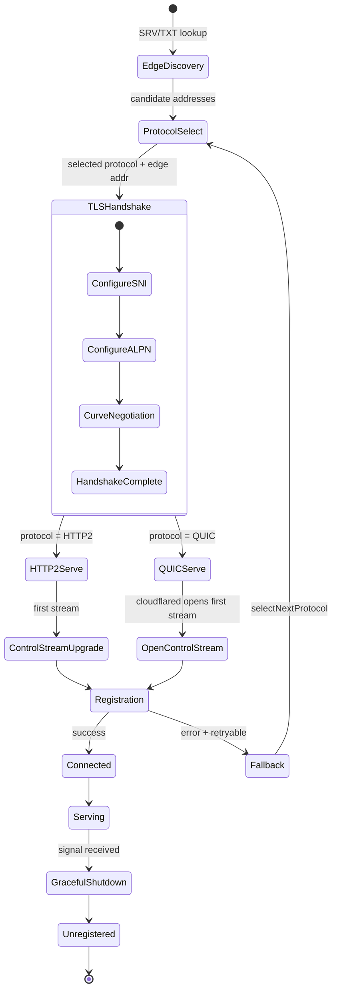
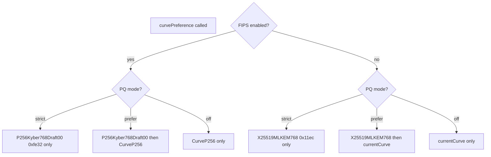

# Wire Protocol — Transport and Handshake

> Part of the [Wire Protocol Behavior Catalog](README.md).

## Transport Handshake State Machine

## TLS and Crypto Wire Contracts

| Surface | Wire-level detail | Primary evidence |
|---|---|---|
| SNI server names | HTTP/2 edge: `h2.cftunnel.com`; QUIC edge: `quic.cftunnel.com`; deprecated h2mux: `cftunnel.com` (unused). | [connection/protocol](../../../atoms/connection/protocol.md) |
| ALPN next-protos | QUIC requires `["argotunnel"]` as ALPN protocol identifier. | [connection/protocol](../../../atoms/connection/protocol.md), [connection/quic](../../../atoms/connection/quic.md) |
| Default TLS curve | `tls.CurveP256` with Cloudflare-optimized comment; differs from Go default ordering. | [tlsconfig/tlsconfig](../../../atoms/tlsconfig/tlsconfig.md) |
| PQ curve (non-FIPS) | Strict: `X25519MLKEM768` (`0x11ec`); Prefer: `[X25519MLKEM768, currentCurve]`. | [supervisor/pqtunnels](../../../atoms/supervisor/pqtunnels.md) |
| PQ curve (FIPS) | Strict: `P256Kyber768Draft00` (`0xfe32`); Prefer: `[P256Kyber768Draft00, CurveP256]`. | [supervisor/pqtunnels](../../../atoms/supervisor/pqtunnels.md) |
| Legacy PQ curve ID | `0x6399` retained in source but no longer in active negotiation paths. | [supervisor/pqtunnels](../../../atoms/supervisor/pqtunnels.md) |
| FIPS TLS mode | `crypto/tls/fipsonly` import in build-tagged file restricts entire TLS surface. | [fips/fips](../../../atoms/fips/fips.md) |
| Certificate loading | Layered: X509KeyPair → CertReloader SNI callback → mTLS client cert → CA pool → version range. | [tlsconfig/tlsconfig](../../../atoms/tlsconfig/tlsconfig.md), [tlsconfig/certreloader](../../../atoms/tlsconfig/certreloader.md) |
| CA trust anchors | Cloudflare CA and hello CA pools embedded for edge and origin verification. | [tlsconfig/cloudflare_ca](../../../atoms/tlsconfig/cloudflare_ca.md), [tlsconfig/hello_ca](../../../atoms/tlsconfig/hello_ca.md) |
| Edge TLS config builder | `CreateTunnelConfig` constructs `tls.Config` with edge SNI, ALPN, PQ curves, and optional FIPS constraints. | [connection/quic](../../../atoms/connection/quic.md), [connection/protocol](../../../atoms/connection/protocol.md) |

### PQ Curve Selection Decision Tree

## Protocol Selection Wire Interaction

### Protocol Selector Modes

| Mode | Trigger | Wire behavior |
|---|---|---|
| Static | Explicit `--protocol quic` or `http2` | Fixed protocol, no edge negotiation |
| Default | `--protocol auto` with `--token` | Starts QUIC, falls back QUIC → HTTP2 on failure |
| Remote | `--protocol auto` without `--token` | FNV-32a hash of account tag vs edge-published percentage; refreshes at 1-hour TTL |

### Edge Protocol Percentage Discovery

The `edgediscovery/protocol` module fetches protocol percentages via SRV/TXT DNS records. The `ProtocolList` evaluation order is `[QUIC, HTTP2]`. The FNV-32a hash threshold provides gradual rollout without client coordination.

Primary evidence: [connection/protocol](../../../atoms/connection/protocol.md), [edgediscovery/protocol](../../../atoms/edgediscovery/protocol.md), [edgediscovery/edgediscovery](../../../atoms/edgediscovery/edgediscovery.md).

## Edge Discovery Wire Contracts

| Method | Wire action | Stickiness |
|---|---|---|
| `ResolveEdge(region, ipVersion)` | DNS SRV lookup for edge address candidates | N/A |
| `StaticEdge(hostnames)` | User-provided `--edge` hostnames (testing) | N/A |
| `GetAddr(connIndex)` | Return same address for this connection index | Connection-sticky |
| `GetDifferentAddr(connIndex, hasConnError)` | Return old address with error tag, allocate new one | Rotation with error tracking |
| `GetAddrForRPC()` | Any available address without affinity | Non-sticky |

Quirk: exhaustion recovery — `GetDifferentAddr` may return `ErrNoAddressesLeft` even when the old address was just returned. The pool does not immediately reuse a just-returned address in the same call.

Primary evidence: [edgediscovery/edgediscovery](../../../atoms/edgediscovery/edgediscovery.md), [edgediscovery/allregions/discovery](../../../atoms/edgediscovery/allregions/discovery.md), [edgediscovery/allregions/region](../../../atoms/edgediscovery/allregions/region.md), [edgediscovery/allregions/address](../../../atoms/edgediscovery/allregions/address.md), [edgediscovery/dial](../../../atoms/edgediscovery/dial.md).

## Upstream-Verified Wire Constants

| Constant | Value | Source | Wire significance |
|---|---|---|---|
| `edgeH2TLSServerName` | `h2.cftunnel.com` | [connection/protocol.go](https://github.com/cloudflare/cloudflared/blob/2026.3.0/connection/protocol.go) | HTTP/2 edge TLS SNI |
| `edgeQUICServerName` | `quic.cftunnel.com` | [connection/protocol.go](https://github.com/cloudflare/cloudflared/blob/2026.3.0/connection/protocol.go) | QUIC edge TLS SNI |
| QUIC ALPN | `["argotunnel"]` | [connection/protocol.go](https://github.com/cloudflare/cloudflared/blob/2026.3.0/connection/protocol.go) | Required ALPN for QUIC handshake |
| `MaxConcurrentStreams` | `math.MaxUint32` | [connection/connection.go](https://github.com/cloudflare/cloudflared/blob/2026.3.0/connection/connection.go) | HTTP/2 server setting |
| `MaxGracePeriod` | 3 minutes | [connection/connection.go](https://github.com/cloudflare/cloudflared/blob/2026.3.0/connection/connection.go) | Maximum unregister grace |
| `dataStreamProtocolSignature` | `0A 36 CD 12 A1 3E` | [tunnelrpc/quic/protocol.go](https://github.com/cloudflare/cloudflared/blob/2026.3.0/tunnelrpc/quic/protocol.go) | QUIC stream data preamble |
| `rpcStreamProtocolSignature` | `52 BB 82 5C DB 65` | [tunnelrpc/quic/protocol.go](https://github.com/cloudflare/cloudflared/blob/2026.3.0/tunnelrpc/quic/protocol.go) | QUIC stream RPC preamble |
| `protocolV1` | `"01"` (ASCII) | [tunnelrpc/quic/protocol.go](https://github.com/cloudflare/cloudflared/blob/2026.3.0/tunnelrpc/quic/protocol.go) | Data stream version |
| `ResolveTTL` | 1 hour | [connection/protocol.go](https://github.com/cloudflare/cloudflared/blob/2026.3.0/connection/protocol.go) | Edge SRV/TXT refresh cadence |
| `ProtocolList` order | `[QUIC, HTTP2]` | [connection/protocol.go](https://github.com/cloudflare/cloudflared/blob/2026.3.0/connection/protocol.go) | Remote selector evaluation order |
| `tunnelRetryDuration` | 10 seconds | [supervisor/supervisor.go](https://github.com/cloudflare/cloudflared/blob/2026.3.0/supervisor/supervisor.go) | Wait before tunnel retry |
| `registrationInterval` | 1 second | [supervisor/supervisor.go](https://github.com/cloudflare/cloudflared/blob/2026.3.0/supervisor/supervisor.go) | HA connection registration spacing |
| Management idle timeout | 5 minutes | [management/service.go](https://github.com/cloudflare/cloudflared/blob/2026.3.0/management/service.go) | Management WebSocket idle |
| Management heartbeat | 15 seconds | [management/service.go](https://github.com/cloudflare/cloudflared/blob/2026.3.0/management/service.go) | Management WebSocket keepalive |
| Management session limit | 1 | [management/service.go](https://github.com/cloudflare/cloudflared/blob/2026.3.0/management/service.go) | Max concurrent log streams |
