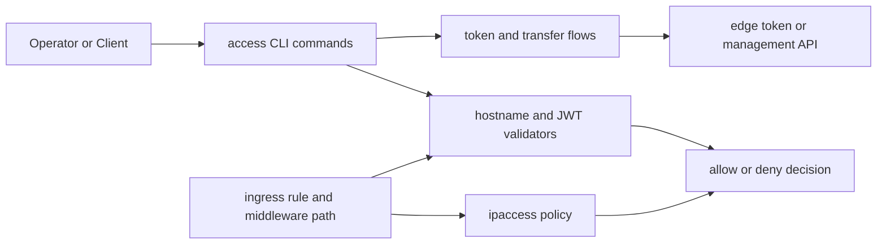
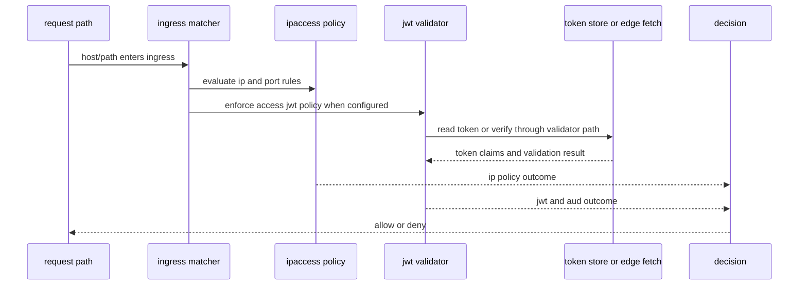
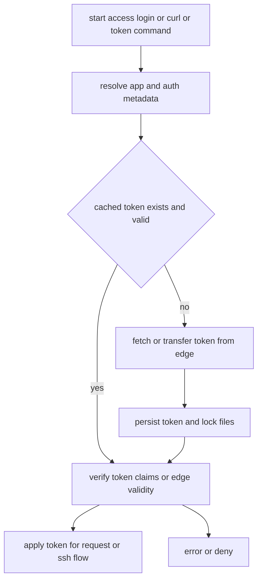
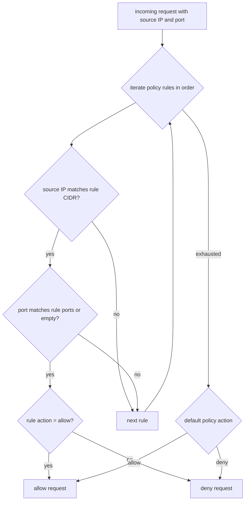

# Access Policies Behavior Catalog

- Baseline date: 20260321
- Baseline reference: [cloudflare/cloudflared/tree/2026.3.0](https://github.com/cloudflare/cloudflared/tree/2026.3.0)
- Primary evidence set: behavior atoms under [../atoms](../../atoms)
- Upstream recheck: policy and token contracts revalidated against tag `2026.3.0` source anchors for [ipaccess/access.go](https://github.com/cloudflare/cloudflared/blob/2026.3.0/ipaccess/access.go), [atoms/ipaccess/access](../../atoms/ipaccess/access.md), [ingress/ingress.go](https://github.com/cloudflare/cloudflared/blob/2026.3.0/ingress/ingress.go), [atoms/ingress/ingress](../../atoms/ingress/ingress.md), [ingress/config.go](https://github.com/cloudflare/cloudflared/blob/2026.3.0/ingress/config.go), [atoms/ingress/config](../../atoms/ingress/config.md), [ingress/middleware/jwtvalidator.go](https://github.com/cloudflare/cloudflared/blob/2026.3.0/ingress/middleware/jwtvalidator.go), [atoms/ingress/middleware/jwtvalidator](../../atoms/ingress/middleware/jwtvalidator.md), [cmd/cloudflared/access/cmd.go](https://github.com/cloudflare/cloudflared/blob/2026.3.0/cmd/cloudflared/access/cmd.go), [atoms/cmd/cloudflared/access/cmd](../../atoms/cmd/cloudflared/access/cmd.md), [validation/validation.go](https://github.com/cloudflare/cloudflared/blob/2026.3.0/validation/validation.go), [atoms/validation/validation](../../atoms/validation/validation.md), [token/token.go](https://github.com/cloudflare/cloudflared/blob/2026.3.0/token/token.go), [atoms/token/token](../../atoms/token/token.md), [token/transfer.go](https://github.com/cloudflare/cloudflared/blob/2026.3.0/token/transfer.go), [atoms/token/transfer](../../atoms/token/transfer.md), [management/token.go](https://github.com/cloudflare/cloudflared/blob/2026.3.0/management/token.go), [atoms/management/token](../../atoms/management/token.md), and [cfapi/tunnel.go](https://github.com/cloudflare/cloudflared/blob/2026.3.0/cfapi/tunnel.go), [atoms/cfapi/tunnel](../../atoms/cfapi/tunnel.md).

## Scope

This catalog documents policy-bearing behavior that gates access decisions in cloudflared: IP allow/deny rule evaluation, hostname/service access policy validation, JWT/AUD verification paths, and token issuance/verification/transfer contracts used by access-facing command and ingress surfaces.

For this catalog, access-policy behavior includes:

- policy construction and evaluation via IP/CIDR and port rules,
- ingress access policy validation and JWT middleware enforcement,
- CLI access flows that mint, verify, and apply access tokens,
- token storage, lock, transfer, and browser-mediated acquisition behavior,
- management token parse and management-resource token generation contracts.

Out of scope:

- full tunnel lifecycle orchestration in [tunnels](tunnels.md),
- generic CLI command inventory in [cli](cli.md),
- host/platform filesystem and syscall nuances in [host-interactions](host-interactions.md),
- edge transport/control stream internals in [edge-interactions](edge-interactions.md).

## Policy Topology

## Access Decision Sequence

## Token Acquisition and Validation Flow

## Domain Map

| Domain | Description | Representative atoms |
|---|---|---|
| Core policy model | Canonical allow/deny policy primitives over CIDR, port lists, and default behavior. | [ipaccess/access](../../atoms/ipaccess/access.md), [ingress/config](../../atoms/ingress/config.md), [ingress/ingress](../../atoms/ingress/ingress.md), [ingress/rule](../../atoms/ingress/rule.md) |
| JWT and request validators | JWT validation middleware and access validator contracts for hostname/url/issuer/audience checks. | [ingress/middleware/jwtvalidator](../../atoms/ingress/middleware/jwtvalidator.md), [validation/validation](../../atoms/validation/validation.md), [cmd/cloudflared/access/validation](../../atoms/cmd/cloudflared/access/validation.md) |
| Access CLI policy enforcement | Access command-family behavior that obtains app URL metadata, checks tokens, and drives policy-protected request flows. | [cmd/cloudflared/access/cmd](../../atoms/cmd/cloudflared/access/cmd.md), [cmd/cloudflared/access/carrier](../../atoms/cmd/cloudflared/access/carrier.md), [cmd/cloudflared/main](../../atoms/cmd/cloudflared/main.md) |
| Token lifecycle for policy proof | App/org token generation, transfer, lock/write/read/delete, browser-launch dispatch, and path derivation behavior. | [token/token](../../atoms/token/token.md), [token/transfer](../../atoms/token/transfer.md), [token/path](../../atoms/token/path.md), [token/encrypt](../../atoms/token/encrypt.md), [token/shell](../../atoms/token/shell.md), [token/launch_browser_darwin](../../atoms/token/launch_browser_darwin.md), [token/launch_browser_unix](../../atoms/token/launch_browser_unix.md), [token/launch_browser_windows](../../atoms/token/launch_browser_windows.md), [token/launch_browser_other](../../atoms/token/launch_browser_other.md) |
| Management token surface | Management-resource token generation and token claims parsing contracts for privileged control surfaces. | [cmd/cloudflared/management/cmd](../../atoms/cmd/cloudflared/management/cmd.md), [management/token](../../atoms/management/token.md), [cfapi/tunnel](../../atoms/cfapi/tunnel.md) |
| Policy-adjacent access artifacts | SSH cert generation and origin-service access policy plumbing used by policy-protected flows. | [sshgen/sshgen](../../atoms/sshgen/sshgen.md), [ingress/origin_service](../../atoms/ingress/origin_service.md), [ingress/origin_connection](../../atoms/ingress/origin_connection.md), [config/configuration](../../atoms/config/configuration.md) |

## Policy Contract Matrix

| Contract area | Behavior contract |
|---|---|
| IP allow/deny precedence | Policy decisions are evaluated from explicit rules with default policy fallback, and rule matching includes CIDR and port constraints. |
| Ingress access validation | Access configuration is validated during ingress parsing, and invalid access policy configuration fails early on config ingestion paths. |
| JWT/AUD enforcement | Middleware and validator surfaces enforce issuer/audience semantics; failed validation yields request deny behavior. |
| Token freshness and locking | Token acquisition path checks cache/expiry, applies lock-file coordination, and can fetch fresh tokens from edge transfer paths. |
| CLI verification path | Access command flows include local and edge-side verification steps before forwarding request behavior. |
| Management token parsing | Management token claims are parsed and verified before use in management-oriented command and API paths. |
| Policy in origin service adapters | Access policy objects can be injected into origin service wrappers (for example socks-over-ws service paths) and influence runtime behavior. |

## Policy Surface Matrix

| Surface | Primary policy input | Decision output |
|---|---|---|
| `ipaccess` | CIDR, ports, allow/deny, default policy | allow/deny boolean and matched rule |
| Ingress rule parsing | unvalidated ingress access config and origin request policy | accepted/rejected ingress configuration |
| JWT middleware | team/environment/audience tags and request token | handled request or auth failure |
| Access CLI | app URL/resource args and token state | token issuance, verification success/failure, or denied command flow |
| Token transfer | app audience, resource key/value, transfer flags | transferred token material or error |
| Management token | tunnel/resource scope token string | verified claims or invalid-token error |

## Full Coverage Links

- [cfapi/tunnel](../../atoms/cfapi/tunnel.md)
- [cmd/cloudflared/access/carrier](../../atoms/cmd/cloudflared/access/carrier.md)
- [cmd/cloudflared/access/cmd](../../atoms/cmd/cloudflared/access/cmd.md)
- [cmd/cloudflared/access/validation](../../atoms/cmd/cloudflared/access/validation.md)
- [cmd/cloudflared/main](../../atoms/cmd/cloudflared/main.md)
- [cmd/cloudflared/management/cmd](../../atoms/cmd/cloudflared/management/cmd.md)
- [config/configuration](../../atoms/config/configuration.md)
- [ingress/config](../../atoms/ingress/config.md)
- [ingress/ingress](../../atoms/ingress/ingress.md)
- [ingress/middleware/jwtvalidator](../../atoms/ingress/middleware/jwtvalidator.md)
- [ingress/origin_connection](../../atoms/ingress/origin_connection.md)
- [ingress/origin_service](../../atoms/ingress/origin_service.md)
- [ingress/rule](../../atoms/ingress/rule.md)
- [ipaccess/access](../../atoms/ipaccess/access.md)
- [management/token](../../atoms/management/token.md)
- [sshgen/sshgen](../../atoms/sshgen/sshgen.md)
- [token/encrypt](../../atoms/token/encrypt.md)
- [token/launch_browser_darwin](../../atoms/token/launch_browser_darwin.md)
- [token/launch_browser_other](../../atoms/token/launch_browser_other.md)
- [token/launch_browser_unix](../../atoms/token/launch_browser_unix.md)
- [token/launch_browser_windows](../../atoms/token/launch_browser_windows.md)
- [token/path](../../atoms/token/path.md)
- [token/shell](../../atoms/token/shell.md)
- [token/token](../../atoms/token/token.md)
- [token/transfer](../../atoms/token/transfer.md)
- [validation/validation](../../atoms/validation/validation.md)

## Upstream-Verified Access Policy Constants and Quirks

_Cross-referenced against [token/token.go](https://github.com/cloudflare/cloudflared/blob/2026.3.0/token/token.go), [ingress/middleware/jwtvalidator.go](https://github.com/cloudflare/cloudflared/blob/2026.3.0/ingress/middleware/jwtvalidator.go), and [credentials/credentials.go](https://github.com/cloudflare/cloudflared/blob/2026.3.0/credentials/credentials.go) at tag `2026.3.0`._

### Token Constants

| Constant | Value | Source |
|---|---|---|
| `keyName` | `"token"` | [token/token.go](https://github.com/cloudflare/cloudflared/blob/2026.3.0/token/token.go) |
| `tokenCookie` | `"CF_Authorization"` | [token/token.go](https://github.com/cloudflare/cloudflared/blob/2026.3.0/token/token.go) |
| `appSessionCookie` | `"CF_AppSession"` | [token/token.go](https://github.com/cloudflare/cloudflared/blob/2026.3.0/token/token.go) |
| `appDomainHeader` | `"CF-Access-Domain"` | [token/token.go](https://github.com/cloudflare/cloudflared/blob/2026.3.0/token/token.go) |
| `appAUDHeader` | `"CF-Access-Aud"` | [token/token.go](https://github.com/cloudflare/cloudflared/blob/2026.3.0/token/token.go) |
| `AccessLoginWorkerPath` | `"/cdn-cgi/access/login"` | [token/token.go](https://github.com/cloudflare/cloudflared/blob/2026.3.0/token/token.go) |
| `AccessAuthorizedWorkerPath` | `"/cdn-cgi/access/authorized"` | [token/token.go](https://github.com/cloudflare/cloudflared/blob/2026.3.0/token/token.go) |
| `headerKeyAccessJWTAssertion` | `"Cf-Access-Jwt-Assertion"` | [ingress/middleware/jwtvalidator.go](https://github.com/cloudflare/cloudflared/blob/2026.3.0/ingress/middleware/jwtvalidator.go) |

### FedRAMP Constants

| Constant | Value | Source |
|---|---|---|
| `FedEndpoint` | `"fed"` | [credentials/credentials.go](https://github.com/cloudflare/cloudflared/blob/2026.3.0/credentials/credentials.go) |
| `FedRampBaseApiURL` | `"https://api.fed.cloudflare.com/client/v4"` | [credentials/credentials.go](https://github.com/cloudflare/cloudflared/blob/2026.3.0/credentials/credentials.go) |
| `FedRampHostname` | `"management.fed.argotunnel.com"` | [credentials/credentials.go](https://github.com/cloudflare/cloudflared/blob/2026.3.0/credentials/credentials.go) |
| JWT certs URL (FedRAMP) | `"https://{team}.fed.cloudflareaccess.com"` | [ingress/middleware/jwtvalidator.go](https://github.com/cloudflare/cloudflared/blob/2026.3.0/ingress/middleware/jwtvalidator.go) |
| JWT certs URL (standard) | `"https://{team}.cloudflareaccess.com"` | [ingress/middleware/jwtvalidator.go](https://github.com/cloudflare/cloudflared/blob/2026.3.0/ingress/middleware/jwtvalidator.go) |

### Token Acquisition Behavioral Quirks

- **Quirk — File-lock coordination with backoff.** Token operations use file-based locking (`path + ".lock"`) with 7-retry exponential backoff. The lock polls with `isTokenLocked` until the file disappears or retries exhaust.

- **Quirk — SIGINT/SIGTERM lock cleanup.** The lock registers a signal handler that deletes the lock file and calls `os.Exit(0)` on interrupt, preventing stale locks from blocking other processes.

- **Quirk — Double-check after lock acquisition.** After acquiring the lock, the code re-checks for a cached token (`GetAppTokenIfExists`) since another process may have written one during the wait period.

- **Quirk — Org-to-app token exchange.** When an org token exists, it is exchanged for an app token via redirect-following HTTP flow before falling back to the full transfer-service browser flow.

- **Quirk — GetAppInfo redirect-stop pattern.** `GetAppInfo` uses a custom `CheckRedirect` that stops at the `/cdn-cgi/access/login` path, extracting the `CF-Access-Domain` and `CF-Access-Aud` headers from the response. Timeout is 7 seconds.

- **Quirk — Token expiry is checked via unsigned payload.** Both `GetOrgTokenIfExists` and `GetAppTokenIfExists` call `UnsafePayloadWithoutVerification()` to check JWT expiry. Expired tokens are deleted from disk (`os.Remove`).

- **Quirk — JWS signature algorithms whitelist.** Token parsing accepts only `signatureAlgs` (defined as a `var`, not shown in constants), restricting valid JWS algorithms for cached token verification.

### JWT Validator Quirks

- **Quirk — SkipClientIDCheck enabled.** The OIDC verifier config sets `SkipClientIDCheck: true` because audience matching is done manually by iterating JWT audience tags against accepted `audTags`.

- **Quirk — Missing JWT yields 403 directly.** When the `Cf-Access-Jwt-Assertion` header is empty, the validator returns `StatusForbidden` with reason `"no access token in request"` without attempting any other authentication path.

- **Quirk — Any-match AUD policy.** At least one JWT `aud` tag must match at least one accepted `audTag`. If zero matches, the request is denied with `"Invalid token in jwt: {audience}"`.

## IP Policy Evaluation Flow

## Notes

- Overlap with [proxying](proxying.md), [sessions](sessions.md), [cli](cli.md), and [upstream-api-contracts](upstream-api-contracts.md) is intentional because access policy behavior crosses ingress, command, and token management boundaries.
- This catalog focuses on behavior contracts for policy decisions and policy proof artifacts, not UI/operator workflow prose.

## Coverage Audit

- Audit method: collect access-policy scoped atom docs across policy core (`ipaccess/access`), ingress policy surfaces (`ingress/{config,ingress,rule,middleware/jwtvalidator,origin_service,origin_connection}`), access and management command surfaces (`cmd/cloudflared/access/{cmd,validation,carrier}`, `cmd/cloudflared/management/cmd`, `cmd/cloudflared/main`), token lifecycle (`token/{token,transfer,path,encrypt,shell,launch_browser_darwin,launch_browser_unix,launch_browser_windows,launch_browser_other}`), validators and token claims (`validation/validation`, `management/token`), and API token bridge (`cfapi/tunnel`) plus ssh policy-adjacent artifact (`sshgen/sshgen`), then diff against all atom links listed in this catalog.
- Current coverage result: 26 access-policy scoped atom docs found, 26 linked in catalog, 0 missing.
- Delta (catalog links - access-policy scoped atom docs): 0.
- Operational guardrail: if policy fields, JWT validator paths, token transfer/lock logic, or management token contracts change, rerun this audit and update this file in the same change.
