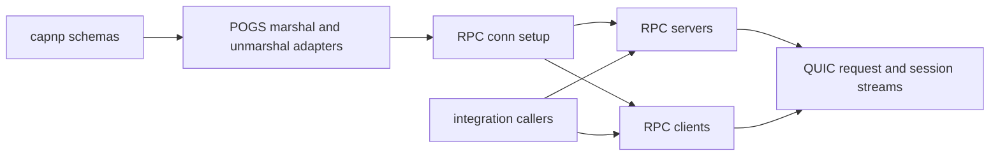
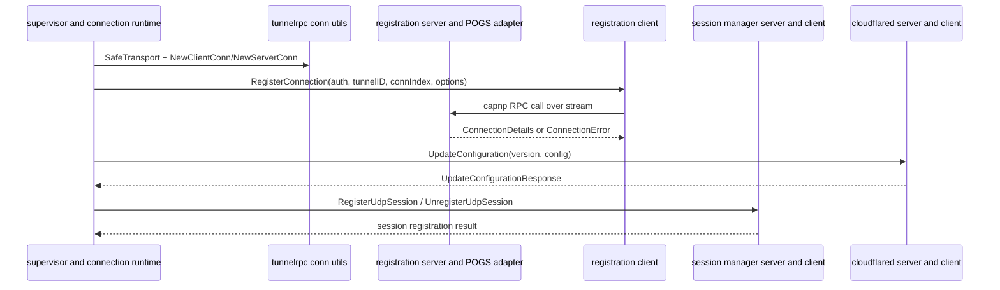

# Cap'n Proto RPC Behavior Catalog

- Baseline date: 20260321
- Baseline reference: [cloudflare/cloudflared/tree/2026.3.0](https://github.com/cloudflare/cloudflared/tree/2026.3.0)
- Primary evidence set: behavior atoms under [../atoms](../../atoms)
- Upstream recheck: key Cap'n Proto RPC surfaces revalidated against tag `2026.3.0` source anchors for [tunnelrpc/utils.go](https://github.com/cloudflare/cloudflared/blob/2026.3.0/tunnelrpc/utils.go), [atoms/tunnelrpc/utils](../../atoms/tunnelrpc/utils.md), [tunnelrpc/registration_client.go](https://github.com/cloudflare/cloudflared/blob/2026.3.0/tunnelrpc/registration_client.go), [atoms/tunnelrpc/registration_client](../../atoms/tunnelrpc/registration_client.md), [tunnelrpc/registration_server.go](https://github.com/cloudflare/cloudflared/blob/2026.3.0/tunnelrpc/registration_server.go), [atoms/tunnelrpc/registration_server](../../atoms/tunnelrpc/registration_server.md), [tunnelrpc/quic/cloudflared_client.go](https://github.com/cloudflare/cloudflared/blob/2026.3.0/tunnelrpc/quic/cloudflared_client.go), [atoms/tunnelrpc/quic/cloudflared_client](../../atoms/tunnelrpc/quic/cloudflared_client.md), [tunnelrpc/quic/cloudflared_server.go](https://github.com/cloudflare/cloudflared/blob/2026.3.0/tunnelrpc/quic/cloudflared_server.go), [atoms/tunnelrpc/quic/cloudflared_server](../../atoms/tunnelrpc/quic/cloudflared_server.md), [tunnelrpc/proto/tunnelrpc.capnp](https://github.com/cloudflare/cloudflared/blob/2026.3.0/tunnelrpc/proto/tunnelrpc.capnp), [atoms/tunnelrpc/proto/tunnelrpc.capnp](../../atoms/tunnelrpc/proto/tunnelrpc.capnp.md), [tunnelrpc/proto/quic_metadata_protocol.capnp](https://github.com/cloudflare/cloudflared/blob/2026.3.0/tunnelrpc/proto/quic_metadata_protocol.capnp), and [atoms/tunnelrpc/proto/quic_metadata_protocol.capnp](../../atoms/tunnelrpc/proto/quic_metadata_protocol.capnp.md).

## Scope

This catalog is the dedicated Cap'n Proto RPC view for cloudflared baseline behavior.

For this catalog, Cap'n Proto RPC behavior includes:

- schema contracts (`tunnelrpc.capnp` and `quic_metadata_protocol.capnp`),
- RPC connection/session bootstrapping (`rpc.Transport`, client/server conn construction),
- POGS marshaling and service adapters,
- registration/session/configuration RPC control surfaces,
- request/response stream framing for QUIC request proxying,
- RPC error wrapping/retry signaling and tunnelrpc-specific metrics,
- integration points where non-`tunnelrpc` modules invoke these RPC contracts.

Out of scope:

- generic tunnel lifecycle orchestration in [tunnels](tunnels.md),
- broad protocol relay behavior in [proxying](proxying.md),
- non-RPC observability inventory in [observabilities](observabilities.md).

## Cap'n Proto RPC Architecture Topology

## End-to-End Control Sequence

## Surface Map

| Surface family | Contracted behavior | Representative atoms |
| --- | --- | --- |
| Schema contracts | Defines wire-level types and RPC methods for registration, session, configuration, connect request/response, and metadata. | [tunnelrpc/proto/tunnelrpc.capnp](../../atoms/tunnelrpc/proto/tunnelrpc.capnp.md), [tunnelrpc/proto/quic_metadata_protocol.capnp](../../atoms/tunnelrpc/proto/quic_metadata_protocol.capnp.md) |
| Connection bootstrap | Wraps stream transport, temporary-read handling, and client/server RPC conn constructors. | [tunnelrpc/utils](../../atoms/tunnelrpc/utils.md) |
| Registration RPC | Connection registration, local configuration push, unregister/graceful-shutdown paths. | [tunnelrpc/registration_client](../../atoms/tunnelrpc/registration_client.md), [tunnelrpc/registration_server](../../atoms/tunnelrpc/registration_server.md), [tunnelrpc/pogs/registration_server](../../atoms/tunnelrpc/pogs/registration_server.md) |
| Session RPC | UDP session register/unregister control contracts and client/server wrappers. | [tunnelrpc/quic/session_client](../../atoms/tunnelrpc/quic/session_client.md), [tunnelrpc/quic/session_server](../../atoms/tunnelrpc/quic/session_server.md), [tunnelrpc/pogs/session_manager](../../atoms/tunnelrpc/pogs/session_manager.md) |
| Configuration RPC | Remote config update contracts with versioned payload handling. | [tunnelrpc/quic/cloudflared_client](../../atoms/tunnelrpc/quic/cloudflared_client.md), [tunnelrpc/quic/cloudflared_server](../../atoms/tunnelrpc/quic/cloudflared_server.md), [tunnelrpc/pogs/configuration_manager](../../atoms/tunnelrpc/pogs/configuration_manager.md) |
| Request stream framing | Connect request/response encode/decode path and protocol preamble/version signaling. | [tunnelrpc/quic/request_client_stream](../../atoms/tunnelrpc/quic/request_client_stream.md), [tunnelrpc/quic/request_server_stream](../../atoms/tunnelrpc/quic/request_server_stream.md), [tunnelrpc/quic/protocol](../../atoms/tunnelrpc/quic/protocol.md), [tunnelrpc/pogs/quic_metadata_protocol](../../atoms/tunnelrpc/pogs/quic_metadata_protocol.md) |
| Error and observability | Retryable and RPC error wrappers plus per-method handler and latency metrics hooks. | [tunnelrpc/pogs/errors](../../atoms/tunnelrpc/pogs/errors.md), [tunnelrpc/metrics/metrics](../../atoms/tunnelrpc/metrics/metrics.md) |

## RPC Contract Matrix

| Contract area | Method-level behavior | Primary evidence |
| --- | --- | --- |
| Registration | Client sends auth/tunnel/options and receives `ConnectionDetails` or mapped connection errors (including retryable forms). | [tunnelrpc/registration_client](../../atoms/tunnelrpc/registration_client.md), [tunnelrpc/pogs/registration_server](../../atoms/tunnelrpc/pogs/registration_server.md) |
| Local config update | Runtime pushes `config []byte` with version semantics through configuration manager contracts. | [tunnelrpc/quic/cloudflared_client](../../atoms/tunnelrpc/quic/cloudflared_client.md), [tunnelrpc/pogs/configuration_manager](../../atoms/tunnelrpc/pogs/configuration_manager.md) |
| Session control | Session registration/unregistration carries session ID, destination, idle hints, and trace context. | [tunnelrpc/quic/session_client](../../atoms/tunnelrpc/quic/session_client.md), [tunnelrpc/pogs/session_manager](../../atoms/tunnelrpc/pogs/session_manager.md) |
| Request proxy framing | Stream-level connect request and connect response envelopes shuttle destination/type/metadata and error payloads. | [tunnelrpc/quic/request_client_stream](../../atoms/tunnelrpc/quic/request_client_stream.md), [tunnelrpc/quic/request_server_stream](../../atoms/tunnelrpc/quic/request_server_stream.md), [tunnelrpc/pogs/quic_metadata_protocol](../../atoms/tunnelrpc/pogs/quic_metadata_protocol.md) |
| Transport resilience | `SafeTransport` protects conn loops from temporary read errors to keep RPC sessions alive under transient faults. | [tunnelrpc/utils](../../atoms/tunnelrpc/utils.md) |

## Schema-to-Implementation Matrix

| Schema | Primary entities | Implementation adapters |
| --- | --- | --- |
| `tunnelrpc.capnp` | `RegistrationServer`, `SessionManager`, `ConfigurationManager`, `ConnectionOptions`, `ConnectionDetails`, connection error envelopes | [tunnelrpc/pogs/registration_server](../../atoms/tunnelrpc/pogs/registration_server.md), [tunnelrpc/pogs/session_manager](../../atoms/tunnelrpc/pogs/session_manager.md), [tunnelrpc/pogs/configuration_manager](../../atoms/tunnelrpc/pogs/configuration_manager.md), [tunnelrpc/quic/cloudflared_server](../../atoms/tunnelrpc/quic/cloudflared_server.md) |
| `quic_metadata_protocol.capnp` | `ConnectRequest`, `ConnectResponse`, metadata key/value list, `ConnectionType` enum | [tunnelrpc/pogs/quic_metadata_protocol](../../atoms/tunnelrpc/pogs/quic_metadata_protocol.md), [tunnelrpc/quic/request_client_stream](../../atoms/tunnelrpc/quic/request_client_stream.md), [tunnelrpc/quic/request_server_stream](../../atoms/tunnelrpc/quic/request_server_stream.md) |

## Integration Overlap (Tunnels and Proxying)

| Overlap catalog | Why overlap exists | Representative overlap atoms |
| --- | --- | --- |
| [tunnels](tunnels.md) | Tunnel lifecycle and HA connection startup require registration/config/session RPC control surfaces. | [connection/control](../../atoms/connection/control.md), [connection/connection](../../atoms/connection/connection.md), [supervisor/tunnel](../../atoms/supervisor/tunnel.md), [orchestration/orchestrator](../../atoms/orchestration/orchestrator.md) |
| [proxying](proxying.md) | Request/session relay paths call tunnelrpc stream/session abstractions to carry traffic and metadata. | [connection/quic_connection](../../atoms/connection/quic_connection.md), [connection/quic_datagram_v2](../../atoms/connection/quic_datagram_v2.md), [connection/quic_datagram_v3](../../atoms/connection/quic_datagram_v3.md), [proxy/proxy](../../atoms/proxy/proxy.md) |
| [config](config.md) | Runtime configuration and tag propagation cross Cap'n Proto configuration manager and tag contracts. | [client/config](../../atoms/client/config.md), [cmd/cloudflared/tunnel/configuration](../../atoms/cmd/cloudflared/tunnel/configuration.md), [cmd/cloudflared/tunnel/tag](../../atoms/cmd/cloudflared/tunnel/tag.md) |

## Error and Retry Semantics

| Pattern | Cap'n Proto RPC behavior |
| --- | --- |
| Retryable failures | RPC layer includes explicit retryable error wrappers with delay semantics for backoff-aware callers. |
| Structured connection errors | Registration adapters map wire errors into structured local error forms while preserving retry/fatal distinctions. |
| Temporary transport reads | Safe transport wrapper treats temporary read errors as recoverable transport behavior rather than immediate fatal teardown. |
| Metrics around failure/success | Server handler observation and client latency timers provide RPC operation visibility by method and endpoint family. |

Primary evidence: [tunnelrpc/pogs/errors](../../atoms/tunnelrpc/pogs/errors.md), [tunnelrpc/pogs/registration_server](../../atoms/tunnelrpc/pogs/registration_server.md), [tunnelrpc/utils](../../atoms/tunnelrpc/utils.md), [tunnelrpc/metrics/metrics](../../atoms/tunnelrpc/metrics/metrics.md).

## Full Coverage Links

### Core tunnelrpc atom set (20)

- [tunnelrpc/metrics/metrics](../../atoms/tunnelrpc/metrics/metrics.md)
- [tunnelrpc/pogs/cloudflared_server](../../atoms/tunnelrpc/pogs/cloudflared_server.md)
- [tunnelrpc/pogs/configuration_manager](../../atoms/tunnelrpc/pogs/configuration_manager.md)
- [tunnelrpc/pogs/errors](../../atoms/tunnelrpc/pogs/errors.md)
- [tunnelrpc/pogs/quic_metadata_protocol](../../atoms/tunnelrpc/pogs/quic_metadata_protocol.md)
- [tunnelrpc/pogs/registration_server](../../atoms/tunnelrpc/pogs/registration_server.md)
- [tunnelrpc/pogs/session_manager](../../atoms/tunnelrpc/pogs/session_manager.md)
- [tunnelrpc/pogs/tag](../../atoms/tunnelrpc/pogs/tag.md)
- [tunnelrpc/proto/quic_metadata_protocol.capnp](../../atoms/tunnelrpc/proto/quic_metadata_protocol.capnp.md)
- [tunnelrpc/proto/tunnelrpc.capnp](../../atoms/tunnelrpc/proto/tunnelrpc.capnp.md)
- [tunnelrpc/quic/cloudflared_client](../../atoms/tunnelrpc/quic/cloudflared_client.md)
- [tunnelrpc/quic/cloudflared_server](../../atoms/tunnelrpc/quic/cloudflared_server.md)
- [tunnelrpc/quic/protocol](../../atoms/tunnelrpc/quic/protocol.md)
- [tunnelrpc/quic/request_client_stream](../../atoms/tunnelrpc/quic/request_client_stream.md)
- [tunnelrpc/quic/request_server_stream](../../atoms/tunnelrpc/quic/request_server_stream.md)
- [tunnelrpc/quic/session_client](../../atoms/tunnelrpc/quic/session_client.md)
- [tunnelrpc/quic/session_server](../../atoms/tunnelrpc/quic/session_server.md)
- [tunnelrpc/registration_client](../../atoms/tunnelrpc/registration_client.md)
- [tunnelrpc/registration_server](../../atoms/tunnelrpc/registration_server.md)
- [tunnelrpc/utils](../../atoms/tunnelrpc/utils.md)

### Integration overlap atom set (12)

- [client/config](../../atoms/client/config.md)
- [cmd/cloudflared/tunnel/configuration](../../atoms/cmd/cloudflared/tunnel/configuration.md)
- [cmd/cloudflared/tunnel/tag](../../atoms/cmd/cloudflared/tunnel/tag.md)
- [connection/connection](../../atoms/connection/connection.md)
- [connection/control](../../atoms/connection/control.md)
- [connection/errors](../../atoms/connection/errors.md)
- [connection/quic_connection](../../atoms/connection/quic_connection.md)
- [connection/quic_datagram_v2](../../atoms/connection/quic_datagram_v2.md)
- [connection/quic_datagram_v3](../../atoms/connection/quic_datagram_v3.md)
- [orchestration/orchestrator](../../atoms/orchestration/orchestrator.md)
- [proxy/proxy](../../atoms/proxy/proxy.md)
- [supervisor/tunnel](../../atoms/supervisor/tunnel.md)

## Upstream-Verified RPC Quirks and Variance

### Client Duality

Two distinct RPC client types coexist for session management:

| Client | File | Methods | Use context |
| --- | --- | --- | --- |
| `CloudflaredClient` | [tunnelrpc/quic/cloudflared_client.go](https://github.com/cloudflare/cloudflared/blob/2026.3.0/tunnelrpc/quic/cloudflared_client.go) | `RegisterUdpSession`, `UnregisterUdpSession`, `UpdateConfiguration`, `Close` | Full tunnel control: session management + configuration updates |
| `SessionClient` | [tunnelrpc/quic/session_client.go](https://github.com/cloudflare/cloudflared/blob/2026.3.0/tunnelrpc/quic/session_client.go) | `RegisterUdpSession`, `UnregisterUdpSession`, `Close` | Session-only control: no configuration update capability |

Both clients accept a `requestTimeout` parameter at construction and wrap a `io.ReadWriteCloser` stream. The `CloudflaredClient` is the superset — it adds `UpdateConfiguration(version int32, config []byte)` which is absent from `SessionClient`.

### Registration Parameter Contracts

The `RegisterUdpSession` RPC signature carries these wire parameters:

| Parameter | Type | Role |
| --- | --- | --- |
| `sessionID` | `uuid.UUID` | Unique session identifier |
| `dstIP` | `net.IP` | Destination IP for the proxied session |
| `dstPort` | `uint16` | Destination port |
| `closeIdleAfterHint` | `time.Duration` | Suggested idle timeout; server may override |
| `traceContext` | `string` | Distributed tracing correlation token |

The return type `*pogs.RegisterUdpSessionResponse` carries the edge's response including any error conditions or session metadata.

## Notes

- This catalog is intentionally RPC-contract-centric; it traces schema, transport, marshaling, and method semantics end to end.
- Overlap with [tunnels](tunnels.md) and [proxying](proxying.md) is expected and documented rather than avoided.
- The schema files are now explicitly first-class in baseline coverage and should stay linked whenever tunnelrpc APIs evolve.

## Coverage Audit

- Audit method: include all atom docs under `atoms/tunnelrpc/**` plus non-`tunnelrpc` atoms that directly import or invoke tunnelrpc Cap'n Proto RPC contracts in connection, supervisor, proxy, orchestration, client, and tunnel CLI configuration paths.
- Current result: 20 core tunnelrpc atoms found and linked; 12 overlap integration atoms selected and linked; 0 missing from this catalog's declared sets.
- Operational guardrail: when any tunnelrpc schema, POGS adapter, or integration caller changes, update this catalog in the same change and recheck overlap notes against [tunnels](tunnels.md) and [proxying](proxying.md).
