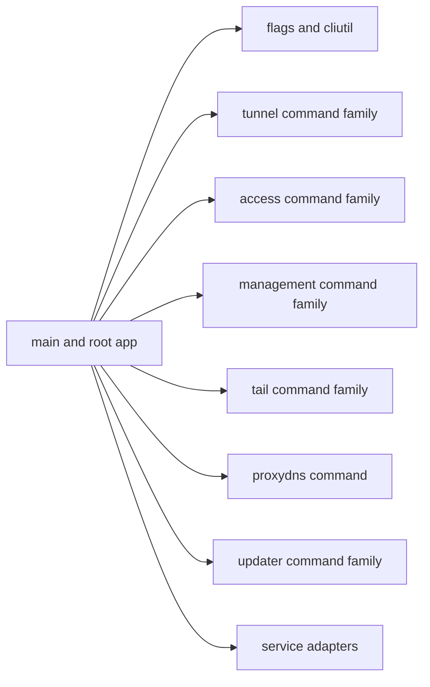
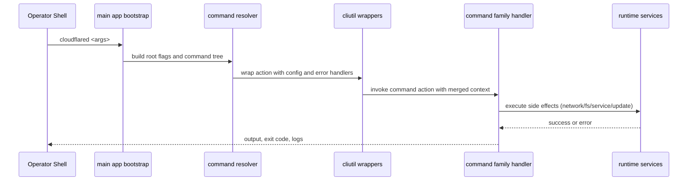
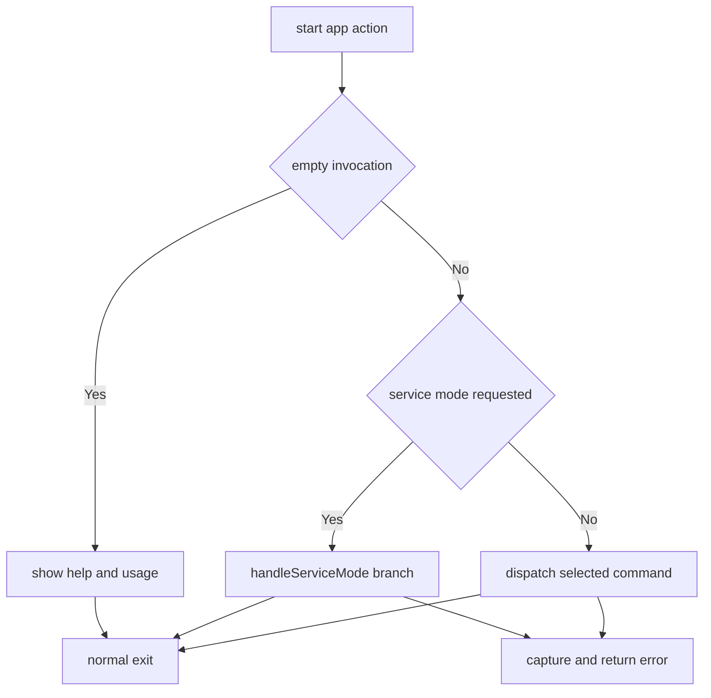

# CLI Behavior Catalog

- Baseline date: 20260321
- Baseline reference: [cloudflare/cloudflared/tree/2026.3.0](https://github.com/cloudflare/cloudflared/tree/2026.3.0)
- Primary evidence set: behavior atoms under [../atoms/cmd/cloudflared](../../atoms/cmd/cloudflared)
- Upstream recheck: key CLI contracts revalidated against tag `2026.3.0` source anchors for [cmd/cloudflared/main.go](https://github.com/cloudflare/cloudflared/blob/2026.3.0/cmd/cloudflared/main.go), [atoms/cmd/cloudflared/main](../../atoms/cmd/cloudflared/main.md), [cmd/cloudflared/tunnel/cmd.go](https://github.com/cloudflare/cloudflared/blob/2026.3.0/cmd/cloudflared/tunnel/cmd.go), [atoms/cmd/cloudflared/tunnel/cmd](../../atoms/cmd/cloudflared/tunnel/cmd.md), [cmd/cloudflared/tunnel/subcommands.go](https://github.com/cloudflare/cloudflared/blob/2026.3.0/cmd/cloudflared/tunnel/subcommands.go), [atoms/cmd/cloudflared/tunnel/subcommands](../../atoms/cmd/cloudflared/tunnel/subcommands.md), [cmd/cloudflared/access/cmd.go](https://github.com/cloudflare/cloudflared/blob/2026.3.0/cmd/cloudflared/access/cmd.go), [atoms/cmd/cloudflared/access/cmd](../../atoms/cmd/cloudflared/access/cmd.md), [cmd/cloudflared/tail/cmd.go](https://github.com/cloudflare/cloudflared/blob/2026.3.0/cmd/cloudflared/tail/cmd.go), [atoms/cmd/cloudflared/tail/cmd](../../atoms/cmd/cloudflared/tail/cmd.md), [cmd/cloudflared/updater/update.go](https://github.com/cloudflare/cloudflared/blob/2026.3.0/cmd/cloudflared/updater/update.go), [atoms/cmd/cloudflared/updater/update](../../atoms/cmd/cloudflared/updater/update.md), [cmd/cloudflared/linux_service.go](https://github.com/cloudflare/cloudflared/blob/2026.3.0/cmd/cloudflared/linux_service.go), [atoms/cmd/cloudflared/linux_service](../../atoms/cmd/cloudflared/linux_service.md), and [cmd/cloudflared/windows_service.go](https://github.com/cloudflare/cloudflared/blob/2026.3.0/cmd/cloudflared/windows_service.go), [atoms/cmd/cloudflared/windows_service](../../atoms/cmd/cloudflared/windows_service.md).

## Scope

This catalog documents cloudflared CLI behavior surfaces that define command routing, flag/config ingestion, command-family entrypoints, operator output, service-mode actions, and update/management token workflows.

For this catalog, CLI behavior includes:

- root app bootstrap and command registry construction,
- command-family dispatch (`tunnel`, `access`, `tail`, `management`, `update`, `proxydns`),
- shared CLI utility wrappers (config-file overlays, error wrappers, logger/build info helpers),
- token and credential path orchestration used by command flows,
- OS-specific service install/uninstall/run command behavior,
- updater command and background auto-update orchestration.

Out of scope:

- deeper runtime tunnel lifecycle internals already detailed in [tunnels](tunnels.md),
- state-transition analysis already detailed in [state-machines](state-machines.md),
- platform divergence-first analysis already detailed in [platforms](platforms.md),
- protocol and proxy data-plane detail already detailed in [proxying](proxying.md).

## CLI Topology

## Invocation and Dispatch Sequence

## Root Action and Service-Mode Decision Flow

## Domain Map

| Domain | Description | Representative atoms |
|---|---|---|
| Root bootstrap and command graph | Constructs root CLI app, global flags, action wrapper, and top-level command wiring. | [cmd/cloudflared/main](../../atoms/cmd/cloudflared/main.md), [cmd/cloudflared/flags/flags](../../atoms/cmd/cloudflared/flags/flags.md) |
| Shared CLI utility layer | Config-file flag overlay, error wrapping, deprecated command handling, logger and build metadata helpers, management-token helper. | [cmd/cloudflared/cliutil/handler](../../atoms/cmd/cloudflared/cliutil/handler.md), [cmd/cloudflared/cliutil/errors](../../atoms/cmd/cloudflared/cliutil/errors.md), [cmd/cloudflared/cliutil/deprecated](../../atoms/cmd/cloudflared/cliutil/deprecated.md), [cmd/cloudflared/cliutil/logger](../../atoms/cmd/cloudflared/cliutil/logger.md), [cmd/cloudflared/cliutil/build_info](../../atoms/cmd/cloudflared/cliutil/build_info.md), [cmd/cloudflared/cliutil/management](../../atoms/cmd/cloudflared/cliutil/management.md) |
| Tunnel command family | Named/quick tunnel run/create/list/delete/info/token/route/diagnostic paths and shared subcommand context. | [cmd/cloudflared/tunnel/cmd](../../atoms/cmd/cloudflared/tunnel/cmd.md), [cmd/cloudflared/tunnel/subcommands](../../atoms/cmd/cloudflared/tunnel/subcommands.md), [cmd/cloudflared/tunnel/subcommand_context](../../atoms/cmd/cloudflared/tunnel/subcommand_context.md), [cmd/cloudflared/tunnel/configuration](../../atoms/cmd/cloudflared/tunnel/configuration.md), [cmd/cloudflared/tunnel/quick_tunnel](../../atoms/cmd/cloudflared/tunnel/quick_tunnel.md), [cmd/cloudflared/tunnel/ingress_subcommands](../../atoms/cmd/cloudflared/tunnel/ingress_subcommands.md), [cmd/cloudflared/tunnel/login](../../atoms/cmd/cloudflared/tunnel/login.md) |
| Teamnet and virtual-network subcommands | Teamnet route and virtual-network command surfaces plus context adapters for route/vnet APIs. | [cmd/cloudflared/tunnel/teamnet_subcommands](../../atoms/cmd/cloudflared/tunnel/teamnet_subcommands.md), [cmd/cloudflared/tunnel/vnets_subcommands](../../atoms/cmd/cloudflared/tunnel/vnets_subcommands.md), [cmd/cloudflared/tunnel/subcommand_context_teamnet](../../atoms/cmd/cloudflared/tunnel/subcommand_context_teamnet.md), [cmd/cloudflared/tunnel/subcommand_context_vnets](../../atoms/cmd/cloudflared/tunnel/subcommand_context_vnets.md) |
| Access command family | Access login/curl/token/ssh command flow with validation and carrier-forwarder integration. | [cmd/cloudflared/access/cmd](../../atoms/cmd/cloudflared/access/cmd.md), [cmd/cloudflared/access/carrier](../../atoms/cmd/cloudflared/access/carrier.md), [cmd/cloudflared/access/validation](../../atoms/cmd/cloudflared/access/validation.md) |
| Management and tail families | Management token command and realtime log-tail command with filter parsing and websocket loop behavior. | [cmd/cloudflared/management/cmd](../../atoms/cmd/cloudflared/management/cmd.md), [cmd/cloudflared/tail/cmd](../../atoms/cmd/cloudflared/tail/cmd.md) |
| Updater command family | Manual update/check behavior, warning checks, workers update artifacts, and auto-update loop surfaces. | [cmd/cloudflared/updater/update](../../atoms/cmd/cloudflared/updater/update.md), [cmd/cloudflared/updater/check](../../atoms/cmd/cloudflared/updater/check.md), [cmd/cloudflared/updater/workers_update](../../atoms/cmd/cloudflared/updater/workers_update.md), [cmd/cloudflared/updater/workers_service](../../atoms/cmd/cloudflared/updater/workers_service.md), [cmd/cloudflared/updater/service](../../atoms/cmd/cloudflared/updater/service.md) |
| Service-mode command adapters | Cross-platform install/uninstall/run service wrappers and service template generation/removal. | [cmd/cloudflared/common_service](../../atoms/cmd/cloudflared/common_service.md), [cmd/cloudflared/generic_service](../../atoms/cmd/cloudflared/generic_service.md), [cmd/cloudflared/linux_service](../../atoms/cmd/cloudflared/linux_service.md), [cmd/cloudflared/macos_service](../../atoms/cmd/cloudflared/macos_service.md), [cmd/cloudflared/windows_service](../../atoms/cmd/cloudflared/windows_service.md), [cmd/cloudflared/service_template](../../atoms/cmd/cloudflared/service_template.md), [cmd/cloudflared/app_service](../../atoms/cmd/cloudflared/app_service.md), [cmd/cloudflared/app_forward_service](../../atoms/cmd/cloudflared/app_forward_service.md) |
| Ancillary command surfaces | DNS proxy command and tunnel helper atoms for file paths, tags, signal handling, and credential discovery. | [cmd/cloudflared/proxydns/cmd](../../atoms/cmd/cloudflared/proxydns/cmd.md), [cmd/cloudflared/tunnel/filesystem](../../atoms/cmd/cloudflared/tunnel/filesystem.md), [cmd/cloudflared/tunnel/credential_finder](../../atoms/cmd/cloudflared/tunnel/credential_finder.md), [cmd/cloudflared/tunnel/tag](../../atoms/cmd/cloudflared/tunnel/tag.md), [cmd/cloudflared/tunnel/signal](../../atoms/cmd/cloudflared/tunnel/signal.md), [cmd/cloudflared/tunnel/info](../../atoms/cmd/cloudflared/tunnel/info.md) |

## Command Family Matrix

| Command family | Core behavior contracts | Primary evidence |
|---|---|---|
| Root `cloudflared` | Builds command tree, parses global flags, dispatches action, and routes service-mode calls. | [cmd/cloudflared/main](../../atoms/cmd/cloudflared/main.md) |
| `cloudflared tunnel` | Implements tunnel lifecycle commands, route/teamnet/vnet operations, login/token/diag flows, and runtime startup orchestration. | [cmd/cloudflared/tunnel/cmd](../../atoms/cmd/cloudflared/tunnel/cmd.md), [cmd/cloudflared/tunnel/subcommands](../../atoms/cmd/cloudflared/tunnel/subcommands.md) |
| `cloudflared access` | Performs access login/curl/token/ssh flows and edge token validation with command argument parsing. | [cmd/cloudflared/access/cmd](../../atoms/cmd/cloudflared/access/cmd.md), [cmd/cloudflared/access/validation](../../atoms/cmd/cloudflared/access/validation.md) |
| `cloudflared tail` | Opens management stream, validates filters, manages websocket loop and output modes. | [cmd/cloudflared/tail/cmd](../../atoms/cmd/cloudflared/tail/cmd.md) |
| `cloudflared management` | Produces scoped management tokens from resource identifiers and build metadata. | [cmd/cloudflared/management/cmd](../../atoms/cmd/cloudflared/management/cmd.md) |
| `cloudflared update` | Checks/releases updates, applies workers binaries, and drives auto-update scheduling loop. | [cmd/cloudflared/updater/update](../../atoms/cmd/cloudflared/updater/update.md), [cmd/cloudflared/updater/workers_update](../../atoms/cmd/cloudflared/updater/workers_update.md) |
| `cloudflared proxydns` | Registers and runs proxy DNS command surface with shared configuration wrappers. | [cmd/cloudflared/proxydns/cmd](../../atoms/cmd/cloudflared/proxydns/cmd.md) |
| Service install/uninstall | Selects Linux/macOS/Windows/generic paths for service lifecycle and template generation. | [cmd/cloudflared/linux_service](../../atoms/cmd/cloudflared/linux_service.md), [cmd/cloudflared/macos_service](../../atoms/cmd/cloudflared/macos_service.md), [cmd/cloudflared/windows_service](../../atoms/cmd/cloudflared/windows_service.md), [cmd/cloudflared/service_template](../../atoms/cmd/cloudflared/service_template.md) |

## Lifecycle and Failure Contracts

| Surface | Contract |
|---|---|
| Config and flag ingestion | Command actions can be wrapped through `cliutil` handlers that merge config-file inputs and normalize usage-error behavior before command-specific execution. |
| Command dispatch determinism | Root app dispatches to explicit command families; empty invocations and service-mode routing are handled before normal command execution branches. |
| Credential/token resolution | Tunnel/access/management commands perform credential and token lookup/derivation with explicit parse/validation branches and typed error exits. |
| Service orchestration branch | Service command paths split by platform (Linux init family, macOS launchd context, Windows SCM) and can create/remove templates and runtime wrappers. |
| Update safety boundary | Update commands classify no-op vs apply outcomes, use structured status errors/exit codes, and gate auto-update by environment and install source checks. |
| Operator output contract | Commands expose human-readable and machine-readable paths (tabular, JSON, logs), with per-command formatting decisions. |
| Signal/shutdown handling | Tunnel and tail command paths include signal-aware shutdown or select-loop behavior to avoid abrupt termination during active sessions. |

Primary evidence: [cmd/cloudflared/cliutil/handler](../../atoms/cmd/cloudflared/cliutil/handler.md), [cmd/cloudflared/main](../../atoms/cmd/cloudflared/main.md), [cmd/cloudflared/tunnel/cmd](../../atoms/cmd/cloudflared/tunnel/cmd.md), [cmd/cloudflared/tunnel/subcommand_context](../../atoms/cmd/cloudflared/tunnel/subcommand_context.md), [cmd/cloudflared/access/cmd](../../atoms/cmd/cloudflared/access/cmd.md), [cmd/cloudflared/updater/update](../../atoms/cmd/cloudflared/updater/update.md), [cmd/cloudflared/windows_service](../../atoms/cmd/cloudflared/windows_service.md), [cmd/cloudflared/tail/cmd](../../atoms/cmd/cloudflared/tail/cmd.md).

## Full Coverage Links

- [cmd/cloudflared/access/carrier](../../atoms/cmd/cloudflared/access/carrier.md)
- [cmd/cloudflared/access/cmd](../../atoms/cmd/cloudflared/access/cmd.md)
- [cmd/cloudflared/access/validation](../../atoms/cmd/cloudflared/access/validation.md)
- [cmd/cloudflared/app_forward_service](../../atoms/cmd/cloudflared/app_forward_service.md)
- [cmd/cloudflared/app_service](../../atoms/cmd/cloudflared/app_service.md)
- [cmd/cloudflared/cliutil/build_info](../../atoms/cmd/cloudflared/cliutil/build_info.md)
- [cmd/cloudflared/cliutil/deprecated](../../atoms/cmd/cloudflared/cliutil/deprecated.md)
- [cmd/cloudflared/cliutil/errors](../../atoms/cmd/cloudflared/cliutil/errors.md)
- [cmd/cloudflared/cliutil/handler](../../atoms/cmd/cloudflared/cliutil/handler.md)
- [cmd/cloudflared/cliutil/logger](../../atoms/cmd/cloudflared/cliutil/logger.md)
- [cmd/cloudflared/cliutil/management](../../atoms/cmd/cloudflared/cliutil/management.md)
- [cmd/cloudflared/common_service](../../atoms/cmd/cloudflared/common_service.md)
- [cmd/cloudflared/flags/flags](../../atoms/cmd/cloudflared/flags/flags.md)
- [cmd/cloudflared/generic_service](../../atoms/cmd/cloudflared/generic_service.md)
- [cmd/cloudflared/linux_service](../../atoms/cmd/cloudflared/linux_service.md)
- [cmd/cloudflared/macos_service](../../atoms/cmd/cloudflared/macos_service.md)
- [cmd/cloudflared/main](../../atoms/cmd/cloudflared/main.md)
- [cmd/cloudflared/management/cmd](../../atoms/cmd/cloudflared/management/cmd.md)
- [cmd/cloudflared/proxydns/cmd](../../atoms/cmd/cloudflared/proxydns/cmd.md)
- [cmd/cloudflared/service_template](../../atoms/cmd/cloudflared/service_template.md)
- [cmd/cloudflared/tail/cmd](../../atoms/cmd/cloudflared/tail/cmd.md)
- [cmd/cloudflared/tunnel/cmd](../../atoms/cmd/cloudflared/tunnel/cmd.md)
- [cmd/cloudflared/tunnel/configuration](../../atoms/cmd/cloudflared/tunnel/configuration.md)
- [cmd/cloudflared/tunnel/credential_finder](../../atoms/cmd/cloudflared/tunnel/credential_finder.md)
- [cmd/cloudflared/tunnel/filesystem](../../atoms/cmd/cloudflared/tunnel/filesystem.md)
- [cmd/cloudflared/tunnel/info](../../atoms/cmd/cloudflared/tunnel/info.md)
- [cmd/cloudflared/tunnel/ingress_subcommands](../../atoms/cmd/cloudflared/tunnel/ingress_subcommands.md)
- [cmd/cloudflared/tunnel/login](../../atoms/cmd/cloudflared/tunnel/login.md)
- [cmd/cloudflared/tunnel/quick_tunnel](../../atoms/cmd/cloudflared/tunnel/quick_tunnel.md)
- [cmd/cloudflared/tunnel/signal](../../atoms/cmd/cloudflared/tunnel/signal.md)
- [cmd/cloudflared/tunnel/subcommand_context](../../atoms/cmd/cloudflared/tunnel/subcommand_context.md)
- [cmd/cloudflared/tunnel/subcommand_context_teamnet](../../atoms/cmd/cloudflared/tunnel/subcommand_context_teamnet.md)
- [cmd/cloudflared/tunnel/subcommand_context_vnets](../../atoms/cmd/cloudflared/tunnel/subcommand_context_vnets.md)
- [cmd/cloudflared/tunnel/subcommands](../../atoms/cmd/cloudflared/tunnel/subcommands.md)
- [cmd/cloudflared/tunnel/tag](../../atoms/cmd/cloudflared/tunnel/tag.md)
- [cmd/cloudflared/tunnel/teamnet_subcommands](../../atoms/cmd/cloudflared/tunnel/teamnet_subcommands.md)
- [cmd/cloudflared/tunnel/vnets_subcommands](../../atoms/cmd/cloudflared/tunnel/vnets_subcommands.md)
- [cmd/cloudflared/updater/check](../../atoms/cmd/cloudflared/updater/check.md)
- [cmd/cloudflared/updater/service](../../atoms/cmd/cloudflared/updater/service.md)
- [cmd/cloudflared/updater/update](../../atoms/cmd/cloudflared/updater/update.md)
- [cmd/cloudflared/updater/workers_service](../../atoms/cmd/cloudflared/updater/workers_service.md)
- [cmd/cloudflared/updater/workers_update](../../atoms/cmd/cloudflared/updater/workers_update.md)
- [cmd/cloudflared/windows_service](../../atoms/cmd/cloudflared/windows_service.md)

## Upstream-Verified CLI Constants and Quirks

_Cross-referenced against [cmd/cloudflared/tunnel/cmd.go](https://github.com/cloudflare/cloudflared/blob/2026.3.0/cmd/cloudflared/tunnel/cmd.go) at tag `2026.3.0`._

### Command Dispatch Behavioral Quirks

- **Quirk — Adhoc named tunnel shortcut.** When `--name` is set on the root `tunnel` command, cloudflared runs `runAdhocNamedTunnel` which creates, routes (optionally), and runs a tunnel in one command execution. The tunnel is reused if a tunnel with the same name already exists.

- **Quirk — Quick tunnel decision gate.** Quick tunnels are only triggered when both `--quick-service` is set (has a default) _and_ either `--url` or `--hello-world` is present. The quick-service URL defaults to `https://api.trycloudflare.com`.

- **Quirk — Classic tunnel deprecation.** Setting `--hostname` without using named tunnels returns `errDeprecatedClassicTunnel` with a migration link. Classic tunnels are no longer supported.

- **Quirk — Config presence hint.** If a `TunnelID` is found in the parsed config but the user invoked bare `cloudflared tunnel`, the error message redirects them to `cloudflared tunnel run`.

- **Quirk — proxydns flags kept for scripts.** DNS proxy flags (`proxydns` package) are appended to tunnel flags with the comment "removed feature, only kept to not break any script that might be setting these flags."

### Startup Orchestration

- **Quirk — systemd readiness notification.** `notifySystemd` is called with `connectedSignal.Wait()` and then calls `daemon.SdNotify(false, "READY=1")` once the first connection is established.

- **Quirk — PID file on connection.** When `--pidfile` is set, the PID file is written only after `connectedSignal` fires (first successful connection), not at process startup.

- **Quirk — ICMP disabled for quick tunnels.** `tunnelConfig.ICMPRouterServer = nil` is explicitly set when a quick tunnel URL is present.

- **Quirk — FedRAMP management override.** If the tunnel credentials endpoint is `FedEndpoint`, the management hostname is forced to `credentials.FedRampHostname` regardless of the `--management-hostname` flag.

### Shutdown Sequence

- **Quirk — Grace period double-SIGTERM.** The `waitToShutdown` function first enters the grace period (default 30s) on SIGTERM, then cancels the server context. A second SIGTERM during the grace period is _not_ separately handled — the `select` waits for either grace timer or `errC`.

- **Quirk — stdin-control reconnect.** When `--stdin-control` is enabled, the `stdinControl` goroutine reads commands from stdin. Only `reconnect [delay]` is supported; any unknown command triggers a help message.

### Hostname Default Ports

`hostnameFromURI` maps schemes to default ports for tunnel access paths:

| Scheme | Default port |
|---|---|
| `ssh` | 22 |
| `rdp` | 3389 |
| `smb` | 445 |
| `tcp` | 7864 (arbitrary; comment: "just a random port") |

## Notes

- CLI atoms include both direct command handlers and command-adjacent support files because both influence operator-observed behavior and failure semantics.
- Some service/update/tunnel surfaces overlap with [platforms](platforms.md) and [state-machines](state-machines.md); overlap is intentional because this catalog is command-entrypoint centric.

## Coverage Audit

- Audit method: collect all behavior atoms under [../atoms/cmd/cloudflared](../../atoms/cmd/cloudflared), then diff against all atom links listed in this catalog.
- Current coverage result: 43 CLI-scoped atom docs found, 43 linked in catalog, 0 missing.
- Delta (catalog links - CLI-scoped atom docs): 0.
- Operational guardrail: if any command family adds, removes, or renames atoms in [../atoms/cmd/cloudflared](../../atoms/cmd/cloudflared), rerun this audit and update this file in the same change.
