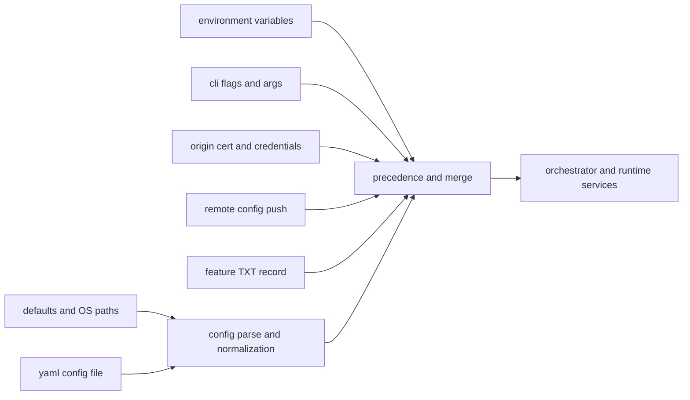
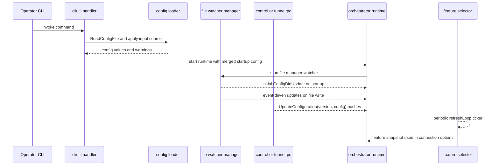

# Config Behavior Catalog

- Baseline date: 20260321
- Baseline reference: [cloudflare/cloudflared/tree/2026.3.0](https://github.com/cloudflare/cloudflared/tree/2026.3.0)
- Primary evidence set: behavior atoms under [../atoms](../../atoms)
- Upstream recheck: cadence and source contracts revalidated against tag `2026.3.0` anchors for [config/configuration.go](https://github.com/cloudflare/cloudflared/blob/2026.3.0/config/configuration.go), [atoms/config/configuration](../../atoms/config/configuration.md), [config/manager.go](https://github.com/cloudflare/cloudflared/blob/2026.3.0/config/manager.go), [atoms/config/manager](../../atoms/config/manager.md), [watcher/file.go](https://github.com/cloudflare/cloudflared/blob/2026.3.0/watcher/file.go), [atoms/watcher/file](../../atoms/watcher/file.md), [features/selector.go](https://github.com/cloudflare/cloudflared/blob/2026.3.0/features/selector.go), [atoms/features/selector](../../atoms/features/selector.md), [orchestration/orchestrator.go](https://github.com/cloudflare/cloudflared/blob/2026.3.0/orchestration/orchestrator.go), [atoms/orchestration/orchestrator](../../atoms/orchestration/orchestrator.md), [tunnelrpc/pogs/configuration_manager.go](https://github.com/cloudflare/cloudflared/blob/2026.3.0/tunnelrpc/pogs/configuration_manager.go), [atoms/tunnelrpc/pogs/configuration_manager](../../atoms/tunnelrpc/pogs/configuration_manager.md), [tunnelrpc/quic/cloudflared_client.go](https://github.com/cloudflare/cloudflared/blob/2026.3.0/tunnelrpc/quic/cloudflared_client.go), [atoms/tunnelrpc/quic/cloudflared_client](../../atoms/tunnelrpc/quic/cloudflared_client.md), and [connection/control.go](https://github.com/cloudflare/cloudflared/blob/2026.3.0/connection/control.go), [atoms/connection/control](../../atoms/connection/control.md).

## Scope

This catalog documents cloudflared configuration behavior end-to-end: where configuration comes from, how precedence is applied, when values are refreshed, and how updates propagate to runtime components.

For this catalog, config behavior includes:

- startup defaults, path discovery, and YAML/JSON decode contracts,
- CLI flag and environment-derived configuration overlays,
- credentials and origin-cert discovery/configuration surfaces,
- ingress and origin-request config model translation,
- runtime config transport contracts over control/RPC surfaces,
- local file-watch reload behavior,
- remote configuration push behavior,
- periodic feature-configuration refresh behavior and cadence.

Out of scope:

- non-config API schema inventory already detailed in [upstream-api-contracts](upstream-api-contracts.md),
- generic transport internals already detailed in [proxying](proxying.md),
- broad tunnel lifecycle state transitions already detailed in [state-machines](state-machines.md).

## Config Source Topology

## Config Lifecycle Sequence

## Cadence Matrix

| Config source | Trigger model | Cadence contract | Merge or precedence behavior | Evidence |
| --- | --- | --- | --- | --- |
| Default directories and file discovery | startup path resolution | one-shot per process command invocation | used when explicit config path is absent; finds first available default file | [config/configuration](../../atoms/config/configuration.md) |
| Config file read and strict warning pass | startup or config path change | lazy load with source-file memoization; rereads when `--config` changes | settings become CLI input source via altsrc; unknown-field warnings surfaced separately | [config/configuration](../../atoms/config/configuration.md), [cmd/cloudflared/cliutil/handler](../../atoms/cmd/cloudflared/cliutil/handler.md) |
| CLI flags and args | operator invocation | one-shot per command execution | can override file-derived values depending on urfave/altsrc precedence for each command context | [cmd/cloudflared/main](../../atoms/cmd/cloudflared/main.md), [cmd/cloudflared/cliutil/handler](../../atoms/cmd/cloudflared/cliutil/handler.md), [cmd/cloudflared/tunnel/configuration](../../atoms/cmd/cloudflared/tunnel/configuration.md) |
| Environment variables and platform defaults | process environment | sampled at startup | merged into config resolution and default path behavior | [config/configuration](../../atoms/config/configuration.md), [cmd/cloudflared/tunnel/configuration](../../atoms/cmd/cloudflared/tunnel/configuration.md) |
| Origin cert and credential file surfaces | startup and on-demand lookup | one-shot lookup per command path using cert or API client setup | file path search and decode guardrails gate identity-bearing config | [credentials/origin_cert](../../atoms/credentials/origin_cert.md), [credentials/credentials](../../atoms/credentials/credentials.md), [cmd/cloudflared/tunnel/credential_finder](../../atoms/cmd/cloudflared/tunnel/credential_finder.md) |
| Local config file watch | fsnotify write events | event-driven, immediate on write; plus initial push on watcher start | watcher callback rereads YAML and emits `ConfigDidUpdate` to runtime | [config/manager](../../atoms/config/manager.md), [watcher/file](../../atoms/watcher/file.md), [watcher/notify](../../atoms/watcher/notify.md) |
| Remote orchestration config | edge push via RPC | event-driven by `UpdateConfiguration(version, config)` | monotonic version guard (`currentVersion >= version` is ignored); local override rules merge selected flags back in | [orchestration/orchestrator](../../atoms/orchestration/orchestrator.md), [tunnelrpc/pogs/configuration_manager](../../atoms/tunnelrpc/pogs/configuration_manager.md), [tunnelrpc/quic/cloudflared_client](../../atoms/tunnelrpc/quic/cloudflared_client.md), [tunnelrpc/quic/cloudflared_server](../../atoms/tunnelrpc/quic/cloudflared_server.md) |
| Local-to-edge config sync | control stream registration path | event-driven when first connection registers and tunnel is not remotely managed | pushes local config JSON through control stream | [connection/control](../../atoms/connection/control.md), [orchestration/orchestrator](../../atoms/orchestration/orchestrator.md) |
| Dynamic feature config (remote TXT) | periodic ticker | startup refresh + recurring refresh loop; upstream default lookup frequency is 1 hour with 10s lookup timeout | feature snapshot influences runtime capability selection (for example datagram version and PQ mode) | [features/selector](../../atoms/features/selector.md), [features/features](../../atoms/features/features.md), [client/config](../../atoms/client/config.md) |

## Domain Map

| Domain | Description | Representative atoms |
| --- | --- | --- |
| Base config model and decoding | Root config structures, duration serialization semantics, config file search, and URL or socket validation contracts. | [config/configuration](../../atoms/config/configuration.md), [config/model](../../atoms/config/model.md), [validation/validation](../../atoms/validation/validation.md) |
| CLI config ingestion and shaping | Root app wrappers, config-file-to-flag binding, warning propagation, and tunnel command config assembly. | [cmd/cloudflared/main](../../atoms/cmd/cloudflared/main.md), [cmd/cloudflared/cliutil/handler](../../atoms/cmd/cloudflared/cliutil/handler.md), [cmd/cloudflared/flags/flags](../../atoms/cmd/cloudflared/flags/flags.md), [cmd/cloudflared/tunnel/configuration](../../atoms/cmd/cloudflared/tunnel/configuration.md) |
| Credential and cert-backed config | Cert path resolution, cert decode, and user/API client config materialization. | [credentials/origin_cert](../../atoms/credentials/origin_cert.md), [credentials/credentials](../../atoms/credentials/credentials.md), [cmd/cloudflared/tunnel/credential_finder](../../atoms/cmd/cloudflared/tunnel/credential_finder.md), [cmd/cloudflared/tunnel/filesystem](../../atoms/cmd/cloudflared/tunnel/filesystem.md) |
| Ingress and origin-request config transforms | Conversion between raw and runtime ingress-origin config, including warp-routing and IP-rule fields. | [ingress/config](../../atoms/ingress/config.md), [orchestration/config](../../atoms/orchestration/config.md) |
| Runtime update orchestration | Versioned remote updates, local override reconciliation, hot-swapped proxies, and runtime config JSON export. | [orchestration/orchestrator](../../atoms/orchestration/orchestrator.md), [connection/control](../../atoms/connection/control.md) |
| Config transport contracts | Cap'n Proto / QUIC RPC config-update interfaces and request or response envelopes. | [tunnelrpc/pogs/configuration_manager](../../atoms/tunnelrpc/pogs/configuration_manager.md), [tunnelrpc/quic/cloudflared_client](../../atoms/tunnelrpc/quic/cloudflared_client.md), [tunnelrpc/quic/cloudflared_server](../../atoms/tunnelrpc/quic/cloudflared_server.md) |
| Dynamic refresh sources | Feature selector periodic refresh and config watcher event loops that mutate effective runtime behavior over time. | [features/selector](../../atoms/features/selector.md), [features/features](../../atoms/features/features.md), [config/manager](../../atoms/config/manager.md), [watcher/file](../../atoms/watcher/file.md), [watcher/notify](../../atoms/watcher/notify.md), [client/config](../../atoms/client/config.md) |

## Precedence and Merge Contracts

| Surface | Contracted behavior |
| --- | --- |
| File-read memoization | Repeated `ReadConfigFile` calls return cached configuration if source path is unchanged; path changes force reread and re-parse. |
| Config-file-to-flag adaptation | Parsed settings are applied to CLI context through `altsrc.ApplyInputSource`, allowing command actions to read normalized flag values. |
| Unknown-field warning lane | A strict YAML pass (`KnownFields(true)`) is used for warning generation while preserving broad compatibility in the primary parse pass. |
| URL/socket exclusivity and validation | URL and unix-socket options are mutually constrained; host and URL validation is delegated to shared validation contracts. |
| Remote-plus-local merge | Remote pushed warp-routing values are merged with selected local configuration overrides before runtime swap. |
| Version monotonicity | Runtime update path applies only newer remote versions and reports last-applied version for stale updates. |
| Runtime swap semantics | New proxy and dialer settings are created first, then old proxy channels are closed to minimize downtime during config updates. |

Primary evidence: [config/configuration](../../atoms/config/configuration.md), [cmd/cloudflared/cliutil/handler](../../atoms/cmd/cloudflared/cliutil/handler.md), [validation/validation](../../atoms/validation/validation.md), [orchestration/orchestrator](../../atoms/orchestration/orchestrator.md), [connection/control](../../atoms/connection/control.md).

## Cadence and Staleness Risk Notes

- Startup-only surfaces (path discovery, initial file parse, credential lookup) do not self-refresh unless a command path re-enters them.
- File watcher updates are edge-triggered by write events and can miss semantic intent if updates do not emit write operations.
- Remote update cadence is producer-driven (edge push), so freshness depends on control-plane update delivery.
- Feature toggles refresh on periodic ticker cadence (default hourly upstream) and can lag behind control-plane pushes by up to one refresh interval.
- Local config push from control stream occurs on connection-registration branch (`connIndex == 0` and not remotely managed), so reconnection timing impacts when edge sees latest local config snapshot.

## Full Coverage Links

- [client/config](../../atoms/client/config.md)
- [cmd/cloudflared/cliutil/handler](../../atoms/cmd/cloudflared/cliutil/handler.md)
- [cmd/cloudflared/flags/flags](../../atoms/cmd/cloudflared/flags/flags.md)
- [cmd/cloudflared/main](../../atoms/cmd/cloudflared/main.md)
- [cmd/cloudflared/tunnel/configuration](../../atoms/cmd/cloudflared/tunnel/configuration.md)
- [cmd/cloudflared/tunnel/credential_finder](../../atoms/cmd/cloudflared/tunnel/credential_finder.md)
- [cmd/cloudflared/tunnel/filesystem](../../atoms/cmd/cloudflared/tunnel/filesystem.md)
- [config/configuration](../../atoms/config/configuration.md)
- [config/manager](../../atoms/config/manager.md)
- [config/model](../../atoms/config/model.md)
- [connection/control](../../atoms/connection/control.md)
- [credentials/credentials](../../atoms/credentials/credentials.md)
- [credentials/origin_cert](../../atoms/credentials/origin_cert.md)
- [features/features](../../atoms/features/features.md)
- [features/selector](../../atoms/features/selector.md)
- [ingress/config](../../atoms/ingress/config.md)
- [orchestration/config](../../atoms/orchestration/config.md)
- [orchestration/orchestrator](../../atoms/orchestration/orchestrator.md)
- [tunnelrpc/pogs/configuration_manager](../../atoms/tunnelrpc/pogs/configuration_manager.md)
- [tunnelrpc/quic/cloudflared_client](../../atoms/tunnelrpc/quic/cloudflared_client.md)
- [tunnelrpc/quic/cloudflared_server](../../atoms/tunnelrpc/quic/cloudflared_server.md)
- [validation/validation](../../atoms/validation/validation.md)
- [watcher/file](../../atoms/watcher/file.md)
- [watcher/notify](../../atoms/watcher/notify.md)

## Upstream-Verified Config Constants and Quirks

_Cross-referenced against [config/configuration.go](https://github.com/cloudflare/cloudflared/blob/2026.3.0/config/configuration.go) at tag `2026.3.0`._

### File Discovery Constants

| Constant | Value | Source |
| --- | --- | --- |
| `DefaultConfigFiles` | `["config.yml", "config.yaml"]` | [config/configuration.go](https://github.com/cloudflare/cloudflared/blob/2026.3.0/config/configuration.go) |
| `DefaultUnixConfigLocation` | `"/usr/local/etc/cloudflared"` | [config/configuration.go](https://github.com/cloudflare/cloudflared/blob/2026.3.0/config/configuration.go) |
| `DefaultUnixLogLocation` | `"/var/log/cloudflared"` | [config/configuration.go](https://github.com/cloudflare/cloudflared/blob/2026.3.0/config/configuration.go) |
| User config dirs | `["~/.cloudflared", "~/.cloudflare-warp", "~/cloudflare-warp"]` | [config/configuration.go](https://github.com/cloudflare/cloudflared/blob/2026.3.0/config/configuration.go) |
| Nix config dirs | `["/etc/cloudflared", "/usr/local/etc/cloudflared"]` | [config/configuration.go](https://github.com/cloudflare/cloudflared/blob/2026.3.0/config/configuration.go) |

### Config File Discovery Behavioral Quirks

- **Quirk — Legacy compatibility dirs.** The `~/.cloudflare-warp` and `~/cloudflare-warp` directories are retained for compatibility with documentation that referenced older naming conventions.

- **Quirk — Windows CFDPATH override.** On Windows, `DefaultConfigDirectory` first checks `CFDPATH` env var; if unset, falls back to `ProgramFiles(x86)/cloudflared`, but only if that directory exists (checked via `os.Stat`).

- **Quirk — Find returns first match.** `FindDefaultConfigPath` iterates user dirs + nix dirs (in that order) × config file names (`config.yml` before `config.yaml`), returning the first path where `FileExists` succeeds. This means `~/.cloudflared/config.yml` takes priority over `/etc/cloudflared/config.yml`.

- **Quirk — Config file memoization.** `ReadConfigFile` caches the result in a package-level `configuration` variable. Subsequent calls with the same `--config` value return the cached result without re-reading. Only a changed config flag value triggers a re-read.

- **Quirk — Two-pass YAML decode.** The config file is parsed twice: once in permissive mode (allowing unknown fields) and once in strict mode (`KnownFields(true)`) to surface unknown-field warnings without failing the primary parse.

- **Quirk — Empty file handling.** An `io.EOF` from the YAML decoder is treated as an empty (but valid) config; an error log is emitted but no failure is returned.

### CustomDuration Serialization Quirk

- **Quirk — JSON seconds vs YAML duration.** `CustomDuration` serializes to seconds (integer) in JSON but to Go duration strings (e.g. `"30s"`) in YAML. This is because JavaScript JSON integer fields are 32-bit limited, which would cap nanosecond-keyed durations to ~2 seconds.

### URL and Socket Exclusivity

- **Quirk — Mutual exclusion enforced.** `ValidateUnixSocket` explicitly rejects the combination of `--unix-socket` with `--url` or positional args.

- **Quirk — URL from args.** `ValidateUrl` can read URLs from positional args (when `allowURLFromArgs` is true) but rejects the combination of both `--url` and positional args.

## Companion Catalog — Const and Env

This catalog shares 8 atoms with [const-and-env](const-and-env.md) ($J = 0.23$), reflecting the boundary between configuration lifecycle management and the symbolic constants that configuration relies on.

### Shared Atom Inventory

| Shared atom | Config perspective | Const-and-env perspective |
| --- | --- | --- |
| [cmd/cloudflared/flags/flags](../../atoms/cmd/cloudflared/flags/flags.md) | Flag definitions consumed during CLI config ingestion | Stable flag-key constants that define the operator-facing contract |
| [cmd/cloudflared/main](../../atoms/cmd/cloudflared/main.md) | Root app wrapper that initializes config-file-to-flag binding | Entry point registering flag-key constant namespaces |
| [cmd/cloudflared/tunnel/configuration](../../atoms/cmd/cloudflared/tunnel/configuration.md) | Tunnel command config assembly and merge logic | Tunnel CLI flag defaults and env-var bindings (TUNNEL_URL, etc.) |
| [config/configuration](../../atoms/config/configuration.md) | Config file discovery, YAML decode, and memoization lifecycle | Default path constants (config filenames, search directories) |
| [features/features](../../atoms/features/features.md) | Feature flag values consumed by runtime config decisions | Feature constant definitions and capability enumeration |
| [features/selector](../../atoms/features/selector.md) | Periodic feature refresh affecting runtime config state | Refresh cadence constants (lookup timeout, refresh interval) |
| [ingress/config](../../atoms/ingress/config.md) | Ingress and origin-request config model translation | Ingress config constant defaults and key names |
| [orchestration/orchestrator](../../atoms/orchestration/orchestrator.md) | Versioned remote config update and proxy hot-swap lifecycle | Orchestrator version constants and update-key naming |

### Boundary Scoping

The config catalog owns the *lifecycle* — how configuration values are discovered, parsed, merged, watched, and propagated to runtime components. The const-and-env catalog owns the *vocabulary* — the stable symbolic names (flag keys, env vars, header constants, timeout values) that configuration surfaces reference. When porting to Rust, this boundary matters: config lifecycle maps to builder/loader patterns and async watch loops, while const-and-env maps to `const` blocks and compile-time definitions. Atoms exclusive to config (credential discovery, watcher/notify, config/manager, orchestration/config, validation, RPC config transport) handle runtime config plumbing. Atoms exclusive to const-and-env (protocol constants, header constants, QUIC constants, diagnostic constants, token paths, metrics config) define the fixed values that config plumbing delivers.

## Notes

- This catalog is source-of-truth oriented: configuration behavior is grouped by source and cadence first, then by subsystem ownership.
- Cross-catalog overlap is intentional with [cli](cli.md), [platforms](platforms.md), [state-machines](state-machines.md), [tunnels](tunnels.md), and [const-and-env](const-and-env.md) because configuration intersects command entry, runtime state, constant vocabulary, and control-plane protocols.

## Coverage Audit

- Audit method: collect config-scoped atoms across base config (`config/*`), ingestion wrappers (`cmd/cloudflared/{main,flags/flags,cliutil/handler,tunnel/configuration,tunnel/credential_finder,tunnel/filesystem}`), identity and validation (`credentials/*`, `validation/validation`), runtime update paths (`orchestration/{config,orchestrator}`, `connection/control`, `tunnelrpc/{pogs/configuration_manager,quic/cloudflared_client,quic/cloudflared_server}`), dynamic refresh (`features/{features,selector}`, `watcher/{file,notify}`), and ingress config transforms (`ingress/config`), then diff against all atom links listed in this catalog.
- Current coverage result: 24 config-scoped atom docs found, 24 linked in catalog, 0 missing.
- Delta (catalog links - config-scoped atom docs): 0.
- Operational guardrail: if any config source, merge path, or cadence surface changes, rerun this audit and update this file in the same change.
