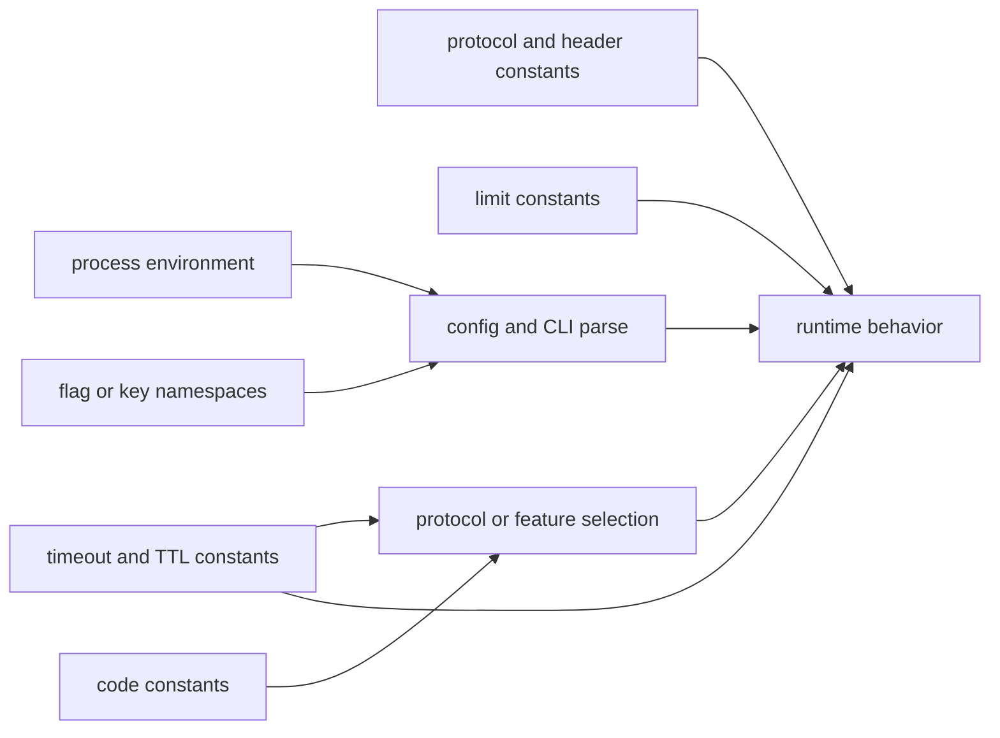
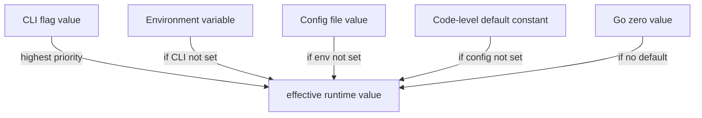
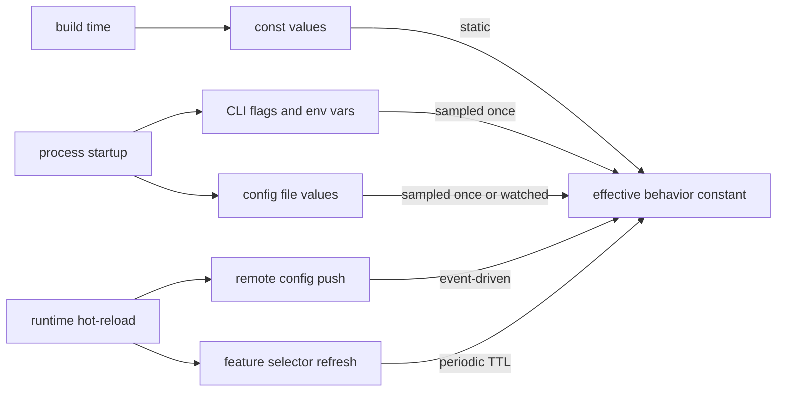

# Const and Env Behavior Catalog

- Baseline date: 20260321
- Baseline reference: [cloudflare/cloudflared/tree/2026.3.0](https://github.com/cloudflare/cloudflared/tree/2026.3.0)
- Primary evidence set: behavior atoms under [../atoms](../../atoms)
- Upstream recheck: key constant and env surfaces revalidated against tag `2026.3.0` anchors for [config/configuration.go](https://github.com/cloudflare/cloudflared/blob/2026.3.0/config/configuration.go), [atoms/config/configuration](../../atoms/config/configuration.md), [cmd/cloudflared/access/cmd.go](https://github.com/cloudflare/cloudflared/blob/2026.3.0/cmd/cloudflared/access/cmd.go), [atoms/cmd/cloudflared/access/cmd](../../atoms/cmd/cloudflared/access/cmd.md), [cmd/cloudflared/flags/flags.go](https://github.com/cloudflare/cloudflared/blob/2026.3.0/cmd/cloudflared/flags/flags.go), [atoms/cmd/cloudflared/flags/flags](../../atoms/cmd/cloudflared/flags/flags.md), [cmd/cloudflared/tunnel/configuration.go](https://github.com/cloudflare/cloudflared/blob/2026.3.0/cmd/cloudflared/tunnel/configuration.go), [atoms/cmd/cloudflared/tunnel/configuration](../../atoms/cmd/cloudflared/tunnel/configuration.md), [connection/protocol.go](https://github.com/cloudflare/cloudflared/blob/2026.3.0/connection/protocol.go), [atoms/connection/protocol](../../atoms/connection/protocol.md), [connection/header.go](https://github.com/cloudflare/cloudflared/blob/2026.3.0/connection/header.go), [atoms/connection/header](../../atoms/connection/header.md), [diagnostic/consts.go](https://github.com/cloudflare/cloudflared/blob/2026.3.0/diagnostic/consts.go), [atoms/diagnostic/consts](../../atoms/diagnostic/consts.md), [features/selector.go](https://github.com/cloudflare/cloudflared/blob/2026.3.0/features/selector.go), [atoms/features/selector](../../atoms/features/selector.md), [quic/constants.go](https://github.com/cloudflare/cloudflared/blob/2026.3.0/quic/constants.go), [atoms/quic/constants](../../atoms/quic/constants.md), and [token/path.go](https://github.com/cloudflare/cloudflared/blob/2026.3.0/token/path.go), [atoms/token/path](../../atoms/token/path.md).

## Scope

This catalog documents behaviorally relevant constants and environment-variable surfaces in cloudflared: symbolic keys, protocol and header constants, timeout and cadence constants, and process-environment inputs that shape runtime behavior.

For this catalog, const-and-env behavior includes:

- command and config key constants that define stable operator-facing contracts,
- transport/protocol and header constants that shape edge interoperability,
- timeout/TTL and cadence constants used in retries, selectors, and diagnostics,
- environment-variable ingestion points used for config pathing and command behavior,
- constant-bound limits and defaults that constrain runtime behavior.

Out of scope:

- exhaustive literal values that are purely local implementation details,
- API payload schema cataloging already covered in [upstream-api-contracts](upstream-api-contracts.md),
- full configuration-source lifecycle inventory already covered in [config](config.md).

## Topology

## Cadence Timeline

```mermaid
gantt
    title Const and Env Cadence Model
    dateFormat  X
    axisFormat  %s
    section Startup-sampled
    Env vars sampled at process command start: done, 0, 1
    CLI/flag constant keys resolved: done, 0, 1
    section Event-driven
    Config push through control or RPC surfaces: active, 1, 1
    section Periodic
    Feature TXT refresh loop tick (default hourly): active, 1, 4
    Protocol remote percentage refresh window (ResolveTTL): active, 1, 4
    section Static compile-time
    Protocol/header/diagnostic/quic constants: done, 0, 4
```

## Environment Variable Inventory

| Env var | Surface | Behavior contract | Cadence |
|---|---|---|---|
| `CFDPATH` | config directory resolution | Windows config directory selection path in default config lookup logic. | startup sampled |
| `ProgramFiles(x86)` | config directory fallback | Windows default directory fallback when `CFDPATH` is unset. | startup sampled |
| `HOME` | access SSH config generation | Used when rendering SSH config template output. | command invocation |
| `PATH` | access binary lookup | Used to locate `cloudflared` executable when direct executable path lookup fails. | command invocation |
| `TUNNEL_SERVICE_HOSTNAME` | access TCP or SSH command flag env binding | Environment-backed default for access service hostname flag. | command invocation |
| `TUNNEL_SERVICE_DESTINATION` | access TCP or SSH command flag env binding | Environment-backed default for destination flag. | command invocation |
| `TUNNEL_SERVICE_URL` | access TCP or SSH command flag env binding | Environment-backed default for listener URL flag. | command invocation |

Primary evidence: [config/configuration](../../atoms/config/configuration.md), [cmd/cloudflared/access/cmd](../../atoms/cmd/cloudflared/access/cmd.md), [cmd/cloudflared/tunnel/configuration](../../atoms/cmd/cloudflared/tunnel/configuration.md), [token/path](../../atoms/token/path.md).

## Constant Domains

| Domain | Description | Representative constants and surfaces |
|---|---|---|
| Flag and key namespace constants | Stable CLI and config flag keys used across command and runtime construction. | [cmd/cloudflared/flags/flags](../../atoms/cmd/cloudflared/flags/flags.md), [cmd/cloudflared/main](../../atoms/cmd/cloudflared/main.md), [cmd/cloudflared/tunnel/configuration](../../atoms/cmd/cloudflared/tunnel/configuration.md) |
| Config path and file defaults | Default config filenames and search directories, plus OS-specific fallback path constants. | [config/configuration](../../atoms/config/configuration.md), [token/path](../../atoms/token/path.md) |
| Protocol selection constants | Auto-select token, server-name constants, protocol list ordering, and protocol refresh TTL. | [connection/protocol](../../atoms/connection/protocol.md), [features/selector](../../atoms/features/selector.md) |
| Header and metadata constants | Internal header names and control-response allowlist prefixes for proxy/control paths. | [connection/header](../../atoms/connection/header.md) |
| Timeout and cadence constants | QUIC, feature-lookup, diagnostic, and runtime-check interval constants that define timing semantics. | [quic/constants](../../atoms/quic/constants.md), [features/selector](../../atoms/features/selector.md), [diagnostic/consts](../../atoms/diagnostic/consts.md), [cmd/cloudflared/access/cmd](../../atoms/cmd/cloudflared/access/cmd.md), [connection/protocol](../../atoms/connection/protocol.md) |
| Limits and bounds constants | Hard bounds that cap resolver counts, stream limits, and diagnostic batch sizes. | [quic/constants](../../atoms/quic/constants.md), [cmd/cloudflared/tunnel/configuration](../../atoms/cmd/cloudflared/tunnel/configuration.md), [diagnostic/consts](../../atoms/diagnostic/consts.md) |
| Token and identity constant-bearing paths | Token path-naming contracts and stable claim-validation guardrails in token flows. | [token/path](../../atoms/token/path.md), [token/token](../../atoms/token/token.md), [management/token](../../atoms/management/token.md) |

## Notable Constant Contracts

| Surface | Contracted behavior |
|---|---|
| Config defaults | Default config filenames and search roots provide deterministic fallback ordering for config discovery. |
| Protocol autoselect | `auto` protocol mode and `ResolveTTL` timing govern when protocol percentages are refreshed and reevaluated. |
| Feature refresh cadence | Feature selector constants define lookup timeout and periodic refresh frequency; startup fetch occurs before steady-state loop. |
| QUIC transport timers | QUIC handshake and idle timeout constants provide fixed baseline timing guardrails in transport setup. |
| Diagnostic collection defaults | Diagnostic constants define collector timeouts, endpoint path constants, artifact naming, and bounded log-line windows. |
| Header sanitation surface | Internal header constants and prefix checks constrain which control-plane headers propagate toward clients. |
| Flag key stability | Centralized flag-key constants prevent drift between parsing, config override maps, and downstream runtime structs. |

Primary evidence: [config/configuration](../../atoms/config/configuration.md), [connection/protocol](../../atoms/connection/protocol.md), [features/selector](../../atoms/features/selector.md), [quic/constants](../../atoms/quic/constants.md), [diagnostic/consts](../../atoms/diagnostic/consts.md), [connection/header](../../atoms/connection/header.md), [cmd/cloudflared/flags/flags](../../atoms/cmd/cloudflared/flags/flags.md).

## Cadence and Freshness Notes

- Compile-time constants are static per build and change only across releases.
- Environment variables are sampled at command or process startup and are not hot-reloaded by long-running loops.
- Feature and protocol selectors use explicit refresh time constants (periodic fetch windows), making them the primary const-governed dynamic knobs.
- Remote config pushes are event-driven; they interact with constants mostly through fixed key names and timeout semantics.
- Some const-bearing files are support-only (no exported functions) but still define external behavioral contracts (for example flag names and header keys).

## Full Coverage Links

- [cfapi/base_client](../../atoms/cfapi/base_client.md)
- [cmd/cloudflared/access/cmd](../../atoms/cmd/cloudflared/access/cmd.md)
- [cmd/cloudflared/cliutil/build_info](../../atoms/cmd/cloudflared/cliutil/build_info.md)
- [cmd/cloudflared/flags/flags](../../atoms/cmd/cloudflared/flags/flags.md)
- [cmd/cloudflared/main](../../atoms/cmd/cloudflared/main.md)
- [cmd/cloudflared/tunnel/configuration](../../atoms/cmd/cloudflared/tunnel/configuration.md)
- [config/configuration](../../atoms/config/configuration.md)
- [connection/header](../../atoms/connection/header.md)
- [connection/protocol](../../atoms/connection/protocol.md)
- [diagnostic/consts](../../atoms/diagnostic/consts.md)
- [features/features](../../atoms/features/features.md)
- [features/selector](../../atoms/features/selector.md)
- [ingress/config](../../atoms/ingress/config.md)
- [management/token](../../atoms/management/token.md)
- [metrics/config](../../atoms/metrics/config.md)
- [orchestration/orchestrator](../../atoms/orchestration/orchestrator.md)
- [quic/constants](../../atoms/quic/constants.md)
- [token/path](../../atoms/token/path.md)
- [token/token](../../atoms/token/token.md)

## Upstream-Verified Constant Values and Environment Quirks

_Cross-referenced against [cmd/cloudflared/tunnel/cmd.go](https://github.com/cloudflare/cloudflared/blob/2026.3.0/cmd/cloudflared/tunnel/cmd.go), [config/configuration.go](https://github.com/cloudflare/cloudflared/blob/2026.3.0/config/configuration.go), and [metrics/metrics.go](https://github.com/cloudflare/cloudflared/blob/2026.3.0/metrics/metrics.go) at tag `2026.3.0`._

### Tunnel CLI Flag Defaults

| Flag | Default value | Env var | Source |
|---|---|---|---|
| `--ha-connections` | `4` | — | [cmd/cloudflared/tunnel/cmd.go](https://github.com/cloudflare/cloudflared/blob/2026.3.0/cmd/cloudflared/tunnel/cmd.go) |
| `--retries` | `5` | `TUNNEL_RETRIES` | [cmd/cloudflared/tunnel/cmd.go](https://github.com/cloudflare/cloudflared/blob/2026.3.0/cmd/cloudflared/tunnel/cmd.go) |
| `--max-edge-addr-retries` | `8` | — | [cmd/cloudflared/tunnel/cmd.go](https://github.com/cloudflare/cloudflared/blob/2026.3.0/cmd/cloudflared/tunnel/cmd.go) |
| `--rpc-timeout` | `5 s` | — | [cmd/cloudflared/tunnel/cmd.go](https://github.com/cloudflare/cloudflared/blob/2026.3.0/cmd/cloudflared/tunnel/cmd.go) |
| `--dial-edge-timeout` | `15 s` | `DIAL_EDGE_TIMEOUT` | [cmd/cloudflared/tunnel/cmd.go](https://github.com/cloudflare/cloudflared/blob/2026.3.0/cmd/cloudflared/tunnel/cmd.go) |
| `--grace-period` | `30 s` | `TUNNEL_GRACE_PERIOD` | [cmd/cloudflared/tunnel/cmd.go](https://github.com/cloudflare/cloudflared/blob/2026.3.0/cmd/cloudflared/tunnel/cmd.go) |
| `--heartbeat-interval` | `5 s` | — | [cmd/cloudflared/tunnel/cmd.go](https://github.com/cloudflare/cloudflared/blob/2026.3.0/cmd/cloudflared/tunnel/cmd.go) |
| `--heartbeat-count` | `5` | — | [cmd/cloudflared/tunnel/cmd.go](https://github.com/cloudflare/cloudflared/blob/2026.3.0/cmd/cloudflared/tunnel/cmd.go) |
| `--write-stream-timeout` | `0` (disabled) | `TUNNEL_WRITE_STREAM_TIMEOUT` | [cmd/cloudflared/tunnel/cmd.go](https://github.com/cloudflare/cloudflared/blob/2026.3.0/cmd/cloudflared/tunnel/cmd.go) |
| `--edge-ip-version` | `"4"` | `TUNNEL_EDGE_IP_VERSION` | [cmd/cloudflared/tunnel/cmd.go](https://github.com/cloudflare/cloudflared/blob/2026.3.0/cmd/cloudflared/tunnel/cmd.go) |
| `--management-hostname` | `"management.argotunnel.com"` | `TUNNEL_MANAGEMENT_HOSTNAME` | [cmd/cloudflared/tunnel/cmd.go](https://github.com/cloudflare/cloudflared/blob/2026.3.0/cmd/cloudflared/tunnel/cmd.go) |
| `--quick-service` | `"https://api.trycloudflare.com"` | — | [cmd/cloudflared/tunnel/cmd.go](https://github.com/cloudflare/cloudflared/blob/2026.3.0/cmd/cloudflared/tunnel/cmd.go) |
| `--management-diagnostics` | `true` | `TUNNEL_MANAGEMENT_DIAGNOSTICS` | [cmd/cloudflared/tunnel/cmd.go](https://github.com/cloudflare/cloudflared/blob/2026.3.0/cmd/cloudflared/tunnel/cmd.go) |
| `--url` | `"http://localhost:8080"` | `TUNNEL_URL` | [cmd/cloudflared/tunnel/cmd.go](https://github.com/cloudflare/cloudflared/blob/2026.3.0/cmd/cloudflared/tunnel/cmd.go) |

### QUIC Flow Control Constants

| Constant | Value | Env var | Source |
|---|---|---|---|
| `--quic-conn-level-flow-control-limit` | 30 MB (`30 * (1 << 20)`) | `TUNNEL_QUIC_CONN_LEVEL_FLOW_CONTROL_LIMIT` | [cmd/cloudflared/tunnel/cmd.go](https://github.com/cloudflare/cloudflared/blob/2026.3.0/cmd/cloudflared/tunnel/cmd.go) |
| `--quic-stream-level-flow-control-limit` | 6 MB (`6 * (1 << 20)`) | `TUNNEL_QUIC_STREAM_LEVEL_FLOW_CONTROL_LIMIT` | [cmd/cloudflared/tunnel/cmd.go](https://github.com/cloudflare/cloudflared/blob/2026.3.0/cmd/cloudflared/tunnel/cmd.go) |

### Metrics Server Constants

| Constant | Value | Source |
|---|---|---|
| `startupTime` | 500 ms | [metrics/metrics.go](https://github.com/cloudflare/cloudflared/blob/2026.3.0/metrics/metrics.go) |
| `defaultShutdownTimeout` | 15 s | [metrics/metrics.go](https://github.com/cloudflare/cloudflared/blob/2026.3.0/metrics/metrics.go) |
| `ReadTimeout` / `WriteTimeout` | 10 s each | [metrics/metrics.go](https://github.com/cloudflare/cloudflared/blob/2026.3.0/metrics/metrics.go) |
| Known ports (host) | `20241..20245` on `localhost` | [metrics/metrics.go](https://github.com/cloudflare/cloudflared/blob/2026.3.0/metrics/metrics.go) |
| Known ports (virtual) | `20241..20245` on `0.0.0.0` | [metrics/metrics.go](https://github.com/cloudflare/cloudflared/blob/2026.3.0/metrics/metrics.go) |
| Default address (host) | `localhost:0` | [metrics/metrics.go](https://github.com/cloudflare/cloudflared/blob/2026.3.0/metrics/metrics.go) |
| Default address (virtual) | `0.0.0.0:0` | [metrics/metrics.go](https://github.com/cloudflare/cloudflared/blob/2026.3.0/metrics/metrics.go) |

### Environment Ingest Quirks

- **Quirk — TUNNEL_EDGE env vars are hidden.** The `--edge` flag (env `TUNNEL_EDGE`) is marked `Hidden: true` and documented as only working in "Cloudflare's internal testing environment."

- **Quirk — Deprecated flags preserved for script compatibility.** `--proxy-connection-timeout` and `--proxy-expect-continue-timeout` no longer have any effect but remain registered with default `90s` values to avoid breaking existing operator scripts.

- **Quirk — deprecated API flags.** `--api-key`, `--api-email`, `--api-ca-key` are retained with `Hidden: true` and a usage message noting deprecation since version 2017.10.1.

- **Quirk — Non-secret flags allowlist.** The `nonSecretFlagsList` explicitly whitelists which CLI flag values may be collected for diagnostics, preventing accidental credential leakage in diagnostic reports.

- **Quirk — Sentry DSN hardcoded.** The Sentry DSN is embedded as a string constant in [cmd/cloudflared/tunnel/cmd.go](https://github.com/cloudflare/cloudflared/blob/2026.3.0/cmd/cloudflared/tunnel/cmd.go).

## Constant Resolution Precedence

Cloudflared uses a layered resolution model where runtime behavior constants can originate from multiple sources with defined precedence.

### Override Chain Analysis

The 5-layer resolution applies differently across cloudflared subsystems:

| Layer | Mechanism | Timing | Examples |
|---|---|---|---|
| CLI flag | `urfave/cli` flag parsing with env binding | Process startup | `--ha-connections`, `--retries`, `--edge-ip-version` |
| Environment variable | `os.Getenv` or `EnvVar` in flag registration | Process startup | `TUNNEL_RETRIES`, `DIAL_EDGE_TIMEOUT`, `CFDPATH` |
| Config file | YAML config loaded via `config/configuration` or remote push | Startup or hot-reload | ingress rules, origin request settings, warp-routing config |
| Code default | `const` or `var` in Go source | Compile time | `tunnelRetryDuration`, `defaultCloseIdleAfter`, flow control limits |
| Zero value | Go type zero | N/A | 0 for integers, empty string, nil for pointers |

### Rust Const and Static Mapping

| Go pattern | Rust equivalent | Porting note |
|---|---|---|
| Package-level `const` block | `const` or `static` items | Rust `const` is always compile-time; no package-level init |
| `var` with computed init value | `lazy_static!` or `std::sync::LazyLock` | Required when value needs runtime computation |
| `init()` for Prometheus registration | Module-level `LazyLock` or explicit init function | Go `init()` has no Rust equivalent; must be called explicitly |
| `os.Getenv` at call site | `std::env::var` | Same lazy-read pattern; consider caching in config struct |
| Build-tagged const files | `cfg(target_os)` conditional compilation | Direct mapping for platform-specific constants |

## Notes

- Overlap with [config](config.md), [cli](cli.md), [platforms](platforms.md), and [state-machines](state-machines.md) is intentional and aligned with the catalog style.
- This catalog focuses on symbolic keys and timing constants that influence behavior, not every literal scalar in implementation code.

## Coverage Audit

- Audit method: collect const-and-env scoped atoms across env-bearing command/config paths (`config/configuration`, `cmd/cloudflared/access/cmd`, `cmd/cloudflared/tunnel/configuration`, `token/path`), centralized key/flag/constants modules (`cmd/cloudflared/flags/flags`, `connection/header`, `connection/protocol`, `diagnostic/consts`, `quic/constants`), and const-governed runtime consumers (`features/{features,selector}`, `token/token`, `management/token`, `orchestration/orchestrator`, `metrics/config`, `cmd/cloudflared/{main,cliutil/build_info}`, `cfapi/base_client`, `ingress/config`), then diff against all atom links listed in this catalog.
- Current coverage result: 19 const-and-env scoped atom docs found, 19 linked in catalog, 0 missing.
- Delta (catalog links - const-and-env scoped atom docs): 0.
- Operational guardrail: if flag keys, env bindings, protocol/header constants, or timing constants are added or renamed, rerun this audit and update this file in the same change.
