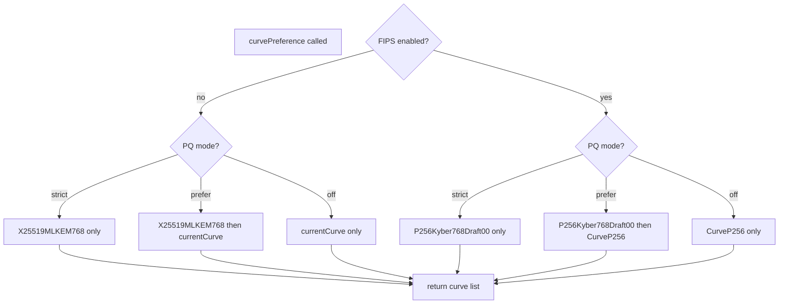
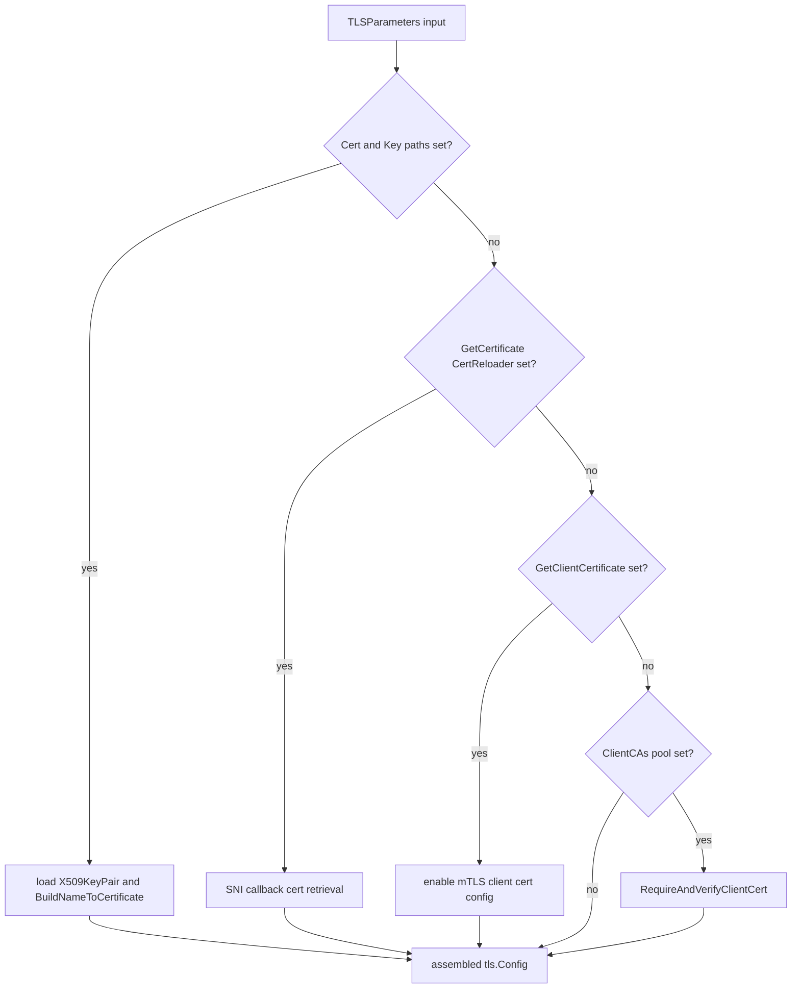
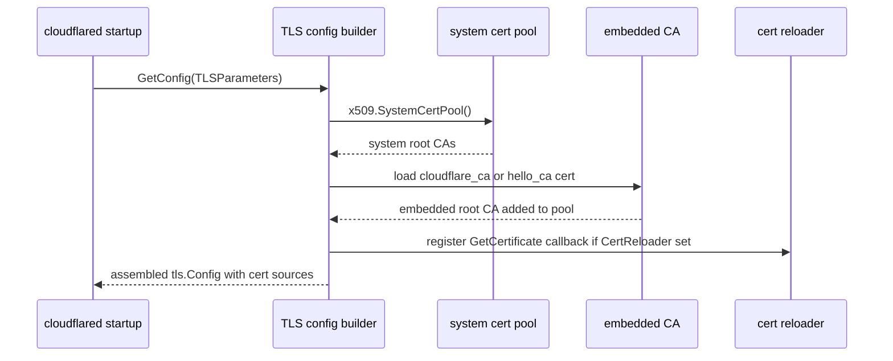

# Cryptography Usage Catalog

- Baseline date: 20260320
- Baseline reference: [cloudflare/cloudflared/tree/2026.3.0](https://github.com/cloudflare/cloudflared/tree/2026.3.0)
- Primary evidence set: behavior atoms under [../atoms](../../atoms)

## Scope

This catalog records cryptography-related usage in the baseline audit corpus.

- Direct evidence: imports explicitly listed in behavior-atom documents for non-vendor, non-test Go implementation files.

## Post-Quantum Crypto Profile

Post-quantum cryptography is actively used in tunnel negotiation paths.

| Aspect | Source-backed detail | Evidence |
| --- | --- | --- |
| Activation path | `needPQ` in protocol selection forces QUIC path selection. | [connection/protocol](../../atoms/connection/protocol.md) and [cloudflare/cloudflared/connection/protocol.go](https://github.com/cloudflare/cloudflared/blob/2026.3.0/connection/protocol.go), [atoms/connection/protocol](../../atoms/connection/protocol.md) |
| PQ negotiation function | `curvePreference(pqMode, fipsEnabled, currentCurve)` computes TLS curve preferences for post-quantum modes. | [supervisor/pqtunnels](../../atoms/supervisor/pqtunnels.md) and [cloudflare/cloudflared/supervisor/pqtunnels.go](https://github.com/cloudflare/cloudflared/blob/2026.3.0/supervisor/pqtunnels.go), [atoms/supervisor/pqtunnels](../../atoms/supervisor/pqtunnels.md) |
| Non-FIPS strict/prefer curve | `X25519MLKEM768` (`tls.CurveID(0x11ec)`). | [cloudflare/cloudflared/supervisor/pqtunnels.go](https://github.com/cloudflare/cloudflared/blob/2026.3.0/supervisor/pqtunnels.go), [atoms/supervisor/pqtunnels](../../atoms/supervisor/pqtunnels.md) |
| FIPS strict curve | `P256Kyber768Draft00` (`tls.CurveID(0xfe32)`). | [cloudflare/cloudflared/supervisor/pqtunnels.go](https://github.com/cloudflare/cloudflared/blob/2026.3.0/supervisor/pqtunnels.go), [atoms/supervisor/pqtunnels](../../atoms/supervisor/pqtunnels.md) |
| FIPS prefer ordering | PQ-first then classical fallback (`P256Kyber768Draft00`, then `tls.CurveP256`). | [cloudflare/cloudflared/supervisor/pqtunnels.go](https://github.com/cloudflare/cloudflared/blob/2026.3.0/supervisor/pqtunnels.go), [atoms/supervisor/pqtunnels](../../atoms/supervisor/pqtunnels.md) |
| Compliance gating | Build-tagged FIPS mode enables `crypto/tls/fipsonly`; non-FIPS build does not. | [fips/fips](../../atoms/fips/fips.md), [fips/nofips](../../atoms/fips/nofips.md), and [cloudflare/cloudflared/fips/fips.go](https://github.com/cloudflare/cloudflared/blob/2026.3.0/fips/fips.go), [atoms/fips/fips](../../atoms/fips/fips.md) |

- Explicit conclusion: this baseline includes hybrid PQ key-exchange variants in runtime TLS curve selection logic, not just classical TLS.

## Direct Crypto Imports in Behavior Atoms

| Import | Atom count | Atom references | Usage | Notes |
| --- | ---: | --- | --- | --- |
| `crypto/tls` | 14 | [carrier/carrier](../../atoms/carrier/carrier.md), [tlsconfig/tlsconfig](../../atoms/tlsconfig/tlsconfig.md), [tlsconfig/hello_ca](../../atoms/tlsconfig/hello_ca.md), [tlsconfig/certreloader](../../atoms/tlsconfig/certreloader.md), [edgediscovery/dial](../../atoms/edgediscovery/dial.md), [edgediscovery/allregions/discovery](../../atoms/edgediscovery/allregions/discovery.md), [supervisor/tunnel](../../atoms/supervisor/tunnel.md), [supervisor/pqtunnels](../../atoms/supervisor/pqtunnels.md), [cmd/cloudflared/tunnel/configuration](../../atoms/cmd/cloudflared/tunnel/configuration.md), [cmd/cloudflared/access/carrier](../../atoms/cmd/cloudflared/access/carrier.md), [ingress/origin_service](../../atoms/ingress/origin_service.md), [ingress/origin_proxy](../../atoms/ingress/origin_proxy.md), [hello/hello](../../atoms/hello/hello.md), [connection/quic](../../atoms/connection/quic.md) | TLS transport and handshake behavior | Transport security surface; details remain in linked atoms |
| `crypto/x509` | 5 | [tlsconfig/tlsconfig](../../atoms/tlsconfig/tlsconfig.md), [tlsconfig/hello_ca](../../atoms/tlsconfig/hello_ca.md), [tlsconfig/cloudflare_ca](../../atoms/tlsconfig/cloudflare_ca.md), [tlsconfig/certreloader](../../atoms/tlsconfig/certreloader.md), [sshgen/sshgen](../../atoms/sshgen/sshgen.md) | Certificate parsing/verification and trust material handling | CA and cert chain management surface |
| `crypto/rand` | 4 | [cmd/cloudflared/tunnel/subcommands](../../atoms/cmd/cloudflared/tunnel/subcommands.md), [ingress/origins/dns](../../atoms/ingress/origins/dns.md), [token/encrypt](../../atoms/token/encrypt.md), [sshgen/sshgen](../../atoms/sshgen/sshgen.md) | Secret generation (`generateTunnelSecret`) and random resolver index selection in `getAddress` | DNS path explicitly marks random selection as non-security-sensitive and used for linter compliance |
| `crypto/sha256` | 2 | [cmd/cloudflared/cliutil/build_info](../../atoms/cmd/cloudflared/cliutil/build_info.md), [config/model](../../atoms/config/model.md) | Binary self-hash and `Forwarder.Hash` computation | Digest usage in identity/fingerprint-style paths |
| `crypto/sha1` | 1 | [websocket/websocket](../../atoms/websocket/websocket.md) | RFC-6455 WebSocket accept-key generation in `generateAcceptKey` (`sha1` + `base64` over challenge + GUID) | Standard WebSocket handshake behavior; not used for confidentiality or payload integrity |
| `crypto/ecdsa` | 1 | [sshgen/sshgen](../../atoms/sshgen/sshgen.md) | SSH key generation/signing primitives | Key lifecycle path |
| `crypto/elliptic` | 1 | [sshgen/sshgen](../../atoms/sshgen/sshgen.md) | Elliptic curve selection for SSH key material | Key lifecycle path |
| `crypto/tls/fipsonly` | 1 | [fips/fips](../../atoms/fips/fips.md) | FIPS-only TLS mode entrypoint | Narrow, explicitly scoped usage |

## Version and Variant Specificity Matrix

This section records version/variant/bit details verified against upstream source where atom summaries are too coarse.

| Crypto surface | Explicit version or variant detail in atom docs | Explicit bit-length detail in atom docs | Atoms using this surface |
| --- | --- | --- | --- |
| TLS protocol versioning | Source-verified in [cloudflare/cloudflared/tlsconfig/tlsconfig.go](https://github.com/cloudflare/cloudflared/blob/2026.3.0/tlsconfig/tlsconfig.go), [atoms/tlsconfig/tlsconfig](../../atoms/tlsconfig/tlsconfig.md): `TLSParameters.MinVersion` and `TLSParameters.MaxVersion` are configurable; source comment documents defaults when zero as min TLS 1.0 and max latest supported (currently TLS 1.3). | Version fields are `uint16`; no fixed bit-length constants beyond Go TLS version encodings are declared in this file. | [tlsconfig/tlsconfig](../../atoms/tlsconfig/tlsconfig.md), [connection/quic](../../atoms/connection/quic.md), [ingress/origin_service](../../atoms/ingress/origin_service.md), [ingress/origin_proxy](../../atoms/ingress/origin_proxy.md), [hello/hello](../../atoms/hello/hello.md), [cmd/cloudflared/tunnel/configuration](../../atoms/cmd/cloudflared/tunnel/configuration.md), [carrier/carrier](../../atoms/carrier/carrier.md), [edgediscovery/dial](../../atoms/edgediscovery/dial.md), [edgediscovery/allregions/discovery](../../atoms/edgediscovery/allregions/discovery.md), [supervisor/tunnel](../../atoms/supervisor/tunnel.md), [supervisor/pqtunnels](../../atoms/supervisor/pqtunnels.md), [cmd/cloudflared/access/carrier](../../atoms/cmd/cloudflared/access/carrier.md), [tlsconfig/hello_ca](../../atoms/tlsconfig/hello_ca.md), [tlsconfig/certreloader](../../atoms/tlsconfig/certreloader.md) |
| TLS compliance mode | FIPS variant is explicitly signaled by `crypto/tls/fipsonly` import. | Not explicitly documented. | [fips/fips](../../atoms/fips/fips.md) |
| TLS curve negotiation variant | Source-verified in [cloudflare/cloudflared/supervisor/pqtunnels.go](https://github.com/cloudflare/cloudflared/blob/2026.3.0/supervisor/pqtunnels.go), [atoms/supervisor/pqtunnels](../../atoms/supervisor/pqtunnels.md): explicit PQ/hybrid curve IDs include `0x11ec` (`X25519MLKEM768`) and `0xfe32` (`P256Kyber768Draft00`), with FIPS-gated curve preference logic; default non-PQ curve in [cloudflare/cloudflared/tlsconfig/tlsconfig.go](https://github.com/cloudflare/cloudflared/blob/2026.3.0/tlsconfig/tlsconfig.go), [atoms/tlsconfig/tlsconfig](../../atoms/tlsconfig/tlsconfig.md) is `tls.CurveP256` when unspecified. | Exact curve IDs are explicit for PQ entries (`0x11ec`, `0xfe32`, legacy `0x6399` constant retained); classical default curve family is P-256. | [supervisor/pqtunnels](../../atoms/supervisor/pqtunnels.md), [tlsconfig/tlsconfig](../../atoms/tlsconfig/tlsconfig.md) |
| Hash algorithm variant | Explicit algorithms: `sha1` for RFC-6455 accept-key generation and `sha256` for build/config hashing paths; verified in [cloudflare/cloudflared/websocket/websocket.go](https://github.com/cloudflare/cloudflared/blob/2026.3.0/websocket/websocket.go), [atoms/websocket/websocket](../../atoms/websocket/websocket.md). | Standard digest widths are 160-bit (`SHA-1`) and 256-bit (`SHA-256`) by algorithm definition. | [websocket/websocket](../../atoms/websocket/websocket.md), [cmd/cloudflared/cliutil/build_info](../../atoms/cmd/cloudflared/cliutil/build_info.md), [config/model](../../atoms/config/model.md) |
| Asymmetric key algorithm variant | Source-verified in [cloudflare/cloudflared/sshgen/sshgen.go](https://github.com/cloudflare/cloudflared/blob/2026.3.0/sshgen/sshgen.go), [atoms/sshgen/sshgen](../../atoms/sshgen/sshgen.md): SSH keypair generation uses `ecdsa.GenerateKey(elliptic.P256(), rand.Reader)` and serializes as EC private/public key material. | P-256 curve implies 256-bit elliptic-curve domain parameters for generated ECDSA keys. | [sshgen/sshgen](../../atoms/sshgen/sshgen.md), [tlsconfig/tlsconfig](../../atoms/tlsconfig/tlsconfig.md), [tlsconfig/hello_ca](../../atoms/tlsconfig/hello_ca.md), [tlsconfig/cloudflare_ca](../../atoms/tlsconfig/cloudflare_ca.md), [tlsconfig/certreloader](../../atoms/tlsconfig/certreloader.md) |
| Token crypto suite versioning | Explicit module-version variants are documented in imports: `github.com/go-jose/go-jose/v4` and `github.com/go-jose/go-jose/v4/jwt`; sealed-box path in [cloudflare/cloudflared/token/encrypt.go](https://github.com/cloudflare/cloudflared/blob/2026.3.0/token/encrypt.go), [atoms/token/encrypt](../../atoms/token/encrypt.md) uses `golang.org/x/crypto/nacl/box` (Curve25519 + XSalsa20-Poly1305 per source comments). | `nacl/box` key arrays are `[32]byte`; nonce is `[24]byte` in the source implementation. | [token/token](../../atoms/token/token.md), [management/token](../../atoms/management/token.md), [sshgen/sshgen](../../atoms/sshgen/sshgen.md), [token/encrypt](../../atoms/token/encrypt.md) |

## External Crypto and Token Libraries in Behavior Atoms

| Import | Atom count | Atom references |
| --- | ---: | --- |
| `github.com/go-jose/go-jose/v4` | 3 | [token/token](../../atoms/token/token.md), [sshgen/sshgen](../../atoms/sshgen/sshgen.md), [management/token](../../atoms/management/token.md) |
| `github.com/go-jose/go-jose/v4/jwt` | 2 | [sshgen/sshgen](../../atoms/sshgen/sshgen.md), [management/token](../../atoms/management/token.md) |
| `golang.org/x/crypto/nacl/box` | 1 | [token/encrypt](../../atoms/token/encrypt.md) |
| `golang.org/x/crypto/ssh` | 1 | [sshgen/sshgen](../../atoms/sshgen/sshgen.md) |

## Supplemental Findings

- `crypto/tls/fipsonly` appears only in [../atoms/fips/fips](../../atoms/fips/fips.md), indicating a narrowly scoped FIPS entrypoint rather than broad ambient usage.
- JOSE and JWT surfaces are confined to token and management paths: [../atoms/token/token](../../atoms/token/token.md) and [../atoms/management/token](../../atoms/management/token.md).
- `golang.org/x/crypto/nacl/box` appears only in [../atoms/token/encrypt](../../atoms/token/encrypt.md), isolating asymmetric sealed-box usage to token encryption behavior.

## High-Risk Areas for Porting Parity

- TLS configuration and CA handling cluster: [../atoms/tlsconfig/tlsconfig](../../atoms/tlsconfig/tlsconfig.md), [../atoms/tlsconfig/certreloader](../../atoms/tlsconfig/certreloader.md), [../atoms/tlsconfig/cloudflare_ca](../../atoms/tlsconfig/cloudflare_ca.md), [../atoms/tlsconfig/hello_ca](../../atoms/tlsconfig/hello_ca.md)
- Token encryption and JOSE/JWT handling cluster: [../atoms/token/encrypt](../../atoms/token/encrypt.md), [../atoms/token/token](../../atoms/token/token.md), [../atoms/management/token](../../atoms/management/token.md)
- Key generation and SSH credential surfaces: [../atoms/sshgen/sshgen](../../atoms/sshgen/sshgen.md)

## Upstream-Verified Crypto Quirks and Variance

_Cross-referenced against [tlsconfig/tlsconfig.go](https://github.com/cloudflare/cloudflared/blob/2026.3.0/tlsconfig/tlsconfig.go) and [supervisor/pqtunnels.go](https://github.com/cloudflare/cloudflared/blob/2026.3.0/supervisor/pqtunnels.go) at tag `2026.3.0`._

### TLS Curve Configuration Quirk

- **Quirk — Cloudflare-optimized default curve.** When `CurvePreferences` is empty in `TLSParameters`, the default curve list is `[tls.CurveP256]` with the source comment "Cloudflare optimize CurveP256." This differs from Go's default curve ordering.

### TLS Certificate Loading Model

The `GetConfig` function in `tlsconfig.go` applies a layered certificate resolution strategy:

1. If `Cert` and `Key` paths are set, load as `X509KeyPair` and call `BuildNameToCertificate` for SNI matching.
2. If `GetCertificate` (a `CertReloader`) is set, it provides dynamic cert retrieval via SNI callback.
3. If `GetClientCertificate` is set, it enables mTLS for HTTP client connections.
4. `ClientCAs` triggers `RequireAndVerifyClientCert` policy.
5. `MinVersion` and `MaxVersion` control TLS version range; zero values mean TLS 1.0 min and latest max (currently TLS 1.3).

### PQ Tunnel Crypto Decision Flowchart

### Variance: PQ Curve IDs and Legacy Retention

| Curve ID | Name | Context |
| --- | --- | --- |
| `0x11ec` | `X25519MLKEM768` | Non-FIPS PQ strict/prefer |
| `0xfe32` | `P256Kyber768Draft00` | FIPS PQ strict/prefer |
| `0x6399` | (legacy constant) | Retained in source but no longer used in active selection paths |

- **Quirk — Legacy curve constant `0x6399`.** The original post-quantum curve ID is still defined in the source file but has been superseded by `0x11ec` and `0xfe32`. Its retention suggests backward-compatibility awareness but no active negotiation path.

- **Quirk — FIPS prefer fallback is always P256.** In FIPS prefer mode, the classical fallback curve is hardcoded to `tls.CurveP256` regardless of `currentCurve` parameter value.

## Certificate Trust Chain Assembly

The TLS certificate loading model in cloudflared involves multiple trust material sources that interact during connection setup.

### System vs Embedded CA Certificates

| Trust source | Usage path | Evidence |
| --- | --- | --- |
| System certificate pool | Origin TLS connections via `x509.SystemCertPool()` | [tlsconfig/tlsconfig](../../atoms/tlsconfig/tlsconfig.md) |
| Embedded Cloudflare CA | Edge server identity verification via `cloudflare_ca.pem` | [tlsconfig/cloudflare_ca](../../atoms/tlsconfig/cloudflare_ca.md) |
| Embedded hello-world CA | Built-in test origin server TLS | [tlsconfig/hello_ca](../../atoms/tlsconfig/hello_ca.md) |
| Dynamic cert reloader | Hot-reloadable origin certificates via filesystem watch | [tlsconfig/certreloader](../../atoms/tlsconfig/certreloader.md) |

## Notes

- This catalog is intentionally evidence-linked to existing audit artifacts and does not infer algorithm behavior that is not visible in the current baseline docs.
- The baseline audit corpus is tracked as baseline-2026.3.0 and aligned to the 2026.3.0 release reference.

## Coverage Audit

- Audit method: collect every atom doc under [../atoms](../../atoms) that imports `crypto/*`, `golang.org/x/crypto/*`, or `github.com/go-jose/go-jose/*`, then diff against all atom links listed in this catalog.
- Current coverage result: 25 crypto-bearing atom docs found, 25 linked in catalog, 0 missing.
- Delta (catalog links - crypto-bearing atom docs): 0.
- Operational guardrail: if new crypto-bearing atom docs are introduced, this section must be recomputed and the atom references updated in this file.
