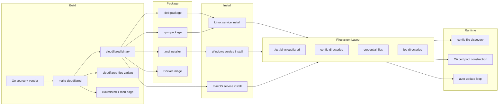

# Deployments Behavior Catalog

- Baseline date: 20260322
- Baseline reference: [cloudflare/cloudflared/tree/2026.3.0](https://github.com/cloudflare/cloudflared/tree/2026.3.0)
- Primary evidence set: behavior atoms under [../../atoms](../../../atoms)
- Upstream recheck: build, packaging, installation, credential, certificate, update, and config-discovery contracts revalidated against tag `2026.3.0` source anchors for [Makefile](https://github.com/cloudflare/cloudflared/blob/2026.3.0/Makefile), [Dockerfile](https://github.com/cloudflare/cloudflared/blob/2026.3.0/Dockerfile), [Dockerfile.amd64](https://github.com/cloudflare/cloudflared/blob/2026.3.0/Dockerfile.amd64), [Dockerfile.arm64](https://github.com/cloudflare/cloudflared/blob/2026.3.0/Dockerfile.arm64), [cloudflared.wxs](https://github.com/cloudflare/cloudflared/blob/2026.3.0/cloudflared.wxs), [postinst.sh](https://github.com/cloudflare/cloudflared/blob/2026.3.0/postinst.sh), [postrm.sh](https://github.com/cloudflare/cloudflared/blob/2026.3.0/postrm.sh), [.docker-images](https://github.com/cloudflare/cloudflared/blob/2026.3.0/.docker-images), [cmd/cloudflared/linux_service.go](https://github.com/cloudflare/cloudflared/blob/2026.3.0/cmd/cloudflared/linux_service.go), [atoms/cmd/cloudflared/linux_service](../../../atoms/cmd/cloudflared/linux_service.md), [cmd/cloudflared/macos_service.go](https://github.com/cloudflare/cloudflared/blob/2026.3.0/cmd/cloudflared/macos_service.go), [atoms/cmd/cloudflared/macos_service](../../../atoms/cmd/cloudflared/macos_service.md), [cmd/cloudflared/windows_service.go](https://github.com/cloudflare/cloudflared/blob/2026.3.0/cmd/cloudflared/windows_service.go), [atoms/cmd/cloudflared/windows_service](../../../atoms/cmd/cloudflared/windows_service.md), [config/configuration.go](https://github.com/cloudflare/cloudflared/blob/2026.3.0/config/configuration.go), [atoms/config/configuration](../../../atoms/config/configuration.md), [credentials/origin_cert.go](https://github.com/cloudflare/cloudflared/blob/2026.3.0/credentials/origin_cert.go), [atoms/credentials/origin_cert](../../../atoms/credentials/origin_cert.md), [tlsconfig/certreloader.go](https://github.com/cloudflare/cloudflared/blob/2026.3.0/tlsconfig/certreloader.go), [atoms/tlsconfig/certreloader](../../../atoms/tlsconfig/certreloader.md), [tlsconfig/cloudflare_ca.go](https://github.com/cloudflare/cloudflared/blob/2026.3.0/tlsconfig/cloudflare_ca.go), [atoms/tlsconfig/cloudflare_ca](../../../atoms/tlsconfig/cloudflare_ca.md), [cmd/cloudflared/updater/update.go](https://github.com/cloudflare/cloudflared/blob/2026.3.0/cmd/cloudflared/updater/update.go), and [atoms/cmd/cloudflared/updater/update](../../../atoms/cmd/cloudflared/updater/update.md).

## Scope

This catalog documents the full deployment lifecycle of cloudflared: how the binary is built and packaged, where it is installed, how credential and certificate files are discovered and laid out on disk, how configuration files are located by path-search logic, how the auto-update mechanism works across platforms, and what runtime directories and file ownership conventions apply.

For this catalog, deployment behavior includes:

- build artifact production (binary, man page, FIPS variant) and compile-time version embedding,
- packaging into `.deb`, `.rpm`, `.msi`, and Docker container images,
- service installation and uninstallation across Linux (systemd, sysv), macOS (launchd), and Windows (SCM),
- service template generation, file placement, and removal,
- post-install and post-remove hook scripts for Linux packages,
- configuration file path discovery, search order, and precedence,
- credential file (`cert.pem`) and tunnel-credential-file discovery,
- CA certificate pool construction (system pool, embedded Cloudflare root CAs, custom origin CA, hello cert),
- auto-update URL, cadence, and platform eligibility,
- FIPS build-tag gating and managed-install detection,
- runtime directory paths, log file locations, and PID file paths per platform.

Out of scope:

- platform-specific runtime behavior divergence (ICMP, QUIC params, diagnostics) already detailed in [platforms](../platforms.md),
- tunnel lifecycle and protocol orchestration already detailed in [tunnels](../tunnels.md),
- configuration model types and runtime config push/reload already detailed in [config](../config.md),
- init/teardown dependency ordering already detailed in [init-teardown](../init-teardown/README.md),
- TLS handshake and connection establishment already detailed in [crypto](../crypto.md).

## Catalog Structure

- [Build and Packaging](build-packaging.md) — Build artifacts, packaging formats (deb/rpm/MSI/Docker), filesystem layout
- [Service Installation](service-installation.md) — Platform-specific service installation (systemd, SysV, launchd, Windows SCM)
- [Configuration, Credentials, and Update](config-credentials-update.md) — Configuration and credential discovery, CA certificate pool, auto-update mechanism

## Deployment Lifecycle Overview

## Domain Map

| Domain | Description | Representative atoms |
|---|---|---|
| Build and version embedding | Binary compilation, version linker vars, build info, FIPS gating | [cmd/cloudflared/main](../../../atoms/cmd/cloudflared/main.md), [cmd/cloudflared/cliutil/build_info](../../../atoms/cmd/cloudflared/cliutil/build_info.md), [fips/fips](../../../atoms/fips/fips.md), [fips/nofips](../../../atoms/fips/nofips.md) |
| Service template engine | Common template generation, path resolution, service arg building | [cmd/cloudflared/service_template](../../../atoms/cmd/cloudflared/service_template.md), [cmd/cloudflared/common_service](../../../atoms/cmd/cloudflared/common_service.md), [cmd/cloudflared/generic_service](../../../atoms/cmd/cloudflared/generic_service.md) |
| Linux service lifecycle | Systemd and SysV install/uninstall, config conflict detection, update timer | [cmd/cloudflared/linux_service](../../../atoms/cmd/cloudflared/linux_service.md) |
| macOS service lifecycle | Launchd daemon/agent install/uninstall, plist generation, root/user context | [cmd/cloudflared/macos_service](../../../atoms/cmd/cloudflared/macos_service.md) |
| Windows service lifecycle | SCM registration, recovery options, Execute loop, event log | [cmd/cloudflared/windows_service](../../../atoms/cmd/cloudflared/windows_service.md) |
| App service adapters | Service runtime wrappers for tunnel and forward commands | [cmd/cloudflared/app_service](../../../atoms/cmd/cloudflared/app_service.md), [cmd/cloudflared/app_forward_service](../../../atoms/cmd/cloudflared/app_forward_service.md) |
| Config file discovery | Path search order, default directories, FindOrCreateConfigPath | [config/configuration](../../../atoms/config/configuration.md), [config/manager](../../../atoms/config/manager.md), [config/model](../../../atoms/config/model.md) |
| Credential discovery | Origin cert search, tunnel credential finder, PEM encode/decode | [credentials/credentials](../../../atoms/credentials/credentials.md), [credentials/origin_cert](../../../atoms/credentials/origin_cert.md), [cmd/cloudflared/tunnel/credential_finder](../../../atoms/cmd/cloudflared/tunnel/credential_finder.md) |
| CA certificate pool | System pool, embedded Cloudflare CAs, origin CA, hello cert | [tlsconfig/certreloader](../../../atoms/tlsconfig/certreloader.md), [tlsconfig/cloudflare_ca](../../../atoms/tlsconfig/cloudflare_ca.md), [tlsconfig/hello_ca](../../../atoms/tlsconfig/hello_ca.md), [tlsconfig/tlsconfig](../../../atoms/tlsconfig/tlsconfig.md) |
| Auto-update mechanism | Update URL, cadence, eligibility checks, apply, SysV fork | [cmd/cloudflared/updater/update](../../../atoms/cmd/cloudflared/updater/update.md), [cmd/cloudflared/updater/check](../../../atoms/cmd/cloudflared/updater/check.md), [cmd/cloudflared/updater/service](../../../atoms/cmd/cloudflared/updater/service.md), [cmd/cloudflared/updater/workers_service](../../../atoms/cmd/cloudflared/updater/workers_service.md), [cmd/cloudflared/updater/workers_update](../../../atoms/cmd/cloudflared/updater/workers_update.md) |
| File watcher and overwatch | Config file change detection, app manager service lifecycle | [watcher/file](../../../atoms/watcher/file.md), [watcher/notify](../../../atoms/watcher/notify.md), [overwatch/manager](../../../atoms/overwatch/manager.md), [overwatch/app_manager](../../../atoms/overwatch/app_manager.md) |
| Tunnel filesystem utilities | Config file reading, path validation | [cmd/cloudflared/tunnel/filesystem](../../../atoms/cmd/cloudflared/tunnel/filesystem.md), [cmd/cloudflared/tunnel/configuration](../../../atoms/cmd/cloudflared/tunnel/configuration.md) |

## Key Deployment Contracts

| Contract area | Deployment behavior |
|---|---|
| Package-managed install sentinel | `postinst.sh` creates `.installedFromPackageManager`; `postrm.sh` removes it. Auto-updater checks both the sentinel file and the linker variable `BuiltForPackageManager`. |
| Config file copy on service install | Linux `service install` copies user config to `/etc/cloudflared/config.yml` if paths differ; rejects install if a conflicting config already exists at the target path. |
| Credential search order | Both origin cert and tunnel credentials iterate `DefaultConfigSearchDirectories()` with fixed filenames (`cert.pem`, `<uuid>.json`), falling back to error if not found in any location. |
| Certificate pool layering | System certs (if available) → Cloudflare embedded root CAs (3 certs) → hello self-signed cert → optional user-provided origin CA pool. Windows explicitly warns that system pool loading is unsupported. |
| Auto-update suppression | Five independent conditions disable auto-update: Windows platform, package-managed install (sentinel or linker var), terminal session, Docker entrypoint (`--no-autoupdate`), explicit `--no-autoupdate` flag. |
| Systemd update restart loop | Update timer fires daily; update service runs `cloudflared update`; exit code 11 triggers `systemctl restart cloudflared`; any other exit code is a no-op. |
| SysV graceful fork | SysV auto-update uses `gracenet.StartProcess()` to fork a new process, then the old process exits — no service manager restarts the daemon. |
| Windows recovery actions | Windows service is configured with `SC_ACTION_RESTART` after 20-second delay, with failure count resetting every 24 hours. |
| Docker no-state contract | Container image ships only the binary — no config, no credentials, no service units. All state is injected at runtime. User `65532:65532` has no elevated privileges. |
| Version embedding at build time | Five linker variables capture version, build time, package manager, runtime (virtual), and build type (FIPS). These control update behavior, metrics binding, and FIPS validation at runtime. |

## Full Coverage Links

- [cmd/cloudflared/app_forward_service](../../../atoms/cmd/cloudflared/app_forward_service.md)
- [cmd/cloudflared/app_service](../../../atoms/cmd/cloudflared/app_service.md)
- [cmd/cloudflared/cliutil/build_info](../../../atoms/cmd/cloudflared/cliutil/build_info.md)
- [cmd/cloudflared/common_service](../../../atoms/cmd/cloudflared/common_service.md)
- [cmd/cloudflared/generic_service](../../../atoms/cmd/cloudflared/generic_service.md)
- [cmd/cloudflared/linux_service](../../../atoms/cmd/cloudflared/linux_service.md)
- [cmd/cloudflared/macos_service](../../../atoms/cmd/cloudflared/macos_service.md)
- [cmd/cloudflared/main](../../../atoms/cmd/cloudflared/main.md)
- [cmd/cloudflared/service_template](../../../atoms/cmd/cloudflared/service_template.md)
- [cmd/cloudflared/tunnel/configuration](../../../atoms/cmd/cloudflared/tunnel/configuration.md)
- [cmd/cloudflared/tunnel/credential_finder](../../../atoms/cmd/cloudflared/tunnel/credential_finder.md)
- [cmd/cloudflared/tunnel/filesystem](../../../atoms/cmd/cloudflared/tunnel/filesystem.md)
- [cmd/cloudflared/updater/check](../../../atoms/cmd/cloudflared/updater/check.md)
- [cmd/cloudflared/updater/service](../../../atoms/cmd/cloudflared/updater/service.md)
- [cmd/cloudflared/updater/update](../../../atoms/cmd/cloudflared/updater/update.md)
- [cmd/cloudflared/updater/workers_service](../../../atoms/cmd/cloudflared/updater/workers_service.md)
- [cmd/cloudflared/updater/workers_update](../../../atoms/cmd/cloudflared/updater/workers_update.md)
- [cmd/cloudflared/windows_service](../../../atoms/cmd/cloudflared/windows_service.md)
- [config/configuration](../../../atoms/config/configuration.md)
- [config/manager](../../../atoms/config/manager.md)
- [config/model](../../../atoms/config/model.md)
- [credentials/credentials](../../../atoms/credentials/credentials.md)
- [credentials/origin_cert](../../../atoms/credentials/origin_cert.md)
- [fips/fips](../../../atoms/fips/fips.md)
- [fips/nofips](../../../atoms/fips/nofips.md)
- [overwatch/app_manager](../../../atoms/overwatch/app_manager.md)
- [overwatch/manager](../../../atoms/overwatch/manager.md)
- [tlsconfig/certreloader](../../../atoms/tlsconfig/certreloader.md)
- [tlsconfig/cloudflare_ca](../../../atoms/tlsconfig/cloudflare_ca.md)
- [tlsconfig/hello_ca](../../../atoms/tlsconfig/hello_ca.md)
- [tlsconfig/tlsconfig](../../../atoms/tlsconfig/tlsconfig.md)
- [watcher/file](../../../atoms/watcher/file.md)
- [watcher/notify](../../../atoms/watcher/notify.md)

## Upstream-Verified Deployment Quirks

### Windows Update Path Encoding

The auto-updater [encodes Windows paths](https://github.com/cloudflare/cloudflared/blob/2026.3.0/cmd/cloudflared/updater/update.go) that contain `Program Files (x86)` and `Program Files` to 8.3 short names (`PROGRA~2`, `PROGRA~1`) because Windows batch files do not handle spaces in directory names.

### macOS Home Directory Resolution

macOS service install uses `go-homedir` to expand `~` paths. The `isRootUser()` check (`os.Getuid() == 0`) determines daemon vs agent context before any path resolution occurs — this affects plist path, log paths, and config search.

### Linux Nightly Package Conflicts

When `NIGHTLY=true`, the deb/rpm package is named `cloudflared-nightly` but declares `--conflicts cloudflared --replaces cloudflared`, forcing removal of the stable package when the nightly is installed.

### Docker Nonroot UID

The Docker image uses numeric UID/GID `65532:65532` rather than the `nonroot` username because [Kubernetes does not support string user IDs](https://github.com/kubernetes/kubernetes/blob/v1.33.2/pkg/kubelet/kuberuntime/security_context_others.go#L49).

## Notes

- This catalog intentionally overlaps with [platforms](../platforms.md) on service installation — this catalog focuses on what goes where on disk and operational contracts, while platforms focuses on runtime behavior divergence.
- Config file discovery overlaps with [config](../config.md) — this catalog focuses on the file-system search order and path layout rather than config model types and runtime propagation.
- Certificate pool construction overlaps with [crypto](../crypto.md) — this catalog focuses on the assembly chain and embedded CAs rather than TLS handshake mechanics.
- Auto-update overlaps with [cli](../cli.md) — this catalog provides the full update flow while cli covers the `update` subcommand registration.
- Service lifecycle contracts here complement [init-teardown](../init-teardown/README.md) which focuses on dependency ordering and [supervisor](../supervisor.md) which focuses on the runtime control loop.

## Coverage Audit

- Audit method: collect deployment-scoped atom docs across build info (`cmd/cloudflared/cliutil/build_info`, `cmd/cloudflared/main`), service templates and installers (`cmd/cloudflared/{service_template,common_service,generic_service,linux_service,macos_service,windows_service,app_service,app_forward_service}`), auto-update (`cmd/cloudflared/updater/{update,check,service,workers_service,workers_update}`), config discovery (`config/{configuration,manager,model}`), credentials (`credentials/{credentials,origin_cert}`, `cmd/cloudflared/tunnel/{credential_finder,filesystem,configuration}`), certificates (`tlsconfig/{certreloader,cloudflare_ca,hello_ca,tlsconfig}`), FIPS (`fips/{fips,nofips}`), file watcher (`watcher/{file,notify}`), overwatch (`overwatch/{manager,app_manager}`), then diff against all atom links listed in this catalog.
- Current coverage result: 33 deployment-scoped atom docs found, 33 linked in catalog, 0 missing.
- Delta (catalog links - deployment-scoped atom docs): 0.
- Operational guardrail: if build targets, packaging scripts, service installers, config paths, or credential discovery logic change, rerun this audit and update this file in the same change.
