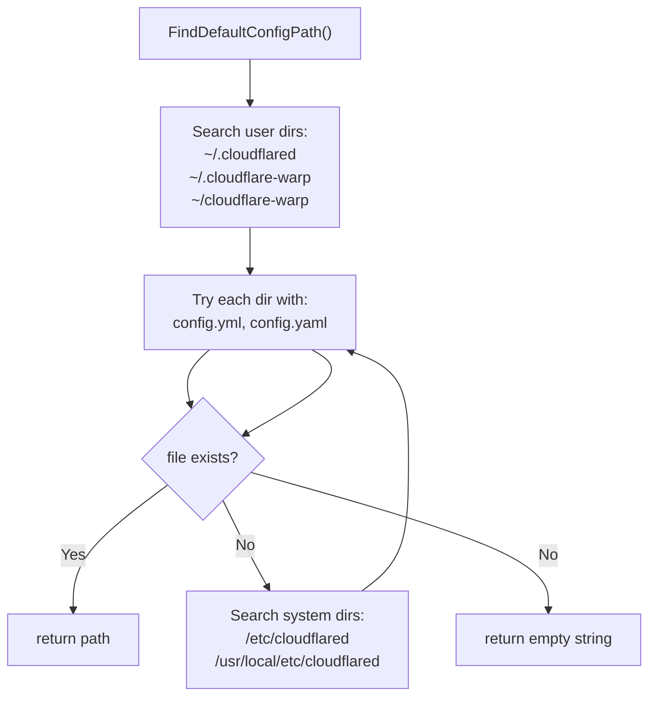
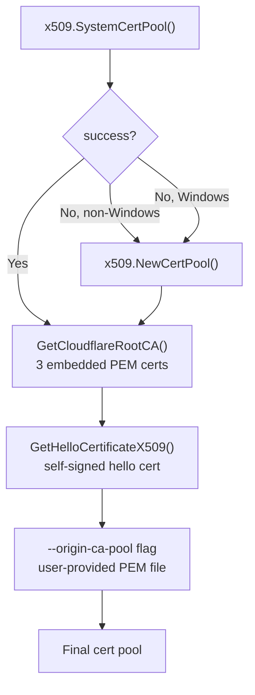
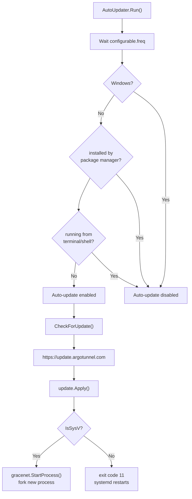

# Deployments — Configuration, Credentials, and Update

> Part of the [Deployments Behavior Catalog](README.md).

## Configuration File Discovery

### Search Order

Configuration file lookup follows a two-phase search: first user directories, then system directories (non-Windows only).

| Platform | Search directories (in order) | Config filenames |
|---|---|---|
| Linux / macOS | `~/.cloudflared`, `~/.cloudflare-warp`, `~/cloudflare-warp`, `/etc/cloudflared`, `/usr/local/etc/cloudflared` | `config.yml`, `config.yaml` |
| Windows | `~/.cloudflared`, `~/.cloudflare-warp`, `~/cloudflare-warp` | `config.yml`, `config.yaml` |

### Default Directories

| Function | Linux / macOS | Windows |
|---|---|---|
| `DefaultConfigDirectory()` | `/usr/local/etc/cloudflared` | `$CFDPATH` env var, or `%ProgramFiles(x86)%\cloudflared`, or `%ProgramFiles%\cloudflared` |
| `DefaultLogDirectory()` | `/var/log/cloudflared` | Same as `DefaultConfigDirectory()` |
| `DefaultConfigPath()` | `/usr/local/etc/cloudflared/config.yml` | `<DefaultConfigDirectory>\config.yml` |

Windows config directory resolution: checks `CFDPATH` environment variable first; if unset, tries `%ProgramFiles(x86)%\cloudflared` and falls back to `%ProgramFiles%\cloudflared` (checks directory existence).

Config discovery evidence: [config/configuration](../../../atoms/config/configuration.md), [config/manager](../../../atoms/config/manager.md).

### Service Config Path

The Linux service installer uses a hardcoded service config path: `/etc/cloudflared/config.yml`. This is separate from the default config search directories — when `service install` runs with a config file, the file is copied to this path and the service arguments reference it explicitly.

## Credential File Discovery

### Origin Certificate (`cert.pem`)

The origin certificate is obtained via `cloudflared login` and stored as a PEM-encoded file containing an `ARGO TUNNEL TOKEN` block with JSON-encoded `OriginCert` (containing `zoneID`, `accountID`, `apiToken`, and optional `endpoint`).

Search order for `FindDefaultOriginCertPath()`: iterate over `DefaultConfigSearchDirectories()` and check for `cert.pem` in each directory.

| Platform | Search paths (in order) |
|---|---|
| Linux / macOS | `~/.cloudflared/cert.pem`, `~/.cloudflare-warp/cert.pem`, `~/cloudflare-warp/cert.pem`, `/etc/cloudflared/cert.pem`, `/usr/local/etc/cloudflared/cert.pem` |
| Windows | `~/.cloudflared/cert.pem`, `~/.cloudflare-warp/cert.pem`, `~/cloudflare-warp/cert.pem` |

Override: `--origincert` CLI flag or `TUNNEL_ORIGIN_CERT` environment variable.

### Tunnel Credentials File

Tunnel-specific credentials (JSON file with `AccountTag`, `TunnelSecret`, `TunnelID`, optional `Endpoint`) are typically stored at `~/.cloudflared/<tunnel-uuid>.json`. The lookup uses two strategies:

1. **Static path** — explicit `--credentials-file` flag or config file `credentials-file:` entry.
2. **Search by ID** — probes `DefaultConfigSearchDirectories()` for `<tunnel-uuid>.json`.

Credential evidence: [credentials/credentials](../../../atoms/credentials/credentials.md), [credentials/origin_cert](../../../atoms/credentials/origin_cert.md), [cmd/cloudflared/tunnel/credential_finder](../../../atoms/cmd/cloudflared/tunnel/credential_finder.md).

## CA Certificate Pool Construction

### Pool Assembly Sequence

### Embedded Cloudflare Root CAs

Three certificates are compiled into the binary via [tlsconfig/cloudflare_ca.go](https://github.com/cloudflare/cloudflared/blob/2026.3.0/tlsconfig/cloudflare_ca.go):

| Certificate | Type | Purpose |
|---|---|---|
| CloudFlare Origin SSL ECC Certificate Authority | ECC | Origin SSL validation |
| CloudFlare Origin SSL Certificate Authority | RSA | Origin SSL validation |
| Origin Pull (`origin-pull.cloudflare.net`) | RSA | Authenticated origin pull |

### Platform-Specific Certificate Behavior

| Platform | System cert pool | Notes |
|---|---|---|
| Linux | `x509.SystemCertPool()` succeeds | Standard `/etc/ssl/certs` or distro-specific paths |
| macOS | `x509.SystemCertPool()` succeeds | Reads from Keychain |
| Windows | `x509.SystemCertPool()` fails | Go issue [#16736](https://github.com/golang/go/issues/16736); user warned to use `--origin-ca-pool` flag |
| Docker | `x509.SystemCertPool()` succeeds | Distroless base includes CA bundle |

### Tunnel TLS Config

`CreateTunnelConfig()` builds the TLS config for the edge connection:

1. Check `--cacert` flag for custom CA path.
2. Build TLS config via `GetConfig()`.
3. If no custom root CAs were loaded: fall back to system pool + embedded Cloudflare CAs.
4. Require either `ServerName` or `InsecureSkipVerify` (edge connections always set `ServerName`).

Certificate evidence: [tlsconfig/certreloader](../../../atoms/tlsconfig/certreloader.md), [tlsconfig/cloudflare_ca](../../../atoms/tlsconfig/cloudflare_ca.md), [tlsconfig/hello_ca](../../../atoms/tlsconfig/hello_ca.md), [tlsconfig/tlsconfig](../../../atoms/tlsconfig/tlsconfig.md).

## Auto-Update Mechanism

### Update Decision Tree

### Update Eligibility

| Condition | Auto-update supported? | Reason |
|---|---|---|
| Windows | No | Not supported on Windows |
| Package-managed install | No | Sentinel file `.installedFromPackageManager` exists, or `BuiltForPackageManager` linker var set |
| Running from terminal | No | Interactive shell — service mode only |
| Linux systemd service | Yes | Daily timer triggers `cloudflared update`; exit 11 → `systemctl restart` |
| Linux sysv service | Yes | `--autoupdate-freq 24h0m0s`; uses `gracenet.StartProcess()` for in-place fork |
| macOS launchd service | Yes | `KeepAlive.SuccessfulExit=false` restarts after exit 11 |
| Docker container | No | Entrypoint includes `--no-autoupdate` |

### Update URLs

| URL | Purpose |
|---|---|
| `https://update.argotunnel.com` | Production update endpoint |
| `https://staging-update.argotunnel.com` | Staging update endpoint (`--staging` flag) |

### Managed-Install Detection

`wasInstalledFromPackageManager()` checks two conditions (either triggers suppression):

1. `BuiltForPackageManager` linker variable is non-empty (set at compile time via `PACKAGE_MANAGER` env var).
2. File `/usr/local/etc/cloudflared/.installedFromPackageManager` exists (created by `postinst.sh`).

### Version Support Policy

Cloudflare supports cloudflared versions within one year of the most recent release. Versions older than one year may encounter breaking changes.

Auto-update evidence: [cmd/cloudflared/updater/update](../../../atoms/cmd/cloudflared/updater/update.md), [cmd/cloudflared/updater/check](../../../atoms/cmd/cloudflared/updater/check.md), [cmd/cloudflared/updater/service](../../../atoms/cmd/cloudflared/updater/service.md), [cmd/cloudflared/updater/workers_service](../../../atoms/cmd/cloudflared/updater/workers_service.md), [cmd/cloudflared/updater/workers_update](../../../atoms/cmd/cloudflared/updater/workers_update.md).
