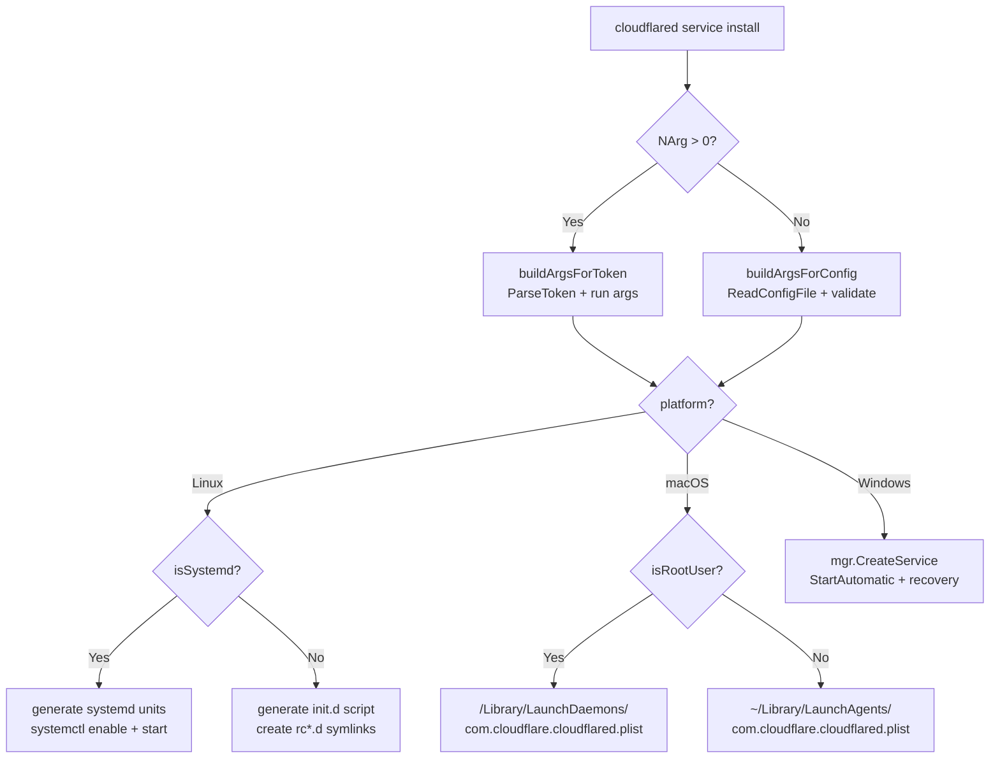

# Deployments — Service Installation

> Part of the [Deployments Behavior Catalog](README.md).

## Service Installation Flow



Service install evidence: [cmd/cloudflared/common_service](../../../atoms/cmd/cloudflared/common_service.md), [cmd/cloudflared/generic_service](../../../atoms/cmd/cloudflared/generic_service.md), [cmd/cloudflared/service_template](../../../atoms/cmd/cloudflared/service_template.md).

## Linux Service Installation

Detection: `isSystemd()` checks for `/run/systemd/system` directory existence.

### Systemd Path

| Unit file | Path | Purpose |
|---|---|---|
| `cloudflared.service` | `/etc/systemd/system/cloudflared.service` | Main daemon unit |
| `cloudflared-update.service` | `/etc/systemd/system/cloudflared-update.service` | One-shot update unit |
| `cloudflared-update.timer` | `/etc/systemd/system/cloudflared-update.timer` | Daily update trigger (`OnCalendar=daily`) |

Systemd install sequence: generate unit files → `systemctl enable cloudflared.service` → `systemctl start cloudflared-update.timer` (if auto-update) → `systemctl daemon-reload` → `systemctl start cloudflared.service`.

Systemd uninstall sequence: `systemctl disable cloudflared.service` → `systemctl stop cloudflared.service` → `systemctl stop cloudflared-update.timer` (if present) → remove unit files → `systemctl daemon-reload`.

The update service unit runs `cloudflared update` and conditionally restarts the main service:

```bash
ExecStart=/bin/bash -c 'cloudflared update 2>&1 | logger -s; code=$?; if [ $code -eq 11 ]; then systemctl restart cloudflared; exit 0; fi; exit $code'
```

Exit code `11` = successful update (triggers restart). Exit code `10` = update failed.

### SysV Path

| Artifact | Path | Permissions |
|---|---|---|
| Init script | `/etc/init.d/cloudflared` | `0755` |
| Runlevel start links | `/etc/rc{2,3,4,5}.d/S50et` | Symlinks to init script |
| Runlevel stop links | `/etc/rc{0,1,6}.d/K02et` | Symlinks to init script |
| PID file | `/var/run/cloudflared.pid` | Written by init script |
| Stdout log | `/var/log/cloudflared.log` | Appended by init script |
| Stderr log | `/var/log/cloudflared.err` | Appended by init script |

SysV auto-update uses `--autoupdate-freq 24h0m0s` flag (or `--no-autoupdate` if disabled).

Linux service evidence: [cmd/cloudflared/linux_service](../../../atoms/cmd/cloudflared/linux_service.md).

### Linux Config Conflict Detection

When installing via config file mode (not token mode), the installer validates:

1. Config file must contain `tunnel:` and `credentials-file:` entries.
2. If the user-specified config file differs from `/etc/cloudflared/config.yml`, and a file already exists at that service config path, installation is rejected with a conflict error.
3. If the user-specified config is at a different path, it is copied to `/etc/cloudflared/config.yml`.

## macOS Service Installation

The launchd identifier is `com.cloudflare.cloudflared`.

| Context | Plist path | Log stdout | Log stderr |
|---|---|---|---|
| Root (daemon) | `/Library/LaunchDaemons/com.cloudflare.cloudflared.plist` | `/Library/Logs/com.cloudflare.cloudflared.out.log` | `/Library/Logs/com.cloudflare.cloudflared.err.log` |
| User (agent) | `~/Library/LaunchAgents/com.cloudflare.cloudflared.plist` | `~/Library/Logs/com.cloudflare.cloudflared.out.log` | `~/Library/Logs/com.cloudflare.cloudflared.err.log` |

Plist properties:

- `RunAtLoad`: `true` — starts on boot or login.
- `KeepAlive.SuccessfulExit`: `false` — restarts on non-zero exit.
- `ThrottleInterval`: `5` seconds between restart attempts.

Install uses `launchctl load` (or `bootout`/`bootstrap` on newer macOS). Uninstall uses `launchctl remove`.

macOS service evidence: [cmd/cloudflared/macos_service](../../../atoms/cmd/cloudflared/macos_service.md).

## Windows Service Installation

| Property | Value |
|---|---|
| Service name | `Cloudflared` |
| Display name | `Cloudflared agent` |
| Start type | `StartAutomatic` |
| Recovery action | Restart after 20-second delay |
| Failure count reset | 24 hours |
| Event log | Registered via `eventlog.InstallAsEventCreate` |

The Windows service `Execute` loop handles SCM change requests (`Interrogate`, `Stop`, `Shutdown`). First `Stop`/`Shutdown` triggers graceful shutdown via `graceShutdownC` channel close; repeated signals force immediate termination.

Windows auto-update is explicitly disabled: `"cloudflared will not automatically update on Windows systems."` Operators must upgrade via MSI reinstall or manual binary replacement.

Windows service evidence: [cmd/cloudflared/windows_service](../../../atoms/cmd/cloudflared/windows_service.md).
