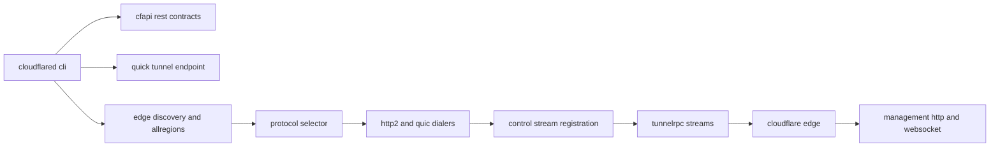
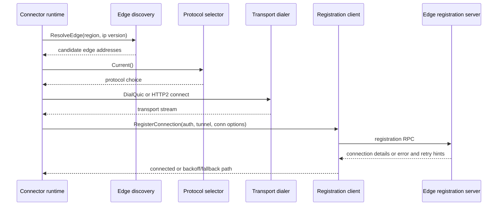
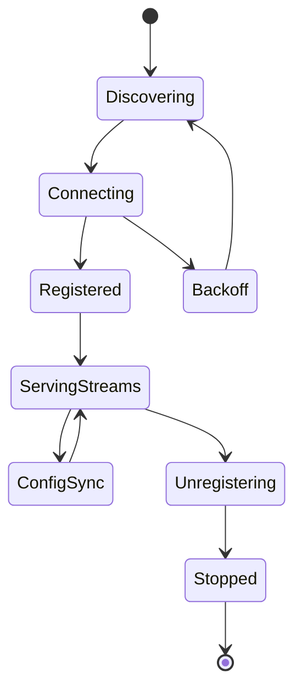

# Edge Interactions Behavior Catalog

- Baseline date: 20260321
- Baseline reference: [cloudflare/cloudflared/tree/2026.3.0](https://github.com/cloudflare/cloudflared/tree/2026.3.0)
- Primary evidence set: behavior atoms under [../atoms](../../atoms)
- Upstream recheck: key discovery and edge contract anchors revalidated against tag `2026.3.0` for [edgediscovery/edgediscovery.go](https://github.com/cloudflare/cloudflared/blob/2026.3.0/edgediscovery/edgediscovery.go), [atoms/edgediscovery/edgediscovery](../../atoms/edgediscovery/edgediscovery.md), [edgediscovery/allregions/discovery.go](https://github.com/cloudflare/cloudflared/blob/2026.3.0/edgediscovery/allregions/discovery.go), [atoms/edgediscovery/allregions/discovery](../../atoms/edgediscovery/allregions/discovery.md), [connection/protocol.go](https://github.com/cloudflare/cloudflared/blob/2026.3.0/connection/protocol.go), [atoms/connection/protocol](../../atoms/connection/protocol.md), [connection/control.go](https://github.com/cloudflare/cloudflared/blob/2026.3.0/connection/control.go), [atoms/connection/control](../../atoms/connection/control.md), [connection/http2.go](https://github.com/cloudflare/cloudflared/blob/2026.3.0/connection/http2.go), [atoms/connection/http2](../../atoms/connection/http2.md), [connection/quic.go](https://github.com/cloudflare/cloudflared/blob/2026.3.0/connection/quic.go), [atoms/connection/quic](../../atoms/connection/quic.md), [tunnelrpc/registration_client.go](https://github.com/cloudflare/cloudflared/blob/2026.3.0/tunnelrpc/registration_client.go), [atoms/tunnelrpc/registration_client](../../atoms/tunnelrpc/registration_client.md), [tunnelrpc/registration_server.go](https://github.com/cloudflare/cloudflared/blob/2026.3.0/tunnelrpc/registration_server.go), [atoms/tunnelrpc/registration_server](../../atoms/tunnelrpc/registration_server.md), [tunnelrpc/quic/cloudflared_client.go](https://github.com/cloudflare/cloudflared/blob/2026.3.0/tunnelrpc/quic/cloudflared_client.go), [atoms/tunnelrpc/quic/cloudflared_client](../../atoms/tunnelrpc/quic/cloudflared_client.md), [tunnelrpc/quic/cloudflared_server.go](https://github.com/cloudflare/cloudflared/blob/2026.3.0/tunnelrpc/quic/cloudflared_server.go), [atoms/tunnelrpc/quic/cloudflared_server](../../atoms/tunnelrpc/quic/cloudflared_server.md), [management/service.go](https://github.com/cloudflare/cloudflared/blob/2026.3.0/management/service.go), [atoms/management/service](../../atoms/management/service.md), and [cmd/cloudflared/tunnel/quick_tunnel.go](https://github.com/cloudflare/cloudflared/blob/2026.3.0/cmd/cloudflared/tunnel/quick_tunnel.go), [atoms/cmd/cloudflared/tunnel/quick_tunnel](../../atoms/cmd/cloudflared/tunnel/quick_tunnel.md).

## Scope

This catalog documents cloudflared edge-facing interaction behavior across discovery, transport negotiation, registration and control streams, management streams, and edge API integration points.

For this catalog, edge interactions include:

- edge address discovery and region/IP family selection behavior,
- protocol choice and fallback behavior for edge connectivity,
- connection registration and unregister lifecycle contracts,
- local/remote configuration exchange over control/RPC channels,
- request/response stream contracts over HTTP2, QUIC, and tunnelrpc,
- Cloudflare management HTTP/WebSocket interactions,
- edge-adjacent REST and quick-tunnel provisioning interactions.

Out of scope:

- broad non-edge config internals already in [config](config.md),
- full transport data-path detail already in [proxying](proxying.md),
- non-edge observability internals already in [observabilities](observabilities.md).

## Interaction Topology

## Discovery to Registration Sequence

## Control and Management Lifecycle

## Domain Map

| Domain | Description | Representative atoms |
|---|---|---|
| Edge API and control-plane REST | REST contracts for tunnel and teamnet resources used to coordinate edge behavior. | [cfapi/base_client](../../atoms/cfapi/base_client.md), [cfapi/tunnel](../../atoms/cfapi/tunnel.md), [cfapi/ip_route](../../atoms/cfapi/ip_route.md), [cfapi/virtual_network](../../atoms/cfapi/virtual_network.md), [cfapi/hostname](../../atoms/cfapi/hostname.md) |
| Discovery and address rotation | Region and address resolution, edge address pools, and connectivity-error-aware address reuse paths. | [edgediscovery/edgediscovery](../../atoms/edgediscovery/edgediscovery.md), [edgediscovery/allregions/discovery](../../atoms/edgediscovery/allregions/discovery.md), [edgediscovery/dial](../../atoms/edgediscovery/dial.md), [edgediscovery/protocol](../../atoms/edgediscovery/protocol.md) |
| Protocol negotiation and transport setup | Protocol selection, fallback semantics, and HTTP2/QUIC edge transport setup. | [connection/protocol](../../atoms/connection/protocol.md), [connection/http2](../../atoms/connection/http2.md), [connection/quic](../../atoms/connection/quic.md), [connection/quic_connection](../../atoms/connection/quic_connection.md) |
| Registration and control streams | Register/unregister, graceful shutdown, and control-stream synchronization to edge. | [connection/control](../../atoms/connection/control.md), [tunnelrpc/registration_client](../../atoms/tunnelrpc/registration_client.md), [tunnelrpc/registration_server](../../atoms/tunnelrpc/registration_server.md), [tunnelrpc/pogs/registration_server](../../atoms/tunnelrpc/pogs/registration_server.md) |
| Stream RPC protocols | tunnelrpc request/session/configuration stream contracts over QUIC/capnp. | [tunnelrpc/quic/protocol](../../atoms/tunnelrpc/quic/protocol.md), [tunnelrpc/quic/request_client_stream](../../atoms/tunnelrpc/quic/request_client_stream.md), [tunnelrpc/quic/request_server_stream](../../atoms/tunnelrpc/quic/request_server_stream.md), [tunnelrpc/quic/session_client](../../atoms/tunnelrpc/quic/session_client.md), [tunnelrpc/quic/session_server](../../atoms/tunnelrpc/quic/session_server.md), [tunnelrpc/pogs/configuration_manager](../../atoms/tunnelrpc/pogs/configuration_manager.md), [tunnelrpc/proto/tunnelrpc.capnp](../../atoms/tunnelrpc/proto/tunnelrpc.capnp) |
| Management-edge stream interactions | Edge or dashboard initiated host-details and logs stream interfaces with auth and lifecycle bounds. | [management/service](../../atoms/management/service.md), [management/events](../../atoms/management/events.md), [management/session](../../atoms/management/session.md), [management/middleware](../../atoms/management/middleware.md), [management/token](../../atoms/management/token.md), [cmd/cloudflared/tail/cmd](../../atoms/cmd/cloudflared/tail/cmd.md) |
| CLI adapters to edge surfaces | CLI command families that shape edge interactions for tunnel runtime and management workflows. | [cmd/cloudflared/tunnel/cmd](../../atoms/cmd/cloudflared/tunnel/cmd.md), [cmd/cloudflared/tunnel/subcommands](../../atoms/cmd/cloudflared/tunnel/subcommands.md), [cmd/cloudflared/management/cmd](../../atoms/cmd/cloudflared/management/cmd.md), [cmd/cloudflared/access/cmd](../../atoms/cmd/cloudflared/access/cmd.md), [cmd/cloudflared/tunnel/quick_tunnel](../../atoms/cmd/cloudflared/tunnel/quick_tunnel.md) |

## Edge Behavior Contracts

| Surface | Contracted behavior |
|---|---|
| Discovery pool resolution | Address and region discovery returns candidate edge addresses and supports error-aware alternate address selection paths. |
| Protocol selection evolution | Auto protocol mode can use fetched percentages and TTL-based refresh windows; fallback semantics govern downgrade on protocol-specific failures. |
| Registration lifecycle | Registration RPC exchanges tunnel auth/options and yields either connection details or typed failure/retry paths. |
| Control stream sync | First connection can push local configuration when tunnel is not remotely managed; unregister path uses graceful shutdown windows. |
| Transport serving | HTTP2 and QUIC serving paths handle control upgrades, configuration updates, and stream-specific response metadata behaviors. |
| Session/datagram control | V2/V3 datagram and session registration paths interact with edge session manager contracts for UDP flow lifecycle management. |
| Management stream governance | Logs stream enforces token middleware, command sequencing, filter parsing, session limits, heartbeat, and idle timeout contracts. |
| Quick tunnel bootstrap | Quick service interaction provisions anonymous credentials then constrains runtime defaults (for example protocol and HA connections). |

Primary evidence: [edgediscovery/edgediscovery](../../atoms/edgediscovery/edgediscovery.md), [connection/protocol](../../atoms/connection/protocol.md), [connection/control](../../atoms/connection/control.md), [connection/http2](../../atoms/connection/http2.md), [connection/quic](../../atoms/connection/quic.md), [tunnelrpc/registration_client](../../atoms/tunnelrpc/registration_client.md), [tunnelrpc/quic/protocol](../../atoms/tunnelrpc/quic/protocol.md), [management/service](../../atoms/management/service.md), [cmd/cloudflared/tunnel/quick_tunnel](../../atoms/cmd/cloudflared/tunnel/quick_tunnel.md).

## Interaction Cadence Notes

- Discovery and initial protocol selection are startup-critical and repeated on reconnect paths.
- Protocol percentage refresh and feature selector refresh introduce periodic cadence in otherwise event-driven edge interaction loops.
- Registration, configuration updates, and management stream operations are primarily edge/event-driven.
- Tail and management websocket behaviors add heartbeat and idle timeout cadences that influence stream liveness.

## Full Coverage Links

- [cfapi/base_client](../../atoms/cfapi/base_client.md)
- [cfapi/client](../../atoms/cfapi/client.md)
- [cfapi/hostname](../../atoms/cfapi/hostname.md)
- [cfapi/ip_route](../../atoms/cfapi/ip_route.md)
- [cfapi/ip_route_filter](../../atoms/cfapi/ip_route_filter.md)
- [cfapi/tunnel](../../atoms/cfapi/tunnel.md)
- [cfapi/tunnel_filter](../../atoms/cfapi/tunnel_filter.md)
- [cfapi/virtual_network](../../atoms/cfapi/virtual_network.md)
- [cfapi/virtual_network_filter](../../atoms/cfapi/virtual_network_filter.md)
- [client/config](../../atoms/client/config.md)
- [cmd/cloudflared/access/cmd](../../atoms/cmd/cloudflared/access/cmd.md)
- [cmd/cloudflared/management/cmd](../../atoms/cmd/cloudflared/management/cmd.md)
- [cmd/cloudflared/tail/cmd](../../atoms/cmd/cloudflared/tail/cmd.md)
- [cmd/cloudflared/tunnel/cmd](../../atoms/cmd/cloudflared/tunnel/cmd.md)
- [cmd/cloudflared/tunnel/configuration](../../atoms/cmd/cloudflared/tunnel/configuration.md)
- [cmd/cloudflared/tunnel/quick_tunnel](../../atoms/cmd/cloudflared/tunnel/quick_tunnel.md)
- [cmd/cloudflared/tunnel/subcommand_context_teamnet](../../atoms/cmd/cloudflared/tunnel/subcommand_context_teamnet.md)
- [cmd/cloudflared/tunnel/subcommand_context_vnets](../../atoms/cmd/cloudflared/tunnel/subcommand_context_vnets.md)
- [cmd/cloudflared/tunnel/subcommands](../../atoms/cmd/cloudflared/tunnel/subcommands.md)
- [cmd/cloudflared/tunnel/teamnet_subcommands](../../atoms/cmd/cloudflared/tunnel/teamnet_subcommands.md)
- [cmd/cloudflared/tunnel/vnets_subcommands](../../atoms/cmd/cloudflared/tunnel/vnets_subcommands.md)
- [connection/control](../../atoms/connection/control.md)
- [connection/errors](../../atoms/connection/errors.md)
- [connection/event](../../atoms/connection/event.md)
- [connection/header](../../atoms/connection/header.md)
- [connection/http2](../../atoms/connection/http2.md)
- [connection/json](../../atoms/connection/json.md)
- [connection/protocol](../../atoms/connection/protocol.md)
- [connection/quic](../../atoms/connection/quic.md)
- [connection/quic_connection](../../atoms/connection/quic_connection.md)
- [connection/quic_datagram_v2](../../atoms/connection/quic_datagram_v2.md)
- [connection/quic_datagram_v3](../../atoms/connection/quic_datagram_v3.md)
- [connection/tunnelsforha](../../atoms/connection/tunnelsforha.md)
- [edgediscovery/allregions/address](../../atoms/edgediscovery/allregions/address.md)
- [edgediscovery/allregions/discovery](../../atoms/edgediscovery/allregions/discovery.md)
- [edgediscovery/allregions/region](../../atoms/edgediscovery/allregions/region.md)
- [edgediscovery/allregions/regions](../../atoms/edgediscovery/allregions/regions.md)
- [edgediscovery/allregions/usedby](../../atoms/edgediscovery/allregions/usedby.md)
- [edgediscovery/dial](../../atoms/edgediscovery/dial.md)
- [edgediscovery/edgediscovery](../../atoms/edgediscovery/edgediscovery.md)
- [edgediscovery/protocol](../../atoms/edgediscovery/protocol.md)
- [features/selector](../../atoms/features/selector.md)
- [management/events](../../atoms/management/events.md)
- [management/logger](../../atoms/management/logger.md)
- [management/middleware](../../atoms/management/middleware.md)
- [management/service](../../atoms/management/service.md)
- [management/session](../../atoms/management/session.md)
- [management/token](../../atoms/management/token.md)
- [tunnelrpc/metrics/metrics](../../atoms/tunnelrpc/metrics/metrics.md)
- [tunnelrpc/pogs/cloudflared_server](../../atoms/tunnelrpc/pogs/cloudflared_server.md)
- [tunnelrpc/pogs/configuration_manager](../../atoms/tunnelrpc/pogs/configuration_manager.md)
- [tunnelrpc/pogs/errors](../../atoms/tunnelrpc/pogs/errors.md)
- [tunnelrpc/pogs/quic_metadata_protocol](../../atoms/tunnelrpc/pogs/quic_metadata_protocol.md)
- [tunnelrpc/pogs/registration_server](../../atoms/tunnelrpc/pogs/registration_server.md)
- [tunnelrpc/pogs/session_manager](../../atoms/tunnelrpc/pogs/session_manager.md)
- [tunnelrpc/pogs/tag](../../atoms/tunnelrpc/pogs/tag.md)
- [tunnelrpc/proto/quic_metadata_protocol.capnp](../../atoms/tunnelrpc/proto/quic_metadata_protocol.capnp)
- [tunnelrpc/proto/tunnelrpc.capnp](../../atoms/tunnelrpc/proto/tunnelrpc.capnp)
- [tunnelrpc/quic/cloudflared_client](../../atoms/tunnelrpc/quic/cloudflared_client.md)
- [tunnelrpc/quic/cloudflared_server](../../atoms/tunnelrpc/quic/cloudflared_server.md)
- [tunnelrpc/quic/protocol](../../atoms/tunnelrpc/quic/protocol.md)
- [tunnelrpc/quic/request_client_stream](../../atoms/tunnelrpc/quic/request_client_stream.md)
- [tunnelrpc/quic/request_server_stream](../../atoms/tunnelrpc/quic/request_server_stream.md)
- [tunnelrpc/quic/session_client](../../atoms/tunnelrpc/quic/session_client.md)
- [tunnelrpc/quic/session_server](../../atoms/tunnelrpc/quic/session_server.md)
- [tunnelrpc/registration_client](../../atoms/tunnelrpc/registration_client.md)
- [tunnelrpc/registration_server](../../atoms/tunnelrpc/registration_server.md)
- [tunnelrpc/utils](../../atoms/tunnelrpc/utils.md)

## Upstream-Verified Edge Discovery Quirks and Variance

### Edge Address Allocation Strategy

The `Edge` object in [edgediscovery/edgediscovery.go](https://github.com/cloudflare/cloudflared/blob/2026.3.0/edgediscovery/edgediscovery.go) uses a mutex-guarded region pool with three distinct allocation paths:

| Method | Semantics | Stickiness |
|---|---|---|
| `GetAddr(connIndex)` | Returns same address previously used by this index; falls back to unused pool | Connection-sticky |
| `GetDifferentAddr(connIndex, hasConnectivityError)` | Gives back old address (with connectivity error flag) and allocates a new unused one | Rotation with error tracking |
| `GetAddrForRPC()` | Returns any available address without connection affinity | Non-sticky |

Quirk — **Error-tagged return**: when `GiveBack(addr, hasConnectivityError=true)` is called, the address is returned to the pool tagged with a connectivity error flag. This influences future allocation decisions within the `allregions` package.

Quirk — **Exhaustion recovery**: `GetDifferentAddr` may return `ErrNoAddressesLeft` even though the old address was just returned — the comment in source notes: "if oldAddr were not nil, it will become available on the next iteration." This means the pool does not immediately reuse a just-returned address in the same call.

### Edge Construction Modes

| Mode | Constructor | Input |
|---|---|---|
| Dynamic discovery | `ResolveEdge(log, region, edgeIpVersion)` | SRV/TXT record resolution against Cloudflare edge |
| Static edge | `StaticEdge(log, hostnames)` | User-provided `--edge` hostname list (mainly for testing) |

### Protocol Selection Integration

The supervisor clamps `HAConnections` to `min(HAConnections, AvailableAddrs())` before starting tunnel workers. This prevents spinning up more connections than the edge pool can serve.

## Notes

- This catalog is intentionally overlap-heavy with [upstream-api-contracts](upstream-api-contracts.md), [tunnels](tunnels.md), [sessions](sessions.md), and [state-machines](state-machines.md) to preserve behavior-first organization across edge boundaries.
- API schema and endpoint details remain in [upstream-api-contracts](upstream-api-contracts.md), while this catalog centers discovery, negotiation, stream lifecycle, and runtime edge behavior.

## Coverage Audit

- Audit method: collect edge-interaction atoms across edge REST/control APIs (`cfapi/*`), discovery (`edgediscovery/*`), edge transport and control paths (`connection/{protocol,control,http2,quic,quic_connection,quic_datagram_v2,quic_datagram_v3,json,header,event,errors,tunnelsforha}`), tunnelrpc registration/request/session/configuration streams, management stream contracts (`management/*` and `cmd/cloudflared/tail/cmd`), and edge-driving CLI adapters (`cmd/cloudflared/{management/cmd,access/cmd,tunnel/*}` plus `client/config` and `features/selector`), then diff against all atom links listed in this catalog.
- Current coverage result: 68 edge-interaction scoped atom docs found, 68 linked in catalog, 0 missing.
- Delta (catalog links - edge-interaction scoped atom docs): 0.
- Operational guardrail: if discovery, registration, transport, or management edge interaction surfaces are added or renamed, rerun this audit and update this file in the same change.
