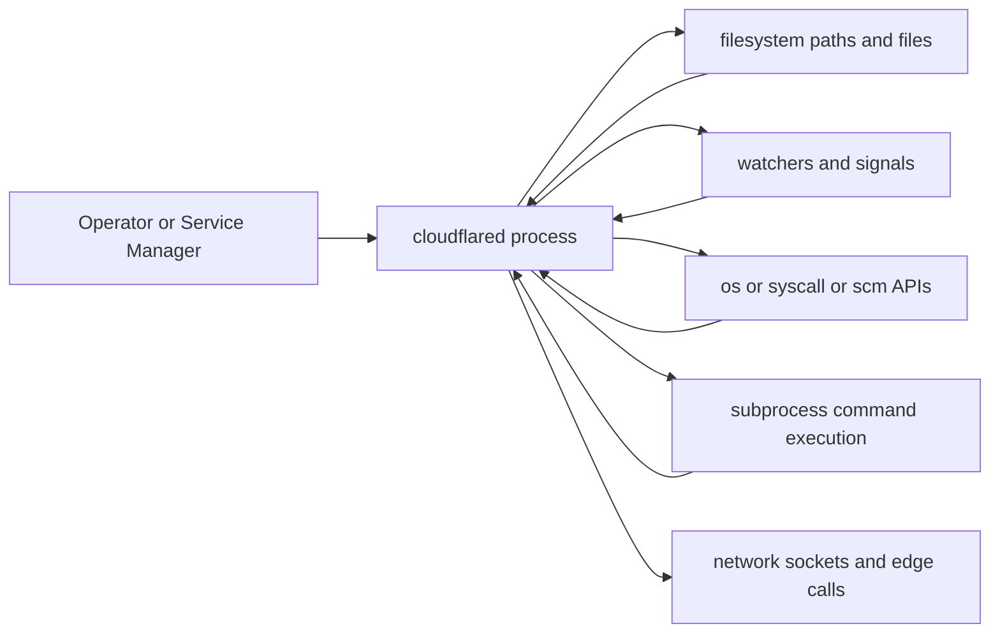
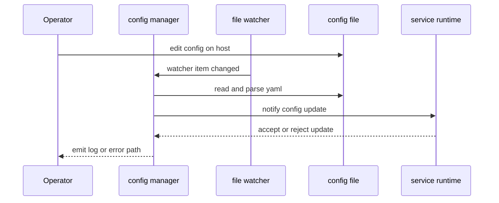

# Host Interactions Behavior Catalog

- Baseline date: 20260321
- Baseline reference: [cloudflare/cloudflared/tree/2026.3.0](https://github.com/cloudflare/cloudflared/tree/2026.3.0)
- Primary evidence set: behavior atoms under [../atoms](../../atoms)
- Upstream recheck: host boundary contracts revalidated against tag `2026.3.0` source anchors for [watcher/file.go](https://github.com/cloudflare/cloudflared/blob/2026.3.0/watcher/file.go), [atoms/watcher/file](../../atoms/watcher/file.md), [config/manager.go](https://github.com/cloudflare/cloudflared/blob/2026.3.0/config/manager.go), [atoms/config/manager](../../atoms/config/manager.md), [cmd/cloudflared/linux_service.go](https://github.com/cloudflare/cloudflared/blob/2026.3.0/cmd/cloudflared/linux_service.go), [atoms/cmd/cloudflared/linux_service](../../atoms/cmd/cloudflared/linux_service.md), [cmd/cloudflared/macos_service.go](https://github.com/cloudflare/cloudflared/blob/2026.3.0/cmd/cloudflared/macos_service.go), [atoms/cmd/cloudflared/macos_service](../../atoms/cmd/cloudflared/macos_service.md), [cmd/cloudflared/windows_service.go](https://github.com/cloudflare/cloudflared/blob/2026.3.0/cmd/cloudflared/windows_service.go), [atoms/cmd/cloudflared/windows_service](../../atoms/cmd/cloudflared/windows_service.md), [diagnostic/system_collector_linux.go](https://github.com/cloudflare/cloudflared/blob/2026.3.0/diagnostic/system_collector_linux.go), [atoms/diagnostic/system_collector_linux](../../atoms/diagnostic/system_collector_linux.md), [diagnostic/system_collector_windows.go](https://github.com/cloudflare/cloudflared/blob/2026.3.0/diagnostic/system_collector_windows.go), [atoms/diagnostic/system_collector_windows](../../atoms/diagnostic/system_collector_windows.md), [ingress/icmp_linux.go](https://github.com/cloudflare/cloudflared/blob/2026.3.0/ingress/icmp_linux.go), [atoms/ingress/icmp_linux](../../atoms/ingress/icmp_linux.md), [ingress/icmp_windows.go](https://github.com/cloudflare/cloudflared/blob/2026.3.0/ingress/icmp_windows.go), [atoms/ingress/icmp_windows](../../atoms/ingress/icmp_windows.md), [token/launch_browser_windows.go](https://github.com/cloudflare/cloudflared/blob/2026.3.0/token/launch_browser_windows.go), [atoms/token/launch_browser_windows](../../atoms/token/launch_browser_windows.md), and [tlsconfig/certreloader.go](https://github.com/cloudflare/cloudflared/blob/2026.3.0/tlsconfig/certreloader.go), [atoms/tlsconfig/certreloader](../../atoms/tlsconfig/certreloader.md).

## Scope

This catalog captures host-facing interactions where cloudflared crosses process and platform boundaries: filesystem, signals, subprocesses, service managers, host diagnostics commands, watcher notifications, and OS-specific syscall/API paths.

For this catalog, host interactions include:

- config and credential file pathing, reads, writes, and reloads,
- watcher-based config change notification lifecycle,
- host service installation/runtime control on Linux, macOS, and Windows,
- subprocess-driven host diagnostics and log collection,
- OS-differentiated ICMP/QUIC/browser-launch execution paths,
- token/key/certificate persistence and locking behavior.

Out of scope:

- pure edge protocol exchange details in [edge-interactions](edge-interactions.md),
- broader platform taxonomies already curated in [platforms](platforms.md),
- API payload contract shape in [upstream-api-contracts](upstream-api-contracts.md).

## Host Boundary Topology

## Config and Watcher Flow

## Platform Capability Matrix

| Surface | Linux | macOS | Windows | Container nuance |
| --- | --- | --- | --- | --- |
| File watch and config reload | Supported through watcher notifier and file manager callbacks. | Supported through same watcher abstraction. | Supported through same watcher abstraction. | Behavior depends on mounted volume semantics and file-event propagation latency. |
| Service install and lifecycle | systemd or sysv branch with template generation and command execution. | launchd branch with root-vs-user install path split. | SCM registration and Execute control loop with recovery settings. | Containerized deployments usually skip host service-manager paths. |
| Host diagnostics command collection | Uses host command execution and filesystem artifact writes. | Uses host command execution and parser variants. | Uses Windows command execution and parser variants. | Alternative collectors for Docker/Kubernetes logs are available. |
| Network diagnostics | traceroute-style command parsing path. | traceroute-style command parsing path. | tracert command and parser path. | In-container network namespace can alter reachability and observed hops. |
| ICMP proxy implementation | Raw-socket and permission gate path with ping-group check. | Echo ID tracking path for Darwin behavior. | Windows ICMP API and syscall-backed path. | Privileges/capabilities can disable ICMP paths even when compiled. |
| QUIC parameter tuning | Unix build-tag parameter module. | Unix build-tag parameter module. | Windows build-tag parameter module. | Container runtime kernel/host networking still governs effective socket behavior. |
| Browser launch integration | Unix launcher command path. | `open` launcher path. | `cmd /c start` style launcher path. | Headless/container environments often make launcher behavior effectively unavailable. |

## Host Interaction Domains

| Domain | Description | Representative atoms |
| --- | --- | --- |
| Watchers and mutable config | File-watcher notification and file-manager reload contract for runtime config mutation. | [watcher/file](../../atoms/watcher/file.md), [watcher/notify](../../atoms/watcher/notify.md), [config/manager](../../atoms/config/manager.md), [config/configuration](../../atoms/config/configuration.md) |
| Host service manager integration | Installation, uninstallation, and service runtime control across systemd/sysv, launchd, and Windows SCM. | [cmd/cloudflared/linux_service](../../atoms/cmd/cloudflared/linux_service.md), [cmd/cloudflared/macos_service](../../atoms/cmd/cloudflared/macos_service.md), [cmd/cloudflared/windows_service](../../atoms/cmd/cloudflared/windows_service.md), [cmd/cloudflared/service_template](../../atoms/cmd/cloudflared/service_template.md), [cmd/cloudflared/common_service](../../atoms/cmd/cloudflared/common_service.md), [cmd/cloudflared/generic_service](../../atoms/cmd/cloudflared/generic_service.md) |
| Tunnel CLI host I/O surfaces | Credentials/config file lookup, writes, pid/service signaling, and process shutdown signal handling. | [cmd/cloudflared/tunnel/cmd](../../atoms/cmd/cloudflared/tunnel/cmd.md), [cmd/cloudflared/tunnel/subcommands](../../atoms/cmd/cloudflared/tunnel/subcommands.md), [cmd/cloudflared/tunnel/subcommand_context](../../atoms/cmd/cloudflared/tunnel/subcommand_context.md), [cmd/cloudflared/tunnel/credential_finder](../../atoms/cmd/cloudflared/tunnel/credential_finder.md), [cmd/cloudflared/tunnel/filesystem](../../atoms/cmd/cloudflared/tunnel/filesystem.md), [cmd/cloudflared/tunnel/signal](../../atoms/cmd/cloudflared/tunnel/signal.md), [cmd/cloudflared/tunnel/login](../../atoms/cmd/cloudflared/tunnel/login.md) |
| Host and container diagnostics | Host/system/log collectors and command-output piping for Docker, Kubernetes, and host service logs. | [diagnostic/diagnostic](../../atoms/diagnostic/diagnostic.md), [diagnostic/diagnostic_utils](../../atoms/diagnostic/diagnostic_utils.md), [diagnostic/log_collector_host](../../atoms/diagnostic/log_collector_host.md), [diagnostic/log_collector_docker](../../atoms/diagnostic/log_collector_docker.md), [diagnostic/log_collector_kubernetes](../../atoms/diagnostic/log_collector_kubernetes.md), [diagnostic/log_collector_utils](../../atoms/diagnostic/log_collector_utils.md), [diagnostic/system_collector](../../atoms/diagnostic/system_collector.md), [diagnostic/system_collector_linux](../../atoms/diagnostic/system_collector_linux.md), [diagnostic/system_collector_macos](../../atoms/diagnostic/system_collector_macos.md), [diagnostic/system_collector_windows](../../atoms/diagnostic/system_collector_windows.md), [diagnostic/system_collector_utils](../../atoms/diagnostic/system_collector_utils.md), [diagnostic/network/collector_unix](../../atoms/diagnostic/network/collector_unix.md), [diagnostic/network/collector_windows](../../atoms/diagnostic/network/collector_windows.md) |
| Syscall and kernel-adjacent paths | OS-specific ICMP and parameter handling that differ by platform implementation details. | [ingress/icmp_linux](../../atoms/ingress/icmp_linux.md), [ingress/icmp_darwin](../../atoms/ingress/icmp_darwin.md), [ingress/icmp_windows](../../atoms/ingress/icmp_windows.md), [quic/param_unix](../../atoms/quic/param_unix.md), [quic/param_windows](../../atoms/quic/param_windows.md) |
| Credential and trust material file lifecycle | Origin cert loading, cert reloading, token lock/write/delete paths, ssh key material generation, and encrypted key persistence. | [credentials/origin_cert](../../atoms/credentials/origin_cert.md), [tlsconfig/certreloader](../../atoms/tlsconfig/certreloader.md), [tlsconfig/tlsconfig](../../atoms/tlsconfig/tlsconfig.md), [token/token](../../atoms/token/token.md), [token/path](../../atoms/token/path.md), [token/encrypt](../../atoms/token/encrypt.md), [sshgen/sshgen](../../atoms/sshgen/sshgen.md), [logger/create](../../atoms/logger/create.md) |
| Platform launcher and app-service glue | OS launcher command selection and service orchestration adapters that bridge config/watch updates into managed service loops. | [token/launch_browser_unix](../../atoms/token/launch_browser_unix.md), [token/launch_browser_darwin](../../atoms/token/launch_browser_darwin.md), [token/launch_browser_windows](../../atoms/token/launch_browser_windows.md), [cmd/cloudflared/app_service](../../atoms/cmd/cloudflared/app_service.md), [cmd/cloudflared/app_forward_service](../../atoms/cmd/cloudflared/app_forward_service.md) |

## Host Contract Matrix

| Contract area | From platform | To runtime behavior |
| --- | --- | --- |
| Config file mutation | Host filesystem events from watched paths. | File manager reloads, parses config, and notifies listeners through callback interfaces. |
| Service bootstrap context | OS service manager and privilege context (root/user/admin). | Install/uninstall path and generated service template location/commands branch by platform and privileges. |
| Signal delivery | Host signal subsystem and service-control messages. | Graceful shutdown channels and service status transitions coordinate process stop behavior. |
| Diagnostic command availability | Presence/absence of host commands and runtime (host, Docker, Kubernetes). | Collector path chooses compatible command surface and writes artifacts with consistent collector contracts. |
| ICMP privileges and API model | Kernel capabilities and platform ICMP API constraints. | Request/serve loop behavior diverges by Linux raw sockets, Darwin ID tracking, and Windows API roundtrip paths. |
| Credential file and lock semantics | Host path resolution, file-permission model, and lock-file behavior. | Token/cert/key material creation, locking, loading, and cleanup paths enforce credential persistence contracts. |
| Browser launch affordance | OS launch command conventions and desktop/session availability. | Token flow emits platform-specific launch command invocation while preserving same high-level login behavior. |

## Host Nuances and Support Boundaries

| Feature | Supported | Not supported or constrained | Nuance |
| --- | --- | --- | --- |
| Watcher-driven config hot update | Supported when host file events are delivered. | Not reliable on all remote/network filesystems or unusual volume mounts. | Runtime still depends on successful parse and manager callback chain. |
| Linux service management | Supported for systemd and sysv branches. | Other init systems are outside explicit branch logic. | Install path and command invocation branch at runtime based on detection. |
| macOS service management | Supported via launchd templates. | Non-standard launch environments may bypass expected behavior. | Root vs user install path selection changes file destination and launch context. |
| Windows service management | Supported via SCM registration and control loop. | Non-service invocations do not use SCM path. | Recovery configuration and status transitions add Windows-specific lifecycle semantics. |
| ICMP forwarding | Supported with platform-specific implementations. | Can fail when OS privileges/capabilities are missing. | Different packet correlation and API calls by OS imply distinct failure envelopes. |
| Host log collection | Supported for host, Docker, and Kubernetes variants. | Missing runtime binaries/permissions degrade specific collector paths. | Collector utils normalize command output and file copy handling across sources. |
| Browser auto-open for token flow | Supported by platform launch commands. | Headless/server environments often cannot open a browser. | Flow remains valid even when launch operation is skipped or fails. |

## Full Coverage Links

- [cmd/cloudflared/app_forward_service](../../atoms/cmd/cloudflared/app_forward_service.md)
- [cmd/cloudflared/app_service](../../atoms/cmd/cloudflared/app_service.md)
- [cmd/cloudflared/common_service](../../atoms/cmd/cloudflared/common_service.md)
- [cmd/cloudflared/generic_service](../../atoms/cmd/cloudflared/generic_service.md)
- [cmd/cloudflared/linux_service](../../atoms/cmd/cloudflared/linux_service.md)
- [cmd/cloudflared/macos_service](../../atoms/cmd/cloudflared/macos_service.md)
- [cmd/cloudflared/service_template](../../atoms/cmd/cloudflared/service_template.md)
- [cmd/cloudflared/windows_service](../../atoms/cmd/cloudflared/windows_service.md)
- [cmd/cloudflared/tunnel/cmd](../../atoms/cmd/cloudflared/tunnel/cmd.md)
- [cmd/cloudflared/tunnel/credential_finder](../../atoms/cmd/cloudflared/tunnel/credential_finder.md)
- [cmd/cloudflared/tunnel/filesystem](../../atoms/cmd/cloudflared/tunnel/filesystem.md)
- [cmd/cloudflared/tunnel/login](../../atoms/cmd/cloudflared/tunnel/login.md)
- [cmd/cloudflared/tunnel/signal](../../atoms/cmd/cloudflared/tunnel/signal.md)
- [cmd/cloudflared/tunnel/subcommand_context](../../atoms/cmd/cloudflared/tunnel/subcommand_context.md)
- [cmd/cloudflared/tunnel/subcommands](../../atoms/cmd/cloudflared/tunnel/subcommands.md)
- [config/configuration](../../atoms/config/configuration.md)
- [config/manager](../../atoms/config/manager.md)
- [credentials/origin_cert](../../atoms/credentials/origin_cert.md)
- [diagnostic/diagnostic](../../atoms/diagnostic/diagnostic.md)
- [diagnostic/diagnostic_utils](../../atoms/diagnostic/diagnostic_utils.md)
- [diagnostic/log_collector_docker](../../atoms/diagnostic/log_collector_docker.md)
- [diagnostic/log_collector_host](../../atoms/diagnostic/log_collector_host.md)
- [diagnostic/log_collector_kubernetes](../../atoms/diagnostic/log_collector_kubernetes.md)
- [diagnostic/log_collector_utils](../../atoms/diagnostic/log_collector_utils.md)
- [diagnostic/network/collector_unix](../../atoms/diagnostic/network/collector_unix.md)
- [diagnostic/network/collector_windows](../../atoms/diagnostic/network/collector_windows.md)
- [diagnostic/system_collector](../../atoms/diagnostic/system_collector.md)
- [diagnostic/system_collector_linux](../../atoms/diagnostic/system_collector_linux.md)
- [diagnostic/system_collector_macos](../../atoms/diagnostic/system_collector_macos.md)
- [diagnostic/system_collector_utils](../../atoms/diagnostic/system_collector_utils.md)
- [diagnostic/system_collector_windows](../../atoms/diagnostic/system_collector_windows.md)
- [ingress/icmp_darwin](../../atoms/ingress/icmp_darwin.md)
- [ingress/icmp_linux](../../atoms/ingress/icmp_linux.md)
- [ingress/icmp_windows](../../atoms/ingress/icmp_windows.md)
- [logger/create](../../atoms/logger/create.md)
- [quic/param_unix](../../atoms/quic/param_unix.md)
- [quic/param_windows](../../atoms/quic/param_windows.md)
- [sshgen/sshgen](../../atoms/sshgen/sshgen.md)
- [tlsconfig/certreloader](../../atoms/tlsconfig/certreloader.md)
- [tlsconfig/tlsconfig](../../atoms/tlsconfig/tlsconfig.md)
- [token/encrypt](../../atoms/token/encrypt.md)
- [token/launch_browser_darwin](../../atoms/token/launch_browser_darwin.md)
- [token/launch_browser_unix](../../atoms/token/launch_browser_unix.md)
- [token/launch_browser_windows](../../atoms/token/launch_browser_windows.md)
- [token/path](../../atoms/token/path.md)
- [token/token](../../atoms/token/token.md)
- [watcher/file](../../atoms/watcher/file.md)
- [watcher/notify](../../atoms/watcher/notify.md)

## Upstream-Verified Host Interaction Quirks

### Service Config Path Convention

The Linux service installer hardcodes `/etc/cloudflared/config.yml` as the service configuration path. If the user's config is at a different location, the installer copies it to this path. This creates a hard file-system coupling between service installation and configuration management.

### SysV Init Compatibility

| Runlevel | Script action |
| --- | --- |
| 2, 3, 4, 5 | Start (symlink `S50et`) |
| 0, 1, 6 | Stop (symlink `K02et`) |

The `S50` and `K02` prefixes control start/stop ordering relative to other init scripts.

### File Watcher Host Coupling

Config file watchers use filesystem notification APIs that vary by OS. The `watcher` package atoms ([watcher/file](../../atoms/watcher/file.md), [watcher/notify](../../atoms/watcher/notify.md)) bridge host-level inotify/kqueue/ReadDirectoryChanges to config reload triggers.

## Notes

- Overlap with [platforms](platforms.md), [config](config.md), [sessions](sessions.md), and [state-machines](state-machines.md) is intentional because host boundaries cut across those domains.
- This catalog is behavior-first at the host boundary; it emphasizes "from platform" stimuli and "to runtime" effects.

## Coverage Audit

- Audit method: collect host-interaction scoped atom docs across watcher/config reload (`watcher/*`, `config/{configuration,manager}`), host service integration (`cmd/cloudflared/{common_service,generic_service,service_template,linux_service,macos_service,windows_service,app_service,app_forward_service}`), tunnel host I/O and signals (`cmd/cloudflared/tunnel/{cmd,subcommands,subcommand_context,credential_finder,filesystem,login,signal}`), diagnostics collectors/parsers (`diagnostic/{diagnostic,diagnostic_utils,log_collector_host,log_collector_docker,log_collector_kubernetes,log_collector_utils,system_collector,system_collector_linux,system_collector_macos,system_collector_windows,system_collector_utils}`, `diagnostic/network/{collector_unix,collector_windows}`), syscall/platform adapters (`ingress/{icmp_linux,icmp_darwin,icmp_windows}`, `quic/{param_unix,param_windows}`), and credential/tls/token file lifecycle (`credentials/origin_cert`, `tlsconfig/{certreloader,tlsconfig}`, `token/{token,path,encrypt,launch_browser_unix,launch_browser_darwin,launch_browser_windows}`, `sshgen/sshgen`, `logger/create`), then diff against all atom links listed in this catalog.
- Current coverage result: 48 host-scoped atom docs found, 48 linked in catalog, 0 missing.
- Delta (catalog links - host-scoped atom docs): 0.
- Operational guardrail: if watcher callbacks, service manager adapters, host diagnostic collectors, filesystem credential paths, or OS-specific syscall modules change, rerun this audit and update this file in the same change.
