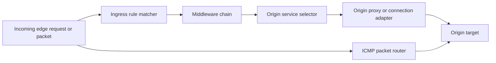
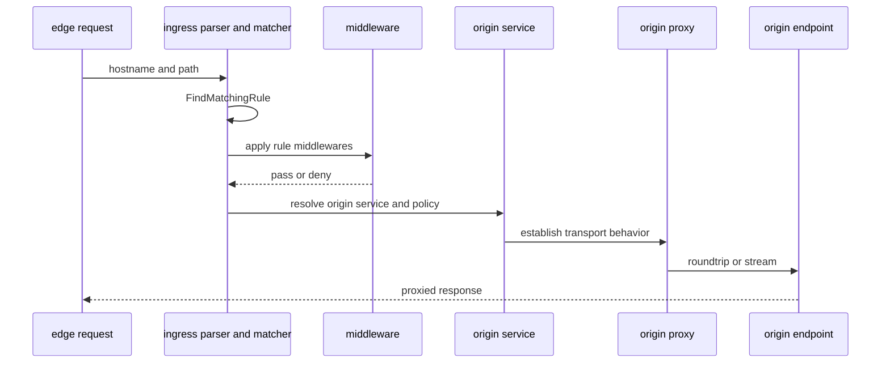
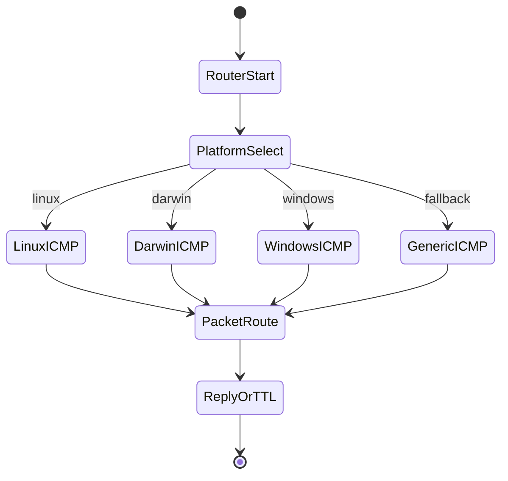
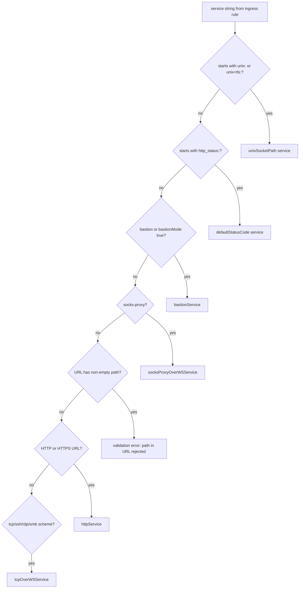

# Ingress Behavior Catalog

- Baseline date: 20260321
- Baseline reference: [cloudflare/cloudflared/tree/2026.3.0](https://github.com/cloudflare/cloudflared/tree/2026.3.0)
- Primary evidence set: behavior atoms under [../atoms/ingress](../../atoms/ingress)
- Upstream recheck: ingress contracts revalidated against tag `2026.3.0` source anchors for [ingress/ingress.go](https://github.com/cloudflare/cloudflared/blob/2026.3.0/ingress/ingress.go), [atoms/ingress/ingress](../../atoms/ingress/ingress.md), [ingress/config.go](https://github.com/cloudflare/cloudflared/blob/2026.3.0/ingress/config.go), [atoms/ingress/config](../../atoms/ingress/config.md), [ingress/rule.go](https://github.com/cloudflare/cloudflared/blob/2026.3.0/ingress/rule.go), [atoms/ingress/rule](../../atoms/ingress/rule.md), [ingress/middleware/middleware.go](https://github.com/cloudflare/cloudflared/blob/2026.3.0/ingress/middleware/middleware.go), [atoms/ingress/middleware/middleware](../../atoms/ingress/middleware/middleware.md), [ingress/middleware/jwtvalidator.go](https://github.com/cloudflare/cloudflared/blob/2026.3.0/ingress/middleware/jwtvalidator.go), [atoms/ingress/middleware/jwtvalidator](../../atoms/ingress/middleware/jwtvalidator.md), [ingress/origin_service.go](https://github.com/cloudflare/cloudflared/blob/2026.3.0/ingress/origin_service.go), [atoms/ingress/origin_service](../../atoms/ingress/origin_service.md), [ingress/origin_proxy.go](https://github.com/cloudflare/cloudflared/blob/2026.3.0/ingress/origin_proxy.go), [atoms/ingress/origin_proxy](../../atoms/ingress/origin_proxy.md), [ingress/origin_connection.go](https://github.com/cloudflare/cloudflared/blob/2026.3.0/ingress/origin_connection.go), [atoms/ingress/origin_connection](../../atoms/ingress/origin_connection.md), [ingress/origin_dialer.go](https://github.com/cloudflare/cloudflared/blob/2026.3.0/ingress/origin_dialer.go), [atoms/ingress/origin_dialer](../../atoms/ingress/origin_dialer.md), [ingress/origin_icmp_proxy.go](https://github.com/cloudflare/cloudflared/blob/2026.3.0/ingress/origin_icmp_proxy.go), [atoms/ingress/origin_icmp_proxy](../../atoms/ingress/origin_icmp_proxy.md), [ingress/packet_router.go](https://github.com/cloudflare/cloudflared/blob/2026.3.0/ingress/packet_router.go), [atoms/ingress/packet_router](../../atoms/ingress/packet_router.md), [ingress/origins/dns.go](https://github.com/cloudflare/cloudflared/blob/2026.3.0/ingress/origins/dns.go), [atoms/ingress/origins/dns](../../atoms/ingress/origins/dns.md), [ingress/icmp_linux.go](https://github.com/cloudflare/cloudflared/blob/2026.3.0/ingress/icmp_linux.go), [atoms/ingress/icmp_linux](../../atoms/ingress/icmp_linux.md), and [ingress/icmp_windows.go](https://github.com/cloudflare/cloudflared/blob/2026.3.0/ingress/icmp_windows.go), [atoms/ingress/icmp_windows](../../atoms/ingress/icmp_windows.md).

## Scope

This catalog is a dedicated ingress deep dive. It documents how cloudflared evaluates ingress rules, applies middleware, selects and starts origin services, and routes HTTP/TCP/WS/ICMP packets to local or remote targets.

For this catalog, ingress behavior includes:

- ingress parsing and validation from config plus CLI overlays,
- host and path matching plus catch-all semantics,
- origin request policy merging (timeouts, TLS, proxy settings, access policy, ip rules),
- middleware execution contracts (including JWT validator behavior),
- origin service and proxy adapter behavior for HTTP/TCP/WS/socks/management/status targets,
- packet and ICMP routing behavior including platform-specific ICMP implementations,
- DNS-origin resolver behavior and ingress metrics.

Out of scope:

- full transport matrix across all proxy subsystems in [proxying](proxying.md),
- broader tunnel lifecycle and orchestration details in [tunnels](tunnels.md),
- cross-domain state-machine focus in [state-machines](state-machines.md),
- deep access token lifecycle focus in [access-policies](access-policies.md).

## Ingress Topology

## HTTP Request Path Sequence

## ICMP Runtime Branching

## Domain Map

| Domain | Description | Representative atoms |
| --- | --- | --- |
| Ingress rule model | Rule matching, hostname and path predicates, default/catch-all behavior, and config parse lifecycle. | [ingress/ingress](../../atoms/ingress/ingress.md), [ingress/rule](../../atoms/ingress/rule.md) |
| Origin request policy merge | Merge and normalize ingress origin-request settings (timeouts, tls, proxy, access, ip rules, http2 toggles). | [ingress/config](../../atoms/ingress/config.md) |
| Middleware contracts | Middleware interface boundary and JWT validation middleware behavior. | [ingress/middleware/middleware](../../atoms/ingress/middleware/middleware.md), [ingress/middleware/jwtvalidator](../../atoms/ingress/middleware/jwtvalidator.md) |
| Origin service adapters | Service objects and startup behavior for HTTP, raw TCP, tcp-over-ws, socks-over-ws, status, hello-world, and management paths. | [ingress/origin_service](../../atoms/ingress/origin_service.md), [ingress/origin_proxy](../../atoms/ingress/origin_proxy.md), [ingress/origin_connection](../../atoms/ingress/origin_connection.md), [ingress/origin_dialer](../../atoms/ingress/origin_dialer.md) |
| Packet and ICMP routing | ICMP router, packet mux/decode/encode flow, ttl exceed behavior, and per-OS ICMP implementations. | [ingress/origin_icmp_proxy](../../atoms/ingress/origin_icmp_proxy.md), [ingress/packet_router](../../atoms/ingress/packet_router.md), [ingress/icmp_linux](../../atoms/ingress/icmp_linux.md), [ingress/icmp_darwin](../../atoms/ingress/icmp_darwin.md), [ingress/icmp_windows](../../atoms/ingress/icmp_windows.md), [ingress/icmp_posix](../../atoms/ingress/icmp_posix.md), [ingress/icmp_generic](../../atoms/ingress/icmp_generic.md), [ingress/icmp_metrics](../../atoms/ingress/icmp_metrics.md) |
| DNS origin behavior | DNS origin dial behavior, resolver refresh loop, and ingress DNS metrics. | [ingress/origins/dns](../../atoms/ingress/origins/dns.md), [ingress/origins/metrics](../../atoms/ingress/origins/metrics.md) |

## Contract Matrix

| Contract area | Behavior contract |
| --- | --- |
| Rule selection contract | Rule matching is driven by hostname and path evaluation with explicit catch-all validation constraints and deterministic rule order semantics. |
| Config-validation contract | Ingress config parse paths validate access settings and hostname/rule constraints before runtime starts origins. |
| Middleware gate contract | Middleware can permit or deny requests before origin service dispatch, with JWT validator enforcing team/environment/audience policy. |
| Origin service startup contract | Start routines for selected origin services run during ingress start and bind request handling strategy to service type. |
| Proxy/connection contract | RoundTrip and EstablishConnection boundaries decide HTTP request forwarding versus stream relay behavior for TCP/WS/socks paths. |
| ICMP contract | ICMP path uses router plus packet responder flow and per-platform proxy implementations, including ttl-exceeded conversion and tracing hooks. |
| DNS origin freshness contract | DNS origin resolver path maintains refresh loop cadence and updates active resolver address with metrics on TCP/UDP request classes. |

## Middleware and Policy Surface

| Surface | Input | Output or side effect |
| --- | --- | --- |
| JWT validator middleware | team, environment, audience tags, request token | allow handling continuation or auth error |
| Ingress access config validation | ingress access config block | accepted ingress config or validation error |
| IP rules in origin request config | serialized ip rule list from config | runtime origin request policy with rule list applied |
| CLI ingress validation command | config and test URL input | validation report and matched rule output |

Command entrypoint evidence: [cmd/cloudflared/tunnel/ingress_subcommands](../../atoms/cmd/cloudflared/tunnel/ingress_subcommands.md).

## Full Coverage Links

- [ingress/config](../../atoms/ingress/config.md)
- [ingress/icmp_darwin](../../atoms/ingress/icmp_darwin.md)
- [ingress/icmp_generic](../../atoms/ingress/icmp_generic.md)
- [ingress/icmp_linux](../../atoms/ingress/icmp_linux.md)
- [ingress/icmp_metrics](../../atoms/ingress/icmp_metrics.md)
- [ingress/icmp_posix](../../atoms/ingress/icmp_posix.md)
- [ingress/icmp_windows](../../atoms/ingress/icmp_windows.md)
- [ingress/ingress](../../atoms/ingress/ingress.md)
- [ingress/middleware/jwtvalidator](../../atoms/ingress/middleware/jwtvalidator.md)
- [ingress/middleware/middleware](../../atoms/ingress/middleware/middleware.md)
- [ingress/origin_connection](../../atoms/ingress/origin_connection.md)
- [ingress/origin_dialer](../../atoms/ingress/origin_dialer.md)
- [ingress/origin_icmp_proxy](../../atoms/ingress/origin_icmp_proxy.md)
- [ingress/origin_proxy](../../atoms/ingress/origin_proxy.md)
- [ingress/origins/dns](../../atoms/ingress/origins/dns.md)
- [ingress/origin_service](../../atoms/ingress/origin_service.md)
- [ingress/origins/metrics](../../atoms/ingress/origins/metrics.md)
- [ingress/packet_router](../../atoms/ingress/packet_router.md)
- [ingress/rule](../../atoms/ingress/rule.md)

## Upstream-Verified Ingress Constants and Quirks

_Cross-referenced against [ingress/ingress.go](https://github.com/cloudflare/cloudflared/blob/2026.3.0/ingress/ingress.go) and [ingress/config.go](https://github.com/cloudflare/cloudflared/blob/2026.3.0/ingress/config.go) at tag `2026.3.0`._

### Origin Request Default Constants

| Constant | Value | Source |
| --- | --- | --- |
| `defaultHTTPConnectTimeout` | 30 s | [ingress/config.go](https://github.com/cloudflare/cloudflared/blob/2026.3.0/ingress/config.go) |
| `defaultWarpRoutingConnectTimeout` | 5 s | [ingress/config.go](https://github.com/cloudflare/cloudflared/blob/2026.3.0/ingress/config.go) |
| `defaultTLSTimeout` | 10 s | [ingress/config.go](https://github.com/cloudflare/cloudflared/blob/2026.3.0/ingress/config.go) |
| `defaultTCPKeepAlive` | 30 s | [ingress/config.go](https://github.com/cloudflare/cloudflared/blob/2026.3.0/ingress/config.go) |
| `defaultKeepAliveTimeout` | 90 s | [ingress/config.go](https://github.com/cloudflare/cloudflared/blob/2026.3.0/ingress/config.go) |
| `defaultKeepAliveConnections` | 100 | [ingress/config.go](https://github.com/cloudflare/cloudflared/blob/2026.3.0/ingress/config.go) |
| `defaultMaxActiveFlows` | 0 (unlimited) | [ingress/config.go](https://github.com/cloudflare/cloudflared/blob/2026.3.0/ingress/config.go) |
| `defaultProxyAddress` | `127.0.0.1` | [ingress/config.go](https://github.com/cloudflare/cloudflared/blob/2026.3.0/ingress/config.go) |

### Service Type Sentinel Constants

| Constant | Value | Role |
| --- | --- | --- |
| `ServiceBastion` | `"bastion"` | Triggers bastion/jump-host mode |
| `ServiceSocksProxy` | `"socks-proxy"` | Triggers SOCKS5-over-WS origin service |
| `ServiceWarpRouting` | `"warp-routing"` | Triggers WARP routing config branch |

### Rule Matching Behavioral Quirks

- **Quirk — InternalRules return negative indices.** `FindMatchingRule` returns `-1 - i` for matches against `InternalRules` (e.g. management endpoint), distinguishing them from user-defined rules in logs. The full range of internal-rule indices is `[-1 .. )` (negative-only).

- **Quirk — Hostname port stripping.** Before rule matching, `FindMatchingRule` calls `net.SplitHostPort` and silently strips port if present, matching host-only against rules.

- **Quirk — Wildcard semantics.** Hostname wildcards are prefix-only: `*.example.com` matches by stripping `*` and checking `HasSuffix`. Only the first `*` position is checked; `LastIndex("*") > 0` disallows mid-hostname wildcards.

- **Quirk — Catch-all validation is bidirectional.** The last rule _must_ be catch-all (hostname empty or `*`, no path filter). Any non-last rule that _is_ catch-all also fails validation with `ruleShouldNotBeCatchAllError`.

- **Quirk — Punycode auto-conversion.** Non-ASCII hostnames are converted to punycode via `idna.Lookup.ToASCII`; the punycode form is stored separately only when it differs from the original hostname.

### Config Merge Precedence (4-layer)

The `setConfig` function applies a documented 4-layer lookup for each origin-request field:

1. Per-rule user config (`overrides`)
2. Global ingress user config (`defaults`)
3. Cloudflared team-chosen defaults (the `default*` variables above)
4. Go zero values

- **Quirk — Pointer-nil gating.** Each setter checks for `nil` pointer on the override; zero-valued non-nil pointers _do_ override defaults. This means an explicit `connectTimeout: 0` in config differs from omitting the field entirely.

### Service parse taxonomy

| Service string prefix | Constructed origin service |
| --- | --- |
| `unix:` | `unixSocketPath` (scheme `http`) |
| `unix+tls:` | `unixSocketPath` (scheme `https`) |
| `http_status:NNN` | `defaultStatusCode` |
| `socks-proxy` | `socksProxyOverWSService` (with IP access policy) |
| `bastion` or `bastionMode: true` | `bastionService` |
| HTTP/HTTPS URL | `httpService` |
| Other scheme URL (tcp, ssh, rdp, smb) | `tcpOverWSService` |

- **Quirk — Path in origin URL is rejected.** Any service URL with a non-empty path fails validation: cloudflared proxies the _eyeball request path_ directly and does not support path rewriting.

### Access Middleware Validation

- Access JWT middleware is instantiated via `NewJWTValidator(teamName, environment, audTags)` which constructs an OIDC verifier against `https://{team}.cloudflareaccess.com/cdn-cgi/access/certs` (or `fed.cloudflareaccess.com` for FedRAMP `environment="fed"`).
- **Quirk — SkipClientIDCheck.** The OIDC `Config` sets `SkipClientIDCheck: true` because audience validation is done manually by matching any JWT `aud` tag against the configured `audTags` list.
- **Quirk — Partial AudTag validation in config.** `validateAccessConfiguration` only validates that `teamName` is non-empty _when_ `audTag` is provided; a bare `required: true` with no team/aud is allowed through config validation.

## Origin Service Selection Decision Tree

### Origin Service Startup Contracts

Each origin service type has distinct startup and shutdown behavior:

| Service type | Startup behavior | Shutdown behavior |
| --- | --- | --- |
| `httpService` | Constructs `http.Transport` with origin request TLS/timeout/keepalive settings | Transport `CloseIdleConnections` |
| `tcpOverWSService` | Lazy dial per request; no listener preallocation | Connection close per stream |
| `unixSocketPath` | Validates socket path exists at parse time | No persistent connection |
| `socksProxyOverWSService` | Binds IP access policy at construction | Policy object dropped |
| `bastionService` | No-op startup; dial target comes from request metadata | Per-request cleanup |
| `defaultStatusCode` | Stateless; returns fixed HTTP status | No-op |

## Notes

- This catalog intentionally intersects [proxying](proxying.md) but goes deeper on ingress-specific behavior, especially middleware, rule evaluation, and origin service selection semantics.
- Access-policy overlap is intentional where ingress access config and JWT middleware interact with policy enforcement surfaces.

## Coverage Audit

- Audit method: collect all atom docs under [../atoms/ingress](../../atoms/ingress), then diff against the Full Coverage Links section in this file.
- Current coverage result: 19 ingress-scoped atom docs found, 19 linked in catalog, 0 missing.
- Delta (catalog links - ingress-scoped atom docs): 0.
- Additional cross-module evidence may be cited for command entrypoints and overlap context, but scoped coverage completeness is measured against ingress module atoms.
- Operational guardrail: if any ingress atom is added, removed, or renamed, rerun this audit and update this catalog in the same change.
