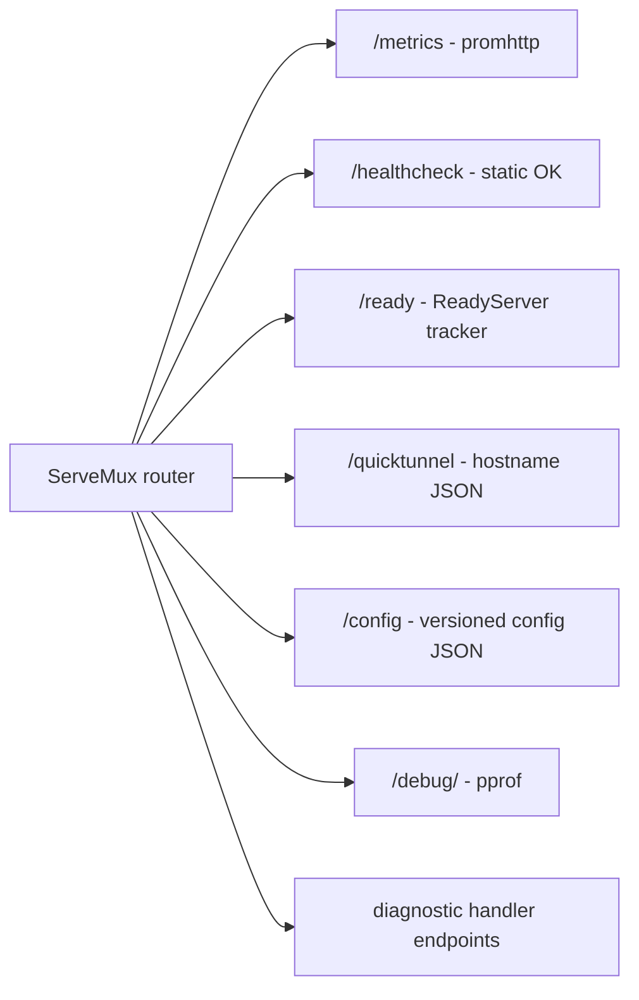
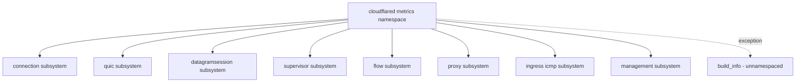
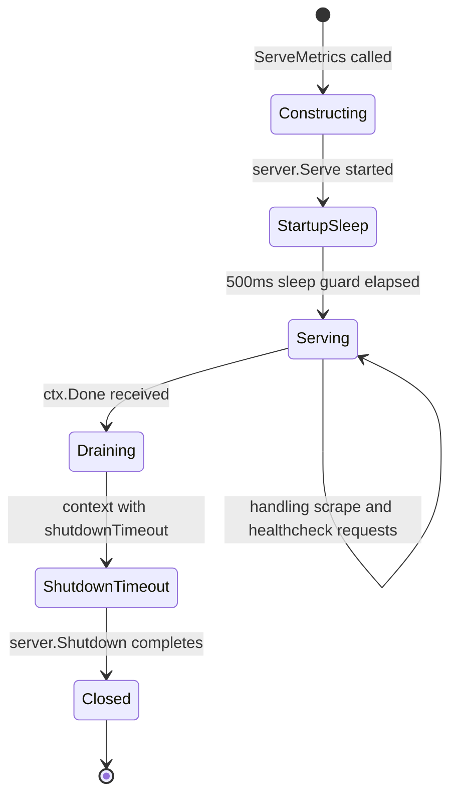

# Metrics Behavior Catalog

- Baseline date: 20260321
- Baseline reference: [cloudflare/cloudflared/tree/2026.3.0](https://github.com/cloudflare/cloudflared/tree/2026.3.0)
- Primary evidence set: behavior atoms under [../atoms](../../atoms)

## Scope

This catalog records metrics instrumentation behavior represented in the baseline atom corpus.

- Direct evidence: behavior atoms that expose `metrics emission`, import Prometheus packages, or belong to the dedicated metrics module.
- Out of scope: broad diagnostics and tracing semantics that do not define metrics instrumentation contracts directly.

## Metrics Surfaces

| Surface | Description | Representative atoms |
|---|---|---|
| Runtime metrics endpoints | Metrics server wiring and readiness state for scrape surfaces. | [metrics/metrics](../../atoms/metrics/metrics.md), [metrics/readiness](../../atoms/metrics/readiness.md), [management/service](../../atoms/management/service.md) |
| Transport and tunnel telemetry | Connection, QUIC, datagram, and supervisor metrics counters and gauges. | [connection/metrics](../../atoms/connection/metrics.md), [quic/metrics](../../atoms/quic/metrics.md), [quic/v3/metrics](../../atoms/quic/v3/metrics.md), [supervisor/metrics](../../atoms/supervisor/metrics.md), [datagramsession/metrics](../../atoms/datagramsession/metrics.md) |
| Flow and ingress telemetry | Flow limiter and ingress-specific metrics families. | [flow/metrics](../../atoms/flow/metrics.md), [ingress/icmp_metrics](../../atoms/ingress/icmp_metrics.md), [ingress/origins/metrics](../../atoms/ingress/origins/metrics.md) |
| Control-plane telemetry hooks | Registration/session/configuration paths that emit metrics in control APIs. | [tunnelrpc/registration_client](../../atoms/tunnelrpc/registration_client.md), [tunnelrpc/quic/session_client](../../atoms/tunnelrpc/quic/session_client.md), [tunnelrpc/pogs/configuration_manager](../../atoms/tunnelrpc/pogs/configuration_manager.md) |

## Full Coverage Links

- [cmd/cloudflared/main](../../atoms/cmd/cloudflared/main.md)
- [cmd/cloudflared/tunnel/cmd](../../atoms/cmd/cloudflared/tunnel/cmd.md)
- [cmd/cloudflared/tunnel/configuration](../../atoms/cmd/cloudflared/tunnel/configuration.md)
- [cmd/cloudflared/tunnel/subcommands](../../atoms/cmd/cloudflared/tunnel/subcommands.md)
- [connection/control](../../atoms/connection/control.md)
- [connection/metrics](../../atoms/connection/metrics.md)
- [connection/observer](../../atoms/connection/observer.md)
- [connection/quic_datagram_v3](../../atoms/connection/quic_datagram_v3.md)
- [connection/tunnelsforha](../../atoms/connection/tunnelsforha.md)
- [datagramsession/metrics](../../atoms/datagramsession/metrics.md)
- [diagnostic/consts](../../atoms/diagnostic/consts.md)
- [diagnostic/error](../../atoms/diagnostic/error.md)
- [flow/metrics](../../atoms/flow/metrics.md)
- [ingress/icmp_metrics](../../atoms/ingress/icmp_metrics.md)
- [ingress/origins/dns](../../atoms/ingress/origins/dns.md)
- [ingress/origins/metrics](../../atoms/ingress/origins/metrics.md)
- [management/service](../../atoms/management/service.md)
- [metrics/config](../../atoms/metrics/config.md)
- [metrics/metrics](../../atoms/metrics/metrics.md)
- [metrics/readiness](../../atoms/metrics/readiness.md)
- [orchestration/metrics](../../atoms/orchestration/metrics.md)
- [proxy/metrics](../../atoms/proxy/metrics.md)
- [quic/conversion](../../atoms/quic/conversion.md)
- [quic/metrics](../../atoms/quic/metrics.md)
- [quic/v3/metrics](../../atoms/quic/v3/metrics.md)
- [quic/v3/muxer](../../atoms/quic/v3/muxer.md)
- [quic/v3/session](../../atoms/quic/v3/session.md)
- [supervisor/metrics](../../atoms/supervisor/metrics.md)
- [supervisor/supervisor](../../atoms/supervisor/supervisor.md)
- [supervisor/tunnelsforha](../../atoms/supervisor/tunnelsforha.md)
- [tunnelrpc/metrics/metrics](../../atoms/tunnelrpc/metrics/metrics.md)
- [tunnelrpc/pogs/configuration_manager](../../atoms/tunnelrpc/pogs/configuration_manager.md)
- [tunnelrpc/pogs/registration_server](../../atoms/tunnelrpc/pogs/registration_server.md)
- [tunnelrpc/pogs/session_manager](../../atoms/tunnelrpc/pogs/session_manager.md)
- [tunnelrpc/quic/cloudflared_client](../../atoms/tunnelrpc/quic/cloudflared_client.md)
- [tunnelrpc/quic/session_client](../../atoms/tunnelrpc/quic/session_client.md)
- [tunnelrpc/registration_client](../../atoms/tunnelrpc/registration_client.md)

## Upstream-Verified Metrics Server Constants and Quirks

_Cross-referenced against [metrics/metrics.go](https://github.com/cloudflare/cloudflared/blob/2026.3.0/metrics/metrics.go) at tag `2026.3.0`._

### Metrics Server Constants

| Constant | Value | Source |
|---|---|---|
| `startupTime` | 500 ms | [metrics/metrics.go](https://github.com/cloudflare/cloudflared/blob/2026.3.0/metrics/metrics.go) |
| `defaultShutdownTimeout` | 15 s | [metrics/metrics.go](https://github.com/cloudflare/cloudflared/blob/2026.3.0/metrics/metrics.go) |
| HTTP `ReadTimeout` | 10 s | [metrics/metrics.go](https://github.com/cloudflare/cloudflared/blob/2026.3.0/metrics/metrics.go) |
| HTTP `WriteTimeout` | 10 s | [metrics/metrics.go](https://github.com/cloudflare/cloudflared/blob/2026.3.0/metrics/metrics.go) |

### Port Binding Strategy

The metrics server uses a semi-deterministic port selection strategy:

1. If operator passes `--metrics` address, bind to exactly that address.
2. If default address is used, try known ports `20241` through `20245` sequentially.
3. If all known ports are busy, fall back to a random port (`:0`).

- **Quirk — Port range 20241-20245 rationale.** The source comment states: "at the time we are in 2024 and they do not collide with any known/registered port."

- **Quirk — Virtual vs host binding.** Runtime type `"virtual"` (set at compile time) binds to `0.0.0.0:*` instead of `localhost:*`, ensuring reachability across container/VM network boundaries.

### Metrics Endpoint Topology

### Server Lifecycle Quirks

- **Quirk — Startup sleep guard.** `ServeMetrics` includes an artificial `time.Sleep(startupTime)` (500ms) between `server.Serve` and waiting on `ctx.Done()`. The comment explains: "server.Serve will hang if server.Shutdown is called before the server is fully started up."

- **Quirk — Privileged port assumption.** The source comment states "Metrics port is privileged, so no need for further access control" and sets `trace.AuthRequest` to always return `(true, true)`.

- **Quirk — Build info metric is unnamespaced.** `RegisterBuildInfo` creates a gauge named `build_info` (not `cloudflared_build_info`) with comment: "Don't namespace build_info, since we want it to be consistent across all Cloudflare services."

- **Quirk — `ErrServerClosed` is success.** When `server.Serve` returns `http.ErrServerClosed`, `ServeMetrics` logs "Metrics server stopped" at info level and returns `nil`, treating graceful shutdown as success.

- **Quirk — Shutdown timeout override.** `Config.ShutdownTimeout` can override the default 15s. A zero value falls back to `defaultShutdownTimeout` rather than meaning "no timeout."

## Metrics Registration Patterns

Cloudflared uses two distinct patterns for Prometheus metric registration across its codebase.

### Init-Time Registration

Most metrics-bearing packages register Prometheus collectors in Go `init()` functions or package-level `var` blocks:

| Package | Registration pattern | Metric types |
|---|---|---|
| `supervisor/metrics` | `var` block with `prometheus.NewGaugeVec` | `haConnections` gauge |
| `connection/metrics` | `var` block with counters and histograms | Connection attempt/success counters, latency histograms |
| `quic/v3/metrics` | `var` block with `prometheus.NewCounterVec` | Session open/close/error counters |
| `flow/metrics` | `var` block with `prometheus.NewGaugeVec` | Active flow gauges |
| `proxy/metrics` | `var` block with counters and histograms | Proxy request counters, latency histograms |
| `ingress/icmp_metrics` | `init()` with `prometheus.MustRegister` | ICMP request/reply counters |

### Runtime Registration

The metrics server itself and management endpoints register handlers at server construction time rather than package init:

| Surface | Registration timing | Handler |
|---|---|---|
| `/metrics` | Server construction in `ServeMetrics` | `promhttp.Handler()` |
| `/healthcheck` | Server construction | Static 200 OK |
| `/ready` | Server construction | `ReadyServer` tracker |
| `/debug/` | Server construction | `net/http/pprof` |

## Metrics Namespace Taxonomy

### Namespace and Subsystem Organization

| Namespace | Subsystem | Example metrics |
|---|---|---|
| `cloudflared` | `connection` | `cloudflared_connection_register_success_total` |
| `cloudflared` | `quic` | `cloudflared_quic_session_total` |
| `cloudflared` | `supervisor` | `cloudflared_supervisor_ha_connections` |
| `cloudflared` | `proxy` | `cloudflared_proxy_requests_total` |
| (none) | (none) | `build_info` — intentionally unnamespaced for cross-service consistency |

## Metrics Server Lifecycle

## Notes

- This catalog is evidence-linked to atom content and does not infer runtime metrics behavior beyond documented contracts.
- Metrics and observability overlap at shared surfaces (for example, [connection/observer](../../atoms/connection/observer.md)); overlap is intentional and scoped by catalog purpose.

## Coverage Audit

- Audit method: collect atom docs under [../atoms](../../atoms) with `metrics emission`, Prometheus imports, or under [../atoms/metrics](../../atoms/metrics), then diff against all atom links listed in this catalog.
- Current coverage result: 37 metrics-scoped atom docs found, 37 linked in catalog, 0 missing.
- Delta (catalog links - metrics-scoped atom docs): 0.
- Operational guardrail: if metrics-bearing atoms are added, rerun this audit and update this file in the same change.
